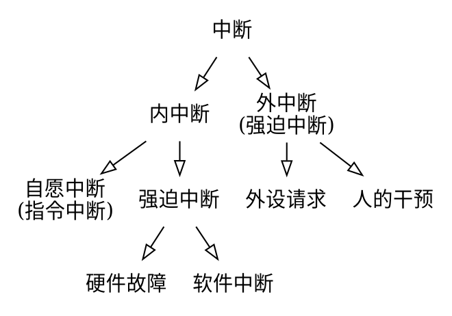

!> 计算机系统概述

# 书籍链接
* [书籍链接](file:///media/deepin/670B-1B04/%E5%B8%B8%E7%94%A8%E8%BD%AF%E4%BB%B6/%E7%B3%BB%E7%BB%9F%E8%BD%AF%E4%BB%B6/%E7%AC%94%E8%AE%B0/%E8%AF%BE%E7%A8%8B/2021%E7%8E%8B%E9%81%93%E6%93%8D%E4%BD%9C%E7%B3%BB%E7%BB%9F.pdf)

# 操作系统的基本概念
14页有操作系统的功能解释
1. 计算机系统自下而上分层:硬件 操作系统 应用程序 用户
2. 应用程序规定用户按何种方式使用系统资源解决计算问题.
3. 操作系统控制和管理计算机系统的软硬件资源,组织调度计算机的工作和资源分配,为用户和程序接口提供方便
4. 操作系统是系统软件
5. 进程是为了让程序并发执行
6. 操作系统的并发性通过分时实现.不同的时间片执行不同的程序.
7. 共享是让内存中的程序共享系统资源,CPU,打印机,内存,硬盘等
8. 共享分为`互斥共享`(一段时间内独享,用完才释放,让其他进程使用,如打印机)和`同时访问`(宏观同时访问,微观以时间片分别访问,如磁盘)
9. `互斥共享`的资源叫`临界资源`或`独占资源`
10. `虚拟`是把物理实体变为逻辑对应物.
11. `虚拟技术`:用于实现虚拟的技术
12. `虚拟处理器`就是让并发程序分时使用一个处理器.宏观上看作多个处理器同时处理多个程序(多用户处理)
13. `虚拟存储器`将物理内存虚拟划分为多个内存
14. `虚拟设备技术`将临界资源变为共享资源,一段时间内可供多用户使用
15. 虚拟技术有 `时分复用技术`(虚拟处理器)和`空分复用技术`(虚拟存储器)
16. `异步`就是并发程序以不可预知的速度前进(并发程序不知道执行多少个时间片以及什么时候执行时间片)
17. 操作系统对处理机的管理就是对线(进)程的管理(处理机分配以线程或进程为单位)
18. 操作系统与用户交互的接口有`命令接口`和`程序接口`(用于编程请求操作系统服务)
    1. 使用命令接口进行作业控制包括`联机命令方式`(使用`联机命令接口`)和`脱机命令方式`(使用`脱机命令接口`)
    2. 联机命令接口是`交互式命令接口`,用于分时或实时操作系统.控制台输入命令,控制权就交给了操作系统的命令解释程序进行解释并执行.执行后,控制权回到控制台.用户直接控制作业.
    3. 脱机命令接口是`批处理命令接口`,用于批处理系统,写好命令脚本,操作系统的命令解释程序进行解释并执行.用户间接控制作业(作业执行期间不控制)
    4. 程序接口由`系统调用`(`广义指令`)组成,请求操作系统进行服务,例如使用IO,CPU等.GUI就是调用程序接口实现的.(图形接口GUI不是操作系统的一部分,其调用的程序接口是)
19. `裸机`:没有装任何软件的计算机.
20. `扩充机器`:(`虚拟机`)装了软件的机器.`操作系统是扩充机器`
21. RAM(random access memory): 随机访问存储器, ROM(read only memory): 只读存储器
22. BIOS(basic input output system)
23. 库函数是语言或应用程序的一部分,运行于用户空间.系统调用运行在内核空间.库函数可以调用系统调用.如果库函数不调用系统调用,会更快(调用系统调用会上下文切换和状态切换,由用户态到内核态).

# 操作系统的发展与分类
1. 人机矛盾:速度和资源利用
2. 操作系统发展历程
   1. `手工操作阶段`:无操作系统;用户独占全机,资源利用率低;CPU需要等待手工操作,CPU利用不充分
   2. `批处理阶段`:(有操作系统),作业自动控制(`单道性,顺序性,自动性`)
      1. `单道批处理系统`:作业自动运行,顺序运行,单道运行(内存一道作业);运行时请求IO.CPU等待,故利用不充分
      2. `多道批处理系统`:内存多个程序,共享资源(硬件并行工作).需要考虑CPU,内存,IO分配和数据组织与存储(需保证数据安全性和一致性);用户响应时间长且没有人机交互(不了解程序运行状况,不能控制计算机)
   3. `分时操作系统`:CPU使用时间片供联机作业使用;多个终端共享一台主机,需保证操作系统处理某用户请求且响应同一用户(`同时性(多路性,多用户同使用), 交互性, 独立性(多用户互不干扰), 及时性(及时返回响应)`)
   4. `实时操作系统`:分为`硬实时系统`(规定时刻或时间范围必须完成)和`软实时系统`(规定时刻或时间范围可偶尔不完成,没有永久损害);(`及时性`, `可靠性`),交互性不如分时操作系统
   5. `网络操作系统`和`分布式操作系统`:都通信交换信息.前者有主从机,后者地位相同,且后者任意台计算机可构成子系统或重构,工作可分布于多台计算机并行完成(有`分布性`和`并行性`)
   6. 个人计算机操作系统
3. `中断技术`: 程序有IO请求,该程序中断CPU执行,别的程序进行CPU执行就是`中断技术`
4. 实时系统保证实时可以用`高优先级`和`可抢占`
5. 机床的系统也要保证`实时`,否则会出问题
6. 分时操作系统`高优先级`可让重要作业及时响应,`非抢占`可让次要作业及时响应.响应也即处理所有进程
7. 多任务操作系统有并发和并行的特点是因为多道程序设计使得并发,各种硬件资源可以并行使用
8. 甘特图:横坐标是时间,纵坐标是程序名字.横线,虚线,波浪线标识不同的资源

# 操作系统的运行环境
1. 计算机的`指令`和高级语言的`代码`:代码CPU看不懂,编译代码到指令,CPU就看懂了.操作系统执行程序就是执行编译后的一个个指令.
2. CPU执行的程序分为操作系统`内核程序`和用户自编`应用程序`.`内核程序`管理`应用程序`.
3. 内核程序有`特权指令`(IO指令,置中断指令等),应用程序无法执行
4. CPU状态有`用户态`(`目态`)和`核心态`(`管态`),CPU在核心态可以执行特权指令.内核程序运行于核心态,应用程序运行在用户态.
5. 内核是计算机的底层软件,是计算机功能延伸.
6. 操作系统内核包括`时钟管理`, `中断机制`, `原语`, `系统控制的数据结构及处理`.核心态指令也是这些操作的指令.
   1. 时钟管理:记时;时钟中断来切换进程;
   2. 中断机制:现代操作系统是靠中断驱动的软件;只有小部分属于内核(记录中断现场上下文,移交控制权给相应程序.可以减少中断处理时间,提高并行能力)
   3. 原语:处于操作系统底层,接近硬件;原子性(一口气执行完);运行时间短,调用频繁
   4. 系统控制的数据结构及处理:数据结构有作业控制块,进程控制块等.需要进程管理,存储器管理,设备管理.
7. 用户程序不能直接执行核心态功能,必须通过中断或异常来从用户态进入核心态.
8. 程序对于占用资源的释放需要使用中断
9. `中断`:(`外中断`)是CPU执行指令以外的事情发生(如IO中断,设备请求新的输入).通常与当前处理机运行程序无关.
10. `异常`:(`内中断`, `例外`, `陷入`)源自CPU执行指令内部的事件(如地址越界,算术溢出).***不能屏蔽***
11. 内中断与外中断联系

12. 中断处理过程
    1. 关中断(避免接收更高级别中断导致上下文保存不完整)
    2. 保存断点(保存程序计数器的断点,恢复后可以从原位置继续执行)
    3. 引出中断服务程序(取出中断服务程序入口地址放入程序计数器)
    4. 保存现场和屏蔽字(保存现场信息的程序状态字或寄存器的内容)
    5. 开中断(允许更高级中断被响应)
    6. 执行中断服务程序
    7. 关中断(保证恢复现场不被更高级别中断影响)
    8. 恢复现场和屏蔽字
    9. 开中断,中断返回(中断返回由中断服务程序最后一条指令返回原程序断点)
    1-3是CPU进入中断周期,硬件(中断隐指令)自动完成,4-9由中断服务程序完成.中断服务程序负责恢复现场
13. 系统调用:特殊的公共子程序.应用程序关于资源的操作都需要请求系统调用
    1. 提供的大致功能分为:`设备管理`, `文件管理`, `进程控制`, `进程通信`, `内存管理`
    2. 系统调用操作的是特权指令,需要由内核态完成
    3. 应用程序执行`访管指令`(`陷入指令`)发起系统调用(应用程序把CPU执行权交给了内核程序,从用户态进入内核态,内核程序处理请求完毕后,将CPU使用权交给应用程序,从内核态到用户态)
    4. 应用程序调用访管指令发起系统调用,保证了系统`稳定性`和`安全性`.
    5. 访管指令是用户态调用,不是特权指令
14. 用户态转向核心态
    1. 系统调用:用户程序请求操作系统服务
    2. 发生中断
    3. 用户程序产生错误状态
    4. 用户程序企图执行特权指令
    5. 从核心态转向用户态的中断返回指令也是特权指令
15. 用户态与核心态的转变,所用堆栈可能也会变为系统堆栈,但都属于该进程.
16. 通用操作系统是使用时间片轮转来调度进程的
17. 多道程序设计可以提高系统利用率和吞吐量
18. 通道是一种特殊的处理器
19. 系统调用编译后可能有trap指令,不会有屏蔽中断指令
20. 注意系统调用是在`内核态`执行,调用系统调用可以从`用户态`调用
21. `中断`操作系统必须提供,用户态到核心态的转变需要中断.相比较`系统调用命令`,作为内核功能的`中断`更重要
22. `访管指令`会引起`访管中断`
23. `内核态`可以执行任何指令,包括`特权指令`和`非特权指令`.用户态只能执行非特权指令
24. `中断`和`地址映射`中的`重定位`都需要硬件支持.`时钟管理`的重置时钟需要硬件支持.`进程调度`虽然最终操作CPU,但调度的过程是由操作系统的调度算法决定,不需要硬件支持.
25. `核心态`程序就是进入核心态后执行的程序,与中断处理程序一样在核心态执行.
26. 缺页处理(用户态发现缺页,然后中断进入和心态的缺页处理程序)和时钟中断都是中断,在核心态处理.命令解释程序属于命令接口,是面向用户的.
27. 置时钟指令只能在核心态,用户态如果可以修改时间,那么时间片就可以无限期执行.而寄存器清零也可以是用户栈的寄存器,所以不一定非要在核心态.
28. 广义指令在核心态,可以由特权指令调用,也可以由访管指令调用
29. 内存的操作,核心态不关心.
30. 访管指令只用于用户态,核心态可以执行所有指令,也就可以执行除访管指令外,所有指令
31. 除数为0的异常,在处理后不会再回到发生异常的指令处继续执行,会跳过中断指令
32. 存储保护错是异常
33. 把地址addr的内存数据放入寄存器可能有`缺页异常`
34. 系统调用先传参,然后用trap指令从用户态到核心态,执行程序,然后返回.
35. 用户态到核心态发生在中断时,核心态到用户态发生在中断返回时
36. CPU的操作和外设传输同时进行需要有中断和通道的支持.
37. 用户态转到核心态只有中断或异常.
38. 访管指令是自愿中断(内中断)

# 操作系统体系结构
1. 大内核:主要模块都在内核,各模块共享信息,性能高
2. 微内核:基本模块放到内核,分离了内核与服务,服务与服务,各模块通过微内核交流,易维护,层次清晰.但频繁进行核心态和用户态切换,开销较大.
3. 库操作系统:系统服务作为运行库链接到用户程序.
4. 内核越小越稳定.越少越容易保证不出错.
5. 微内核需要频繁进行通信,系统负载更大