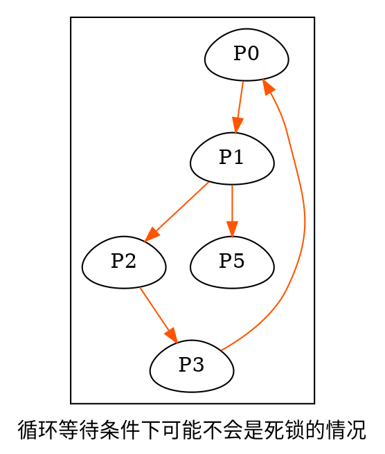

!> 进程管理,容易有`综合题`

# 书籍链接
* [书籍链接](file:///media/deepin/670B-1B04/%E5%B8%B8%E7%94%A8%E8%BD%AF%E4%BB%B6/%E7%B3%BB%E7%BB%9F%E8%BD%AF%E4%BB%B6/%E7%AC%94%E8%AE%B0/%E8%AF%BE%E7%A8%8B/2021%E7%8E%8B%E9%81%93%E6%93%8D%E4%BD%9C%E7%B3%BB%E7%BB%9F.pdf)


# 进程与线程
1. 多道程序执行,每个程序就失去了`封闭性`.给每个程序放一个`进程`的概念,就可以更好的描述和控制程序并发.
2. `进程映像`(`进程实体`)组成:`PCB`,`程序段`,`数据段`
3. `PCB`用于描述进程的基本情况和运行状态,是进程存在的唯一标志
4. 创建进程就是创建进程映像中的PCB,撤销进程就是撤销进程映像中的PCB
5. 进程映像是静态的,进程是动态的.
6. 进程是进行资源分配和调度的独立单位.分配系统资源就是分配资源的`使用时间`(处理器资源就是处理器的时间片)
7. 进程的特征(对于单个程序顺序执行提出)
   1. 动态性:基本特征,可以看作程序的一次执行,有生命周期,创建,就绪,运行,阻塞,消亡
   2. 并发性:重要特征,提高资源利用率(让资源都不闲着)
   3. 独立性:独立运行,获取资源,调度(没有`PCB`的程序不能运行)
   4. 异步性:会导致运行结果不可再现(需要进程同步)
   5. 结构性
8. 进程生命周期中的状态(1-3是基本状态)
   1. 运行态
   2. 就绪态:处于就绪态的进程有多个,组成就绪队列.
   3. 阻塞态:(等待态),等待的是IO资源或内存资源
   4. 创建态:需要创建PCB,PCB填入必要信息,分配运行必备资源(除CPU),进入就绪态
   5. 结束态:正常结束或中断退出.需要配置进程为结束态,再释放和回收资源.
9. 运行态->就绪态:可能因为时间片用完,也不需要其他资源,所以回到了就绪态等待调度,也可以被高优先级进程剥夺CPU使用权,进程被迫回到就绪态
10. 进程请求操作系统提供服务使用`系统调用`
11. 进程从运行态到阻塞态是主动行为,从阻塞态到就绪态是被动行为(需要其他进程支持)
12. `进程控制`就是用于进程的管理,可以创建进程,撤销进程,进程状态转换(`主要用PCB来进行操作`)
    1. `进程创建`: 一个进程(父进程)创建另一个进程(子进程)
        1. 子进程继承父进程所有资源
        2. 子进程撤销,将资源归还父进程
        3. 父进程撤销,将撤销所有子进程
        4. 进程创建过程
            1. 新进程分配进程标识号,申请PCB(PCB是有限的).申请PCB失败则创建失败
            2. 新进程分配内存(放程序,数据,用户栈)和其他资源.资源不足(如内存),将阻塞,等待资源分配(未创建失败)
            3. 初始化PCB,放进程初始化信息
            4. 新进程进入就绪队列,等待调度
    2.  `进程终止`: 
        1. 可能正常结束,异常结束(算术异常),外界干预(操作系统干预等)
        2. 进程撤销过程
            1. 用终止进程标识符,检索PCB,读取进程状态
            2. 若进程处于执行状态,终止进程执行,将处理机分配给别的进程
            3. 若进程有子孙进程,终止所有子孙进程
            4. 归还进程拥有所有资源,还给父进程或操作系统
            5. 从队列删除PCB
    3.  `进程的阻塞和唤醒`
        1. 进入阻塞:进程请求资源失败,等待某操作完成,新数据未到达,无新工作.是主动行为(主动放弃CPU)
        2.  阻塞原语执行过程
            1. 找到阻塞进程标识号对应的PCB
            2. 若进程为运行态,保护现场,转为阻塞态,停止运行
            3. 将PCB插入某事件的阻塞队列,交出处理机给就绪进程
        3. 进入唤醒:进程请求资源成功,某操作完成,新数据到达,有新工作,是被动行为(由提供资源的进程唤醒它)
        4.  唤醒原语执行过程
            1. 找到该事件阻塞队列的相应进程PCB
            2. 从阻塞队列移出PCB,置为就绪态
            3. 将PCB插入就绪队列,等待程序调度
    4.  `进程的切换`
        1. 进程切换就是处理机从一个进程的运行切换到另一个进程的运行
        2.  进程切换执行过程
            1. 保存处理机上下文(程序计数器和其他寄存器)
            2. 更新PCB信息
            3. 将PCB移入到相应队列(就绪或阻塞队列)
            4. 选择另一个进程执行,并更新PCB
            5. 更新内存管理的数据结构
            6. 恢复处理机上下文
13. `原语`:进行进程控制的程序段(原子性)
14. 进程创建,撤销,切换都要使用系统调用.任何进程都是在操作系统`内核`支持下运行的
15. 进程切换与处理机模式切换的不同:处理机模式切换的时候,可能处于同一进程,进入核心态保存上下文,恢复到用户态恢复上下文都在同一进程中运行,环境不变.进程切换,不同进程的环境不同,所以环境也需要改变.
16. 调度与切换的区别
    1. 调度是决定分配给哪个进程资源(决策行为)
    2. 切换是实际分配给进程资源(执行行为)
    3. 一般先有资源调度,再有进程切换
17. 进程由`PCB`, `程序段`, `数据段`组成
    1. 进程创建,分配一个PCB,进程结束,删除PCB.PCB是进程存在唯一标志
    2. 操作系统通过PCB表管理和控制进程.PCB存放了现行状态,优先级,程序和数据始址等内容,操作系统通过他来感知进程的存在.
    3. `PCB`的用户标识符用于共享和保护服务
    4. `PCB`组织方式
        1. `链接方式`:同一状态的PCB链接成一个队列,同一状态不同原因可分为多个队列
        2. `索引方式`:同一状态进程组织到同一索引表,索引表指向PCB
    5. `程序段`可以被多个进程共享,多个进程可以运行同一个程序
    6. `数据段`可能存放程序的原始数据,程序执行的中间或最终结果
18. `进程通信`就是进程间交换信息,包括`低级通信`(PV操作)和`高级通信`(以较高效率传输大量数据,包括`共享存储`,`消息传递`,`管道通信`)
    1. `共享存储`:通信进程间有共享空间,可对共享空间读写,读写需要同步互斥.
        1. `低级共享`是基于数据结构的共享,`高级共享`是基于存储区的共享.
        2. `操作系统`为通信进程提供`共享空间`和`同步互斥工具`,数据交换由通信进程完成.
        3. `用户进程空间`一般都是独立的,不同进程一般无法访问对方进程空间,需要使用特殊的系统调用才能实现 .
        4. 进程内的线程自然共享进程空间
    2. `消息传递`:进程间的数据交换以`格式化的消息`为单位.操作系统使用`发送消息`和`接收消息`原语提供`消息传递`,
        1. `直接通信方式`: 发送进程直接将消息发给接收进程,消息挂到接收进程的消息缓冲队列.接收进程从消息缓冲队列取消息
        2. `间接通信方式`: 也叫`信箱通信方式`, 发送进程把消息发送到中间实体(`信箱`),接收进程从中间实体取消息.就像`电子邮件`
    3. `管道通信`: 用`共享文件`(`管道`)连接读进程和写进程,进行大量数据传送
        1. `管道`相当于一个固定大小缓冲区(linux为4K)
        2. `写进程`写满后,`写进程`阻塞,等待数据读取后再写
        3. `读进程`读完后,`读进程`阻塞,等待数据写满后再读(防止读后直接返回文件结束)
        4. 管道数据被读取后,管道清空(管道读数据为一次性操作)
        5. 管道只能`半双工`(某时刻只能单向传输).两个进程想要同时通信需要定义两个管道
    4. `共享存储`进行读取的时候需要看有没有写进程操作,有的话读进程阻塞.`管道通信`只能一端读另一端写,管道有数据就能读,管道数据为空写进程才写(管道数据不为空,写进程不写数据)
19. 进程可以使程序并发,提高资源利用率和系统吞吐量.线程可以减小并发的时空开销,提高并发.
    1. 线程由线程ID,程序计数器,寄存器集合,堆栈组成.
    2. 线程是进程的一个实体,是系统独立调度的基本单位.
    3. 同一进程的线程共享进程全部资源
    4. 线程间可以创建,撤销,并发执行
    5. 线程也有`就绪`, `运行`, `阻塞`的状态
20. 进程与线程比较
    1. 同一进程的线程切换不引起进程切换,不同进程的线程切换引起进程切换.
    2. 进程作为除CPU的资源分配单位,线程是CPU分配单位
    3. 创建和撤销进程,系统需要分配和回收资源,开销大.创建撤销线程开销小.
    4. 进程切换需要保存大量CPU环境信息,线程切换只需要保存少量信息.
    5. 同一进程的线程共享进程地址空间,让线程间的同步与通信更容易.且进程内的线程对其他进程不可见
    6. 不同进程通信需要使用同步互斥工具,同一进程的不同线程可直接读写数据段(全局变量)来通信
21. 多线程中,进程处于执行状态,就是其中某个线程在执行
    1. 线程不拥有系统资源,但要有TCB,记录线程的寄存器和栈
    2. 不同线程可以执行相同程序
    3. 同一进程的线程共享进程所有资源
    4. 线程是CPU调度单位
    5. 线程有阻塞,运行,就绪三个状态
22. 线程的实现包括`用户级线程`和`内核级线程`
    1. `用户级线程`的线程管理(创建,撤销,切换)由应用程序完成,内核意识不到其线程存在.`用户级线程`可通过线程库创建新线程.
    2. `内核级线程`的管理工作由内核完成.应用程序只有到内核级线程的编程接口.
    3. `组合级线程`的线程创建,调度,同步都在应用程序中,内核中有少量内核级线程.用户级线程会被映射到内核级线程中.
23. 多线程模型(`用户级线程`和`内核级线程`连接方式)
    1. 多对一:多个用户级线程映射到一个内核级线程,线程管理由用户空间完成.用户级线程对操作系统透明(不可见)  
        优点:线程管理在用户空间,效率较高  
        缺点:一个线程使用内核服务被阻塞,整个进程阻塞,多个线程不能并行运行在多处理机  
    2. 一对一:一个用户级线程映射到一个内核级线程  
        优点:一个线程阻塞,另一个线程仍可继续运行,并发能力强  
        缺点:创建一个用户级线程也要创建一个内核级线程,创建开销较大,影响应用程序性能
    3. 多对多:n个用户级线程映射到m个内核级线程,m<=n  
        特点:比多对一并发度高,比一对一开销小,且线程管理在用户空间,效率较高,
24. 地址空间指的就是内存空间

# 处理机调度
1. 处理机`调度`就是从就绪队列按一定算法选择一个进程分配处理机运行.实现进程并发执行
2. 处理机调度是多道程序操作系统的基础,是操作系统设计的核心问题.
3. 一个作业从提交到完成往往经历以下三级调度
    1. `作业调度`:(高级调度)按一定原则从外存处于后备状态的作业挑选一个或多个作业,为其分配内存,输入输出等资源,建立相应进程,使其能够竞争处理机.
        1. 是内存和辅存的调度
        2. 每个作业只调入一次,调出一次
        3. 多道批处理系统大多有`作业调度`
        4. 执行频率低,多为几分钟一次.
    2. `中级调度`:(内存调度)将暂时不能运行的进程调至外存(进程为`挂起态`),可能是就绪态的进程不需要运行了,可能是阻塞态的进程长时间获取不到资源.具备运行条件且内存有空闲,则将进程调入内存挂到就绪队列
        1. 可以提高内存利用率和系统吞吐量
    3. `进程调度`:(低级调度)按一定原则从就绪队列选取一个进程,分配处理机
        1. 进程调度是操作系统最基本调度
        2. 一般几十毫秒调度一次.
    4. 三种调度的关系
        1. 作业调度为进程活动做准备,进程调度使进程活动起来,中级调度将暂时不能运行的进程挂起.
        2. 作业调度次数少,进程调度次数多,中级调度次数居中
        3. 进程调度是最基本的
4. 进程`调度`和`切换`的程序是操作系统的内核程序
5. 不能进行进程调度与切换的情况
    1. 处理中断的过程.中断是内核空间操作,并且很复杂,中间很难添加调度与切换
    2. 进程在操作系统内核程序临界区中.这个时候临界区被加锁(数据需独占式访问),其他进程无法进入
    3. 原子操作过程.进行原语操作的时候,中断都会屏蔽,也就更不会有进程的切换和调度
    4. 出现了上述三种无法进行进程调度与切换的情况时,需要置系统请求调度标志.上述情况结束后再调度与切换
6. 应该进行调度与切换的情况
    1. `非剥夺调度方式`:有调度请求,且当前进程无法继续运行
    2. `剥夺调度方式`: 中断处理结束或自陷处理结束,返回中断现场前,如果置了请求调度标志,则可马上进行进程调度与切换
7. 进程切换一般在调度后立刻发生.内核需要保存原进程上下文信息,并设置新进程上下文信息,运行新进程.
8. 进程调度方式:处理机正在执行某个进程,有更重要,优先级更高的的进程是如何分配处理机的方式
    1. `非剥夺调度方式`:(非抢占方式)进程正在处理,优先级更高的进程需要等待该进程执行完或进入阻塞态才能获得处理机.  
        简单,系统开销小,  
        适用于多数批量处理系统,不能用于分时或大多数实时操作系统
    2. `剥夺调度方式`:(抢占方式)进程正在处理,优先级更高的进程过来,则立即暂停当前进程,优先级更高的进程获得处理机  
        可以提高系统吞吐率和响应效率.  
        剥夺需要有一定原则(优先权,短进程优先,时间片等)
9. 调度基本准则(用于评价调度算法)
    1. `CPU利用率`: CPU需要尽量忙
    2. `系统吞吐量`: 单位时间CPU完成作业数量.长作业(执行时间长)降低系统吞吐量,短作业提高系统吞吐量.
    3. `周转时间`: 作业提交到作业完成所用时间,包括作业等待,就绪队列排队,处理机运行,输入输出操作时间花费  
        周转时间 = 作业完成时间 - 作业提交时间  
        ```tex
        \small 
        \displaystyle 平均周转时间 = \frac{作业1周转时间 + ... + 作业n周转时间}{n}  \\
        ```
        ```tex
        \small
        \displaystyle 带权周转时间 = \frac{作业周转时间}{作业实际运行时间(CPU运行时间)}  \\
        ```
        ```tex
        \small
        \displaystyle 平均带权周转时间 = \frac{作业1带权周转时间 + ... + 作业n带权周转时间}{n}  \\
        ```
    4. `等待时间`: 进程等待处理机时间之和.等待时间越长,用户满意度越低.  
        处理机调度只影响作业在就绪队列等待时间  
        等待时间常用来进行调度算法优劣的简单衡量  
    5. `响应时间`: 用户提交请求到系统首次响应的时间.用于交互式系统,须让用户感觉响应时间更短.
    6. 设计调度程序,要满足特定系统用户要求,要考虑系统整体效率,考虑调度算法开销
10. 典型调度算法
    1. 先来先服务(FCFS)
        用于`作业调度`和`进程调度`  
        是不可剥夺算法  
        长作业先进来,后边许多短作业会等很久(故不能用于分时或实时系统的主调度策略)  
        常和其他调度算法结合(如,以优先级为调度策略,同一优先级则FCFS)  
        简单,效率低;有利于长作业,不利于短作业;有利于CPU繁忙型作业,不利于IO繁忙型作业
    2. 短作业优先(SJF)(SPF是短进程优先)
        用于`作业调度`和`进程调度`  
        是不可剥夺算法(作业执行完后,先选取执行时间短的作业)  
        长作业先进来,可能长时间不调度(饥饿)且优先级高作业无法及时调度  
        作业运行时间是用户估计的,则用户可能缩短其时间
        短作业优先的`平均等待时间`,`平均周转时间`最少
    3. 优先级调度算法(优先级描述作业紧迫程度)
        用于`作业调度`和`进程调度`  
        根据高优先级能否抢占分为`非剥夺式优先级调度算法`和`剥夺式优先级调度算法`(会立即暂停当前运行进程)  
        根据进程创建后优先级是否可改变分为  
        `静态优先级`: 进程创建时指定,运行期间不变,依据有`进程类型`,`进程对资源要求`和`用户要求`  
        `动态优先级`: 进程运行过程中可动态调整进程优先级,依据有`CPU占用时长`和`就绪进程等待CPU时长`  
        进程优先级设置原则:  
        系统进程 > 用户进程
        交互性进程 > 非交互性进程(即前台进程 > 后台进程)  
        IO型进程 > 计算型进程(IO调用多的进程先处理,则可让IO设备尽早工作,提升系统效率)  
    4. 高响应比优先调度算法  
        主要用于`作业调度`,是`FCFS`和`SJF`的综合  
        调度时按照作业的响应比调度(等待时间长会被调度,相同等待时间,运行时间短先服务)  
        ```tex
        \displaystyle 响应比 = \frac{等待时间 + 要求服务时间}{要求服务时间}
        ```  
        兼顾了长作业,克服了饥饿状态  
    5. 时间片轮转调度算法
        主要用于`分时系统`  
        所有就绪进程排成一个队列,每次选择队列第一个执行一个时间片.时间片到,未运行完,释放处理机,排到就绪进程末尾.  
        时间片选择很重要,时间片过大,就成了先来先服务,时间片很小,处理机切换频繁,增加了处理机开销  
        时间片确定依据: `系统的响应时间`, `就绪队列进程数目`和`系统处理能力`
    6. 多级反馈队列调度算法
        综合了`时间片轮转调度算法`和`优先级调度算法`,可以动态调整进程优先级和时间片大小  
        执行过程:
        有多个就绪队列,每个队列有不同优先级,第一级队列优先级最高.  
        每个队列时间片大小不同,高优先级队列时间片小,优先级越低,时间片越大  
        进程进入内存,先放入第一级队列末尾.分到时间片后,若一个时间片执行不完,转入第二级队列末尾  
        第一级队列为空,才会调度第二级队列.  
        调用低优先级队列进程时,若高优先级队列来了进程,则抢占低优先级队列进程的处理机.原进程排到原队列末尾  
        优势:  
        终端型作业用户: 短作业优先  
        短批处理作业用户: 周转时间较短  
        长批处理作业用户: 在高优先级队列可以获得部分执行,不会长期不被处理  
11. `饥饿`是进程调度迟迟无法调度某一个进程,`死锁`是进程环形等待
12. 对资源的请求大于资源的个数就要调度(2个进程,1个CPU)

# 进程同步
1. 临界资源: 一次仅允许一个进程使用的资源(打印机,共享变量等)  
2. 临界区: 访问临界资源的代码段(临界资源需要互斥访问)  
3. 临界资源访问过程
    1. 进入区: 检查可否访问临界区(进入后需要置临界区访问标志)  
    2. 临界区: 访问临界资源的代码段
    3. 退出区: 清除临界区访问标志
    4. 剩余区: 代码其他部分
4. 同步: (直接制约关系)协调进程的先后执行关系
5. 互斥: (间接制约关系)一个进程进入临界区使用临界资源,另一个进程需等待
6. 防止两个进程同时进入临界区
    1. 空闲让进: 临界区空闲,可让一个进程进入临界区
    2. 忙则等待: 已有进程访问临界区,其他进程需等待
    3. 有限等待: 应保证进程在有限时间内进入临界区
    4. 让权等待: 进程不能进入临界区,则释放处理机,防止`忙等待`
7. 临界区互斥的方法
    1. 软件实现: 进程在进入区设置并检查标志位.退出区修改标志位的占用.(均以两个进程为例)
        * 单标志法   
            设一个公用变量,一个进程占用一个号码,为0,进程1进,为1,进程2进  
            进入后执行完必要代码,设置公共变量为另一个进程所需公用变量数值  
            若另一个进程不进去,自己永远也无法进去  
            缺点: 需要交替进入,违背`空闲等待`
        * 双标志法先检查
            设置flag[x]标示x进程是否占用临界区  
            进程1进入时先判断进程2是否占用临界区,未占用则设置进程1的标志为true,执行完后设置false  
            优点: 进程不需要交替进入  
            缺点: 两个进程可能同时进入临界区(同时判断,同时是flase),违背`忙则等待`  
        * 双标执法后检查
            设置flag[x]标示x进程是否占用临界区  
            进程1进入前先设置进程1的标志为true,然后判断进程2是否占用临界区,不占用,则使用,使用完后设置false  
            缺点: 两个进程都先设置为true,检测后,谁都无法进入临界区(`饥饿`)
        * Peterson's Algorithm
            使用双标志来标示自己想进入临界区,利用单标志来先让对方进入临界区  
            使用while(flag[j] && turn == j)来防止进入临界区  
            查看对方是否进入,未进入则看是否对方是否先让自己进入.让自己进,自己就进  
    2. 硬件实现: 硬件实现临界区的方法叫`低级方法`或`元方法`
        * 中断屏蔽方法  
            也叫屏蔽中断,关中断,可以禁止其他进程进入临界区(CPU只在发生中断时进程切换)  
            流程: 关中断 => 临界区代码执行 => 开中断  
            限制了处理机交替执行程序的能力,执行效率降低  
            关中断交给内核处理很方便,交给用户处理如果不开中断可能会系统因此终止
        * 硬件指令方法
            TestAndSet指令: 原子操作,功能为读出指定标志,并置为真  
            临界区资源设置lock(布尔类型),初始为false,占用临界区使用TestAndSet置为真,释放临界区则用其置为false  
            Swap指令: 原子操作,交换两个字(节)内容  
            临界区资源设置lock(布尔类型),初始为false,进程设置局部变量key(布尔类型),初始为true  
            进入区交换lock与key的值,交换后key为true,则有占用,循环交换并判断等待,key为false,执行即可,执行完置为false  
            硬件方法  
            优点: 硬件可以支持多个进程,且单处理机还是多处理机都可以,简单,进程有多个临界区,每个临界区均设置一个变量即可  
            缺点: 进程等待进入临界区耗费处理机时间,不能`让权等待`,有的进程一直无法进入临界区,造成`饥饿`  
8. 信号量
    作用: 解决同步互斥问题  
    使用wait(P操作)和signal(V操作)原语访问(因为是原语,不能被打断,所以进入临界区的进程保证了只有一个)  
    1. 整型信号量: S被定义为是资源数目  
    ```c
    // 没有资源,那么就一直等待,如果有资源,则可以获取资源进行临界区代码操作
    wait(S) {
        while(S <= 0);
        S = S - 1;
    }
    // 临界区代码执行完后,释放资源
    signal(S) {
        S = S + 1;
    }
    ```  
    在wait中,如果没有资源,进程会一直忙等,违背`让权等待`  
    2. 记录型信号量  
    ```c
    // 结构体中定义资源数目value和等待进程链表L
    typedef struct {
        int value;
        struct process *L;
    } semaphore;
    // 没有资源,那么就一直等待,如果有资源,则可以获取资源进行临界区代码操作
    void wait(semaphore S) {
        S.value--; // 表示请求资源
        if (S.value < 0) {
            add this process to S.L;// 添加进程到请求该类资源的等待队列
            block(S.L);// 阻塞该进程,放弃处理机
        }A
    }
    // 临界区代码执行完后,释放资源
    void signal(semaphore S) {
        S.value++;  //释放一个资源
        if (S.value <= 0) {// 表示还有阻塞的进程未被唤醒,等于0是因为归还一个资源后,资源数多了一个,但还没唤醒阻塞进程消耗该资源
            remove a process P from S.L;// 从等待队列放出一个进程
            wakeup(P);// 唤醒刚刚放出的进程
        }
    }
    ```  
    记录型信号量遵循了`让权等待`,因为无法使用临界区时进入阻塞队列,放弃处理机占用  
    3. 利用信号量实现同步(同步就是有先后顺序)  
    ```c
    // 设S为p1,p2同步的公共信号量,初值为0.p2执行y需要p1先执行x
    semaphore S = 0;
    p1() {
        x;
        // 处理完后,y可以执行
        V(S);
    }
    p2() {
        // 因为要x先执行,P操作无法消费的时候,则x未执行,可以消费的时候,则x已执行
        P(S);
        y;
    }
    ```
    4. 利用信号量实现互斥(互斥是一个操作,另一个不能操作)
     ```c
    // 设S为p1,p2互斥的公共信号量,初值为1.一个执行临界区,另一个则不能执行
    semaphore S = 1;// 可用资源数为1
    p1() {
        // 若临界区被占用,则等待,若不被占用,则使用
        P(S);
        临界区代码;
        V(S);
    }
    p2() {
        P(S);
        临界区代码;
        V(S);
    }
    ```
    5. 使用信号量实现前驱关系  
        第一级V(a),V(b)来提供资源  
        第二级P(a), P(b)等待资源产生,获取到资源后再V(c),V(d)为后级产生资源  
    6. 分析同步互斥关系  
        找到所有进程,分析其中的前后关系,抢夺关系,设置信号量,确定初值并执行  
9. 原语的原子性可由硬件实现(TestAndSet和Swap原语)
10. 原语的不被中断在单处理机可由软件屏蔽中断方法实现
11. 同步互斥总结:同步中,要用到某个资源,则先P一下,某个行为可以提供资源,则V一下;互斥中,PV操作夹在互斥行为中间
12. 管程:
    管程是进程同步互斥工具,降低了死锁发生可能性.  
    信号量机制,如果同步操作不当则可能死锁  
    管程可以看做是一个类,定义共享数据结构(属性),通过不同的过程处理共享数据结构(方法)  
    每次只允许一个进程进入管程,调用其过程,多个进程调用相同的过程,也只能一个进程调用完毕,再让另一个进程调用(进程互斥访问共享数据结构)  
    管程的`条件变量`就是某种阻塞原因的队列,当进程进入管程后阻塞,用其存放阻塞进程.条件变量只能被wait和signal  
    条件变量的wait和signal类似PV操作,但条件变量没有值,仅用于等待排队,共享数据结构保存剩余资源数.信号量有值,反应剩余资源数.
13. 经典同步问题: 这里的唤醒机制都是唤醒队列中前边的进程
    1. 生产者,消费者问题  
    P操作要考虑先后,V操作可以不考虑先后  

    ```c
    /**
    一群生产者,一群消费者,一个共享缓冲区(大小为n)
    缓冲区不满,生产者放入消息,否则等待,
    缓冲区不空,消费者者消费消息,否则等待,
    缓冲区是临界资源,每次只允许一个进程进入
    分析:
    缓冲区互斥访问,使用信号量mutex,缓冲区的大小表示教复杂
    生产者需要知道缓冲区有没有空位置,空位置的增加由消费者提供
    消费者需要知道缓冲区有没有实位置,实位置的增加由生产者提供
    故最好生产者消费者各自一个信号量,表示空的有几个,实的有几个,生产或者是消费后改变对方信号量
    由于需要先判断是不是有空或实位置,再使用临界区.故P操作需要注意次序
    */
    semaphore mutex = 1;// 临界区资源
    semaphore empty = n;// 还能生产几个
    semaphore full = 0;// 已经生产个数
    // 这种方法可以更快的释放临界区,下边的苹果释放临界区较慢
    producer() {
        while (true) {
            P(empty);// 看还能不能生产
            P(mutex);
            生产;
            V(mutex);
            V(full);// 生产出来,已生产数增加
        }
    }
    consumer() {
        while (true) {
            P(full);// 看还能不能消费
            P(mutex);
            获取消费资源;
            V(mutex);
            V(empty);// 消费出来,可生产数增加
            消费;
        }
    }
    /**
    桌子上有一个盘子,每次只能放一个水果,爸爸放苹果,妈妈放橘子,儿子吃橘子,女儿吃苹果
    盘子为空,可放水果,盘子有对应水果,儿子或女儿可取出
    分析:
    盘子作为临界区,mutex = 1
    爸爸生产苹果,女儿消费苹果,可以用apple表示有没有苹果
    妈妈生产橘子,儿子消费橘子,可以用orange表示有没有橘子
    */
    semaphore mutex = 1;
    semaphore apple = 0;
    semaphore orange = 0;
    // 这里可以用上边的方式来处理消费,但是代码更麻烦,这样更简单
    dad() {
        while (true) {
            准备苹果;
            P(mutex);// 看盘子是否为空
            放苹果;
            V(apple);
        }
    }
    mom() {
        while (true) {
            准备橘子;
            P(mutex);// 看盘子是否为空
            放橘子;
            V(orange);
        }
    }
    son() {
        while (true) {
            P(orange);
            取橘子;
            V(plate);
            消费橘子;
        }
    }
    daughter() {
        while (true) {
            P(apple);
            取苹果;
            V(plate);
            消费苹果;
        }
    }
    ```

    生产者消费者的问题可以  
    (1) 先看可不可以生产,可以生产再看能不能用临界区,生产完后释放临界区,通知消费者消费(临界区是工厂,缓冲区放产品)  
    (2) 看临界区有没有占用,没占用则生产,通知消费者消费,消费者消费后,再释放临界区(临界区放产品)  
    2. 读者,写者问题

    ```c
    /**
    有读者和写者两组并发进程.可以同时读,只允许一个写者写信息,
    任意一个写者写完之前,不允许读或其他写者写
    写者写之前,让所有读者和写者退出
    分析:
    信号量只能用PV操作,所以不能直接将信号量进行加减,普通int可以(不能count++)
    写者与任意进程互斥,只需要占用读写信号量rw即可
    读者与写者互斥,但是读者之间可以同步,读者数量使用count计数器,count的操作是互斥的,使用mutex保护
    读者获取读写互斥锁在第一个读者读的时候占用即可,等到所有读者都读完,可以释放读写锁
    */
    semaphore mutex = 1;
    semaphore rw = 1;
    int count = 0;
    // 如下算法读进程优先,只要有读进程,写进程就不能写,写进程会出现'饿死'情况
    // 有读进程,则先互斥的修改读者数量.如果读者数量为0,则应先获取读写锁.读完之后,再互斥的修改读者数量,如果没有读者,则释放读写锁
    reader() {
        while (true) {
            P(mutex);
            if (count == 0) {
                P(rw);
            }
            count++;
            V(mutex);
            读操作;
            P(mutex);
            count--;
            if (count == 0) {
                V(rw);
            }
            V(mutex);
        }
    }

    writer() {
        while (true) {
            P(rw);
            写操作;
            V(rw);
        }
    }

    // 为了提高写进程的优先级,应该在有写操作时,后续读操作不再排队,当前读操作完成后直接写操作
    // 增加写锁,提高写权限.为读写公平法(读写进程优先级相同)
    semaphore mutex = 1;
    semaphore rw = 1;
    semaphore w = 1;
    int count = 0;

    reader() {
        while (true) {
            P(w);
            P(mutex);
            if (count == 0) {
                P(rw);
            }
            count++;
            V(mutex);
            V(w);
            读操作;
            P(mutex);
            count--;
            if (count == 0) {
                V(rw);
            }
            V(mutex);
        }
    }

    writer() {
        while (true) {
            P(w);
            P(rw);
            写操作;
            V(rw);
            V(w);
        }
    }
    ```

    3. 哲学家就餐问题

    ```c
    /**
    五个哲学家坐在圆桌上,每人面前一碗饭,每两人之间一根筷子
    哲学家思考时不进餐,饥饿时,一根一根拿起左右两根筷子吃饭(必须有两根才能吃)
    筷子在他人手上,则等待
    分析: 
    要么每次每人同时拿起两个筷子,要么用规则限制,避免造成死锁和饥饿,如下
    (1) 可以是最多让四个人同时拿筷子(至少有一个人可以拿两个筷子)
    (2) 两边筷子都可用时,把拿筷子变成原子性
    (3) 奇数哲学家先拿左边筷子,偶数哲学家先拿右边筷子
    */
    // (1)
    int eatCount = 0;
    semaphore mutex = 1;// 保证进食者数量的改变互斥
    semaphore chopsticks[5] = {1, 1, 1, 1, 1};

    Pi() {// i号哲学家
        while (true) {
            P(mutex);
            if (eatCount == 4) {
                V(mutex);
                continue;
            }
            eatCount++;
            V(mutex);
            P(chopsticks[i]);
            P(chopsticks[(i + 1) % 5]);
            吃饭;
            V(chopsticks[i]);
            V(chopsticks[(i + 1) % 5]);
            P(mutex);
            eatCount--;
            V(mutex);
            思考
        }
    }
    // (2)
    semaphore mutex = 1;// 保证每次拿两个筷子
    semaphore chopsticks[5] = {1, 1, 1, 1, 1};

    Pi() {// i号哲学家
        while (true) {
            P(mutex);
            P(chopsticks[i]);
            P(chopsticks[(i + 1) % 5]);
            V(mutex);
            吃饭;
            V(chopsticks[i]);
            V(chopsticks[(i + 1) % 5]);
            思考
        }
    }
    // (3)
    semaphore chopsticks[5] = {1, 1, 1, 1, 1};

    Pi() {// i号哲学家
        while (true) {
           if (i % 2 == 1) {
               P(chopsticks[i]);
               P(chopsticks[(i + 1) % 5]);
           } else {
               P(chopsticks[(i + 1) % 5]);
               P(chopsticks[i]);
           }
           吃饭;
           V(chopsticks[i]);
           V(chopsticks[(i + 1) % 5]);
           思考;
        }
    }
    ```

    4. 吸烟者问题

    ```c
    /**
    三个抽烟者进程,一个供应者进程,抽烟者每次需要烟草,纸,胶水卷烟.
    三个抽烟者,第一个有烟草,第二个有纸,第三个有胶水,供应者进程每次供应其中两种
    */
    int random;// 随机找一个数表示给哪个人提供材料
    semaphore materia1 = 0;
    semaphore materia2 = 0;
    semaphore materia3 = 0;
    semaphore over = 1;// 表示可否放材料

    giver() {
        while (true) {
            random = 任意随机整数;
            random = random % 3;
            P(over);
            放材料;
            switch (random) {
                case 0: 
                    V(materia1);
                    break;
                case 1: 
                    V(materia2);
                    break;
                case 2: 
                    V(materia3);
                    break;
            }
        }
    }

    smoker1() {
        P(materia1);
        取材料;
        卷烟;
        抽烟;
        V(over);
    }

    smoker2() {
        P(materia2);
        取材料;
        卷烟;
        抽烟;
        V(over);
    }

    smoker3() {
        P(materia3);
        取材料;
        卷烟;
        抽烟;
        V(over);
    }
    ```

14. 进程的同步互斥处理不好就会出现死锁问题.例如哲学家就餐问题.

# 死锁
1. 多进程的好处:提高了资源利用率和系统处理能力;坏处:可能造成死锁
2. 死锁产生原因
    1. 系统资源的竞争(对不可剥夺资源的竞争可能产生死锁,如打印机,对可剥夺资源的竞争不会有死锁,如CPU)
    2. 进程推进顺序非法(两个进程都需要请求对方的资源,也可能两个进程都在等待对方发来的信号量消息)
3. 死锁产生的必要条件(只要一个不满足,死锁就不会发生)
    1. 互斥条件  
        一段时间某资源只能被一个进程占有
    2. 不剥夺条件
        进程获取到某资源开始运行,运行时申请其他资源时,不放弃已占用资源
    3. 请求并保持条件
        请求所需所有资源,没有申请到所有资源就不运行,也不释放
    4. 循环等待条件
        链中每个进程获得的资源被链中下一个进程所请求
4. 若资源分配图含圈,但是没有死锁,则可能某个资源数目大于1.但每个资源都是1,则资源分配图含圈就是死锁的充分必要条件
5. 循环等待条件可以是有一个圈,但圈外还有分叉,某一个进程的所需资源可被圈内进程提供,也可被分叉提供.则只要分叉的进程释放资源,圈就可以解开  



6. 死锁的处理
    1. 死锁预防: 设置条件,破坏死锁产生的四个必要条件之一(系统效率低, 资源利用率低, 有空闲资源)  
    2. 避免死锁: 资源分配过程中,用某种方法防止系统进入不安全状态(通过算法判断是否进入不安全状态)
    3. 死锁的检测和解除: 不需要限制措施,允许发生死锁并可检测到,通过某些措施解除死锁
7. 死锁预防
    1. 破幻互斥条件  
        如打印机就不能共享访问,只能互斥访问.否则打印会出错  
    2. 破坏不剥夺条件  
        已获取某资源,暂时获取不到其他资源,则放弃已获取资源.如:CPU,内存(其状态易于保存与恢复).但打印机不能破坏该条件
    3. 破坏请求并保持条件  
        运行前分配好所有资源,未获取所有资源则不运行,获取后运行则一直占有所有资源.这种方法资源严重浪费,可能有`饥饿`现象  
    4. 破坏循环等待条件
        可以用顺序分配法(将编号后的资源按号码递增顺序获取,每次获取编号更大的资源),但添加新设备后需重新编号,也可能作业顺序与设备编号顺序不同,给用户编程带来麻烦.
8. 死锁避免
    通过算法(银行家算法)计算进程申请资源后系统是否进入不安全状态,是则进程等待  
    安全状态: 按进程推进顺序,每个进程都可顺利执行.推进过程中进程执行的序列就是`安全序列`  
    系统进入不安全状态则可能死锁,系统在安全状态则可避免死锁  
    银行家算法  
    ```javascript
    // 数据结构定义

    Available// 资源数组,共m个键,每个键表示一类资源,键值表示该类资源可用数目
    Max// n*m的矩阵,表示n个进程对这m类资源的申请情况,每个二维键值表示i进程对j资源的最大请求数目
    Allocation// n*m的矩阵,表示n个进程已获得的m类资源情况,每个二维键值表示i进程对j资源的已请求数目
    Need// n*m的矩阵,表示n个进程仍需的m类资源情况,每个二维键值表示i进程对j资源的仍需请求数目
    Need = Max - Allocation// 一般需求矩阵需要自己求
    Request_i = {1, 1, ... , 3}// 进程Pi每次请求所有资源的数目
    SafeList = []// 安全性序列

    if (Request_i > Need[i]) {
        return;// Pi对资源的请求数,大于Pi进程所需资源的数目,则拒绝分配,Pi等待
    }
    
    if (Request_i > Available) {
        return;// Pi对资源的请求数大于资源现有数目,则拒绝分配,Pi等待
    }

    // 尝试进行资源分配
    Available = Available - Request_i;
    Allocation[i] = Allocation[i] + Request_i;
    Need[i] = Need[i] - Request_i;
    Work = Available// 都是剩余资源数

    // 得到表头为此的表格 Work Need Allocation Work+Allocation(执行后可用资源数)
    // 进行安全性检查,代码写较复杂,故用文字描述
    // 若Need[i] > Work, 则不安全,Available,Need,Allocation恢复原数值,Pi等待,
    // 否则Work = Work + Allocation[i],并删除进程Pi的Need[i]和Allocation[i],SafeList添加进程Pi
    // 不停重复上一步.当SafeList.length = n,则序列安全
    // 安全后则将资源分配给Pi
    // 不安全是因为将资源分配给他之后,所有进程都无法执行,所以不能分给他
    ```
9. 死锁检测和解除: 用于系统为进程分配资源时不采取任何措施
    1. 检测  
    死锁定理: 当且仅当资源状态图不可完全简化(找一个进程结点,若其可获得所有资源,则可消去边.所有边都消去,则可完全简化,否则不可完全简化)  
    2. 解除  
    资源剥夺法: 挂起某些死锁进程,将其资源分配给其他死锁进程  
    撤销进程法: 撤销部分或全部死锁进程,剥夺其资源(可按进程优先级和撤销代价来撤销)  
    进程回退法: 让一个或多个进程回退到可以避免死锁的地步.进程回退时自愿释放资源.
10. `饥饿`是进程迟迟无法分配资源, `饿死`是进程因为长时间无法分配资源,即使获得资源也没有实际意义
11. `饥饿`的进程可以只有一个, `死锁`的进程必须两个或以上
12. `饥饿`的进程可能是就绪进程, `死锁`的进程必定是阻塞进程
13. `作业`: 用户要求计算机完成的一串作业
14. `进程族`: 一个进程的子任务由其子进程完成,子进程的子任务由二级子进程完成(一个作业就成了一组运行实体)
15. `分时系统的作业`就是用户的一次上机操作(终端操作)
16. `批处理系统`是`作业控制语言解释程序`, `分时系统`是`命令解释程序`
17. `作业控制说明书`就是脚本,如`bat`或`sh`
