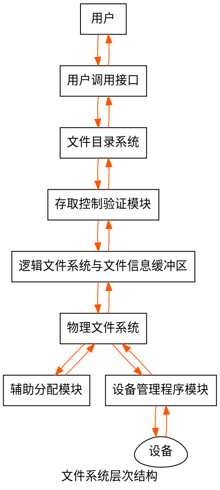

!> 文件管理

# 书籍链接
* [书籍链接,239](file:///media/deepin/670B-1B04/%E5%B8%B8%E7%94%A8%E8%BD%AF%E4%BB%B6/%E7%B3%BB%E7%BB%9F%E8%BD%AF%E4%BB%B6/%E7%AC%94%E8%AE%B0/%E8%AF%BE%E7%A8%8B/2021%E7%8E%8B%E9%81%93%E6%93%8D%E4%BD%9C%E7%B3%BB%E7%BB%9F.pdf)

# 文件管理
## 文件系统基础
1. 用户的输入输出基本单位是`文件`
2. 几个名词
    1. 数据项: 分为`基本数据项`(数据中可命名的最小逻辑数据单位, 是原子数据,如身份证号等)和`组合数据项`(多个基本数据项组成)
    2. 记录: 数据项的集合
    3. 文件: 信息集合, 存储在计算机硬盘这个载体上; 程序也是文件
        * 逻辑上分为`有结构文件`(文件由相似的记录组成, 也叫`记录式文件`)和`无结构文件`(字符流, 二进制文件或字符文件, 也叫`流式文件`)
2. 文件的一些属性  
    > 文件的属性信息都保存在目录结构中,目录结构保存在外存.需要时可调入内存  

    * 名称: 文件名
    * 标识符: 文件的内部标签,人不可见
    * 类型: 格式(doc, pdf)
    * 位置: 指向设备上文件的指针
    * 大小: 文件当前大小,也可表示文件允许最大值
    * 保护: 文件访问控制信息
    * 时间: 文件创建,修改,访问的信息
3. 文件的基本操作(需要使用系统调用)
    1. 创建文件: 在文件系统为文件找到空间, 在目录中为新文件创建目录
    2. 写文件: 需要执行系统调用. 通过文件名从目录找到文件, 读取写指针,写入内容(需要有写指针指向文件)
    3. 读文件: 需要执行系统调用, 通过文件名从目录找到文件, 读取读指针, 读出文件到内存块(读指针和写指针为一个指针)
    4. 文件重定位: (即文件寻址)按条件搜索目录, 设置当前文件位置为给定值,不进行文件读写
    5. 删除文件: 删除目录中该文件目录项, 然后回收该存储空间
    6. 截断文件: (清空文件)文件属性不变, 删除文件所有内容,释放所占空间
4. 文件的打开与关闭  
    系统首次使用文件时,调用open将文件属性及外存位置从外存复制到内存的`打开文件表`的一个表目中,返回表目索引指针  
    用户操作文件时,无需搜索文件位置,通过该索引找到表目信息即可操作文件  
    open打开某文件后,对该文件的操作则只需使用其表目索引指针  
    每个表目有一个`文件打开计数器`count, 用于记录打开了该文件的进程数.count为0, 则可以进行该文件内存空间的回收,回写外存,删除表目等操作,并释放文件控制块  
    打开的文件会有`文件指针`(记录上次读写位置,每个进程都有一个读写指针), `文件打开计数`, `文件磁盘位置`(保存在内存中), `访问权限`  

## 文件的逻辑结构
1. 文件的逻辑结构是以用户观点来看的,与存储介质特性无关;文件的物理结构(存储结构)是文件在外存的存储形式,与存储介质特性有关
2. 以逻辑结构,文件分为`无结构文件`(流式文件)和`有结构文件`(记录式文件)
3. `无结构文件`没有结构,访问使用穷举搜索,适用于对基本单位操作不多的字符流文件(`源程序文件`, `目标代码文件`)
4. `有结构文件`分为`顺序文件`,`索引文件`, `顺序索引文件`, `直接文件`(`散列文件`)
    1. `顺序文件`: 文件一个接一个顺序排列, 通常为定长, 可以`顺序存储`或`链表存储`,只能顺序访问
        1. 有`串结构`(按时间顺序排列,顺序与关键字无关)和`顺序结构`(记录按关键字顺排) 
        2. 大批量读取时顺序文件是所有逻辑文件效率最高的
        3. 只有顺序文件可以存到磁带,但对增删改查不方便
    2. `索引文件`: 将记录的关键字存到索引表
    3. `索引顺序文件`: 将顺序文件分组, 然后选取每组的第一个记录建立索引项. 索引项按关键字顺排, 组间关键字递增,组内记录可以无序  
        顺序查找某记录, 平均查找N/2次  
        索引顺序查找,N记录分为√N组,√N索引项,索引表和组内记录顺序查找,平均查找√N次  
        索引表加快了查找速度,但增加了存储空间
    4. `散列文件`: 通过散列函数得到记录地址.可能不同关键字有相同散列值.存取很快

## 目录结构
1. 文件目录: 可实现文件名与文件的映射(按名存取)
2. 文件控制块: (FCB)用于目录管理. 存储控制文件的所需信息  
    一个FCB是一个`文件目录项`,FCB的有序集合就是`文件目录`.  
    创建了新文件,则分配一个FCB到文件目录中  
    FCB主要包含文件的一些信息(名称,物理位置,逻辑物理结构,权限,创建修改时间等)
3. 索引结点: 检索文件一般用文件名索引,故将文件名与文件描述信息分开,文件描述信息则形成`索引结点`(`i结点`)  
    其文件目录项由`文件名`与`文件的i结点指针`组成(UNIX使用)  
    UNIX目录项16B(14B文件名,2B结点指针),1KB盘块放64个目录项(必须连续存放FCB),比一般64B目录项单位盘块存储更多  
    UNIX每个文件有唯一`磁盘索引结点`(磁盘上的索引结点),文件打开后`磁盘索引结点`复制到`内存索引结点`,包括  
    X) 文件标识符(拥有个人或小组标识符)  
    X) 文件类型(普通文件,目录文件,特别文件)  
    X) 文件权限  
    X) 文件物理地址  
    X) 文件长度  
    X) 文件链接计数(文件系统中指向该文件的文件名指针计数)  
    X) 文件存取时间  
    文件打开后还会增加`访问计数`,`索引结点编号`等标识  
4. 目录所需操作
    1. 搜索: 用户通过文件名搜索目录找到目录项
    2. 创建文件: 用户创建新文件,目录中增加目录项
    3. 删除文件: 用户删除文件,目录中删除目录项
    4. 显示目录: 显示目录内容,如所有文件及属性
    5. 修改目录: 文件变化后,目录项也需要变化
5. 几种目录结构: 单级目录结构, 两级目录结构, 多级目录结构(树形目录结构), 无环图目录结构
    1. 单级目录结构: 文件系统只一张目录表,每个文件一个目录项  
        搜索时顺序找到对应FCB,  
        创建文件先查找有无重名目录项,没有则创建FCB到目录表  
        删除先顺序找到目录项,回收文件存储空间,删除目录项  
        单级目录结构实现了按名存取,但查找慢,文件不能重名,不便文件共享(不适用于多用户操作系统)  
    2. 两级目录结构: 文件目录分为主文件目录(MFD Master File Directory)和用户文件目录(UFD User)  
        MFD记录用户名与用户文件目录存储位置,用户文件目录记录用户文件FCB信息  
        可以保证多用户使用,用户之间文件可重名,目录可加访问权限.但不能对文件分类
    3. 多级目录结构: (树形目录结构)用文件路径名标识文件  
        可以对文件分类,对文件更有效的管理和保护.但查找文件按路径名访问,增加了访盘次数,影响查询速度
    4. 无环图目录结构: 在树形目录结构上增加了指向同一结点的有向边(目录成为有向无环图),便与实现文件共享,但系统管理变复杂  
        共享结点设置共享计数器,若增加文件共享请求,则计数器加1,用户要删除该文件,删除共享链,计数器减1.共享计数器为0,则真正删除该结点  
        共享文件只存在一个真正的文件,任何改变其他用户都可见.
6. 进程对各文件的访问都相对于当前目录进行
7. 文件共享: 多个用户或进程共享同一个文件(如果每个用户或进程都有各自副本,会对存储空间造成浪费)
8. 常用文件共享方法
    1. 基于索引结点共享(硬链接)  
        用户目录项只有文件名和指向索引结点的指针,索引结点也会有count计数器  
        用户A创建了文件,则count就初始置为1,用户B共享使用该文件,count为2.即使用户A为创建者,删除时也不能直接删除文件,而只能删除自己用户目录的目录项
    2. 利用符号链共享(软链接)  
        用户B请求共享文件F,系统在用户B目录创建LINK文件(该文件只包含F的路径名).这使用了`符号链接`  
        访问LINK文件来请求F时,操作系统会根据LINK文件中的路径名读该文件  
        符号链的共享,只有文件拥有者才有指向索引结点的指针,其他共享用户只有该文件路径名,不拥有索引结点指针  
        文件主删除文件,其他共享用户不持有索引结点指针,也就不会有悬空指针.使用符号链访问失败,删除符号链即可  
        其他用户用共享链访问共享文件,会根据文件路径名逐个查找目录,所以可能多次读盘.  
        符号链接在网络共享时只需提供文件所在机器网络地址及文件路径即可  
    3. 两种共享方法总结  
        共享文件均会产生多个相同文件名,遍历文件系统则会多次遍历到共享文件  
        硬链接和软链接都是`静态共享方法`(只能一个进程操作)  
        多个进程同时对同一个文件操作是`动态共享方法`  
        `硬链接`比`软链接`快(直接持有共享文件的索引结点指针)  
9. 文件保护: 使用`口令保护`, `加密保护`, `访问控制`实现  
    前两个是防止用户文件被他人存取和窃取,谁都可以访问, 访问控制用来控制用户对文件的访问方式,有权限则可访问  
    1. 访问类型: 读, 写, 执行(装入内存执行), 添加(添加到文件尾), 删除(删除文件), 列表清单(列出文件名及属性)
    2. 访问控制: 可以每个文件和目录加一个`访问控制列表`,易访问,但可能导致复杂的空间管理  
        `精简访问列表`使用`拥有者`, `组`(需要共享文件,有类似访问的用户), `其他`(UNIX使用)  
        用户创建文件时,FCB记录文件拥有者名及组名  
    3. 口令保护: 创建文件时FCB记录口令,共享用户使用口令访问文件.时空开销不大,但口令存在系统内部不安全
    4. 加密保护: 文件被加密,访问时用秘钥访问.保密性强,但编码译码费时间.
10. 现代操作系统文件保护多用`访问控制列表`和`精简访问列表`组合方式
11. 多级目录结构还需保护目录,目录操作与文件操作不同,故需不同的保护机制
12. 文件管理系统: 操作系统负责管理和存储文件信息的软件机构
13. 文件系统由`文件管理软件`, `文件`, `管理文件的数据结构`组成
14. 文件系统要让用户可以方便操作,也能管理好硬盘上数据的存储

# 文件系统实现
## 文件系统层次结构(重点)
1. 各种文件系统类型(FAT32, NTFS, ext4等)
2. 文件系统层次结构图(可以借鉴用户访问一个文件时的过程来记忆)
    1. 用户调用接口: 文件系统提供给用户的文件与目录的调用(新建等),调用后转入相应模块
    2. 文件目录系统: 管理文件目录(管理目录相关的表,并调用存取控制模块)
    3. 存取控制验证模块: 实现文件保护, 比对用户请求与FCB中的权限信息
    4. 逻辑文件系统与文件信息缓冲区: 根据文件逻辑结构将用户请求的逻辑记录转成文件逻辑结构的块号
    5. 物理文件系统: 将逻辑块号转成物理地址
    6. 辅助分配模块: 分配和回收辅存空间,
    7. 设备管理程序模块: 分配设备,读写缓冲区,磁盘调度等



## 目录实现
1. 目录实现就是为了查找到文件信息
2. 目录实现有`线性列表`(对应线性查找)和`哈希表`(对应散列查找)
3. 线性列表: 存储文件名和数据块指针.创建时顺序查找,没有同名文件则创建目录项;删除时找到目录项,释放文件空间;  
    重用目录项可以标记不再使用,加到空闲目录表,将目录表后边目录项复制到空闲位置(降低目录长度).  
    链表结构可以减少删除文件时间.实现简单,但线性表费时
4. 哈希表: 通过文件名得到线性列表元素指针.快,插入删除简单,但可能会有指针冲突  
5. 目录查询需要多次访盘,可将当前使用文件目录复制到内存,如后边使用该文件则可减少访盘次数

## 文件实现
1. 文件实现就是研究文件数据在物理存储设备上如何分布和组织
2. 文件分配方式: (如何为磁盘分配空闲块)连续分配,链接分配,索引分配(RDOS操作系统三种分配方式都支持)  
    1. 连续分配: 每个文件在磁盘占有一组连续块.访问磁盘需要的寻道数与寻道时间最小  
        目录项只需记住开始块地址与块数即可  
        可以顺序访问和直接访问,简单,存取快,但文件长度不宜动态增加(文件尾盘块如果已分给其他文件,增加盘块需要移动大量盘块,反复增加会有外部碎片)  
        适用于长度固定文件  
    2. 链接分配: 使用离散分配,消除了外部碎片,提高了磁盘空间利用率;文件动态增加时方便分配盘块;文件增删改方便  
        链接分配也分为`隐式链接`与`显式链接`  
        1. 隐式链接: 一个文件对应一个磁盘块链表,每个磁盘块存下一个盘块指针,目录项包括文件第一块指针与最后一块指针.第一块指针为NULL,则文件为空文件;  
            读则从第一块指针顺序读块;  
            无法直接访问盘块,指针也消耗存储空间.系统软硬件错误导致链表指针丢失,则数据损坏  
        2. 显式链接: 将链接文件的物理块指针放到文件分配表中(FAT, file allocation table 磁盘仅设置一张),每个表项存下一块链接指针.  
            文件第一个盘块号记录在目录中,后续盘块号通过FAT找到(如aa的盘块号为2->4->0,FAT表如下,FAT表记录了所有盘块号,-1最后一块,-2空闲块)  
            对于磁盘块的分配,只需要在FAT中找到-2的盘块号即可  
            FAT表在系统启动则读入内存,加快检索速度,减少访盘次数  
            |盘块号|下一块|
            | :--:| :--:|
            | 0   | -1  |
            | 1   | -2  |
            | 2   | 4   |
            | 3   | -2  |
            | 4   | 0   |
    3. 索引分配: 链接分配不支持直接访问(FAT除外),故索引分配将每个文件盘块号放到一起构成索引块(表),  
        目录项放索引块地址, 读取索引块第i个条目就是文件第i块  
        创建文件时,索引块所有指针为空,得到空闲块后,修改指针地址  
        索引分配可以直接访问,也没有外部碎片,但索引块占了磁盘空间  
        可将索引块读入内存,减少访盘次数  
        索引块处理方案  
        1. 链接方案: 一个索引块放到一个磁盘块,大文件通过多个索引块链接
        2. 多层索引: 第一层索引块指向第二层索引块,第二层索引块指向文件磁盘块
        3. 混合索引(`高频考点`): 用于UNIX,有13个地址项(一个地址项4B),地址被分为直接地址和间接地址  
            直接地址: 索引结点可设置10个盘块号.若一个盘块4KB,文件不大于40KB时,索引结点可得到文件所有盘块号  
            一次间接地址: 使用一个地址项存放一个间址盘块地址,文件可达4MB  
            多次间接地址: 再使用一个地址项存放一个二次间址盘块地址,文件可达4GB.  
                在使用一个地址项存放一个三次间址盘块地址,文件长度可达4TB
    4. 各种分配方式比较
        1. 连续分配: 访盘1次,存取快,支持直接访问,但文件要求连续磁盘块,易有碎片,不易动态扩充文件长度
        2. 链接分配: 访盘n次,没有外部碎片,提高了磁盘利用率,便于动态增长,但只能顺序查找,指针信息也消耗空间
        3. 索引分配: m级索引访盘m+1次,可随机访问,文件易增删,但索引块消耗空间,索引策略也影响文件系统效率
3. 文件存储空间管理: 磁盘管理
    1. 文件存储器空间的划分: 一般一个文件存储在一个文件卷(文件卷可以是物理盘一部分,整个物理盘或多个物理盘,一个卷由多个物理盘组成用于超大型文件)  
        一个文件卷分为目录区(放FCB的信息)和文件区(放文件数据)  
        逻辑卷提供文件服务前需先初始化  
    2. 文件存储空间管理就是`空闲块的组织,分配,回收`,有如下方法
        1. 空闲表法  
            是连续分配方式.将所有空闲区置入空闲盘块表,每个表项存放一个空闲区(表项存放第一个空闲盘块号和空闲盘块数量),表项按空闲盘块号递增排列  
            可以使用首次适应算法,最佳适应,最坏适应,循环首次适应算法  
            回收时查看空闲表插入点前后是否有空闲区,有则合并  
        2. 空闲链表法  
            将空闲盘区组成空闲链.可以有`空闲盘块链`和`空闲盘区链`  
            空闲盘块链从链首摘下空闲盘分给用户.删除文件则回收的盘块插入空闲盘块链末尾(分配和回收一个盘块简单,分配多个盘块要多次操作)  
            空闲盘区链有指向下个空闲盘区的指针和本盘区盘块数.分配一般使用首次适应算法,回收需要将回收区与相邻空闲盘区合并  
        3. 位示图法  
            将磁盘所有盘块使用一个二进制位表示盘块情况(0空闲,1分配)  
            获取盘块流程  
            1. 顺序扫描位示图,获取一个或一组值为0的二进制位
            2. 将二进制位转换为盘块号
            ```tex
            b = n(i - 1) + j \\
            \small{b是盘块号,n是每行位数,i是行数,j是列数}
            ```
            3. 修改位示图:map[i, j] = 1  
            回收盘块流程  
            1. 获取盘块行列号
            ```tex
            i = b / n  \\ 
            j = b % n
            ```
            2. 修改位示图:map[i, j] = 0  
        4. 成组链表法: 用于大型文件系统(UNIX用, 大型文件系统空闲表和空闲链表会太大),是空闲表和空闲链表的组合  
            每n个空闲扇区的地址都放到第一个空闲扇区,每个第一个空闲扇区链起来.可以迅速找到大批空闲块地址  
            超级块: 空闲空间的位向量表, 第一个成组链块指针,卷的目录区,文件划分信息等存放的位置,一般在卷头  
            操作卷中文件前,超级块需要先读入内存,且主存超级块和辅存超级块需经常保持一致
4. 文件的物理结构如果选择不慎,逻辑结构的特点就很难体现(如逻辑结构为顺序结构,物理结构为隐式链接结构,理论可以直接获取数据,实际却要一块一块找).

# 磁盘组织与管理
## 磁盘的结构
1. 磁盘: 表面有磁性物质的金属或塑料圆盘
2. 磁头: 一个导体线圈,从磁盘取数据.读写时,磁头不同,磁盘高速旋转
3. 磁道: 磁盘的一个圆,用于存储数据.磁道与磁头一样宽.
4. 盘块: 一个扇区就是一个盘块(磁盘可寻址最小存储单位).
5. 柱面: 所有磁盘相同位置相同磁道组成柱面
6. 磁盘驱动器: 由磁头臂, 旋转磁盘的主轴,用于数据IO的电子设备组成
7. 磁盘地址=柱面号x盘面号x扇区号
8. 一个盘面上千个磁道,一个磁道几百个扇区(扇区按圆心角划分).每个扇区有固定存储大小(一般512B)
9. 相邻磁道和相邻扇区有间隙,用于避免精度错误
10. 磁盘存储能力受限于最内道最大记录密度(外道密度小,内道密度大,且每个扇区固定大小)
11. 磁头臂可以向外道移动,也可以向内道移动
12. 磁盘分类
    1. 固定头磁盘: 磁头到圆心距离固定,每个磁道一个磁头
    2. 活动头磁盘: 磁头臂可来回伸缩定位磁道
    3. 固定盘磁盘: 磁盘永久固定在磁盘驱动器
    4. 可换盘磁盘: 磁盘可移动与替换
13. 磁盘调度算法就是决定操作系统先给哪个请求寻找数据

##　磁盘调度算法
1. 一次磁盘读写操作时间由`寻道(寻找)时间`(找到磁道), `延迟时间`(找到扇区), `传输时间`(读写数据)决定
    1. 寻道时间: 活动头磁盘将磁头移动到指定磁道的时间(跨越n条磁道时间 + 启动磁臂s)  
    ```tex
    T_s = m x n + s  \\
    \small{m是跨越磁道时间, 约0.2ms,磁臂启动时间约2ms}
    ```
    2. 延迟时间: 磁头定位到某磁道扇区的时间  
    ```tex
    T_r = \frac{1}{2r}  \\
    \small{r为旋转速度,即每分钟转几圈.这里延迟时间算的是半圈时间}
    ```
    3. 传输时间: 从磁盘读出或写入磁盘数据的时间(取决于读写字节数b和磁盘旋转速度)
    ```tex
    T_t = \frac{b}{rN}  \\
    \small{r为旋转速度,即每秒转几圈,N是一个磁道字节数}
    ```
2. 磁盘存取数据的步骤中,寻道时间与磁盘调度算法有关,延迟时间与传输时间与磁盘旋转速度相关(线性相关).转速快,存取数据也快
3. 一次数据读写时间计算(`实际磁盘IO操作中,磁盘存取时间与磁盘调度算法密切相关`)
```tex
T_a = T_s + \frac{1}{2r} + \frac{b}{rN}
```
4. 磁盘调度算法(用来优化寻道时间)
    1. 先来先服务(FCFS): 根据进程请求磁盘的先后顺序进行调度  
        公平, 简单  
        只有少量进程访问,大部分请求访问簇聚的文件扇区,性能较好  
        大量进程访问磁盘,性能接近随机调度  
    2. 最短寻找时间优先(SSTF Shortest Seek Time First)  
        每次寻找与当前磁头所在磁道距离最近的磁道(每次寻找时间最短,但平均寻找时间不一定最短)  
        会产生饥饿现象  
        性能比FCFS算法更好  
    3. 扫描算法(SCAN, 也叫电梯调度算法)  
        消除了饥饿,不利于远端访问
        从当前磁头移动方向寻找与当前磁头所在磁道最近的磁道  
        对最近扫描过的区域不公平,访问局部性不如FCFS和SSTF算法  
    4. 循环扫描算法(Circular SCAN, C-SCAN)  
        消除了两端请求不公平
        磁头只能单向移动,然后从磁头移动方向找与当前磁头所在磁道最近的磁道  
        回返时快速移动到起始端不服务任何请求  
        SCAN算法偏向处理最里或最外磁道请求, C-SCAN则不会有偏向  
    5. LOOK算法  
        SCAN算法会走到最内或最外的磁道,LOOK算法走到最内或最外的请求的磁道则改变方向,不走到端点  
    6. C-LOOK算法  
        C-SCAN算法在一个方向上走到头才回到起始点,C-LOOK在一个方向上走到最远的请求的磁道则回到起始点.  
    7. 若无特别说明SCAN算法可以看成LOOK算法,C-SCAN算法可以看成C-LOOK算法.
    8. FCFS简单,性能差,请求少时用;SSTF比较通用;SCAN和C-SCAN在磁盘负载大时占优势
5. 减少延迟时间(寻找扇区时间)可对盘面扇区交替编号,盘片组不同盘面错位命名  
    磁盘会连续自转,磁头读写一个物理块后会经过短暂处理时间才能进行下次读写,盘面扇区交替编号,若数据连续存放,则连续读写可减少磁头延迟时间  
    不同盘面扇区错位编号,连续读写相邻盘面也可减少磁头延迟时间  
6. 磁盘寻块的寻道时间和延迟时间是找磁盘块的时间,可以减少,传输时间是磁盘本身性质决定,不能通过方法减少

## 磁盘的管理
1. 低级格式化(物理分区): 将只含有磁性记录材料的空白盘分成扇区.每个扇区的数据结构由头,数据区域(一般512B),尾部组成.头尾包含磁盘控制器使用的信息
2. 逻辑格式化: 将磁盘分为一个或多个柱面组成的分区(C盘,D盘),然后逻辑格式化物理分区,操作系统将初始文件系统数据结构(空闲和已分配空间)存到磁盘
3. 引导块: 存放自举程序(初始化程序),加载系统内核,初始化CPU等信息.  
    ROM保留很小的自举装入程序,完整自举程序在磁盘启动块  
    启动块在磁盘固定位置, 有启动分区的磁盘叫启动磁盘或系统磁盘  
4. 坏块: 需要使用某种机制让系统不使用坏块(坏块是硬件故障,操作系统无法修复)
5. 分区控制块: 记录分区详细信息
6. 内存分区表: 包含所有安装分区的信息