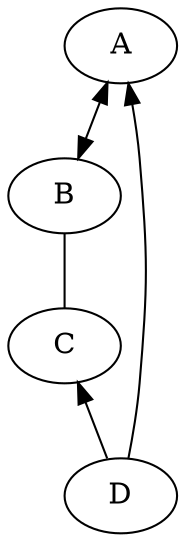

# 常用文档
简单[总结](https://blog.csdn.net/jy692405180/article/details/52077979)  

# 简单图形展示
````markdown

```dot
digraph demo{
    A->B[dir=both];
    B->C[dir=none];
    C->D[dir=back];
    D->A[dir=forward];
}
```
````


```dot
digraph demo{
    A->B[dir=both];
    B->C[dir=none];
    C->D[dir=back];
    D->A[dir=forward];
}
```