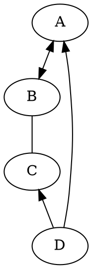

# DOT图

# KaTex语法
## 参考文档
* [官方](https://katex.org/docs/supported.html)进入  
* [简单](https://pandao.github.io/editor.md/examples/katex.html)文档  

## 常用语法
### 复杂公式嵌套
```tex
(\sqrt{a^2 + b^2} - (1 + x)^2)
```

### 右上标
```tex
a^2
```

### 多个右上标
```tex
a^{b^{2\pi}}
```

### 右下标
```tex
a_3
```

### 二维下角标
```tex
a_{i, j}
```

### 右上右下标
```tex
a_{i=3}^{5}
```

### 上下标
* displaystyle
  * 让公式显得更饱满
  * 让上下标生效
```tex
\displaystyle \left (\sum_{i=0}^{\infty} \right)
```

### 极限
```tex
\displaystyle \left (\lim_{x->-\infty}^{}\frac{\sin x}{x} = ? \right)  
```

### 正负号
```tex
\pm
```

### 小于等于
```tex
\leq
```

### 大于等于
```tex
\geq
```

### 根号
```tex
\sqrt{a^2 + b^2}
```

### 三角符号
```tex
\sin(x)  \\
\cos(x)  \\
\tan(x)  \\
\arctan(x)  \\
```

### 希腊字母
```tex
\alpha  \\
\theta  \\
\xi  \\
\pi  \\
\phi  \\
\oint  \\
\Omega  \\
```

### 求和符号
```tex
\sum 
```

### 连乘符号
```tex
\prod
```

### 分号
```tex
\dfrac{-b \pm \sqrt{b^2 - 4ac}}{2a}  \\
\dfrac{b}{a}  \\
```

### 积分
```tex
\int 
```

### 无穷
```tex
-\infty 
```

### 上尖号
```tex
\hat f(x_i) 
```

### 将公式写大
```tex
\Bigl (\alpha \Bigr)
```

### 省略号
```tex
\cdots
```

### 矩阵
```tex
\begin{pmatrix}
   a & b \\
   c & d
\end{pmatrix}
```

### 行列式
```tex
\begin{vmatrix}
   a & b \\
   c & d
\end{vmatrix}
```

### 交并符号
```tex
\bigcap  \\
\bigcup  \\
```

### ~,等价
```tex
\enspace\text{\textasciitilde}\enspace
```

### 大于等于
```tex
\geqslant
```

### 小于等于
```tex
\leqslant
```

### 不等于
```tex
\mathrlap{\,/}{=}
```

## 属于
```tex
\in 
```

## 包含于
```tex
\owns 
```

### 突出颜色
```tex
\color{Red}{x^2}
```

### 在线绘图
[脚本之家工具](http://tools.jb51.net/aideddesign/fooplot)  