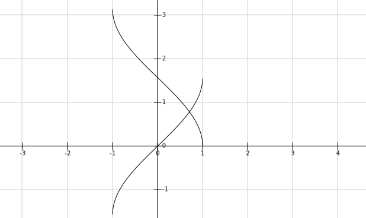

# 三角函数
下边是反正弦与反余弦公式的图线(反三角函数就是和三角函数的定义域值域相反.)  
  
常用三角函数值  
```tex
\displaystyle
\footnotesize
sin(\frac{\pi}{2}) = 1  \\
sin(0) = 0  \\
sin(-\frac{\pi}{2}) = -1  \\
arcsin(1) = \frac{\pi}{2}  \\
arcsin(0) = 0  \\
arcsin(-1) = -\frac{\pi}{2}  \\
cos(0) = 1  \\
cos(\frac{\pi}{2}) = 0  \\
cos(\pi) = -1  \\
arccos(1) = 0  \\
arccos(0) = \frac{\pi}{2}  \\
arccos(-1) = \pi  \\
arctan1 = \frac{\pi}{4}  \\
cosn\pi = (-1)^n  \\
sinn\pi = 0  \\
```  
```tex
\displaystyle
\footnotesize
\begin{matrix}
度 & 30 & 45 & 60  \\
sin & \frac12 & \frac{\sqrt{2}}{2} & \frac{\sqrt{3}}{2}  \\
cos & \frac{\sqrt{3}}{2} & \frac{\sqrt{2}}{2} & \frac12  \\
tan & \frac{\sqrt{3}}{3} & \frac{\sqrt{9}}{3} & \frac{\sqrt{27}}{3}  \\ 
\end{matrix}
```  
三角函数  
```tex
\displaystyle
\footnotesize
\sin^2x + \cos^2x = 1 \\
\sec^2x - \tan^2x = 1 \\
\csc^2x - \cot^2x = 1 \\
\dfrac{\sin{x}}{\cos{x}} = \tan{x}  \\
\dfrac{\sin^2{x}}{\cos^2{x}} = \tan^2{x}  \\
\cos{x} * \tan{x} = \sin{x}  \\
\cos^2{x} * \tan^2{x} = \sin^2{x}  \\
\sin^2{x} + \cos^2{x} = 1  \\
arcsinx + arccosx = \frac\pi2(导数为0,是常值函数)  \\
arctanx + arccotx = \frac\pi2(导数为0,是常值函数)  \\
arctanx + arctan\frac{1}{x} = \frac\pi2(导数为0,是常值函数,x与\frac{1}{x}互为倒数即可)   \\
arctane^x + arctane^{-x} = \frac\pi2(导数为0,是常值函数)  \\
arctane^x + arccote^{x} = \frac\pi2(导数为0,是常值函数)  \\
arctanx = arccot{\frac{1}{x}}(y = arctanx, x = tany, \frac{1}{x}= coty, y = arccot{\frac{1}{x}})  \\
\sec x = \dfrac{1}{\cos x}  \\
\csc x = \dfrac{1}{\sin x}  \\
\sin(\alpha + \beta) = \sin\alpha\cos\beta + \cos\alpha\sin\beta  \\
\sin(\alpha - \beta) = \sin\alpha\cos\beta - \cos\alpha\sin\beta  \\
\cos(\alpha + \beta) = \cos\alpha\cos\beta - \sin\alpha\sin\beta  \\
\cos(\alpha - \beta) = \cos\alpha\cos\beta + \sin\alpha\sin\beta  \\
\tan(\alpha + \beta) = \dfrac{\tan\alpha + \tan\beta}{1 - \tan\alpha\tan\beta}  \\
\tan(\alpha - \beta) = \dfrac{\tan\alpha - \tan\beta}{1 + \tan\alpha\tan\beta}  \\
\cot(\alpha + \beta) = \dfrac{\cot\alpha\cot\beta - 1}{\cot\beta + \cot\alpha}  \\
\cot(\alpha - \beta) = \dfrac{\cot\alpha\cot\beta + 1}{\cot\beta - \cot\alpha}  \\
sinacosb = \tfrac12[sin(a + b) + sin(a - b)]  \\
cosacosb = \tfrac12[cos(a + b) + cos(a - b)]  \\
sinasinb = \tfrac12[cos(a - b) - cos(a + b)]  \\
sina + sinb = 2sin\frac{a + b}{2}cos\frac{a - b}{2}  \\
sina - sinb = 2sin\frac{a - b}{2}cos\frac{a + b}{2}  \\
cosa + cosb = 2cos\frac{a + b}{2}cos\frac{a - b}{2}  \\
cosa - cosb = -2sin\frac{a + b}{2}sin\frac{a - b}{2}  \\
sin2x = 2sinxcosx  \\
cos2x = cos^2x - sin^2x = 2cos^2x - 1 = 1 - 2sin^2x  \\
sin3x = -4sin^3x + 3sinx  \\
cos3x = -4cos^3x - 3cosx  \\
sinx + cosx = \sqrt{2}(\frac{\sqrt{2}}{2}sinx + \frac{\sqrt{2}}{2}cosx) = \sqrt{2}(cos\frac{\pi}{4}sinx + sin\frac{\pi}{4}cosx) = \sqrt{2}sin(x + \frac{\pi}{4})  \\
```
万能代换(三角函数和普通函数之间的变换)
```tex
\displaystyle
\footnotesize
tanu = x  \\
则sinu = \frac{x}{\sqrt{x^2 + 1}}  \\
cosu = \frac{1}{\sqrt{x^2 + 1}}   \\
```

# 排列组合公式
```tex
\displaystyle
\footnotesize
A_n^m = n(n-1)(n-m+1)\dfrac{n!}{(n - m)!}  \\
C_n^m = \dfrac{A_n^m}{m!} = \dfrac{m!}{n!(m-n)!}  \\
```

# 数列公式
```tex
\displaystyle
\footnotesize
等差数列前n项和(a_1是首项,a_n是尾项,d为公差)  \\
S_n = na_1 + \dfrac{n(n-1)}{2}d (n \in N^*)  \\
等比数列前n项和(a_1是首项,a_n是尾项,q为公比)  \\
S_n = a_1 \dfrac{1-q^n}{1-q}(q\mathrlap{\,/}{=}1)  \\
n! = 1 *.. *n  \\
(2n-1)!! = 1 * 3 * ... * (2n-1)  \\
(2n)!! = 2 * 4 * ... * (2n)  \\
\sum_{k = 1}^n k^2 = 1^2 + ... + n^2 = \frac{n(n+1)(2n+1)}{6}  \\
\sum_{k = 1}^n k^3 = 1^3 + ... + n^3 = [\frac{n(n+1)}{2}]^2 = (\sum_{k = 1}^n k)^2  \\
\sum_{k = 1}^n k(k+1) = 1 x 2 + ... + n(n + 1) = \sum_{k = 1}^n (k^2 + k) = \frac{n(n+1)(n+2)}{3}  \\
```
```tex
\displaystyle
\footnotesize
证\sum_{k = 1}^n k^a, 使用\sum_{k = 1}^n k^{a+1} - (k - 1)^{a+1},如证\sum_{k = 1}^n k^2  \\
\sum_{k = 1}^n [k^3 - (k - 1)^3] = \sum_{k = 1}^n [3k^2 - 3k + 1] = 
3\sum_{k = 1}^n k^2 - 3\sum_{k = 1}^n k + n = n^3  \\
3\sum_{k = 1}^n k^2 = n^3 - n + \frac{3n(n+1)}{2}, \sum_{k = 1}^n k^2 = \frac{n(n+1)(2n+1)}{6}  \\
```  
[参考](https://zhuanlan.zhihu.com/p/69321050)  

# 常用不等式
```tex
\displaystyle
\footnotesize
\dfrac12(a + b) \geqslant \sqrt{ab}  \\
\dfrac14(a + b + c + d) \geqslant \sqrt[4]{abcd}  \\
\dfrac13(a + b + c) \geqslant \sqrt[3]{abc}  \\
a + \frac{1}{a} \geqslant 2  \\
如 \dfrac14(3x_n + \dfrac{1}{x_n^3})=\dfrac14(x_n + x_n + x_n + \dfrac{1}{x_n^3}) \geqslant \sqrt[4]{x_n*x_n*x_n*\dfrac{1}{x_n^3}}  \\
ln(1 + x) < x < e^x - 1  (\forall x)\\
|a - b| \leqslant |a| + |b|  \\
\sin x < x < \tan x(0 < x < \frac{\pi}{2})  \\
\dfrac{x}{1 + x} < ln(1 + x) < x, (x > 0)  \\
e^x \geqslant x + 1 (\forall x)  \\
lnx \leqslant x - 1 (x > 0)  \\
x - 1 < [x] \leqslant x ,[1.5] = 1[2] = 2 \\
a < b < c, 则 \frac{1}{c} < \frac{1}{b} < \frac{1}{a}  \\
当0<x<1, e^{-t^2} > e^{-t}  \\
ln(n + 1) < \sum_{i = 1}^{n} \frac{1}{i} < 1 + lnn  \\
```

# 常用直线公式
```tex
\displaystyle
\footnotesize
y = ax + b(斜截式)  \\
y - y_0 = y'(x - x_0)(点斜式)  \\
\frac{y - y_1}{y_2 - y_1} = \frac{x - x_1}{x_2 - x_1}(两点式)  \\
\frac{x}{a} + \frac{y}{b} = 1(截距式, a是y = 0时x的值,b是x = 0时y的值)  \\
Ax + By +C = 0(一般式)  \\
点到直线距离公式  \\
d = |\frac{Ax_0 + By_0 + C}{\sqrt{A^2 + B^2}}|  \\
```

# 极坐标与直角坐标转化
```tex
\displaystyle
\footnotesize
圆周长 = 2\pi r  \\
圆面积 = \pi r^2 = 2\pi r * r * \frac12 \\
弧长 = \theta r = 2\pi r * \frac{\theta}{2\pi} \\
扇形面积 = \frac12 r^2\theta = \theta r * r * \frac12 \\
x = rcos\theta  \\
y = rsin\theta  \\
x^2 + y^2 = r^2  \\
```

# 常用变形
```tex
\displaystyle
\footnotesize
\sqrt x = x^{\frac{1}{2}}  \\
x = lne^x = e^{lnx}  \\
f(\xi) = \xi \to g(x) = f(x) - x,{\footnotesize 找g(x)=0,零点定理}  \\
a^3+b^3 = (a+b)(a^2-ab+b^2)  \\
a^3-b^3 = (a-b)(a^2+ab+b^2)  \\
a^4 - b^4 = (a^2 + b^2)(a + b)(a - b) = (a + b)(a^3 - a^2b + ab^2 - b^3) = (a - b)(a^3 + a^2b + ab^2 + b^3)  \\
(a + b)^3 = a^3 + 3a^2b + 3ab^2 + b^3 \\
(a - b)^3 = a^3 - 3a^2b + 3ab^2 - b^3 \\
(a + b)^n = \sum_{k = 0}^n C_n^ka^{n - k}b^k (二项式定理) \\
```

# 充分和必要的判断
```tex
\displaystyle
\footnotesize
A \to B: A是B的充分条件,B是A的必要条件  \\
A \to B , B \nrightarrow A: A是B的充分不必要条件,B是A的必要不充分条件  \\
A \nrightarrow B , B \nrightarrow A: A是B的既不充分也不必要条件  \\
A \to B , B \to A: A是B的充要条件  \\
A \nrightarrow B , B \to A: A是B的必要不充分条件,B是A的充分不必要条件  \\
```

# 相关符号
```tex
\displaystyle
\footnotesize
N: 自然数, N*: 正整数,N^* \in N  \\
Z: 整数  \\
```

# 物理公式
```tex
\displaystyle
\footnotesize
\rho = \frac{m}{v}  \\
```

# 奇偶函数的性质
```tex
\displaystyle
\footnotesize
奇函数求导是偶函数, 偶函数求导是奇函数  \\
奇函数原函数是偶函数,偶函数原函数只有一个(变上限函数)  \\
两个奇函数相加或相减是奇函数  \\
偶函数与奇函数的和或差为非奇非偶函数  \\
两个奇函数相乘除结果为偶函数  \\
偶函数与奇函数乘除结果为奇函数  \\
f(x)是偶函数, f(x + a) = f(-(x + a)), f(x + a)是偶函数, f(x + a) = f(-x + a)  \\
证明偶函数求导是奇函数  \\
f(-x) = f(x)  \\
则-f'(-x) = f'(x)  \\
```

# 二次函数

```tex
\displaystyle
\footnotesize
ax^2 + bx + c = 0  \\
\Delta = b^2 - 4ac, \Delta > 0,方程有两个不同实根, \Delta = 0, 方程有一个根, \Delta < 0, 方程无实根  \\
顶点公式(-\frac{b}{2a}, \frac{4ac - b^2}{4a})  \\
求根公式x = \frac{-b \pm \sqrt{b^2 - 4ac}}{2a}  \\
韦达定理:x_1 + x_2 = -\frac{b}{a}, x_1*x_2 = \frac{c}{a}  \\
```

# 几何图形公式

```tex
\displaystyle
\footnotesize
椭圆面积 = \pi ab  \\
```

# 函数相关知识
```tex
\displaystyle
\footnotesize
(1)函数: 也叫直接函数, 记为y = f(x), \forall x \in D, 都有y \in R与之对应  \\
(2)反函数: 记为x = f^{-1}(y), \forall y \in R, 都有x \in D与之对应  \\
如果函数是单值函数, 反函数不一定是单值函数, 但如果函数是单值单调函数, 反函数也是单值单调函数  \\
y = x^2的反函数是x = \pm \sqrt{y}, y = x^2(x \in [0, +\infty)的反函数是x = \sqrt{y}  \\
(3)对数函数: log_a(x), a> 1,函数单增, 0 < a < 1, 函数单减  \\
(4)正割函数: secx, 余割函数: cscx  \\
(5)绝对值函数: y = |x|,在x \geqslant 0, y = x, x < 0, y = -x  \\ 
(6)绝对值函数与最大值,最小值函数  \\
U = max\{f(x), g(x)\}, V = min\{f(x), g(x)\}  \\
U + V = f(x) + g(x), U - V = |f(x) - g(x)|, UV = f(x)g(x)  \\
(7)符号函数y = sgnx, 在x > 0, y = 1, x = 0, y = 0 x < 0, y = -1  \\ 
任意实数x = |x|sngx  \\
(8)取整函数:y = [x], 不超过x的最大整数[-3.4] = -4, [-2.5] = 2, [3] = 3 \\
x - 1 < [x] \leqslant x, [x + n] = [x] + n, n[x] \leqslant nx, [x] + [y] \leqslant [x + y], n为正整数  \\ 
\lim\limits_{x \to 0^+} [x] = 0, \lim\limits_{x \to 0^-} [x] = -1  \\
(9)奇偶函数中  \\
奇函数在原点有定义,f(0) = 0  \\
偶函数在0点有导数, f'(0) = 0  \\
f(x)与f(-x)关于y轴对称, f(x)与-f(x)关于x轴对称, f(x)与-f(-x)关于原点对称  \\
y = f(x)关于x = T对称, 则f(x) = f(2T - x)或f(x + T) = f(T - x)  \\
```

