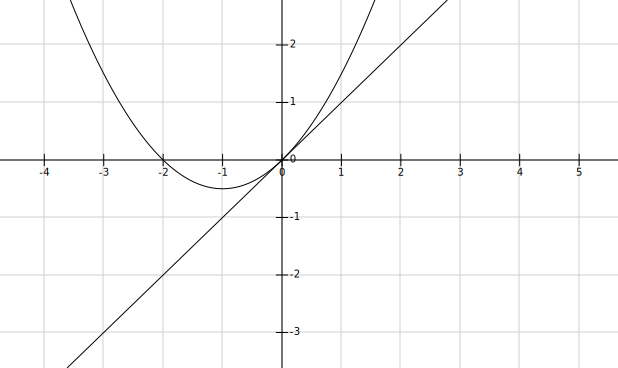

# 书籍链接
* [题目分册,21](file:///media/easul/D4B4E1AFB4E19470/Software/%E5%AD%A6%E4%B9%A0/%E8%80%83%E7%A0%94/%E8%B5%84%E6%96%99/%E6%95%B0%E5%AD%A6/%E8%B5%84%E6%96%99/2020%E5%BC%A0%E5%AE%87%E9%A2%98%E6%BA%90%E6%B7%B1%E6%9E%901000%E9%A2%98-%E4%B9%A0%E9%A2%98%E5%88%86%E5%86%8C%EF%BC%88%E6%95%B0%E5%AD%A6%E4%B8%80%EF%BC%89.pdf)
* [解析分册,38](file:///media/easul/D4B4E1AFB4E19470/Software/%E5%AD%A6%E4%B9%A0/%E8%80%83%E7%A0%94/%E8%B5%84%E6%96%99/%E6%95%B0%E5%AD%A6/%E8%B5%84%E6%96%99/2020%E5%BC%A0%E5%AE%87%E9%A2%98%E6%BA%90%E6%B7%B1%E6%9E%901000%E9%A2%98-%E8%A7%A3%E6%9E%90%E5%88%86%E5%86%8C%EF%BC%88%E6%95%B0%E5%AD%A6%E4%B8%80%EF%BC%89.pdf)

# 基础知识
1. 导数定义
```tex
\footnotesize
\displaystyle
平均变化率: \frac{f(x_0 + \Delta x) - f(x_0)}{\Delta x}   \\
导数定义,瞬时变化率: f'(x_0) = \lim\limits_{\Delta x \to 0}\frac{f(x_0 + \Delta x) - f(x_0)}{\Delta x}  \\
\orange{(这里\Delta x是变化量,x_0是定量)}  \\
导数定义另一种写法: f'(x_0) = \lim\limits_{x \to x_0}\frac{f(x) - f(x_0)}{x - x_0}  \\
\orange{(这里x是变化量,x_0是定量)}  \\
f'(x)=\frac{df}{dx}, f'(x_0)=\frac{df}{dx}|_{x = x_0}  \\
\frac{d^2f(x)}{dx^2}可以看做是f(x)的二阶导f''(x),或者是\frac{d\frac{df(x)}{dx}}{dx} \\
上边两种都是特殊点,下边是一般点的导数(注意\Delta可以看成狗,凑\orange{狗}的时候要三处都相同)  \\
f'(x) = \lim\limits_{\Delta x \to 0}\frac{f(x + \Delta x) - f(x)}{\Delta x}  \\
```
2. 一点可导,则左导数 = 右导数即
```tex
f'_+(x_0) = f'_-(x_0)  (用导数定义来求)  \\
```
3. 常用求导方法  
    1. 复合函数求导(从外到内,然后就是乘积和除法的求导)  
        如果里边的函数在这个点可导,外边的函数在这个点也可导,那么整体就可用复合函数法则求导  
        对于加减乘除,每个函数都在这个点可导,则整体在这个点可导  
    2. 隐函数求导  
    ```tex
    \footnotesize
    \displaystyle
    显函数 y = f(x), 可以看出详细的x,y的关系  \\
    隐函数 F(x, y) = 0, 函数关系无法简化,可以同时在函数两边对x求导,y看成是y(x)  \\
    如 y - tan(x + y) = 0  \\
    ```
    3. 对数求导法  
    多项相乘,相除,开方,乘方的式子,可以先取对数再求导  
    ```tex
    lny = lnab = lna + lnb
    ```
    4. 反函数求导
    原函数的导数的倒数,就是反函数的导数  
    原函数与反函数单调性相同  
    原函数导数和反函数导数互为倒数,所以相乘为1.  
    f(3) = 5, g(5) = 3, 则f'(3)f'(5) = 1, arctan(1)' = tan(45<sup>o</sup>)' 
    ```tex
    \footnotesize
    \displaystyle
    y = f(x)求导就是y' = \frac{dy}{dx}  \\
    \frac{1}{y'} = \frac{dx}{dy}就是反函数的导数
    ```
    5. 参数方程求导  
    ```tex
    \footnotesize
    \displaystyle
    x = x(t), y = y(t)  \\
    一阶导为\frac{dy}{dx} = \frac{\frac{dy}{dt}}{\frac{dx}{dt}}  \\
    二阶导为\frac{d^2y}{dx^2} = \frac{d(\frac{dy}{dx})}{dx} = \frac{\frac{d(\frac{dy}{dx})}{dt}}{\frac{dx}{dt}}
    ```
    6. 高阶导数: 二阶导数以上,可以理解为很高阶的导数   
    ```tex
    \footnotesize
    \displaystyle
    (一)  \\
    这里的n是n阶导  \\
    (u \plusmn v)^{(n)} = u^{(n)} \plusmn v^{(n)}  \\
    (uv)^{(n)} = \sum_{k=0}^n C_n^k u^{(n-k)}v^{(k)} = C_n^0 u^{(n)}v + C_n^1 u^{(n-1)}v^{(1)} + ... + C_n^n uv^{(n)}(莱式公式,用于乘积的高阶导)  \\
    (二)  \\
    如果是一个点的高阶导,可以用泰勒公式(但高阶导不是唯一办法)可以参考\orange{2.45}.  \\
    (三)  \\
    归纳法: 先求几阶导,然后找规律,可能需要变形,同时注意系数变化  \\
    (四)  \\
    化简带公式(因式分解,三角变形),可以带入的公式有  \\
    (e^{ax + b})^{(n)} = a^n e^{ax + b}  \\
    (sin{ax + b})^{(n)} = a^n sin({ax + b + \frac{n\pi}{2}})  \\
    (cos{ax + b})^{(n)} = a^n cos({ax + b + \frac{n\pi}{2}})  \\
    (ln({ax + b}))^{(n)} = (-1)^{n - 1} a^n \frac{(n - 1)!}{(ax + b)^n}  \\
    (\frac{1}{ax + b})^{(n)} = (-1)^n a^n \frac{n!}{(ax + b)^{n+1}}  \\
    ```  
    ```tex
    \displaystyle
    \footnotesize
    (1)设f(x)有任意阶导数,且f'(x) = f^2(x), 则f^{(n)}(x)(n > 2)为 ?  \\
    多算几阶导数来归纳  \\
    (2)f(x) = e^xcosx,则f^{(n)}(x) = ?  \\
    f'(x) = e^x(cosx - sinx) = e^x(cosx - sinx) = \sqrt{2}e^x cos(x + \frac{\pi}{4}) \to 这里逆用sin(a+b)变形  \\
    f''(x) = (\sqrt{2})^2 e^xcos(x + 2*\frac{\pi}{4})  \\
    故f^{(n)}(x) = (\sqrt{2})^n e^xcos(x + n*\frac{\pi}{4})  \\
    (3)y = sin^4x, 则y^{(n)} = ?  \\
    将次方减少,然后就可以算了  \\ 
    sin^4x = (sin^2x)^2 = \frac14(1 - 2cos2x - cos^22x) = \frac38 - \frac12 cos2x + \frac18 cos4x  \\
    (4)y = ln(3 + 7x - 6x^2), y^{(n)} = ?  \\
    y = ln|3 - 2x| + ln|3x + 1| \to 绝对值不能忘 \\
    然后带公式  \\
    y^{(n)} = (-1)^{n - 1}[(-2)^n\frac{(n-1)!}{3 - 2x}^n + (3)^n\frac{(n-1)!}{3x + 1}^n]  \\
    (5)y = x^3sinx, 求y^{(6)}(0) = ?  \\
    可以用莱氏公式(用莱氏公式要注意不能忘了C_n^k),也可以用泰勒公式  \\
    左边 y = y(0) + y'(0)x + \frac{1}{6!}y^{(6)}(0)x^6 + o(x^6)  \\
    右边 = x^3sinx = x^3(x - \frac16 x^3)  \\
    故\frac{1}{6!}y^{(6)}(0) = - \frac16  \\
    y^{(6)}(0) = -120  \\
    y^{(5)}(0)从右边的泰勒公式中可以看出没有系数,所以可以肯定,5阶导系数为0, y^{(5)}(0) = 0  \\ 
    (6)y = \frac{1}{1 + x^2}, y^(3)(0) = ?  \\
    可以用泰勒公式,也可以用偶函数求导是奇函数,因为这里在x = 0处有定义,所以可以直接用导数的奇偶性  \\
    y'(x)是奇函数, y^{(奇次导)}是奇函数,奇函数在0点有定义,则0点值为0  \\
    (7)y = arctanx, 则y^{(n)}(0) = ?  \\
    泰勒公式: 直接无法求n阶导,可以求一阶导,然后一阶导结果发现可以用n - 1阶导数来求了  \\
    也可以用奇偶性求,arctanx是奇函数  \\
    n = 2k, n阶导是奇函数  \\
    n = 2k + 1,n阶导是偶函数,然后用泰勒公式算  \\
    ```
4. 十大中值定理  
泰勒公式使用佩亚诺余项,则为无穷小项,可以省略掉,如果使用拉格朗日余项,则该项值在极限下可以表示出来
5. 导数的几何应用  
    三点,两性,一线
    * 极值点
        * 判断  
        ```tex
        \displaystyle
        \footnotesize
        \orange{第一种}  \\
        若f(x)在x = x_0连续, 在\mathring{U}(x_0, \delta)可导(去心邻域可导,该点可以不可导)  \\
        当x_0 \in (x_0 - \delta, x_0)时,f'(x) < 0, x_0 \in (x_0, x_0 + \delta)时,f'(x) > 0, 则该点是极小值点  \\
        当x_0 \in (x_0 - \delta, x_0)时,f'(x) > 0, x_0 \in (x_0, x_0 + \delta)时,f'(x) < 0, 则该点是极大值点  \\
        当x_0 \in (x_0 - \delta, x_0)和x_0 \in (x_0, x_0 + \delta)时,f'(x)不变号,则该点不是极值点  \\
        \orange{第二种}  \\
        若f(x)在x_0处,f'(x_0) = 0, f'(x_0) > 0, 则该点为极小值点  \\
        若f(x)在x_0处,f'(x_0) = 0, f'(x_0) < 0, 则该点为极大值点  \\
        证明  \\
        f(x) = f(x_0) + f'(x_0)(x - x_0) + \frac12f''(x_0)(x - x_0)^2 + o(x - x_0)^2(o是无穷小项,可以不理会), 则  \\
        f(x) - f(x_0) =  \frac12f''(x_0)(x - x_0)^2 + o(x - x_0)^2 > 0, f(x_0)是极小值(真正极小值)  \\
        f(x) - f(x_0) =  \frac12f''(x_0)(x - x_0)^2 + o(x - x_0)^2 < 0, f(x_0)是极大值(真正极大值)  \\
        ```
        * 极值必须是双侧定义,单侧和端点不讨论极值
        * 广义极值(`考研用`): x<sub>0</sub>邻域内所有值都大于等于该值(极小值)或小于等于该值(极大值).邻域包括x<sub>0</sub>
        * 真正极值: x<sub>0</sub>去心邻域内所有值都大于该值(极大值)或小于该值(极小值).邻域不包括x<sub>0</sub>
        * 极值点是f'(x)两边变号的点,导数为0,二阶导不为0的点,也可能是没有导数的点,或者直接有f(x) < f(x<sub>0</sub>)
    * 最值点
        * 包括`驻点`(导数为0的点), `不可导点`(导数不存在的点), 端点(驻点和不可导点统称可疑点)
        * I上的唯一极大(小)值, 则是I上最大(小)值
        * 开区间的两端取值取极限即可,无穷则不用再取两端的值.
    * 拐点  
        * 连续曲线凹凸弧的的分界点
        * 拐点(x_<sub>0</sub>, f(x_<sub>0</sub>))为f''(x)在x<sub>0</sub>的邻域左右变号的点,也可能是f''((x_<sub>0</sub>, f(x_<sub>0</sub>))) = 0, f'''((x_<sub>0</sub>, f(x_<sub>0</sub>)))不为0的点
        * 一阶导不为零的点也可以是拐点
    * 单调性
    * 凹凸性
    ```tex
    \orange{定义表示}  \\
    \forall x_1, x_2 \in I, \frac{f(x_1) + f(x_2)}{2} > f(\frac{x_1 + x_2}{2}), f(x是凹曲线)  \\
    \forall x_1, x_2 \in I, \frac{f(x_1) + f(x_2)}{2} < f(\frac{x_1 + x_2}{2}), f(x是凸曲线)  \\
    \orange{几何表示}  \\
    切线小于凹曲线,  \\
    切线大于凸曲线  \\
    \orange{函数表示}  \\
    \forall x \in I, f''(x) > 0, f(x)是凹的  \\
    \forall x \in I, f''(x) < 0, f(x)是凸的  \\
    ```
    * 渐进线  
        先找定义域,定义域内的无定义点,开区间端点可以有垂直渐近线,无穷处可以有水平渐近线和斜渐近线  
        * 铅直渐近线
        ```tex
        \displaystyle
        \footnotesize
        \lim\limits_{x \to x_0^{+/-}} f(x) = \infty  \\
        x = x_0是铅直渐近线  \\
        可以在无定义点, 开区间端点, 可以是单侧(x_0一侧极限为3,一侧极限为无穷,也是铅直渐近线)  \\
        铅直渐近线可以有无穷条,如tanx  \\
        ```
        * 水平渐近线
        ```tex
        \displaystyle
        \footnotesize
        \lim\limits_{x \to +/-\infty} f(x) = A  \\
        y = A是水平渐近线(+\infty处是f(x)在右侧的水平渐近线,-\infty处是f(x)在左侧的水平渐近线)  \\
        水平渐近线最多两条,如arctanx  \\
        ```
        * 斜渐近线
        ```tex
        \displaystyle
        \footnotesize
        \lim\limits_{x \to +/-\infty} \frac{f(x)}{x} = a \mathrlap{\,/}{=} 0且\lim\limits_{x \to +/-\infty}[f(x) - ax] = b存在  \\
        y = ax + b是斜渐近线(a是斜率,b是截距)  \\
        x的阶数一致才能有相同增速,也才能有渐近线  \\
        x \to -\infty是左侧的斜渐近线,  x \to +\infty是右侧的斜渐近线  \\
        \red{同一侧,水平渐近线和斜渐近线不会同时存在}  \\
        斜渐近线最多两条  \\
        \orange{若\lim\limits_{x \to \infty} [f(x) - (ax + b)] = 0,则y = ax + b是f(x)的斜渐近线}  \\
        ```
        ```tex
        \displaystyle
        \footnotesize
        (一)  \\
        找y = \frac{1}{x} + ln(1 + e^x)的斜渐近线  \\
        \lim\limits_{x \to +\infty} \frac{\frac{1}{x} + ln(1 + e^x)}{x} dx  \\
        这里\frac{1}{x}\to 0 ,存在于加减中,可以先算出来,然后只看ln(1 + e^x)即可  \\
        \lim\limits_{x \to +\infty} [\frac{1}{x} + ln(1 + e^x) - x] = \lim\limits_{x \to +\infty} [ln(1 + e^x) - lne^x] = 0  \\
        (二)  \\
        xln\frac{1}{x} = -xlnx  \\
        (三)  \\
        \lim\limits_{x \to \infty} [f(x) - (ax + b)] = 0  \\
        因为y = ax + b就是f(x)的斜渐近线,所以如果极限通分很麻烦, 那么可以改成求函数斜渐近线来得到a, b  \\
        如\lim\limits_{x \to +\infty} [\sqrt{x^2 + x + 1} - (ax + b)] = 0,求a, b  \\
        y = ax + b是斜渐近线,求出来 y = x + \frac12, 则a = 1, b = \frac12  \\
        若是y = x - \frac12, 则b = -\frac12  \\
        ```

# 自我总结
1. 奇函数是f(-x) = -f(x),故关于原点对称(否则原点就有两个函数值了)
2. 奇偶函数
```tex
\footnotesize
\displaystyle
f(x) + f(-x)就是偶函数  \\
f(x) - f(-x)就是奇函数
```
3. f对x的变化率就是f对x的导数,也可以说是一点切线的斜率,也是tant
```tex
\displaystyle
\footnotesize
\frac{df}{dx} = f'(x) = y'_x
```
4. 若一点可导,则导数值唯一,左右导数相等
5. 导数中的几个符号
```tex
\displaystyle
\footnotesize
dx^2 = (dx)^2, dx^n = (dx)^n,(微分的幂), dx = \Delta x  \\
d(x^2) = 2xdx,(幂的微分)  \\
\frac{d^2x}{dx^2} = \frac{d(\frac{dx}{dx})}{dx} = 0  \\
x = f(y), 则\frac{df}{dy} = \frac{dx}{dy},   \\
\frac{d^2f}{dy^2} = \frac{d^2x}{dy^2} = \frac{\frac{d(\frac{dx}{dy})}{dx}}{\frac{dy}{dx}}
```
6. 积分的保号性
```tex
\displaystyle
\footnotesize
A \geq B,则\int_a^b Adx \geq \int_a^b Bdx (a < b)  \\
从几何上看,谁高谁就大
```
7. 如果相减的两个式子除了数不同,其他长得相似,则可以用拉格朗日中值定理(`2.1`)
```tex
\displaystyle
\footnotesize
x^{10} - 1 = 10\xi^9(x - 1)
```
8. 求一个原函数f(x),可以直接解出f(x),也可以想f'(x),积分就有了f(x)(`2.4`, `2.5`, `2.6`).f'(x)可以使用导数定义
9. 如果f(x)在区间有定义,但是没说连续,又不容易证明连续,则默认连续
10. f(x)在某点二阶可导,则一阶导连续,原函数连续.
11. f(x)在某点二阶可导,可用一次洛必达法则.二阶导数连续,可以用两次洛必达法则,
12. 在某点函数连续,则极限值等于函数值
13. 如果一个式子根号很多,可以想一下用ln变成加法
14. 如果有积分和函数,但不能再求导,可以看一下积分和函数的关系,用极限比较一下,如果等价,则可以等价代换,如果一方比较小,则可以,大 + 小 ~ 大,或者积分可以用积分中值定理(`2.31`第一问)
15. 不能求导的部分可以先提出去(`2.31`第二问)
16. 莱氏公式求导用于两个式子相乘(`2.49`第一问),式子中有x的幂次则可以化简很多项,泰勒公式用于一个式子的展开
17. 一个式子y''是二阶导,(y'')<sup>(n)</sup>是n+2阶导
18. 如果是分段函数求n阶导数,看这是否是同一个函数,是的话则可以满足同一个泰勒公式(`2.50`),这样便于第n项求导.
19. 参数方程中一定要注意,`y'是对t的导数,不是对x的导数`.
20. 进行无穷的等价前先看是不是未定式,否则可能等价错误(`1.60`).
21. 多个f可以凑多个导数定义(`2.64`)
22. 极值也可以由极限的保号性得到(`2.66`)
23. 有了f(-x)要想到带入f(-(-x)),然后得到f(x),从而可以反解出f(x)(`2.69`)
24. 给了导数,给了f(0) = 0,想要求原函数在f(1)的值,则可以用牛莱公式(`2.70`)
```tex
\displaystyle
\footnotesize
f(1) = f(1) - f(0) = \sum_0^1 f'(x)dx
```
25. 求拐点和极值点,如果左右导数符号不好证明,但是可以试出来,可以直接说拐点或极值点左右导数符号相反(不再证明),则该点是极值点.
26. 要注意数列极限可能会用到定积分定义(`2.84`),第二问要注意用到偶函数来减少计算量
27. 如果一个式子中三角函数比较多,可以令成u,求导或许更方便(`2.87`).`坑比较多,可以再算算`
28. 如果证明结果中有两个字母,那么可能一个字母属于一个中值定理,另一个字母属于另一个中值定理,然后两个定理由f(b)-f(a)连接(拉氏和柯西)(`2.96`)
29. 如果要构造函数,题目中有比较特殊的条件,可以尝试用其构造.(`2.95`)
29. 费马定理如果找极值,只要在一段范围内有单增和单减的连接点就有极值(`2.95`)
30. 拉格朗日中值定理消不掉的,可能需要柯西再填一个函数来进行化简(`2.98`)
31. 泰勒公式需要看x<sub>0</sub>(导数点)和x(特殊点,如两个点中间点,1,0等点)的选值
32. 有了比较,可以想到夹逼定理(`2.103`,这里不是求f(1),而是得到f(x))
33. 拉格朗日中值定理可以给一个式子的一部分使用(`2.105`的第一问)
34. 求公共点
    1. 做差求零点
    2. 如果一个式子里除了变量x还有另一个变化的参数a,可以用分离参数法,来减少另一个变化参数a的影响(x放一边,a放另一边`2.109`)
    3. 为了查看方便,可以画一个图,注意画图的时候`求一下正负无穷的情况`,不然画的或许不准.
35. 凹曲线f(x) > 某点切线,凸曲线f(x) < 某点切线
36. 证两个式子相等,可以让每个式子等于k,然后看两个式子都怎么变化的(`2.108`)
37. ln|f(x)|求导,则绝对值可以无视,导数如下
```tex
\displaystyle
\footnotesize
[ln|f(x)|]' = \frac{f'(x)}{f(x)}  \\
```
38. 自己的泰勒公式不好找,可以找导数的泰勒公式,再积分回去 

# 解题技巧
## 一点的导数问题
* 方法
    1. 一点的导数(无论是当条件还是证结论)都可以用`导数定义`
    2. 求分段函数分段点的导数
        1. 导数定义
        2. 带入导函数中
        ```tex
        \footnotesize
        带入的时候如果该点连续,则导数可以带入.否则不包括这个点就不能带入  \\
        f(x) = \frac23 x^3(x \leqslant 0)  \\
        则可带入:f'(x)|_{x = 0} \to 连续保证了这点一定可以用导数定义求出来  \\
        f(x) = x^2(x < 0)  \\
        则不可带入,可以用导数定义,导数是无穷  \\
        ```
        3. 计算导函数的极限,用的时候需要说f(x)在某点连续
        ```tex
        设f(x)在x_0连续,在x_0去心邻域可导  \\
        若有\lim\limits_{x\to x_0} f'(x) = A, 则f'(x_0) = A,f'(x)在x_0连续  \\
        推广  \\
        设f(x)在x_0右连续,在x_0去心邻域可导  \\
        若有\lim\limits_{x\to x_0^+} f'(x) = A, 则f'_{+}(x_0) = A  \\
        设f(x)在x_0左连续,在x_0去心邻域可导  \\
        若有\lim\limits_{x\to x_0^-} f'(x) = A, 则f'_{-}(x_0) = A  \\
        ```

* 总结
    1. 一点的极限存在,则上下同趋向,都为无穷大或无穷小
    2. 
    ```tex
    在f'(x_0)的导数可以先找f(x_0)是多少,如果x_0 = 0,则直接找f(0)是多少
    ```
    3. 可导必连续,连续不一定可导(如果一点有二阶导,那么一阶导连续,已经有了一阶导,则原函数在该点连续)
    ```tex
    可导必连续?
    由\lim\limits_{x\to x_0}\frac{f(x) - f(x_0)}{x - x_0} = A,得  \\
    则\lim\limits_{x\to x_0}[f(x) - f(x_0)] = 0  \\
    \lim\limits_{x\to x_0}f(x) = f(x_0)(极限值等于函数值)
    ```
    4. 变化的时候要看是否还是原定义域,需要注意可能出现问题的点
    5. 存在就是结果为正数,负数或者0,正负无穷是不存在
    6. 某一点存在二阶导,则可以用一次洛必达法则,接下来可以用导数定义求二阶导数.若二阶导连续,则可以用两次洛必达法则.
    7. f(x)定义在(-1, 1)也就是f(x)在这个定义域内,每个点都有函数值
    8. 绝对值左右导数不同

## 导数计算
* 方法
    * 行列式的导数  
        n阶行列式求导等于每行求导后相加或每列求导后相加.求导后有n个行列式相加  
    ```tex
    \footnotesize
    \displaystyle
    a_{ij} = a_{ij}(x)(每一个位置都是一个函数)  \\
    证明下列求导公式  \\
    (1) F(x) = \begin{vmatrix} a_{11} & a_{12}  \\ a_{21} & a_{22} \end{vmatrix}, 有
    F'(x) = \begin{vmatrix} a'_{11} & a'_{12}  \\ a_{21} & a_{22} \end{vmatrix} + 
    \begin{vmatrix} a_{11} & a_{12}  \\ a'_{21} & a'_{22} \end{vmatrix} 或
    F'(x) = \begin{vmatrix} a'_{11} & a_{12}  \\ a'_{21} & a_{22} \end{vmatrix} + 
    \begin{vmatrix} a_{11} & a'_{12}  \\ a_{21} & a'_{22} \end{vmatrix}  \\
    (2) F(x) = \begin{vmatrix} a_{11} & a_{12} & a_{13}  \\ a_{21} & a_{22} & a_{23} \\ a_{31} & a_{32} & a_{33} \end{vmatrix}, 有
    F'(x) = \begin{vmatrix} a'_{11} & a'_{12} & a'_{13}  \\ a_{21} & a_{22} & a_{23} \\ a_{31} & a_{32} & a_{33} \end{vmatrix} + 
    \begin{vmatrix} a_{11} & a_{12} & a_{13}  \\ a'_{21} & a'_{22} & a'_{23} \\ a_{31} & a_{32} & a_{33} \end{vmatrix} + 
    \begin{vmatrix} a_{11} & a_{12} & a_{13}  \\ a_{21} & a_{22} & a_{23} \\ a'_{31} & a'_{32} & a'_{33} \end{vmatrix}  \\
    (上边的求导可以归纳为按行求导或按列求导)  \\
    ```
* 总结
    1. y = e^x, dy = (e^x)'dx(dy是y的微分)
    2. 可微: 定义域中所有点都有导数
    3. 一元函数,可微必可导,可导必可微,多元函数,可微必可导,可导不一定可微(可微是在某点有导数,可导是在某方向有导数)

## 导数应用
* 方法
    1. 切线问题  
    其中曲线的构造有`显函数`, `隐函数`, `参数方程`, `极坐标`  
    2. 性态问题: 三点两性一线  
    单调性, 凹凸性, 极值(导数为0,二阶导大于0(在连续区间),也可能是没有导数的点(分段点)), 最值, 拐点, 渐近线  
    要注意函数的构造,可以是常规函数(显函数,隐函数,参数方程,极坐标,分段函数,变限积分)  
    也可能是用极限构造函数
    ```tex
    \footnotesize
    \lim\limits_{n->\infty}g(n, x)
    ```
    ,用定积分定义构造函数,用微分方程的解构造函数,用行列式构造函数.
    3. 渐近线,曲率,变化率的问题(需要记好公式)
* 总结
    1. 法线和切线,斜率互为负倒数,均过同一个点,所以(x0, y0)不变
    2. x轴的截距就是(x0, 0)
    3. 周期函数的导数也是周期函数,周期不变.(解题中可以说一下)
    4. 斜率k = tan \theta,用于计算两个切线之间的夹角.
    5. 知道了极限值可以去想保号性
    6. 驻点: 导数为0
    7. 不可导点一侧取不到该点的值,则只要得到他的极限值和导数,如极限为1,导数<0,则可看出这点无法超过该点极值(`2.72`的0点极值)
    8. 二阶导大于0,凹曲线,二阶导小于0,凸曲线
    9. 渐近线铅垂线找无定义点,斜渐近线需要斜率不为0
    10. 求值域就是找极值点,最值点最大的范围.极值点可以是导数为0的点,也可以是不可导点
    11. 极限与定积分之间的转化  
    ```tex
    \footnotesize
    \displaystyle
    这里是0到1等分n份,右端点做高是1到n,左端点做高是0到n-1  \\
    \lim\limits_{n\to \infty} \sum_{i = 1}^{n}\frac1nf(\frac{i}{n}) = \int_0^1f(x)dx 
    = \lim\limits_{n\to \infty} \sum_{i = 0}^{n-1}\frac1nf(\frac{i}{n})  \\
    也可以0到x等分n份  \\
    \lim\limits_{n\to \infty} \sum_{i = 1}^{n}\frac{x}{n}f(\frac{ix}{n}) = \int_0^xf(t)dt 
    = \lim\limits_{n\to \infty} \sum_{i = 0}^{n-1}\frac{x}{n}f(\frac{ix}{n})  \\
    ```
    12. 拐点需要说明是哪个点(x_0, y_0)

##　中值定理
* 方法
    1. 十大定理  
        费马定理, 罗尔定理, 拉格朗日中值定理, 柯西中值定理, 泰勒定理
* 总结
    * 总结相关突破口

## 方程的根
* 方法
    1. 通过`导数` + `端点值`获得方程的根 
    2. 带有参数的方程可以`分离参数`
* 总结
    1. 方程的根就是函数与x轴交点
    2. 画草图的时候注意分析负无穷和正无穷时的情况.有时候并不是对称的.图画错了,可能就都错了
    3. 方程有根可以用罗尔定理证,F'(x) = 0,也可以用零点定理(单调,两端异号)
    4. F(x)与f(x)的奇偶关系(f(x)的积分是F(x))  
    ```tex
    \footnotesize
    \displaystyle
    F(x) = \int_{-a}^a|x - t|f(t)dt  在这个式子里,t的范围是[-a, a],x的范围任意  \\
    若f(x)是奇函数,F(x)是奇函数  \\
    若f(x)是偶函数,F(x)是偶函数  \\
    证明:  \\
    F(-x) = \int_{-a}^a|-x - t|f(t)dt = \int_{a}^{-a}|-x + u|f(-u)(d-u) = \int_{-a}^a|x - u|f(-u)du  \\
    故F(x)的奇偶性与f(x)相同  \\
    ```
    5. 奇函数对称积分为0
    6. 凹曲线,切线都在曲线下方`f(曲线) > y(切线)`,凸曲线,切线都在曲线上方`f(曲线) < y(切线)`

## 不等式
* 方法
    1. 如果导数情况比较多,导数比较高阶,可以想泰勒公式
    2. 计算的时候变形可能会更容易计算
* 总结
    1. 式子中有正有负就不容易定号
    2. 要注意是不是偶函数
    3. 不好看导数情况,则可以一直求导

# 题目
* 2.2   
一个数在某点连续,则该点的极限值等于函数值  
由于只给了一个极限,可以加减拆项等价代换,用导数定义找到该点导数值  
```tex
\footnotesize
\displaystyle
\lim\limits_{x\to0}[\frac{e^{f(x)} - cosx + sinx}{x}] = 0,则极限\exists,且上边为高阶无穷小  \\
故 \lim\limits_{x\to0}(e^{f(x)} - cosx + sinx) = 0  \\
又\because f(x)在x = 0连续  \\
则e^{\lim\limits_{x\to0}f(x)} = 1,\lim\limits_{x\to0}f(x) = f(0) = 0  \\
由\lim\limits_{x\to0}[\frac{e^{f(x)} - cosx + sinx}{x}] = 
\lim\limits_{x\to0}[\frac{e^{f(x)} - 1 + 1 - cosx + sinx}{x}] = 
\lim\limits_{x\to0}\frac{f(x) - f(0)}{x - 0} + 1 = 0 = f'(0) + 1  \\
故f'(0) = -1
```

* 2.3   

```tex
\footnotesize 
\displaystyle
这里左右导数不同,下边列出除导数定义外的带入做法  \\
\red {代入法}  \\
f'_+(0) =[x(x^2 - 4)]|_{x = 0}  = -4  \\
由f(x)在x=0处连续(根据条件可以看出来,所以左极限可以带入)  \\
f'_-(0) = k(x^3 + 6x^2 + 8x) = 8k  \\
```

* 2.4  
`比较难`,用导数定义搭建微分方程  
```tex
\footnotesize
\displaystyle
这里有导数,求原函数,想着用导数积分到原函数  \\
有f'(0),很自然先想到f(0),然后导数定义找一下f'(x)  \\
找f'(x)则函数必须连续,题目未给出,这里默认连续,不然找不出连续  \\
f'(x),x作为一个变的定点,不能做导数定义里的变量,要做常量,故\Delta x来做变量  \\
化简之后,可以将导数化成f'(0)的形态,另一部分中f(x)是常数  \\
f(0) = \frac{2f(0)}{1-f^2(x)},故f(0) = 0  \\
f'(x) = \lim\limits_{\Delta x\to0}\frac{f(x + \Delta x) - f(x)}{\Delta x} = 
\lim\limits_{\Delta x\to0}\frac{f(\Delta x)[1 + f^2(x)]}{\Delta x[1 - f(x)f(\Delta x)}\\
=\lim\limits_{\Delta x\to0}\frac{f(0 + \Delta x) - f(0)}{\Delta x}
\lim\limits_{\Delta x\to0}\frac{1 + f^2(x)}{1 - f(x)f(\Delta x)} = f'(0)[1 + f^2(x)]  \\
故\frac{f'(x)}{1 + f^2(x)} = a,两边同时积分,arctanf(x) = ax + c  \\
f(x) = tan(ax + c)  \\
又\because f(0) = 0,故c = 0  \\
f(x) = tanax
```

* 2.5  
`比较难`  
```tex
\footnotesize
证明f(x)在(-\infty, +\infty)可导,则x看做常量,变化由\Delta x来承担,使用导数定义  \\
这里没有提到f(x)连续,所以也默认有连续.f(x)在\Delta x的极限里是常数,可以提出来  \\
带入后算出,f(x) = f'(x),因为x在任意一点都有导数,所以f(x)在任意一点都可导  \\
故f(x) = e^x + c,  \\
f(x) = 1 + xg(x),则f(0) = 1  \\
最后可以得到C = 0  \\
```

* 2.6  
常值函数就是函数为常数,其导数为0  

* 2.7  
`比较难`  
```tex
\footnotesize
\displaystyle
设f''(1)存在,且\lim\limits_{x\to1}\frac{f(x)}{x-1} = 0, 记  \\
\varphi(x) = \int_0^1f'[1 + (x - 1)t]dt  \\
求\varphi(x)在x = 1的某个邻域内的导数,并讨论\varphi'(x)在x = 1的连续性  \\
```
```tex
\footnotesize
\displaystyle
可以先将\varphi(x)换元一下,令u = (x-1)t  \\
\varphi(x) = \int_0^{x-1}f'(1+u)\frac{1}{x - 1}du = \frac{f(x) - f(1)}{x - 1}(x \mathrlap{\,/}{=} 1)  \\
\because \lim\limits_{x\to1}\frac{f(x)}{x-1} = 0,故\lim\limits_{x\to1}f(x) = 0  \\
(如果一点有二阶导,那么一阶导连续,已经有了一阶导,则原函数在该点连续)  \\
则f(1) = 0  \\
当x = 1,\varphi(1) = \int_0^1f'(1)dt = f'(1) \\
又\because \lim\limits_{x\to1}\frac{f(x) - f(1)}{x-1} = f'(1) = 0  \\
故  \\
x = 1,\varphi(x) = 0  \\
x \mathrlap{\,/}{=} 1, \varphi(x) = \frac{f(x) - f(1)}{x - 1}=  \frac{f(x)}{x - 1}  \\
\varphi'(1) = \lim\limits_{x\to1}\frac{\varphi(x) - \varphi(1)}{x - 1} =  \\
\lim\limits_{x\to1}\frac{f(x)}{(x - 1)^2} = (洛必达)\lim\limits_{x\to1}\frac{f'(x)}{2(x - 1)}  \\
=\lim\limits_{x\to1}\frac{f'(x) - f'(1)}{2(x - 1)} = \frac12f''(1) (x = 1)(一点处有二阶导只能用一次洛必达,一点处有二阶导且连续则能用两次洛必达)  \\
\varphi'(x) = \frac{f'(x)(x - 1) - f(x)}{(x - 1)^2} (x\mathrlap{\,/}{=}1) \\
\lim\limits_{x\to1}\varphi'(x) = \lim\limits_{x\to1}\frac{f'(x) - f'(1)}{x - 1} - \lim\limits_{x\to1}\frac{f'(x)}{2(x - 1)} = \frac12f''(1) = \varphi'(1)  \\
故\varphi'(x)在x = 1连续 \\
```

* 2.23  

```tex
f(0) = f(1) = 0,则用罗尔定理,\exists\xi \in (0, 1), f'(\xi) = 0;
```

* 2.26

```tex
虽然这里只知道f''(0)在这个点可导,但是x^2在0可导,f(x)在0也可导,根据复合函数求导法则,整体在这个点可导.
```

* 2.30  

```tex
\footnotesize
\displaystyle
f(x) = 
\begin{cases}
x^{3x}, x > 0  \\
x + 1, x \leqslant 0  \\
\end{cases}, 其导数在0处需要左右导数一致才能够说有导数  \\
f'(x) = 
\begin{cases}
3x^{3x}(lnx + 1), x > 0  \\
导数不存在(左右导数不相等), x = 0  \\
1, x < 0  \\
\end{cases},
```

* 2.31

```tex
\footnotesize
\displaystyle
\frac{\int_0^xtf(t)dt}{\int_0^xf(t)dt}  \\
对于上下都是变限函数的求导用上下求导的法则,不能直接约分  \\
g'(0) = \lim\limits_{x\to0}\frac{xf(x)}{\int_0^xf(t)dt + xf(x)}=(这里不能再求导,可以用积分中值定理)  \\
\lim\limits_{x\to0}\frac{xf(x)}{xf(\xi) + xf(x)}  \\
\because f(x)连续,   \\
又\because当x\to0时,\xi \to 0,故I = \frac{f(0)}{f(0) + f(0)} = \frac12  \\
第二问显然g'(x)在x不为0时连续,算x在0点的极限即可  \\
算g'(x)的时候不能直接用洛必达,因为有f(x)不能求导,则可以直接提出去再求导.算的时候注意不要算错.
```

* 2.33 

```tex
在参数方程求导中,x\to1,不代表t\to1,需要根据x = 1 + t^2算一下t的情况
```

* 2.35 

```tex
参数方程且带隐函数,可以先求出\frac{dy}{dt},\frac{dx}{dt}(可以将x'_t,y'_t解出来,解的结果可以带t)  \\
然后将两个结果拼到一起  \\
y + ty' = 2ty^2 + 2t^2yy'  \\
y't(2ty - 1) = (2ty - 1)y  \\
y' = \frac{y}{t}  \\
```

* 2.41

```tex
\footnotesize
虽然是参数方程,但是有x,y肯定最后是化成dx的  \\
du中y为自变量,则du = g'(siny)cosydy(因为y不是函数,故y' = 1)  \\
\frac{dy}{dx}进行参数方程化简时,可以把式子凑成acost和bsint,换成x,y  \\
```

* 2.45

这个直接用高阶导求导法则不好用,并且是一点的导数,所以可以用泰勒公式展开
```tex
\footnotesize
\displaystyle
f(x) = \frac{x}{1-2x^4},则f^{(101)}(0)为   \\
上下两个式子的每一项相等  \\
f(x) = f(0) + f'(0)x + ... + \frac{f^{(101)}(0)}{101!}x^{101} + ...  \\
f(x) = x[1 + 2x^4 + (2x^4)^2 + ... + (2x^4)^{25} + ...]  \\
故\frac{f^{(101)}(0)}{101!}x^{101} = x(2x^4)^{25},结果为2^{25}*101!
```

* 2.47

```tex
这里第一问是两个三角函数相乘,但是第二问求20次方比较麻烦,可以用积化和差公式将乘积变为和,算加减的高阶求导更方便
```

* 2.48

```tex
这里可以将(x^2 - 3x + 2) = (x - 1)(x - 2),所以求点2处的n阶导的值,很多就可以消掉
```

* 2.49  
用递推来实现  

```tex
\footnotesize
\displaystyle
因为不知道arcsinx的泰勒公式,所以高阶导数用莱氏公式.先看n = 0的情况,带入arcsinx的求导满足.然后根据n = 0的情况再进行n阶导看看情况  \\
y^{(n)}推到最开始,每次少两阶,若n为奇数,则需要推到y',若n为偶数,则需要推到y  \\
(1) y'(x) = \frac{1}{\sqrt{1 - x^2}} , y''(x) = \frac{x}{(1- x^2)^{\frac32}}  \\
则(1 - x^2)y'' - xy' = 0,然后把式子展开,用莱式公式来求导  \\
(y'' - y''x^2 - xy')^{(n)} = y^{(n+2)} - y^{(n+2)}x^2 - 2nxy^{(n + 1)} - 2 * \frac{n(n-1)}{2}y^{(n)}
- y^{(n+1)}x - ny^{(n)}  \\
= (1-x^2)y^{(n + 2)} - (2n+1)xy^{(n+1)} - n^2y^{(n)}  \\
(2) x = 0, 则y^{(n + 2)}(0) = n^2y^{(n)}(0)  \\
若n = 2k(偶数), 则y^{(2k + 2)}(0) = (2k)^2y^{(2k)}(0) = (2k)^2*...*(2k - 2k)^2y^{(0)}(0) = (2k)^2*...*(2k - 2k)^2arcsin(0) = 0;  \\
若n = 2k + 1(奇数), 则y^{(2k + 3)}(0) = (2k + 1)^2y^{(2k + 1)}(0) = (2k + 1)^2*...*(1)^2y^{(1)}(0) = (2k + 1)^2*...*(1)^2 \\
则用递推实现高阶求导  \\
```

* 2.50  

```tex
如果直接将g(x)求导得到f(x),会变得很麻烦,可以先看到g(x)的泰勒情况,然后f(x)就是g(x)求一个导 \\
当x \mathrlap{\,/}{=} 0, g(x) = 1 + \frac12x + \frac{1}{n+1}x^n,  \\
当x = 0, g(x) = 1 = 1 + \frac12x + \frac{1}{n+1}x^n  \\
故g(x) = 1 + \frac12x + \frac{1}{n+1}x^n (\forall x)  \\
这样就把分段函数看成一个整体函数,这样就可以处理了  \\
```

* 2.51

```tex
\footnotesize
给的是参数方程,求一点的切线方程  \\
可以求出这点的导数,作为斜率,然后看当t = 0时, x,y = 多少,带入点斜式  \\
注意y' = \frac{\frac{dy}{dt}}{\frac{dx}{dt}}  \\
```

* 2.55

```tex
函数在x=0可导,则原函数连续,如果用洛必达,不知道一阶导数是否连续,也就没法算了,所以可以用导数定义,f(0)又等于0,所以可以算出来.
```

* 2.58

给了曲线,找切线,然后再找极限
```tex
先求斜率,过(1, 1)和(x_n, 0),先用第一个点找到切线方程,然后用第二个点找到x_n,然后带入方程算极限
```

* 2.60

对于e的重要极限,在右上角没有括号里的式子,补上即可.  
或者这里可以看到结果是1的无穷次方,然后是未定式,可以转成e进行化简(`进行无穷的等价前先看是不是未定式`).
```tex
\displaystyle
{\footnotesize 对于\lim\limits_{n\to\infty}(\frac{1 - tan\frac{1}{2n}}{1 + tan\frac{1}{2n}})^n可以做如下处理}  \\
= \lim\limits_{n\to\infty}\frac{(1 - tan\frac{1}{2n})^n}{(1 + tan\frac{1}{2n})^n}
= \lim\limits_{n\to\infty}\frac{(1 - tan\frac{1}{2n})^{\frac{1}{tan\frac{1}{2n}}*\frac{tan\frac{1}{2n}}{\frac1n}}}{(1 + tan\frac{1}{2n})^{\frac{1}{tan\frac{1}{2n}}*\frac{tan\frac{1}{2n}}{\frac1n}}}
```

* 2.61

```tex
在这个题中,因为有了个\alpha(x)所以可能有些麻烦  \\
所以算f(1)的时候需要用极限来算  \\
式子在x \to 0的极限为0,得到f(1) = 0,这个时候\alpha(0)也是可以带进去的,为0(都是x^n)  \\
因为这里求的是某个点的导数,所以可以想导数定义.这里有两个f,所以又可以想将两个f拆开,每个f凑一个导数定义  \\
这里求f(1)并不是带入x = 1,而是带入x = 0  \\
```

* 2.62

```tex
这个题求公切线,不可以直接让两个式子导数相同(不能直接使用点斜式),因为切线过得不是同一个点,导数的计算由两个点得来的.所以可以用两点式  \\
但两个点都是未知点,无法求出结果,又因为两个点的斜率相同,所以用斜截式得到两个点分别的切线中的k与b对应相等  \\
因为公切线过两个曲线,第一个曲线的点是(x_0, \frac{1}{x_0}),第二个曲线的点时(x_1, x_1^2)  \\
然后写出两个点的点斜式,转成斜截式, 对应的x的部分相等,b的部分相等,然后联立求出x_0和x_1  \\
```

* 2.64

```tex
df(x)|_{x = 2} = f'(2)dx,\frac{df(x)}{dx}|_{x = 2} = f'(2)
```

* 2.66

```tex
I = -1 < 0 ,由极限保号性,f(x) < f(x_0)  \\
```

* 2.67

主要是为了找f'(0)和f''(0)的情况,可以通过泰勒展开,极限存在,得到低阶必须为0,或者在求导的时候判断  
```tex
\footnotesize
\displaystyle
这里的f(x - t)有两个参数,不方便求导,所以换元一下  \\
换元之后原来对应的上下限也要改变,上边对应的上边变,下边对应的下边变  \\
令u = x - t, \int_0^xtf(x-t)dt = \int_0^x(x - u)f(u)du(这样还是不能求导,因为里边有x,需要再变)  \\
= x\int_0^xf(u)du - \int_0^xuf(u)du  \\
a = \lim\limits_{x\to0}\frac{x\int_0^xf(u)du - \int_0^xuf(u)du}{x^4} = \lim\limits_{x\to0}\frac{f(x)}{12x^2}  \\
法一:  \\
因为f(x)在x=0的某邻域连续,故\lim\limits_{x\to0}f(x)=f(0) = 0  \\
有f''(0)存在,故f'(x)在x = 0连续,则a = \lim\limits_{x\to0}\frac{f'(x)}{24x},\lim\limits_{x\to0}f'(x) = f'(0) = 0  \\
f''(0) = \lim\limits_{x\to0}\frac{f'(x) - f'(0)}{x} = 24a > 0,故该点是极小值点  \\
法二:  \\
a = \lim\limits_{x\to0}\frac{f(x)}{12x^2} = \lim\limits_{x\to0}\frac{f(0) + f'(0)x + \frac12f''(0)x^2}{12x^2} \\
这里用了泰勒公式展开,因为最后极限存在,所以f(0) = 0, f'(0) = 0, f''(0) = 24a > 0,故该点是极小值点  \\
```

* 2.68

```tex
\frac{dy}{dx} = \frac{\frac{dy}{dt}}{\frac{dx}{dt}}算两边的导数,然后计算导数在0的极限得到0点导数  \\
也可以用导数定义求两边的导数,这样也可以算  \\
对于这个题,因为y = f(x)是可以通过t的联系解出来的,所以直接解出方程来算即可  \\
```

* 2.69

```tex
这里要求f(x)极值点,那么就需要找到导数为0或者导数不存在的点,这里可以解出导数  \\
f'(-x) = x[f'(x) + 1],则f'(x) = -x[f'(-x) + 1],  \\
f'(x) = -x[x[f'(x) + 1] + 1] = -\frac{x^2 + x}{1 + x^2}  \\
初等函数天生可导,找导数为0的点即可.x = 0或x = -1.  \\
对于二阶导的情况可以看f'(0)或f'(-1)左右两边的情况,免去算f''(x)  \\
```

* 2.70

```tex
\footnotesize
\displaystyle
第一问f'(x) = \frac{x - 1}{1 + x^2} \\
第二问求得是极值是多少,即f(1) = ?  \\
f(1) = f(1) - f(0) = \int_0^1f'(x)dx = \frac12ln2 - \frac\pi4 \\
第二问用了牛莱公式,算积分可以拆开算  \\
```

* 2.79

```tex
\footnotesize
\displaystyle
不要忘记在ln中不能取0  \\
算趋向0的水平渐近线时要尽量化简一下,然后再得到极限  \\
斜渐近线正负无穷负号不同,算到后边可以用倒带换做成乘除的形式  \\
在算-\infty的时候,进行化简无法洛必达,所以需要将-\infty转为+\infty  \\
```

* 2.81

```tex
\footnotesize
\displaystyle
F(x) = \int^x_1f(t)dt  \\
F'(x) = f(x)  \\
对于变上限求导,直接将上限带入即可(求导规则是带入后再对带入的函数求导,下限是常数,求导为0,故后边的就不用写了)  \\
且这里的f(x)可以积分,故可以对积分后的函数求导得到f(x)  \\
题目分析  \\
求F(x)的最小值,那么就找他的导数为0和端点值,给F(x)求导得到x = 2,  \\
f(x)是正值函数,且在(1, +\infty),f(x)的积分的面积不会为0,故只有x = 2,只有一个点,既是极小值又是最小值  \\
```

* 2.83

```tex
有最大值,有最小值,有极限,可以想用夹逼定理.分类讨论也行,也可以算f(+\infty)
```

* 2.84

可以再做做
```tex
\footnotesize
\displaystyle
函数用极限包起来,求某点的导数可以如下操作  \\
f(x) = \lim\limits_{n\to\infty}\frac1n(1 + cos\frac{x}{n} + ... + cos\frac{n-1}{n}x)  \\
= \lim\limits_{n\to\infty}\frac1n \sum_{i = 0}^{n-1}cos\frac{ix}{n} = \lim\limits_{n\to\infty}\frac1x * \frac{x}{n}\sum_{i = 0}^{n-1}cos\frac{ix}{n}  \\
= \frac{\int_0^xf(t)dt}{x} = \frac{sinx}{x}  \\
第二问求f(x)的导数,可以令g(x) = xcosx - sinx,然后再看g(x)和0的情况反过来求f'(x)  \\
```

* 2.85

```tex
物体最开始T(0) = 20,当时间无限延长的时候是T(+\infty) = 200
```

* 2.86

```tex
\footnotesize
如果要说是拐点可以直接说  \\
\frac{d^2y}{dx^2}|_{x = 0} = 0,且\frac{d^2y}{dx^2}在x = 0的两侧变号,故(0, 0)为拐点  \\
求g(x)的最大值,直接算出t的参数方程g(t),且g'(0) = 0(或g'(0)不存在), g''(0) < 0  \\
```

* 2.87

```tex
\footnotesize
因为这里要求最小曲率半径,可以求最大曲率是多少  \\
k的式子写出来之后发现既有sinx又有cosx求导不好求,所以把下边的cosx变成sinx,然后令u = sinx,这样比较好求导数  \\
求出导数之后,式子的范围是在变量u的控制下,不是在x的控制下,这个需要注意  \\
设抛物线方程为Ax^2 + Bx + C = y,因为抛物线与曲线弧都过曲率半径最小的那个点,所以可以带进去  \\
且两线相切,\orange{曲率和凹向相同,所以y',y''都相同}(直接说这个,就可以用第一问的曲率计算结果了),也就可以得到A B C了
```

* 2.89

```tex
\footnotesize
原点处的曲率圆就是曲率圆要过原点  \\
这里x是自变量,y是函数值,所以y要看成复合函数来求导yy' = 4  \\
如果求出y',y'',这个时候无法直接得到结果,可以将求出来的函数直接带入方程,然后化简后再带入点.  \\
这里曲率圆过原点,所以带入原点计算出\alpha, \beta和R  \\
```

* 2.90

```tex
在该点的的抛物线代替y=lnx,则该点函数值相同,斜率相同,曲率相同,  \\
求函数值,一阶导,二阶导即可
```

* 2.91

```tex
点P到点O的距离可以用勾股定理算出来,写成含x的表达式l,  \\
L_{op} = \sqrt{x^2 + x}  \\
\frac{dx}{dt} = 5, \frac{dl}{dt} = \frac12(x^2+x)^{-\frac12}(2x+1)\frac{dx}{dt}  \\
已知x'_t = \frac{dx}{dt}在x = 9时为5,  \\
看l'_t = \frac{dl}{dt}在x = 9时的导数即可
```

* 2.92

```tex
\footnotesize
\displaystyle
这里球和切线的切点是动点,所以设为(x, x^2), 切线方程也为Y - x^2 = 2x(X - x),切点是动点,带入的过该线的点也是动点  \\
求抛物线上滚动圆的圆心轨迹,可以先得到切点的切线方程,然后得到法线方程,  \\
圆心到该切点的距离为半径,且该圆心过法线方程  \\
\frac{d\xi}{d\eta}就用\xi和\eta进行求导即可,最后可以算出\frac{1}{2x}  \\
```

* 2.95

比较难  
```tex
\footnotesize
\displaystyle
在这个题里,f^2(0) + [f'(0)]^2 = 0,条件比较特殊,可以想直接构造这个函数,求导之后得到需要的式子  \\
F'(\xi) = 2f'(\xi)[f(\xi) + f''(\xi)](后边为0,则F'(\xi)必须为0,且2f'(\xi)不为0)  \\
F'(\xi)为0,可以用罗尔定理和费马定理找.罗尔定理不好用,则用费马定理(可导满足,需判断\xi为极值点)  \\
看一下F(x)在[-2,2]各个点的情况.F(0) = 4  \\
F(x)中的f^2(x)小于等于1,需要看一下f'^2(x)的情况,用拉格朗日得到[-2,0]和[0,2]的一阶导  \\
得到|f'(\xi_1)|,|f'(\xi_2)|都小于等于1,f'^2(\xi_1),f'^2(\xi_2)小于等于1,F(\xi_1),F(\xi_2)小于等于2  \\
F(\xi_1),F(0),F(\xi_2)之间的连线有增有减,则一定有一个点\xi的导数为0  \\
然后用反证法证明f'(\xi)在该点不为0  \\
过程  \\
令F(x) = f^2(x) + [f'(x)]^2, 则F'(x) = 2f'(x)[f(x) + f''(x)]  \\
(用罗尔定理不好找等于0的点,则用费马定理找导数为0的点(可导,有极值即可))  \\
取\xi_1 \in [-2, 0], 则f'(\xi_1) = \frac12 [f(-2) - f(0)],  \\
则|f'(\xi_1)| \leqslant \frac12 |f(-2) - f(0)| \leqslant \frac12 (|f(-2)| + |f(0)|) \leqslant 1  \\
同理, 取\xi_2 \in [0, 2], |f'(\xi_2)| \leqslant 1  \\
则F(\xi_1) \leqslant 2, F(\xi_2) \leqslant 2, 但F(0) = 4  \\
则F(x)必取得在(\xi_1, \xi_2) \in [-2, 2]上的最大值x=\xi且该值大于等于4(极大值不一定大于等于4,最大值一定是),  \\
则F'(\xi) = 2f'(\xi)[f(\xi) + f''(\xi)] = 0  \\
若f'(\xi) = 0, 则F(\xi) \leqslant 1, 与F(\xi)大于等于4矛盾  \\
则f'(\xi)不为0, 故f(\xi) + f''(\xi) = 0 
```

* 2.96

```tex
\displaystyle
\footnotesize
这里\xi, \eta \in (a, b), 从证明结果看应该有柯西中值定理或者拉格朗日中值定理  \\
所以应该想到,可以一个字母属于一个定理,因为每个定理中存在的字母不一定是同一个  \\
两个定理也可以由f(b) - f(a)连接  \\
```

* 2.97

```tex
\footnotesize
\displaystyle
F(x) = \frac{f(x)}{x}, G(x) = \frac1x, 用柯西中值定理  \\
这里找到F(x),发现拉格朗日和求导能得到部分式子,但是还有一部分无法化简,所以想到用柯西化简另一部分  \\
也可以用\orange{常数k值法}, a,b都在一端  \\
令\frac{1}{a-b}[af(b) - bf(a)] = k, 然后化成左右对称的局面  \\
\frac{f(b)}{b} - \frac{k}{b} = \frac{f(a)}{a} - \frac{k}{a}, a或b换成x  \\
则辅助函数为F(x) = \frac{f(x)}{x} - \frac{k}{x}, F(b) = F(a), 罗尔定理\exists \xi \in (a, b) f'(\xi) = 0  \\
需要把k带进去(k是上边那一堆)  \\
```

罗尔定理证拉格朗日中值定理可以使用常数k值法  
```tex
\frac{f(b) - f(a)}{b - a} = f'(\xi)
```

* 2.98

```tex
\footnotesize
\displaystyle
e^{-lnx} = \frac1x  \\
f'(\xi) - \frac{1}{\xi}f(\xi) = \frac{1}{\xi}[f(2) - 2f(1)],把\xi换成x  \\ 
f'(x) - \frac{1}{x}f(x) = \frac{1}{x}[f(2) - 2f(1)]  \\
[f(x)e^{-lnx}]' = [f(x)\frac1x]' = [\int \frac{1}{x}[f(2) - 2f(1)]e^{-lnx}dx]' = [-[f(2) - 2f(1)]\frac1x]'  \\
则F(x) = \frac{f(x) + f(2) - 2f(1)}{x},且F(1) = F(2)  \\
则\exists \xi \in (1, 2), F'(\xi) = 0, 再算一下则证明成功  \\
```

* 2.100

高阶导要想到`Taylor公式`,用于3阶或3阶以上  
```tex
\footnotesize
\displaystyle
一般\orange{x_0}选取已知导数值的点, \orange{x}选取已知函数值的点  \\
f(x) = f(0) + f'(0)x + \frac12f''(0)x^2 + \frac16f'''(\xi_1)x^3, \xi_1介于x与0之间  \\
f(-1) = f(0) + \frac12f''(0) - \frac16f'''(\xi_2) = 0, \xi_2介于-1与0之间  \\
f(1) = f(0) + \frac12f''(0) + \frac16f'''(\xi_3) = 1, \xi_2介于1与0之间  \\
则\frac{f'''(\xi_3) + f'''(\xi_2)}{2} = 3(因为这两个函数值相加除以2等于3, 且连续,故之间一定有一个函数值为3)  \\
因为f(x)三阶导连续,由介值定理, \exists \xi \in [\xi_2, \xi_3] \sub [-1, 1], 使f'''(\xi) = 3  \\
```

* 2.101  
`第二问再看看`
```tex
\footnotesize
\displaystyle
(1) \\
用反证法比较简单, 假设x = c, g(c) = 0,用罗尔定理证出矛盾即可  \\
或者用罗尔定理推论  \\
因为g''(x)不等于0, 故g(x) = 0在[a ,b]最多有两个根,且g(a) = g(b) = 0, \\
故g(x) = 0在(a, b)无根,即g(x)在(a, b)\mathrlap{\,/}{=} 0  \\
(2) \\
交叉相乘,变换之后可以得到辅助函数  \\
F(x) = f(x)g'(x) - f'(x)g(x)(直接得到这个辅助函数即可,不必再向上找\frac{g(x)}{f(x)})  \\
得到F(a) = F(b) = 0,用罗尔定理可证
```

* 2.102

```tex
\footnotesize
\displaystyle
注意一定要拆分,\xi和\eta一面一个  \\
f'(\xi) = \frac{e^b - e^a}{b - a}\frac{f'(\eta)}{e^\eta}  \\
左边拉格朗日,右边柯西,混合使用了  \\
```

* 2.103  
`比较难,再看看`  
给了函数,给了一阶导,给了一个点函数值为0,一般用拉格朗日中值定理  
```tex
|f(x)| = |f(x) - f(0)| = |f'(\xi_1)|x \leqslant |f(\xi_1)|x  \\
|f(\xi_1)|x = |f(\xi_1) - f(0)| = |f'(\xi_2)|\xi_1 x \leqslant |f(\xi_2)|\xi_1 x  \\
即|f(x)| \leqslant |f(\xi_n)|\xi_1*...*\xi_{n-1} x  \\
因为f(x)在[0, 1]可导, 则当n趋向无穷时, f(\xi_n)趋向于0  \\
|f(x)| \leqslant 0, 即f(x) = 0  \\
```

* 2.105  
`比较难`  
如果函数单调递减,则函数小于第一个数  
若函数单调递增,则函数大于第一个数
```tex
\footnotesize
\displaystyle
(1)  \\
因为有了函数,可以直接进行一下求导  \\
令g(x) = \frac{f(x)}{x}, \\
g'(x) = \frac{xf'(x) - f(x)}{x^2} =^{拉格朗日} = \frac{xf'(x) - [f(x) - f(0)]}{x^2}  \\
= \frac{xf'(x) - xf'(\xi_1)}{x^2}  (0 < \xi_1 < x)\\
因为f(x)二阶可导,且f''(x) < 0 故g'(x) = \frac{x(x - \xi_1)f''(\xi)}{x^2} < 0  \\
故\frac{f(x)}{x}在(0, +\infty)单调减少  \\
(2)  \\
如果没有给0 < x_n < 1, 则由(1)  \\
\frac{f(x)}{x} < \frac{f(1)}{1} = \frac12, 即f(x) < \frac12 x  \\
x_{n+1} = f(x_n) < \frac12 x_n  < ... < (\frac12)^n x_1 = 0, 故x_n有下界0  \\
\because f''(x) < 0, 故f'(x)单调递减, f'(x) < f'(0) \leqslant \frac13  \\
x_{n+1} = f(x_n) - f(0) = f'(\xi_n)x_n < \frac13 x_n < x_n, 故函数单调递减  \\
\therefore \lim\limits_{n\to \infty}x_n 存在  \\
```

* 2.106

```tex
\footnotesize
\displaystyle
这里f'(\xi_a) = \frac{1}{1+\xi_a^2}是可以算出来的,把这个值算出来,然后再进行变换得到\xi_a,计算极限  
```

* 2.108  
`比较难`  
可以再看看  
```tex
\footnotesize
\displaystyle
分析: 令原式 = k, 则  \\
1 = f'(\eta)(b - k),若f(b) - f(k) = 1,则可以用拉氏中值定理证,由介值定理保证f(k) = 1  \\
(\xi - k)f'(\xi) + f(\xi) = 0  \\
可以令F(x) = (x - k)f(x), 由罗尔定理F(a) = F(k), 即可证得  \\
过程  \\
由介值定理,\exists k \in (a, b), 使f(k) = 1  \\
则f(b) - f(k) = f'(\eta)(b - k),  \\
即\frac{bf'(\eta) - 1}{f'(\eta)} = k  \eta \in (k, b)  \\
由罗尔定理, F(x) = (k - x)f(x), F(a) = F(k) = 0, \\
则F'(\xi) = -f(\xi) + (k - x)f'(\xi) = 0  \xi \in (a, k)  \\
即\frac{f(\xi) + xf'(\xi)}{f'(\xi)} = k  \\
故存在不同的\xi, \eta,满足式子(\xi, \eta在不同区间)  \\
```

* 2.109

使用了`分离参数`,减少变量的影响, 参数放一边,x放另一边,先找到x的情况,再讨论参数的情况
```tex
\footnotesize
\displaystyle
公共点就是相交的点,就是ae^x - 1 - x = 0的根  \\
可以令F(x) = ae^x - 1 - x, 求导F'(x)找到x = 0的情况.但这样需要讨论很多次  \\
可以使用分离参数  \\
ae^x = 1 + x, 则a = \frac{1 + x}{e^x}  \\
令F(x) = \frac{1 + x}{e^x}, F'(x) = \frac{-x}{e^x}  \\
则F(-\infty) = -\infty, F(0) = 1, F(+\infty) = 0  \\
可以画一个草图,让a与该图线相交看交点即可  \\ 
```

* 2.112

```tex
\footnotesize
\displaystyle
F(x) = x^{\alpha} - lnx   \\
F(0) = +\infty, F(+\infty) = 0 - (+\infty) = -\infty,   \\
F'(x) < 0,\\ 
由零点定理  \\
故F(x) = 0在(0, +\infty)只有一个根,也即方程只有一个根
```

* 2.113

罗尔定理也可以证方程有根
```tex
\footnotesize
\displaystyle
设f(x)的两个零点为x = a, x = b,  \\
则f(a) = f(b) = 0  \\
这里看到这个式子可以想到是否可以找到构造函数  \\
令F(x) = f(x)e^x,则F(a) = F(b) = 0,由罗尔定理  \\
存在F'(\xi) = f'(\xi) + f(\xi) = 0  \\
```

* 2.114

```tex
\footnotesize
\displaystyle
F(-x) = F(x), F(x)是偶函数(可参考F(x)与f(x)的奇偶性), 故只需考察0\leqslant x\leqslant 1即可  \\
F'(x)求导之后发现还是偶函数,故  \\
F'(x) = \int_{-1}^{x}e^{-t^2}dt - \int_{x}^{1}e^{-t^2}dt = \int_{-x}^{x}e^{-t^2}dt  \\
也可以用换元看
F'(x) = \int_{-1}^{x}e^{-t^2}dt - \int_{-1}^{-x}e^{-u^2}du = \int_{-x}^{x}e^{-t^2}dt  \\
= 2\int_{0}^{x}e^{-t^2}dt \geqslant 0(0 \leqslant x \leqslant1)  \\
故F(x)在[0, 1]单增  \\
然后算F(0)与F(1)发现异号,则由零点定理,F(x)在[0, 1]有一个零点  \\
算F(1)的时候有\int_0^1e^{-t^2}dt不好算可以想\int_0^1e^{-t^2}dt \geqslant \int_0^1e^{-t}dt,然后再算范围.  \\
这里只需要知道范围即可,不需要知道指定的值,所以想到放缩后得到范围即可  \\
故F(x)在[-1, 1]有两个零点  \\
```

* 2.115

两个函数相加,结果为常数.那么可以给函数求导
```tex
\footnotesize
\displaystyle
直接求导得到导数为0,原函数就是常值函数  \\
然后随便带一个点就可以得到值  \\
```

* 2.116

有二阶导作条件,可以用单调性最大最小值,凹凸性的几何意义,泰勒公式等
```tex
\footnotesize
\displaystyle
\because \lim\limits_{x\to0}\frac{f(x)}{x} = 1, f''(x) > 0  \\
\lim\limits_{x\to0}f(x) = f(0) = 0  \\
f'(0) = \lim\limits_{x\to0}\frac{f(x) - f(0)}{x} = 1  \\
(1)  \\
令\varphi(x) = f(x) - x, \varphi'(x) = f'(x) - 1, 则\varphi'(0) = 0  \\
\varphi''(x) = f''(x) > 0, 故\varphi''(0) > 0, \\
则\varphi'(x)单调递增,\varphi(x)在(-\infty, 0)单减,在[0, +\infty)单增  \\
且\varphi(x)在x = 0取极小值点,故\varphi(x)在x = 0取最小值点,\varphi(0) = 0  \\
故\varphi(x) \geqslant 0,即f(x) \geqslant x  \\
(2)  \\
f''(x) > 0, f(x)是凹曲线,且在(0, f(0))处的切线为  \\
y - f(0) = f'(0)(x - 0)即y = x  \\
则f(x) \geqslant x (凹曲线的几何特征,曲线函数大于切线函数.仅在切点处,两个函数相等)  \\
(3)  \\
f(x) = f(0) + f'(0)x + \frac12f''(\xi)x^2(使用泰勒公式)  \\
= x + \frac12f''(\xi)x^2  \\
\frac12f''(\xi)x^2 \geqslant 0, 故x + \frac12f''(\xi)x^2 \geqslant x  \\
```
  

* 2.117

```tex
\footnotesize
\displaystyle
经过分析,函数在a < b时,f(a) < f(b),只要证明函数单调递增即可,求导到二阶导即可  \\
```

* 2.118  
`可以再做做`  
不等式要等价变形(取对数,乘除,等价替换), 算起来更容易  
```tex
\footnotesize
\displaystyle
取对数
blna > alnb  \\
这里是常数不等式,可以将一个字母取成变量  \\
令f(x) = xlna - alnx  (x > a > e)\\
f'(x) = lna - \frac{a}{x}(lna > 1, \frac{a}{x} < 1) > 0
故f(x)单增,则f(b) > f(a), 得证  \\
也可以取f(x) = \frac{lnx}{x}
```

* 2.119

```tex
\footnotesize
\displaystyle
y = y(t) y(0) = 0 y'(0) = 0  \\
y(1) = 1, y'(1) = 0  \\
需要证|y''(\xi)| \geqslant 4  \\
用泰勒公式  \\
```

* 2.120

一个题有三个点,可能要用拉格朗日
```tex
\displaystyle
\footnotesize
一点处的取得极大值,则f'(\xi) = 0  \\
```

* 2.122  
减法一般先换成加法  
```tex
\displaystyle
\footnotesize
计算比较麻烦,右边先把减化成加,然后转到左边,再把1转到左边,求导  \\
求导注意提出不需要计算的式子  \\
```

* 2.123

```tex
\displaystyle
\footnotesize
用泰勒公式,x_0取导数,x取中间点,两个泰勒公式相减  \\
\frac12[|f''(\xi_1)| + |f''(\xi_2)|] \geqslant max\{|f''(\xi_1)|, |f''(\xi_2)|\} = |f''(\xi)|(|f''(\xi)|为两个中大的那个)
```

* 2.124

```tex
\displaystyle
\footnotesize
第一问取ln,证明凹曲线  \\
g(x) = lnf(x) g''(x) \geqslant 0  \\
故g(x)是凹曲线  \\
故\frac{g(x_1) + g(x_2)}{2} \geqslant g(\frac{x_1 + x_2}{2})  \\
第二问,给了零点的值,给了零点的导数,所以用凹曲线和切线的几何特征(凹曲线 \geqslant 切线)  \\
g(x) \geqslant y - g(0) = g'(0)(x - 0)
```

* 2.125

一个题有三个点,可能要用拉格朗日
```tex
\displaystyle
\footnotesize
这里换一个字母来变成函数进行求值.注意h(x)求了一阶导之后,可以用拉格朗日就用拉格朗日求二阶导,不然接下来算不出来
```

* 2.126

```tex
\footnotesize
\displaystyle
偶函数,所以可以只算[0, +\infty)  \\
然后多次求导可以得到结果  \\
x^a多次求导就没了,sinx在某些情况下为0,e^x永远大于0
```

* 2.127

`泰勒公式`需要思考在哪个点展开(x0)和函数值取什么(`给出的函数值的点`和`函数值中间点`,函数值也可以取`让系数消失的点`)
```tex
\footnotesize
\displaystyle
导数比较多,可以试试泰勒公式,因为泰勒公式可以很好的把导数连接起来,然后把导数的不等式带入很方便  \\
没有给固定的点, 可以直接在一个任意点\orange{x}展开  \\
这里如果函数值取x + 1,结果就是\leqslant 3  \\
所以可以取x + h  \\
由泰勒公式  \\
f(u) = f(x) + f'(x)(u - x) + \frac{f''(\xi)}{2}(u - x)^2  \\
令u = x + h  \\
f(x + h) = f(x) + hf'(x) + \frac{h^2}{2}f''(\xi)  \\
f'(x) = \frac{1}{h}[f(x+h) - f(x) - \frac{h^2}{2}f''(\xi)]  \\
|f'(x)| \leqslant \frac{1}{h}(|f(x+h)| - |f(x)| - \frac{h^2}{2}|f''(\xi)|) 
\leqslant \frac{2}{h} + h \geqslant 2\sqrt{2}  \\
当h = \sqrt{2}时, \frac{2}{h} + h = 2\sqrt{2},即|f'(x)| \leqslant 2\sqrt{2}  \\
|f'(x)| \leqslant 上边最小的情况
```

* 2.128

不等式的计算一般就是求导,和0比,如果0大或小,不等式的一部分就可以挪过去了
```tex
\footnotesize
\displaystyle
用\frac{2(x - 1)}{x + 1}近似lnx,误差不超过\frac{1}{12}(x-1)^3  \\
也就是\frac{2(x - 1)}{x + 1} - lnx \leqslant \frac{1}{12}(x-1)^3  \\
令f(x) = \frac{2(x - 1)}{x + 1} - lnx - \frac{1}{12}(x-1)^3  \\
看导数情况即可  \\
求导的时候,合并先把前边两个相减的式子合并,否则无法看出和\frac{1}{12}(x-1)^3的关系  \\
```