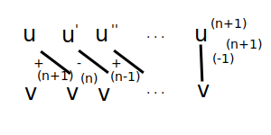
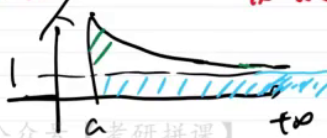
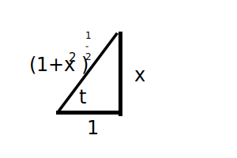
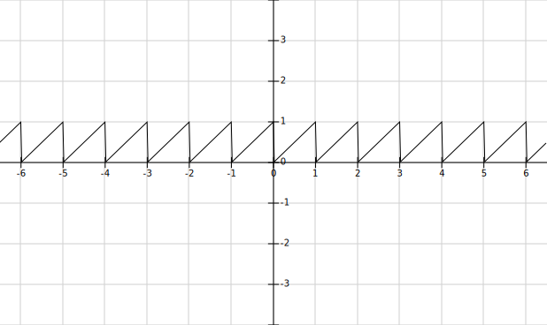
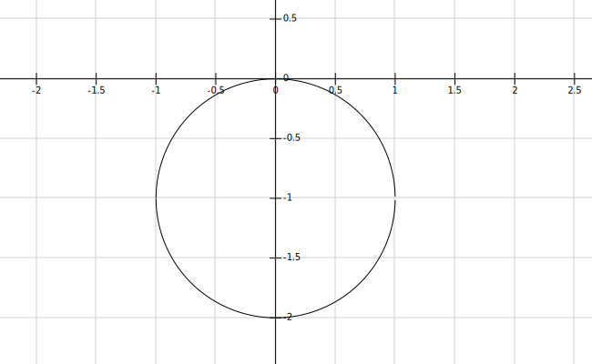
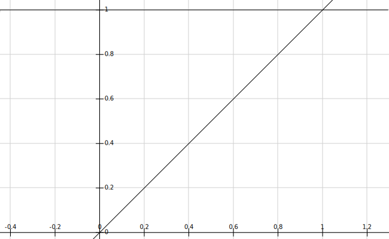
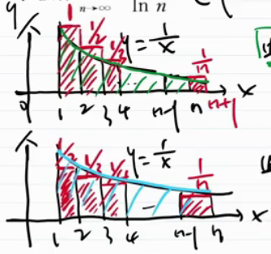

# 书籍链接
* [题目分册,31](file:///media/easul/D4B4E1AFB4E19470/Software/%E5%AD%A6%E4%B9%A0/%E8%80%83%E7%A0%94/%E8%B5%84%E6%96%99/%E6%95%B0%E5%AD%A6/%E8%B5%84%E6%96%99/2020%E5%BC%A0%E5%AE%87%E9%A2%98%E6%BA%90%E6%B7%B1%E6%9E%901000%E9%A2%98-%E4%B9%A0%E9%A2%98%E5%88%86%E5%86%8C%EF%BC%88%E6%95%B0%E5%AD%A6%E4%B8%80%EF%BC%89.pdf)
* [解析分册,69](file:///media/easul/D4B4E1AFB4E19470/Software/%E5%AD%A6%E4%B9%A0/%E8%80%83%E7%A0%94/%E8%B5%84%E6%96%99/%E6%95%B0%E5%AD%A6/%E8%B5%84%E6%96%99/2020%E5%BC%A0%E5%AE%87%E9%A2%98%E6%BA%90%E6%B7%B1%E6%9E%901000%E9%A2%98-%E8%A7%A3%E6%9E%90%E5%88%86%E5%86%8C%EF%BC%88%E6%95%B0%E5%AD%A6%E4%B8%80%EF%BC%89.pdf)

# 基础知识
1. 积分的定义
    1. 不定积分
    ```tex
    \displaystyle
    \footnotesize
    \forall x \in I, 使F'(x) = f(x), 则F(x)是f(x)的一个原函数  \\
    全体原函数就叫\orange{不定积分} \to \int f(x)dx = \int_0^x f(t)dt + c = F(x) + C  \\
    不定积分的积分号没有上下限  \\
    ```
    2. 定积分
    ```tex
    \displaystyle
    \footnotesize
    \int f(x)dx是函数族, \int_a^bf(x)dx是定积分  \\
    定积分的积分号有上下限,且定积分是一个数,是一个面积值  \\
    性质: |\int_a^b f(x)dx| \leqslant \int_a^b |f(x)|dx  \\ 
    ```
    3. 牛顿-莱布尼兹公式/N-L公式
    ```tex
    \int_a^b f(x)dx = F(x)|_a^b = F(b) - F(a)  \\
    ```
    4. 反常积分: 上下限无穷,或被积函数有瑕点(分母为0的点)
2. 积分的计算
    1. 凑微分法: 
    ```tex
    \displaystyle
    \footnotesize
    xdx = d(\frac12x^2)  \\
    \int \frac{\arctan\sqrt{x}}{\sqrt{x}(1+x)}dx = 
    2\int \frac{\arctan\sqrt{x}}{1+x}d(\sqrt{x}) = 
    2\int \arctan\sqrt{x}d(\arctan\sqrt{x}) = 
    \arctan^2\sqrt{x} + C  \\
    ```
    2. 换元法
    ```tex
    \displaystyle
    \footnotesize
    \red{三角换元}  \\
    被积函数f(x)含有\orange{\sqrt{a^2 - x^2}, \sqrt{a^2 + x^2}, \sqrt{x^2 - a^2}}, 则  \\
    \sqrt{a^2 - x^2}, 令x = asint,(-\frac{\pi}{2} < t < \frac{\pi}{2})  \\
    \sqrt{a^2 + x^2}, 令x = atant,(-\frac{\pi}{2} < t < \frac{\pi}{2})  \\
    \sqrt{x^2 - a^2}, 令x = asect,(x > 0, 0 < t < \frac{\pi}{2},
    x < 0, \frac{\pi}{2} \leqslant t \leqslant \pi)  \\
    若被积函数f(x)有\orange{\sqrt{ax^2 + bx + c}},则先化成  \\
    \sqrt{g(x)^2 - k^2}, \sqrt{g(x)^2 + k^2}, \sqrt{k^2 - g(x)^2}  \\
    \red{倒带换},用于分子次数低于分母次数  \\
    \int \frac{1}{x^k\sqrt{a^2 - x^2}}dx  \\
    \int \frac{1}{x^k\sqrt{a^2 + x^2}}dx  \\
    \int \frac{1}{x^k\sqrt{x^2 - a^2}}dx  \\
    k = 1, 2, 4  \\
    \red{复杂部分代换}如下,将复杂的根式 = t  \\
    \sqrt[n]{ax + b} = t, \sqrt{\frac{ax + b}{cx + d}} = t, \sqrt{ae^{bx} + c} = t  \\
    \red{指数代换}  \\
    a^x, e^x = t  \\
    \red{对数代换}  \\
    lnx = t  \\
    \red{反三角函数代换}  \\
    arcsinx, arctanx = t  \\
    ```
    3. 分部积分法(反对幂指三): 用于不同类型函数乘积.  
    ```tex
    \displaystyle
    \footnotesize
    \because d(uv) = vdu + udv  \\
    \therefore \int d(uv) = \int vdu + \int udv  \\
    \therefore uv = \int vdu + \int udv  \\
    \therefore \orange{\int udv = uv - \int vdu}  \\
    ```
    幂函数 x 指数函数/三角函数, 幂函数做u  
    指数函数 x 三角函数,谁做u都可以  
    幂函数 x 反函数/对数函数, 反函数/对数函数做u  
    ```tex
    \displaystyle
    \footnotesize
    分部积分法推广  \\
    \int uv^{(n + 1)}dx = uv^{(n)} - u'v^{(n - 1)} + ... + (-1)^{n}u^{(n)}v + (-1)^{n + 1}\int u^{(n + 1)v}dx
    ```  
      
    幂函数 x 指数函数/三角函数, 求导幂次加1次  
    指数函数 x 三角函数求两次  
    幂函数 x 反函数/对数函数, 求导一次
    4. 有理函数的积分(一般考K重1/2次因式),进行拆分
    ```tex
    \displaystyle
    \footnotesize
    Q_m(x) = (2x+1)^3,三重一次因式  \\
    定义: 形如\int \frac{P_n(x)}{Q_m(x)}dx, (n < m)的积分  \\
    方法: 将\frac{P_n(x)}{Q_m(x)}拆成若干项相加  \\
    拆分原则: \\
    Q_m(x)分解出(ax+b)^k,  \\
    \frac{A_1}{ax+b} + \frac{A_2}{(ax+b)^2} + ...  + \frac{A_k}{(ax+b)^k} \\
    Q_m(x)分解出(px^2+qx+r)^k,  \\
    \frac{A_1x + B_1}{px^2+qx+r} + \frac{A_2x + B_2}{(px^2+qx+r)^2} + ... + \frac{A_kx + B_k}{(px^2+qx+r)^k}
    ```
3. 定积分的计算
    ```tex
    \displaystyle
    \footnotesize
    \int_a^bf(x)dx = F(b) - F(a) \to 牛莱公式  \\
    \int_a^bf(x)dx = \int_{g^{-1(a)}}^{g^{-1(b)}}f(g(t))g'(t)dt \to 换元法,g'(x)要连续  \\
    \int_a^b udv = uv|_a^b - \int_a^b vdu  \\
    参数方程  \\
    x = f(t), y = g(t)  \\
    \int_a^b y dx = \int_{f^{-1(a)}}^{f^{-1(b)}} g(t)f'(t) dt
    ```
4. 一元积分学应用
    1. 面积
    ```tex
    \displaystyle
    \footnotesize
    y = y_1(x), y = y_2(x), x = a, x = b(a < b)围成图形的面积  \\
    \int_a^b |y_2(x) - y_1(x)|dx
    ```
    2. 体积
    ```tex
    \displaystyle
    \footnotesize
    y = y_(x), x = a, x = b(a < b)和x轴绕x轴旋转体的体积  \\
    V = \int_a^b \pi y^2(x)dx  \\
    y = y_(x), x = a, x = b(a < b)和x轴绕y轴旋转体的体积  \\
    V = \int_a^b 2\pi x y(x)dx  \\
    ```
    3. 积分表达函数平均值(积分中值定理中值,平均高)
    ```tex
    \displaystyle
    \footnotesize
    y(x)在[a,b]平均值\bar{y} = \frac{\int_a^b y(x)dx}{b-a}
    ```
    4. 曲线的弧长
    ```tex
    \displaystyle
    \footnotesize
    y = f(x)在[a, b]有一阶连续导数,则  \\
    弧长s = \int_a^b \sqrt{1 + [f'(x)]^2}dx  \\
    若x = x(t), y = y(t), t \in [a, b]  \\
    弧长s = \int_a^b \sqrt{x'^2(t) + y'^2(t)} dt  \\
    弧长s = \int_a^b \sqrt{r^2(t) + r'^2(t)} dt  \\
    ```
    ```tex
    \displaystyle
    \footnotesize
    证明  \\
    \Delta s_i = \sqrt{(\Delta x_i)^2 + \Delta y_i)^2} = \sqrt{(\Delta x_i)^2 + (f'(x_i)\Delta x_i)^2} = \sqrt{1 + f'^2(x_i)}\Delta x_i  \\
    S = \lim\limits_{n \to +\infty} \sum_{i = 0}^{n}\Delta s_i = 
    \lim\limits_{n \to +\infty} \sum_{i = 0}^{n}\sqrt{1 + f'^2(x_i)}\Delta x_i
    = \int_a^b\sqrt{1 + f'^2(x)}dx  \\
    S = \lim\limits_{n \to +\infty} \sum_{i = 0}^{n}\Delta s_i = 
    \lim\limits_{n \to +\infty} \sum_{i = 0}^{n}\sqrt{(\Delta x_i)^2 + \Delta y_i)^2}
    = \lim\limits_{n \to +\infty} \sum_{i = 0}^{n}\sqrt{f'^2(t_i) + g'^2(t_i)}\Delta t_i  \\
    = \int_a^b\sqrt{f'^2(t) + g'^2(t)}dt  \\
    S = \int_a^b \sqrt{x'^2(t) + y'^2(t)} dt = \int_a^b \sqrt{(r'cost - rsint)^2 + (r'sint - rcost)^2} dt
    = \int_a^b \sqrt{r^2 + r'^2} dt  \\
    ```
    6. 质心,形心
     ```tex
    \displaystyle
    \footnotesize
    质心横坐标 \bar{x} = \frac{\iint_D x\rho(x,y) d\sigma}{\iint_D \rho(x,y) d\sigma}  \\
    质心纵坐标 \bar{y} = \frac{\iint_D y\rho(x,y) d\sigma}{\iint_D \rho(x,y) d\sigma}  \\
    \rho(x,y)是密度  \\
    形心横坐标 \bar{x} = \frac{\iint_D x d\sigma}{\iint_D  d\sigma}  \\
    形心纵坐标 \bar{y} = \frac{\iint_D y d\sigma}{\iint_D  d\sigma}  \\
    形心密度均匀,密度是常数,所以\rho(x,y)为1  \\
    ```
    7. 物理应用公式
    ```tex
    \displaystyle
    \footnotesize
    功 \to W = F * S,单位为J  \\
    水压力 \to F = p * A(A是面积),单位为N  \\
    引力 \to F = k\frac{m_1*m_2}{r^2}(k是引力系数),单位为N  \\
    ```

# 自我总结
1. 被积函数变成f(-x)的操作流程

```tex
\displaystyle
\footnotesize
f(x)是偶函数,则\int_0^{-x}f(t)dt = \int_0^{x}f(-t)d(-t) = -\int_0^{x}f(t)dt
```
2. 常值函数可以看成偶函数,也可以看成周期函数

```tex
\displaystyle
\footnotesize
f(x) = c  \\
f(-x) = f(x)  \\
f(x+T) = f(x)  \\
```
3. 奇偶函数(一元微分里写了,这里再写一次)

```tex
\footnotesize
\displaystyle
f(x) + f(-x)就是偶函数  \\
f(x) - f(-x)就是奇函数  \\
```
4. 周期函数不一定连续,如tanx,
5. 周期函数的导数也是周期函数(周期仍是T),周期函数的原函数不一定是周期函数

```tex
\footnotesize
\displaystyle
f(x) = f(x + T)  \\
f'(x) = \lim\limits_{\Delta x \to 0} \frac{f(x + \Delta x ) - f(x)}{\Delta x } = 
\lim\limits_{\Delta x \to 0} \frac{f(x + T + \Delta x ) - f(x + T)}{\Delta x } = f'(x + T)  \\
故周期函数的导数也是周期函数  \\
\int f(x)dx = \int f(x + T)d(x + T), 故F(x) = F(x +T)  \\
但f(x) + a是周期函数  \\
\int [f(x) + a]dx = F(x) + ax + C  \\
故周期函数的原函数不一定是周期函数  \\
```
6. 极限,积分,导数都可以令成A,B,C
7. a>0, x>=0时, x<sup>a</sup>单调递增,无论a大于1还是小于1,x<sup>a</sup>都是单调递增
8. 对称区间的积分 = 0到a上f(x) + f(-x)的积分

```tex
\displaystyle
\footnotesize
\int_{-a}^af(x)dx = \int_{-a}^af(-t)dt = \frac12 \int_{-a}^a[f(-x) + f(x)]dx = \int_{0}^a[f(-x) + f(x)]dx  \\
f(-x) + f(x)是偶函数
```
9. 换元必换限
10. 在x趋向正无穷时,被积函数不趋向0,则反常积分发散(面积无法收住口)  
  
11. 双曲余弦的函数

```tex
\displaystyle
\footnotesize
f(x) = \frac{e^x + e^{-x}}{2}, 形状和高压线垂下来的形状一样,也叫悬链线,悬挂线.伯努利发现的  \\
```
12. 数学三大法则: 观察法(直接看出来由什么得来的),显然成立(有界没界不好说,就显然有下界), 暴力带值
13. 一定要注意分部积分时凑微分是否要加一个常数,这样可能会让后边的分部积分的时候更容易.否则可能无法计算(`3.40`)
14. 积分的重要公式

```tex
\displaystyle
\footnotesize
(一)  \\
\int_0^\pi xf(sinx)dx = \frac{\pi}{2}\int_0^\pi f(sinx)dx \to 将x化为\frac{\pi}{2} \\
令x = \pi - t  \\
\int_0^\pi xf(sinx)dx = \int^0_\pi (\pi-x)f(sin(\pi-x))d(\pi-x) = \int_0^\pi (\pi-x)f(sinx)dx = 
\int_0^\pi \pi f(sinx)dx - \int_0^\pi xf(sinx)dx  \\
2\int_0^\pi xf(sinx)dx = \int_0^\pi \pi f(sinx)dx  \\
\int_0^\pi xf(sinx)dx = \frac{\pi}{2} \int_0^\pi f(sinx)dx  \\
(二)  \\
\int_0^{\frac{\pi}{2}} f(sinx)dx = \int_0^{\frac{\pi}{2}} f(cosx)dx  \\
\int_0^{\frac{\pi}{2}} f(sinx, cosx)dx = \int_0^{\frac{\pi}{2}} f(cosx, sinx)dx  \\
这里可以看作是轮换对称性,可以用区间再现证明  \\
如\int_0^{\frac{\pi}{2}} \frac{cos^ax}{cos^ax + sin^ax} = \int_0^{\frac{\pi}{2}} \frac{sin^ax}{cos^ax + sin^ax}  \\
```
15. 积分换元,如果是不定积分,最后需要再换回来元.
16. 积分的时候分母 高,分子次方低,可以用倒代换
17. 对称性的使用

```tex
\displaystyle
\footnotesize
[a, b]区间关于\frac{a+b}{2}对称,需要看一下函数f(x)是不是关于\frac{a+b}{2}对称,即f(x - \frac{a+b}{2})是奇偶函数  \\
```
18. 加减的时候除了可以加常数,也可以加x等变量(`3.59`)
19. 注意sec和cos的变化  

```tex
\displaystyle
\footnotesize
\frac{1}{cos^2\frac{x}{2}} = sec^2\frac{x}{2}  \\
最后算出来得到xtan\frac{x}{2} - ln2 + C = xtan\frac{x}{2} + C  \\
-ln2也是常数的一部分  \\
```
20. 积分常用的形式

```tex
\displaystyle
\footnotesize
\int \frac{1}{x^2}dx = -\frac{1}{x} + C  \\
\int \frac{1}{\sqrt{x}}dx = 2\sqrt{x} + C  \\
```
21. 有数列递推再去夹住I<sub>n</sub>的技巧  

```tex
\displaystyle
\footnotesize
有I_n < I_{n - 2}且I_n + I_{n - 2} = \frac{1}{n - 1}(需要知道第n和第n+1项谁大,那么才能夹逼成功)  \\
则2I_n < I_n + I_{n - 2} < 2I_{n-2}  \\
从而I_n < \frac{1}{2(n - 1)}, I_{n-2} > \frac{1}{2(n - 1)}, I_n > \frac{1}{2(n + 1)}
```

22. 若sint在(0, \frac\pi2)之间,则他的n次方越大,自己越小
23. 将x的式子换成t后, 若式中有关于t的的导数,则t看成x的函数,求t'则相当于求x的反函数的倒数(`3.90`)
24. 数列问是否存在极限,则单调有界,如果问极限是多少,一般是夹逼准则
25. 取整函数中,[x + 整数] = [x] + 整数, [0.5] = 0, [-0.3] = -1  
26. 反常积分的被积函数极限不为0,则积分发散.同时,反常积分趋向0(瑕点)和无穷时的情况不同,可能需要将积分分开,然后讨论
27. 反常积分加减抓大头(`3.97`), 乘除不为0不考虑
28. f(x) = g(x), 则f'(x) = g'(x)
29. x换成-x,y换成-y,结果不影响,则其有对称性(`3.117`)
30. 圆的圆心偏离可以带个数算
```tex
\displaystyle
\footnotesize
x^2 + (y - 2)^2 = 4  \\
没有2时,x = 0,y  = 2,  \\
有2时, x = 0, y = 4  \\
上偏了2个单位
```
31. 面积是正的,积分可以有负的
32. 不等式的一些理解
```tex
\displaystyle
\footnotesize
x^2 \leqslant \frac{12}{t^2}  \\
其含义是x^2的最大值小于等于\frac{12}{t^2}的最小值  \\
```
33. 图形对称(也就是密度均匀的图形),形心一定在对称轴上
34. 常数可以写成积分的形式(`3.146`)

# 解题技巧
1. 概念与性质
```tex
\displaystyle
\footnotesize
不定积分:\int f(x)dx = \int_0^x f(t)dt + c = F(x) + c \to 函数的不定积分就是全体原函数 \\
奇偶性:f(x)在[-a, a]是连续的奇(偶)函数, 则\int_0^x f(t)dt为偶(奇)函数(以0为下限则正确,以别的为下限不一定正确)  \\
周期性:f(x)在(-\infty, +\infty)连续,且以T为周期,则  \\
\int_a^{a+T} f(x)dx = \int_0^{T} f(x)dx  \\
\int_a^{x} f(t)dt以T为周期 <-> \int_0^{T} f(t)dt = 0 (两个条件互为充要) \\
可导性:f(x)在[a, b]连续,则F(x) = \int_{x_0}^x f(t)dt在[a, b]可导,F'(x) = f(x)(f(x)连续,F(x)是原函数,否则只能是变上限)  \\
若f(x)在[a,b]除x=c点处处连续,则F(x) = \int_{x_0}^x f(t)dt在x=c点  \\
(1)若x=c是f(x)可去间断点,可导,F'(c) = \lim\limits_{x \to c} f(x) \mathrlap{\,/}{=} f(c) \\
(2)若x=c是f(x)跳跃间断点,不可导,F'(c)不\exists  \\
f(x)除x=c处处连续,则F(x)除x=c处处可导(d为[a, c)U(c, b]上任意一点,F'(d) = f(d))  \\
```

2. 一元积分比大小  
```tex
\displaystyle
\footnotesize
在[a, b]上,f(x)只改变一次符号,研究\int_a^b f(x)dx,则找到f(x)的正负分界点c(a < b < c)  \\
则\int_a^b f(x)dx = \int_a^c f(x)dx + \int_c^b f(x)dx  \\
对\int_c^b f(x)dx换元写成\int_a^c g(x)dx, 再看f(x) + g(x)在[a,c]符号  \\ 
\orange{换元的时候可以直接让上限变到上限,下限变到下限,也可以让上限变到下限,下限变到上限,如3.14}  \\
f(x) > g(x) \int_a^b f(x)dx > \int_a^b g(x)dx  \\
```

3. 定积分的定义(求数列的极限)
```tex
\displaystyle
\footnotesize
\lim\limits_{n \to \infty} \sum_{i=1}^n f(a+\frac{b-a}{n}i)*\frac{b-a}{n} = \int_a^b f(x)dx \to 右端点做高  \\
\lim\limits_{n \to \infty} \sum_{i=1}^n f(a+\frac{b-a}{n}(i-1))*\frac{b-a}{n} = \int_a^b f(x)dx  \to 左端点做高  \\
当a = 0, b = 1
\lim\limits_{n \to \infty} \sum_{i=1}^n f(\frac{i}{n})*\frac{1}{n} = \int_0^1 f(x)dx \to 右端点做高  \\
\lim\limits_{n \to \infty} \sum_{i=1}^n f(\frac{i-1}{n})*\frac{1}{n} = \int_0^1 f(x)dx  \to 左端点做高  \\
```
4. 不可求积可抵消
```tex
\displaystyle
\footnotesize
就是求积分某一部分的原函数时,原函数求不出来,但是可以抵消掉(一般用分部积分)\orange{(3.63)}  \\
```
5. 一元积分的复杂与特色计算
```tex
\displaystyle
\footnotesize
用积分构造数列a_n = \int_a^b f(x, n)dx, 求极限\lim\limits_{n \to \infty}a_n = \lim\limits_{n \to \infty} \int_a^b f(x, n)dx  \\
积分可以算出来,也可以递推,或者放缩  \\
区间再现  \\
若原积分是\int_a^b, 则让x = a+b-t, 积分区间还是原来的区间  \\
周期函数的一个结论  \\
若f(x)以T为周期,则\lim\limits_{x \to +\infty} \frac{1}{x}\int_0^x f(t)dt = \frac{1}{T} \int_0^T f(x)dx  \\
```
```tex
\displaystyle
\footnotesize
当n \leqslant x \leqslant n + 1  \\
\frac{n}{T}\int_0^T f(t)dt \leqslant \int_0^x f(t)dt \leqslant \frac{n+1}{T}\int_0^{T} f(t)dt  \\
\frac{n}{T(n+1)}\int_0^T f(t)dt \leqslant \frac{1}{x}\int_0^x f(t)dt \leqslant \frac{n+1}{Tn}\int_0^{T} f(t)dt  \\
\lim\limits_{x \to +\infty} \frac{n}{T(n+1)}\int_0^T f(t)dt \leqslant
\lim\limits_{x \to +\infty} \frac{1}{x}\int_0^x f(t)dt \leqslant
\lim\limits_{x \to +\infty} \frac{n+1}{Tn}\int_0^{T} f(t)dt  \\
\lim\limits_{x \to +\infty} \frac{1}{x}\int_0^x f(t)dt = \frac{1}{T} \int_0^T f(x)dx
```

6. 反常积分判敛与计算

```tex
\displaystyle
\footnotesize
\int_a^{+\infty}\frac{dx}{x^p}, p>1, 收敛, p \leqslant 1, 发散(a > 0) \to 区间不再有瑕点(分母为0的点)  \\
\int_a^{b}\frac{dx}{(x-a)^p}, p<1, 收敛, p \geqslant 1, 发散 \to 分母等于0的瑕点的情况  \\
\int_0^{+\infty}e{-x^2}dx = \frac{\sqrt{\pi}}{2}  \\
\int_2^{+\infty} \frac{1}{xln^p x}d(x), p > 1, 收敛, p \leqslant 1, 发散  \\
\int_2^{+\infty} \frac{1}{x^q ln^p x}d(x), 当q > 1, \forall p收敛, 当q < 1, \forall p发散, 当q = 1, p > 1, 收敛, p \leqslant 1, 发散  \\
比较准则1  \\
f(x), g(x)在[a, +\infty)连续, 0 \geqslant f(x) \geqslant g(x), 则  \\
\int_a^{+\infty} g(x)dx收敛, \int_a^{+\infty} f(x)dx收敛  \\
\int_a^{+\infty} f(x)dx发散, \int_a^{+\infty} g(x)dx发散  \\
比较准则2  \\
\lim\limits_{x \to \infty} \frac{f(x)}{g(x)} = \lambda \to (极限找大小更方便)  \\
当\lambda \mathrlap{\,/}{=} 0时, \int_a^{+\infty} f(x)dx与\int_a^{+\infty} g(x)dx有相同敛散性  \\
当\lambda = 0时, \int_a^{+\infty} g(x)dx收敛, \int_a^{+\infty} f(x)dx收敛  \\
当\lambda = \infty时, \int_a^{+\infty} g(x)dx发散, \int_a^{+\infty} f(x)dx发散  \\
```
```tex
\displaystyle
\footnotesize
(一) I = \frac{x^{-p+1}}{-p+1}|_a^{+\infty},   \\
p > 1,无穷在分数线下边,收敛到0, p = 1是ln,发散, p < 1, 无穷在分数线上边,发散  \\
(二) I = \frac{t^{-p+1}}{-p+1}|_0^{b - a},   \\
p > 1,0在分数线下边,发散, p = 1是ln,发散, p < 1, 0在分数线上边,收敛到0  \\
(五) 当q < 1, \int_2^{+\infty} \frac{1}{x^q ln^p x}d(x) > \int_2^{+\infty} \frac{1}{xln^p x}d(x), 后边发散,前边发散  \\
当q > 1, \int_2^{+\infty} \frac{1}{x^q}d(x) > \int_2^{+\infty} \frac{1}{x^q ln^p x}d(x), 前边收敛,后边收敛  \\
```

7. 一元积分不等式

```tex
\displaystyle
\footnotesize
(一)利用单调性(将定积分改成不定积分,求导计算), 积分的性质(亡羊补牢 \leqslant 未雨绸缪, |\int_a^b f(x)dx| \leqslant \int_a^b |f(x)|dx ), 积分中值定理  \\
(二)利用拉氏中值定理,牛莱公式,分部积分,柯西不等式  \\
(三)利用泰勒公式  \\
柯西不等式  \\
若b > a, [\int_a^b f(x)g(x)dx]^2 \leqslant \int_a^b f^2(x)dx *  \int_a^b g^2(x)dx  \\
```
```tex
\displaystyle
\footnotesize
(一)只告知被积函数f(x)连续,则可将积分上限改为x,然后用单调性证明  \\
(1)f(x),g(x)在[a, b]连续(柯西不等式)  \\
证明: [\int_a^b f(x)g(x)dx]^2 \leqslant \int_a^b f^2(x)dx *  \int_a^b g^2(x)dx  \\
F(x) = \int_a^x f^2(t)dt *  \int_a^x g^2(t)dt - [\int_a^x f(t)g(t)dt]^2  \\
F'(x) = f^2(x)\int_a^x g^2(t)dt + g^2(x)\int_a^x f^2(t)dt - 2\int_a^x f(t)g(t)dt f(x)g(x)  
= \int_a^x [f(x)g(t) - g(x)f(t)]^2 dx \geqslant 0  \\
被积函数为0, 积分为0, 被积函数大于0, 积分大于0  \\
故F(x)单增, 故F(b) \geqslant F(a) = 0  \\
(二)已知被积函数f(x)一阶可导,且某个端点的函数值为0  \\
先写出该点的拉格朗日中值定理(适用于证明式子中,定积分的被积函数不含f'(x))  \\
f(x) = f(x) - f(a) = f'(\xi)(x - a) (f(a) = 0)  \\
也可以想牛莱公式(适用于证明式子中,定积分的被积函数含f'(x))   \\
f(x) = f(x) - f(a) = \int_a^x f'(t)dt (f(a) = 0)  \\
(2)设f'(x)在[0, a]连续, f(0) = 0, 证明 |\int_0^a f(x)dx| \leqslant \frac12 Ma^2(M = max|f'(x)|)
f(x) = f'(\xi)x  \\
|\int_0^a f(x)dx| = |\int_0^a f'(\xi)xdx| \leqslant \int_0^a |f'(\xi)x|dx \leqslant M \int_0^a xdx = \frac12Ma^2 \\
(3)设f'(x)在[0, 1]连续, f(0) = f(1) = 0,  证明 |\int_0^1 f(x)dx| \leqslant \frac14M(M = max|f'(x)|)  \\
f(x) = f'(\xi_1)x = f'(\xi_2)(x-1)  \\
|\int_0^1 f(x)dx| = |\int_0^{\frac12} f(x)dx + \int^1_{\frac12} f(x)dx| = |\int_0^{\frac12} f'(\xi_1)xdx + \int^1_{\frac12} f'(\xi_2)(x-1)dx| \\
\leqslant |\int_0^{\frac12} f'(\xi_1)xdx| + |\int^1_{\frac12} f'(\xi_2)(x-1)dx|
\leqslant \int_0^{\frac12} |f'(\xi_1)x|dx+ \int^1_{\frac12} |f'(\xi_2)(x-1)|dx  \\
\leqslant M\int_0^{\frac12} xdx + M\int^1_{\frac12} (1 - x)dx = \frac14M \\
(4)设f'(x)在[a, b]连续, f(a) = f(b) = 0,  证明: |f(x)| \leqslant \frac12|\int_a^bf'(x)|dx  \\
f(x) = \int_a^xf'(t)dt = \int_b^xf'(t)dt  \\
|f(x)| = \frac12|\int_a^xf'(t)dt + \int_b^xf'(t)dt| \leqslant \frac12[|\int_a^xf'(t)dt| + |\int_b^xf'(t)dt|]
\leqslant \frac12[\int_a^x|f'(t)|dt + \int^b_x |f'(t)|dt] = \frac12|\int_a^bf'(x)|dx  \\
(b > x,所以这里要换一下上下限,不然就是负的了)  \\
(5)设f'(x)在[0, 1]连续, f(0) = 0,  证明: \int_0^1f^2(x)dx \leqslant \frac12\int_0^1f'^2(x)dx  \\
f(x) = \int_0^x f'(t)dt  \\
f^2(x) = [\int_0^x f'(t)dt]^2 \leqslant \int_0^x f'^2(t)dt\int_0^x dt  \leqslant x\int_0^1 f'^2(t)dt  \\
\int_0^1 f^2(x)dx \leqslant \int_0^1 f'^2(t)dt \int_0^1xdx = \frac12 \int_0^1 f'^2(t)dt  \\
(三)已知被积函数f(x)二阶或二阶以上可导,直接写成f(x)的泰勒展开,再根据定积分性质处理(x_0可以选提示的点)  \\
(6)设f''(x)在[0, 2]连续, f(1) = 0, 证明|\int_0^2f(x)dx| \leqslant \frac13M(M = max|f''(x)|)  \\
f(x) = f(1) + f'(1)(x - 1) + \frac12 f''(\xi)(x - 1)^2  \\
|\int_0^2 f(x)dx| = |\int_0^2 f'(1)(x - 1) dx + \int_0^2 \frac12 f''(\xi)(x - 1)^2 dx| 
\leqslant \frac{M}{2}\int_0^2 (x - 1)^2 dx = \frac{M}{3}
```

# 题目
* 3.1  
```tex
\displaystyle
\footnotesize
第一问  \\
若f(x)为奇函数,则F(-x) = \int_0^{-x} f(t)dt = \int_0^{x} f(-t)d(-t) = \int_0^{x} f(t)dt =  F(x), F(x)为偶函数  \\
若f(x)为偶函数,则F(-x) = \int_0^{-x} f(t)dt = \int_0^{x} f(-t)d(-t) = -\int_0^{x} f(t)dt =  -F(x), F(x)为奇函数  \\
第二问  \\
f(x)一切原函数为 G(x) = \int f(x)dx + C  \\
若f(x)为奇函数,则G(-x) = \int f(-x)d(-x) + C = \int f(x)dx + C = G(x),故f(x)一切原函数均为偶函数  \\
若f(x)为偶函数,则G(-x) = \int f(-x)d(-x) + C = -\int f(x)dx + C, -G(x) = -[\int f(x)dx + C]  \\
当G(-x) = -G(x)时,C = 0, 故f(x)有且仅有一个原函数为奇函数  \\
```

* 3.2  
```tex
\displaystyle
\footnotesize
第一问  \\
第一种  \\
\frac{d\int_a^{a+T} f(x)dx}{da} = f(a+T) - f(a) = 0  ,则积分是常值函数,与a无关,a可以为0  \\
\therefore \int_a^{a+T} f(x)dx = \int_a^{a+T} f(x)dx|_{a=0} = \int_0^{T} f(x)dx  \\
第二种  \\
\int_a^{a+T} f(x)dx = \int_a^{0} f(x)dx + \int_0^{T} f(x)dx + \int_{T}^{a+T} f(x)dx  \\
\int_{T}^{a+T} f(x)dx = \int_{0}^{a} f(x - T)d(x - T) = \int_{0}^{a} f(x)dx  \\
\therefore \int_a^{a+T} f(x)dx = \int_a^{0} f(x)dx + \int_0^{T} f(x)dx + \int_{0}^{a} f(x)dx = \int_0^{T} f(x)dx  \\
第二问  \\
\int_{a}^{x} f(t)dt以T为周期(即x+T的积分与x的积分值相同),则  \\
\int_{a}^{x + T} f(t)dt - \int_{a}^{x} f(t)dt = 0 = \int_{x}^{x + T} f(t)dt = \int_{0}^{T} f(t)dt  \\
```

* 3.5  
```tex
\displaystyle
\footnotesize
周期函数如果不连续,如tanx,  \\
积分平移nT之后也是相等的  \\
```

* 3.7  
```tex
\displaystyle
\footnotesize
G(x)以2为周期是因为他不是标准的\int_0^x f(t)dt的形式,而是添加了一些其他的部分  \\
```

* 3.8  
```tex
\displaystyle
\footnotesize
\lim\limits_{x \to 0}\frac{f(x)}{x}是一个数A  \\
有了f(x)了,所以f(0)直接算即可,即f(0) = 0  \\
故f(x) = x + x\int_0^1 f(x)dx + f'(0)x^2  \\
故f(x) = x + Ax + Bx^2  \\
f'(0) = 1 + A = B  \\
\int_0^1 f(x)dx = A = \frac12 (1 + A) + \frac{B}{3}  \\ 
故B = 6, A = 5  \\
```

* 3.9  
```tex
\displaystyle
\footnotesize
f(x) = 3x - A\sqrt{1 - x^2}  \\
A是f^2(x),所以f^2(x)也需要求一下
```

* 3.10  
```tex
\displaystyle
\footnotesize
sinx是周期函数,比较规则,但是乘e^{x^2},增函数,那么图形在区间内就会被拉的越来越长  \\
I_3由3块面积相加,有正有负,可以先看后两块面积相加为正,加I_1肯定大于I_1  \\
也可以用积分比大小的一般方法  \\
```

* 3.13  
```tex
\displaystyle
\footnotesize
I_1 - I_2 = \int_0^{\frac\pi2} \frac{cosx - sinx}{1+x^a}dx  \\
在[0, \frac\pi2],f(x)在\frac\pi4变号  \\
I_1 - I_2 = \int_0^{\frac\pi4} \frac{cosx - sinx}{1+x^a}dx + \int_{\frac\pi4}^{\frac\pi2} \frac{cosx - sinx}{1+x^a}dx  \\
= \int_0^{\frac\pi4} \frac{cosx - sinx}{1+x^a}dx + \int_{-\frac\pi4}^{0} \frac{cos(x - \frac{\pi}{2}) - sin(x - \frac{\pi}{2})}{1+(x - \frac{\pi}{2})^a}d(x - \frac{\pi}{2})  \\
= \int_0^{\frac\pi4} \frac{cosx - sinx}{1+x^a}dx + \int_{\frac\pi4}^{0} \frac{cos(\frac{\pi}{2}-x) - sin(\frac{\pi}{2}-x)}{1+(\frac{\pi}{2}-x)^a}d(\frac{\pi}{2}-x)  \\
= \int_0^{\frac\pi4} \frac{cosx - sinx}{1+x^a}dx + \int_{\frac\pi4}^{0} \frac{sinx - cosx}{1+(\frac{\pi}{2}-x)^a}d(-x)  \\
这里-\frac\pi4变到\frac\pi4的时候,x - \frac{\pi}{2}看成一个整体  \\
= \int_0^{\frac\pi4} (cosx - sinx)(\frac{1}{1+x^a} - \frac{1}{1+(\frac{\pi}{2}-x)^a})dx  > 0\\
[0, \frac\pi4]下, cosx > sinx, \frac\pi2 - x > x  \\
\orange{这里是让t = x - \frac\pi2, 也可以让t = \frac\pi2 - x,直接变成\int_{\frac\pi4}^0}  \\
也可以看到cosx - sinx在[0, \frac\pi2]的面积是0,\frac\pi4左右的面积相等  \\
\frac{1}{1+x^a}在[0, \frac\pi2]且a>0下, x^a单增,故\frac{1}{1+x^a}单减,\frac\pi4左边系数大于右边系数  \\
所以I_1 - I_2 > 0  \\
```

* 3.17  
```tex
\displaystyle
\footnotesize
如果不管下边的n,则最后没有\frac{i}{n}  \\
\lim\limits_{n \to \infty} \frac{\sqrt[n]{(n+1)(n+2)...(n+1)}}{n}  
= \lim\limits_{n \to \infty} \sqrt[n]{\frac{(n+1)(n+2)...(n+1)}{n^n}}
= \lim\limits_{n \to \infty} \sqrt[n]{\frac{(n+1)(n+2)...(n+1)}{n ... n}}  \\
= \lim\limits_{n \to \infty} \sqrt[n]{(1+\frac{1}{n})(1+\frac{2}{n})...(1+\frac{n}{n})}
= e^{\lim\limits_{n \to \infty} \frac{1}{n} \sum_{i=1}^n ln(1 + \frac{i}{n})}
= e^{\int_0^1 ln(1+x)dx}  \\
然后可以分部积分  \\
右上 = ln(1+x)(1+x)|_0^1 - \int_0^1(1+x)dln(1+x) = 2ln2 - 1  \\
故结果为e^{2ln2 - 1} = 4e^{-1}  \\
```

* 3.19  
```tex
\displaystyle
\footnotesize
按照0到\pi的\frac{1}{n}来积分,得到\int_0^{\pi} \frac{1}{2+cosx}dx  \\
= \int_0^{\pi} \frac{1}{1+2cos^2 \frac{x}{2}}dx
= \int_0^{\pi} \frac{1}{sin^2 \frac{x}{2} + 3cos^2 \frac{x}{2}}dx  \\
然后变成tanx的情况,上下同时除以cos^2  \\
= \int_0^{\pi} \frac{sec^2 \frac{x}{2}}{tan^2 \frac{x}{2} + 3}dx 
= 2\int_0^{\pi} \frac{dtan \frac{x}{2}}{tan^2 \frac{x}{2} + 3}  \\
= \frac{2}{\sqrt{3}}\int_0^{\pi} \frac{d\frac{tan \frac{x}{2}}{\sqrt{3}}}{(\frac{tan \frac{x}{2}}{\sqrt{3}})^2 + 1}
= \frac{2}{\sqrt{3}}arctan \frac{tan \frac{x}{2}}{\sqrt{3}}|_0^\pi = \frac{\pi}{\sqrt{3}}
```

* 3.20  
```tex
\displaystyle
\footnotesize
直接化简之后,不能成为定积分的形式,所以可以放缩一下  \\
令x_n = \sum_{i = 0}^{n-1} \frac{1}{n} \frac{1}{1 + \frac{i^2 + 1}{n^2}}  \\
则\sum_{i = 0}^{n-1} \frac{1}{n} \frac{1}{1 + \frac{(i+1)^2}{n^2}} < x_n < 
\sum_{i = 0}^{n-1} \frac{1}{n} \frac{1}{1 + \frac{i^2}{n^2}}  \\
这样一个取的是左边的高,一个取的是右边的高  \\
```

* 3.21  
```tex
\displaystyle
\footnotesize
令x_n = \sum_{i = 1}^{n} \frac{3^{\frac{i}{n}}}{n + \frac{1}{i}}  \\
\sum_{i = 1}^{n} \frac{3^{\frac{i}{n}}}{n} * \frac{n}{n+1} < x_n < \sum_{i = 1}^{n} \frac{3^{\frac{i}{n}}}{n}
```

* 3.22  
```tex
\displaystyle
\footnotesize
令x_n = \sum_{i = 1}^{n} \frac{|x|^{\frac{i}{n}}}{n + \frac{i}{n}}  \\
\sum_{i = 1}^{n} \frac{|x|^{\frac{i}{n}}}{n + 1} < x_n < \sum_{i = 1}^{n} \frac{|x|^{\frac{i}{n}}}{n}  \\
\sum_{i = 1}^{n} \frac{1}{n}\frac{n}{n+1} |x|^{\frac{i}{n}} < x_n < \sum_{i = 1}^{n} \frac{1}{n} |x|^{\frac{i}{n}} \\
\sum_{i = 1}^{n} \frac{1}{n}\frac{n}{n+1} |x|^{\frac{i}{n}} = \int_0^1 |x|^tdt  \\
故f(x)在  \\
x\mathrlap{\,/}{=}0,且|x|\mathrlap{\,/}{=}1时,  = \frac{|x| - 1}{ln|x|}  \\
|x| = 1时,  = 1  \\
x = 0时,  = 0  \\
0点的导数可以用定义找一下,1和-1点的导数用导数的极限可以找
```

* 3.24  
`比较重要`  
```tex
\displaystyle
\footnotesize
当算到有\int (1+x^2)^{-\frac32}dx的时候,想到可以把根号下的情况化简成三角函数  \\
最后算出三角函数为sint,需要将sint转为x  \\
由于上边x = tant,故如下图
```
  
```tex
\displaystyle
\footnotesize
则sint = \frac{对}{斜} = \frac{x}{\sqrt{x^2+1}}  \\
\orange{这里不要再将\int costdt里的cost化成x,否则算出来x的取值就变小了}  \\
```

* 3.25
```tex
\displaystyle
\footnotesize
令x = -t  \\
\int_{\frac\pi4}^{-\frac\pi4} 5cos(-t) * arctane^{-t}d(-t) = 
\int_{-\frac\pi4}^{\frac\pi4} 5cost * arctane^{-t}dt =  
\int_{-\frac\pi4}^{\frac\pi4} 5cost * arccote^{t}dt  \\
= \frac{5}{2} [\int_{-\frac\pi4}^{\frac\pi4} cost * (arctane^{t} + arccote^{t}) dt]  \\
```

* 3.27
```tex
\displaystyle
\footnotesize
\int xarctanxdx =  \frac12 \int arctanxd(x^2+1)  \\
看一下arctanx求导有个\orange{+1},故后边积分的时候放一个\orange{+1}  \\
```

* 3.28  
`反常积分`的计算.如果计算的时候出现了无穷,则步骤错误  
需要先找整体原函数,然后整体带上下限,极限的地方再求极限  
```tex
\displaystyle
\footnotesize
\int \frac{xe^{-3x}}{(1 + e^{-3x})^2}dx = \frac{x}{3({1+e^{-3x}})} - \frac19ln(e^{3x} + 1) + C  \\
I = \frac{x}{3({1+e^{-3x}})} - \frac19ln(e^{3x} + 1)|_0^{+\infty}  \\
\lim\limits_{x \to +\infty} [\frac{x}{3({1+e^{-3x}})} - \frac19ln(e^{3x} + 1)] = 
\lim\limits_{x \to +\infty} [\frac{x}{3({1+e^{-3x}})} - \frac{x}{3} - \frac19ln(e^{-3x} + 1)]  \\
= \lim\limits_{x \to +\infty} \frac{x}{3}*\frac{-e^{-3x}}{{1+e^{-3x}}}  
= \lim\limits_{x \to +\infty} \frac{-xe^{-3x}}{3} = 0
```

* 3.29  
```tex
\displaystyle
\footnotesize
可以用\lim\limits_{x \to 0^+} xlnx = 0
```

* 3.30
```tex
\displaystyle
\footnotesize
令t = sin^2x来变形f(x)  \\
同时注意\int \sqrt{1-x}darcsin\sqrt{x} = \int d\sqrt{x}
```

* 3.31  
```tex
\displaystyle
\footnotesize
\int [\frac{f'(x)}{f(x)} + \frac{f(x)}{f'(x)}]dx  \\
前半部分是ln|f(x)|, 后半部分看成是ln|f'(x)|  \\
因为f''(x) = f(x)  \\
所以\int [\frac{f'(x)}{f(x)} + \frac{f(x)}{f'(x)}]dx = \int [\frac{f'(x)}{f(x)} + \frac{f''(x)}{f'(x)}]dx  \\
```

* 3.40  
积分与牛莱公式的结合
```tex
\displaystyle
\footnotesize
这里y(1)未知,但是知道y(0),所以可以用N-L公式  \\
y(1) - y(0) = \int_0^1 y'(x)dx  \\
另外一种解法  \\
I = \int_0^1y(x)dx = \int_0^1y(x)d(x - 1) = (x - 1)y(x)|_0^1 - \int_0^1(x - 1)y'(x)dx = \\
这样y(1)就没了,后边也好算了  \\
```

* 3.42
```tex
\displaystyle
\footnotesize
观察得到这里的形式为\sqrt{1 - u^2},则可以让e^x = sint  \\
```

* 3.43
```tex
\displaystyle
\footnotesize
可以用\int_0^\pi xf(sinx)dx = \frac{\pi}{2} \int_0^\pi f(sinx)dx   \\
算到\frac{\pi}{2}\int_0^\pi \frac{dcosx}{cos^2x - 2}的时候, \\
如果直接将上下限带入 ln|\frac{cosx - \sqrt{2}}{cosx + \sqrt{2}}|,   \\
因为有负数的积分没有算进去,所以会出错,这里\frac{dcosx}{cos^2x - 2}是偶函数,所以可以只算[0, \frac\pi2]的部分就可以了
```

* 3.48
```tex
\displaystyle
\footnotesize
有根号下的平方,则换成三角函数,如果是根号下一次方,则整体令成t  \\
令t = \sqrt{x+2}  \\
I = \int \frac{2tdt}{t^2 + t - 2}  \\
可以给分数线下边的式子进行直接进行微分,那么分子需要+1,但是积分出来的结果再合并比较难,  \\
所以可以将分母拆分 = (t + 2)(t - 1),上边的2t也可以拆成t + 2 + t - 1 - 1,但还多个1,可以为1凑微分,也可以多加一个t减去1  \\
I = \int \frac{2tdt}{t^2 + t - 2} = \frac{2}{3} \frac{(t + 2) + 2(t - 1)}{(t + 2)(t - 1)}dt  \\
= \frac{2}{3}ln|t-1| + \frac{4}{3}ln|t+2| + C = \frac{2}{3}ln|(t-1)(t+2)^2| + C  \\
= \frac{2}{3}ln|(\sqrt{x+2}-1)(\sqrt{x+2}+2)^2| + C  \\
```

* 3.49
```tex
\displaystyle
\footnotesize
使用f(x)在对称区间积分 = 0到a上[f(x) + f(-x)]的积分  \\
I = \frac12 \int_0^{\frac\pi4} cos^4 2xdx = \frac14 \int_0^{\frac\pi2} cos^4 tdt  \\
也可以用倒代换
```

* 3.50
```tex
\displaystyle
\footnotesize
最后还要回带x的三角函数,所以式子中尽量不要变成二倍角,不然计算步骤会更多  \\
```

* 3.52
```tex
\displaystyle
\footnotesize
式子里一个是x-1的幂次,一个是x的幂次,想着把x的幂次换成x - 1的幂次.统一算更好算  \\
也可以想[0, 2]区间关于1对称,则奇偶性看的是f(x - 1)  \\
I = \int_0^2[(x - 1)^3 + 2(x - 1) + 2]\sqrt{1 - cos2\pi(x - 1)}dx  \\
(x - 1)^3, 2(x - 1)是奇函数,\sqrt{1 - cos2\pi(x - 1)}是偶函数,所以积分可以化简  \\
I = 4 \int_0^1\sqrt{1 - cos2\pi(x - 1)}dx  \\
这里如果先把根号下换成sin,那么sin需要加绝对值,因为根号下是正的,所以先取对称区间的一半更方便  \\
```

* 3.56
```tex
\displaystyle
\footnotesize
分母次方高于分子,所以可以倒代换.倒代换之后发现两个式子相等,所以用\frac12两个式子的和就可以算  \\
```

* 3.57
```tex
\displaystyle
\footnotesize
有理函数可以直接拆分  \\
```

* 3.58
```tex
\displaystyle
\footnotesize
这里不给x^3 - 1 + 1,而是变成(x - 1 + 1)^3  \\
然后用(a + b)^3来求,这里可以看到后边的+1没了,从而更好的进行化简  \\
```

* 3.59
```tex
\displaystyle
\footnotesize
这里分母比分子次数大,所以用倒代换也可以,但要注意x \to +\infty时,倒代换对应的是t \to 0  \\
```

* 3.60  
这个可以`再看看`  
```tex
\displaystyle
\footnotesize
I = \int \frac{1}{tan\theta - 2}d\theta  \\
没有办法了,可以用换元t = tan\theta  \\
I = \int \frac{1}{(t - 2)(1 + t^2)}dt  \\
(t - 2)(1 + t^2)有一次,有二次,则拆成\frac{A}{t - 2}dt + \frac{Bt + C}{1 + t^2}dt  \\
得到A = \frac15, B = -\frac15, C = -\frac25  \\
最后把结果合并  \\
```

* 3.61
```tex
\displaystyle
\footnotesize
如果直接拆项则拆成\frac{A}{x} + \frac{Bx + C}{x^2 + 1} + \frac{Dx + E}{(x^2 + 1)^2} \\
故令t = x^2  \\
化简后可拆乘\frac{A}{t} + \frac{B}{t + 1} + \frac{C}{(t + 1)^2} \\
```

* 3.63
```tex
\displaystyle
\footnotesize
I = 2\int \frac{e^{-2x}}{x}dx + \int \frac{e^{-2x}}{x^2}dx = 2\int \frac{e^{-2x}}{x}dx - \int e^{-2x}d\frac{1}{x}  \\
= 2\int \frac{e^{-2x}}{x}dx - \frac{e^{-2x}}{x} + \int \frac{e^{-2x}}{x} * (-2) dx = - \frac{e^{-2x}}{x} + C  \\
```

* 3.64
```tex
\displaystyle
\footnotesize
I = \int \frac{x}{1 + cosx}dx + \int \frac{sinx}{1 + cosx}dx = \frac12 \int xsec^2\frac{x}{2}dx + \int \frac{sinx}{1 + cosx}dx  \\
```

* 3.66
```tex
\displaystyle
\footnotesize
I = \int e^x\frac{1 - 2x + x^2}{(1 + x^2)^2}dx = \int e^x\frac{1 + x^2}{(1 + x^2)^2}dx - \int e^x\frac{2x}{(1 + x^2)^2}dx  \\
```

* 3.71
``tex
\displaystyle
\footnotesize
单调区间包括端点,所以写闭区间
```

3.84
```tex
\displaystyle
\footnotesize
这里xf'(x)想要消掉x就需要说明x\mathrlap{\,/}{=}0,  \\
当用牛莱公式得到f(x)在(0, +\infty)的式子之后,因为f(x)在0点可导,  \\
则\lim\limits_{x \to 0^+} f(x) = f(0)从而得到f(x)在[0, +\infty)的式子,  \\
这里f(0) = 0, 所以从变限积分解得的C也就可以算出来了  \\
```

* 3.85
```tex
\displaystyle
\footnotesize
当x < \frac\pi2时,\int_0^xf(t)g(x-t)dt就是该式子  \\
当x \geqslant \frac\pi2时, \int_0^xf(t)g(x-t)dt =  \int_0^{\frac\pi2} f(t)g(x-t)dt + \int^x_{\frac\pi2} f(t)g(x-t)dt  \\
```

3.87
```tex
\displaystyle
\footnotesize
第一问  \\
因为n有偶数和奇数之分且需要控制-1的变化,所以可以想到n = 2k是偶数, n = 2k + 1是奇数  \\
求I_n要注意是用递推算的  \\
n = 2k, I_{2k} = \frac{1}{2k - 1} - I_{2(k - 1)} 
= \frac{1}{2k - 1} - \frac{1}{2k - 3} + ... + (-1)^{k - 2}(\frac{1}{3} - I_{2[k-(k-1)]}) 
= \frac{1}{2k - 1} - \frac{1}{2k - 3} + ... + (-1)^{k - 1}(1 - I_0)  \\
= \frac{1}{2k - 1} - \frac{1}{2k - 3} + ... + (-1)^{k} I_0  \\
n = 2k + 1, I_{2k + 1} = \frac{1}{2k} - I_{2(k - 1) + 1} 
= \frac{1}{2k} - \frac{1}{2k - 2} + ... + (-1)^{k - 2}(\frac{1}{4} - I_{2[k - (k - 1)] + 1}) 
= \frac{1}{2k - 1} - \frac{1}{2k - 3} + ... + (-1)^{k - 1} (\frac12 - I_1)  \\
= \frac{1}{2k - 1} - \frac{1}{2k - 3} + ... + (-1)^{k} I_1  \\
确定I_x前边负号的几次方,发现I_{2(k - 1)}是1次方,I_{2(k - k)}是k次方
第二问  \\
I_n + I_{n - 2} = \frac{1}{n-1}且I_n < I_{n-2}(tan^n x在[0, \frac\pi4])次方越大,函数越小,面积也越小  \\
故2I_n < I_n + I_{n - 2} < 2I_{n-2}  \\
然后可以找到I_n的范围,这样的话求\lim\limits_{n \to \infty} nI_n也可以用夹逼定理求  \\
```

* 3.88
```tex
\displaystyle
\footnotesize
想到三角代换,想到偶函数,三角代换因为是n次,想到转换成sin^n x或cos^n x,因为涉及到dx,求导之后为了没负号x=sint  \\
最后转换成点火公式  \\
```

* 3.90  

比较难  
```tex
\displaystyle
\footnotesize
令t = ln\frac{1}{x} ,x = e^{-t}这样之后,t是关于x的函数  \\
则I_n = \int_{2n\pi}^0|sint * \frac{dt}{dx}|t (-e^{-t})dt  \\
I_n = \int^{2n\pi}_0|sint * \frac{dt}{dx}|te^{-t}dt  \\
\frac{dt}{dx} = \frac{1}{\frac{dx}{dt}}  \\
I_n = \int^{2n\pi}_0|sint * e^t|te^{-t}dt = \int^{2n\pi}_0 |sinx|tdt  \\
然后使用区间再现 x = a + b - t  \\
I_n = \int_{2n\pi}^0 (2n\pi - u)|sinu|d(-u) = n\pi \int^{2n\pi}_0 |sinu|d(u)  \\
这里|sinu|是周期函数,则I_n = 2n^2\pi \int^{\pi}_0 |sinu|d(u)=4n^2\pi  \\
或者  \\
I_n = \int^{2n\pi}_0 |sinx|tdt = \sum_{k = 1}^{2n} \int^{k\pi}_{(k-1)\pi} (-1)^{k-1}sint * tdt 
= \sum_{k = 1}^{2n} [(-1)^{k-1} (-tcost |_{(k-1)\pi}^{k\pi}) +  \int^{k\pi}_{(k-1)\pi} costdt]  
= \sum_{k = 1}^{2n} (-1)^{k-1} (-tcost +  sint)|_{(k-1)\pi}^{k\pi}  \\
= \sum_{k = 1}^{2n} (-1)^{k-1} [-k\pi(-1)^k + (k-1)\pi(-1)^{k-1}] = \sum_{k = 1}^{2n} (2k - 1)\pi
```

* 3.91

```tex
\displaystyle
\footnotesize
可以将x^{n-1}凑微分到后边,而不用直接将根号变成t  \\
```

* 3.92

```tex
\displaystyle
\footnotesize
第一问用和差化积  \\
```

* 3.93

```tex
\displaystyle
\footnotesize
证明存在一般用单调有界,算出结果一般用夹逼定理  \\
第一问  \\
题设n为正整数,而递推的n - 1\geqslant 1, 则n \geqslant 2  \\
I_n = \frac{1}{2n - 1} + I_{n -1} = \frac{1}{2n - 1} + \frac{1}{2(n-1) - 1} + I_{n - 2} = 
\frac{1}{2n - 1} + \frac{1}{2n - 3} + I_{n - 2}(递推)  \\
= \frac{1}{2n - 1} + \frac{1}{2n - 3} + ... + \frac{1}{2[n - (n - 2)] - 1} + I_1 = 
= \frac{1}{2n - 1} + \frac{1}{2n - 3} + ... + \frac{1}{3} + 1 = \sum_{i = 1}^n \frac{1}{2i - 1}  \\
第二问  \\
单调性  \\
x_n - x_{n - 1} =  \frac{1}{2n - 1} + ln\frac{n - 1}{n} \to 因为第一项是正数,所以后边加ln比较好算,但ln是小于0的,所以看一下导数  \\
令f(x) = \frac{1}{2x - 1} + ln\frac{x - 1}{x}, f'(x) > 0,f(x)单调递增  \\
\lim\limits_{x \to +\infty} f(x) = 0,所以f(x) < 0, 即x_n - x_{n - 1} < 0, x_n < x_{n - 1},x_n单调递减  \\
x_n = 2\sum_{i = 1}^n \frac{1}{2i - 1} - ln n  \\
ln n是无穷,肯定需要消掉,或者找到不等式,这里发现lnx求导是\frac{1}{x},原函数可以连接导数的这里可以选拉格朗日(泰勒公式展开后带入n有次方,不合适),发现  \\
ln3 - ln1 = \frac{2}{\xi_1} < \frac{2}{1} ...  \\
ln(2n+1) - ln(2n-1) = \frac{2}{\xi_n} < \frac{2}{2n-1}  \\
ln(2i - 1),i从(n + 1)到2共n个,刚好符合x_n中的情况  \\
所有的ln相加之后ln(2n+1) - ln1 = ln(2n+1) < 2In  \\
0 < ln(2n+1) - ln n < x_n  \\
故x_n有下界0,所以x_n极限存在  \\
```

* 3.94

```tex
\displaystyle
\footnotesize
先证以1为周期  \\
f(x + 1) = x + 1 - [x + 1] = x + 1 - ([x] + 1) = f(x)  \\
故f(x)以1为周期  \\
\therefore \lim\limits_{x \to +\infty} \frac{1}{x}\int_0^x f(t)dt = \int_0^1 (x + [x])dx = \frac12  \\
```  
  


* 3.95

```tex
\displaystyle
\footnotesize
第一问  \\
x到2k的最小距离就是x到0, 2, 4, 6 8等的最小距离
2k \leqslant x < 2k + 1, f(x) = x - 2k  \\
2k + 1 \leqslant x < 2(k + 1), f(x) = -x + 2(k + 1)  \\
则f(x + 2)在  \\
2(k-1) \leqslant x < 2(k-1) + 1, f(x) = x - 2(k-1)  \\
2(k-1) + 1 \leqslant x < 2k, f(x) = -x + 2k \\
则f(x + 2) = f(x)  \\
故f(x)周期为2  \\
huo
第二问需要令xn = t  \\
I_n = \frac{1}{n}|int_0^nf(t)dt  \\
如n为偶数,I_n = \frac{n}{n2} \int_0^2 f(t)dt  \\
如n为奇数,I_n = \frac{1}{n} \frac{n - 1}{2} \int_0^2 f(t)dt + \frac{1}{n} \int_0^1 f(t)dt  \\
故I_n = \frac12  \\
但是因为2的周期又是对称的,所以 I_n = \frac{1}{n} * \frac{1}{2} * n \\
这里因为是有限个数相加,所以不能用极限  \\
```  

* 3.96

```tex
\displaystyle
\footnotesize
这里x一头到0,一头到无穷,所以可以先拆成0到1,1到+\infty两个积分,  \\
\int_1^{+\infty} \frac{1}{x^a(2020 + x)^b} = \int_1^{+\infty} \frac{1}{x^{a + b}(\frac{2020}{x} + 1)^b} = \int_1^{+\infty} \frac{1}{x^{a + b}}  \\
故a + b > 1  \\
\int_0^1 \frac{1}{x^a(2020 + x)^b} = \int_0^1 \frac{1}{x^a*2020^b}  \\
故a < 1(分母趋向0,p < 1则收敛)  \\
```

* 3.97

```tex
\displaystyle
\footnotesize
I = \int_0^1 \frac{1}{x^a + x^b}dx + \int_1^{+\infty} \frac{1}{x^a + x^b}dx  \\
当x \to 0^+,x^a + x^b ~ a^b, 这里抓大头可以看成\int_0^1 \frac{1}{x^b}dx  \\
当x \to +\infty,这里抓大头可以看成\int_1^{+\infty} \frac{1}{x^a}dx  \\
```

* 3.98

```tex
\displaystyle
\footnotesize
为了凑成x^p的情况, \int_{\frac{\pi}{4}}^{{\frac{\pi}{2}}} \frac{1}{cos^b x}可以化成
\int_{\frac{\pi}{4}}^{{\frac{\pi}{2}}} \frac{1}{sin^b (\frac{\pi}{2} - x)}  \\
然后可以化成\int_{\frac{\pi}{4}}^{{\frac{\pi}{2}}} \frac{1}{(\frac{\pi}{2} - x)^b},这就是公式的形式了  \\
```

* 3.99

```tex
\displaystyle
\footnotesize
当x \to 0时, \int_0^1 \frac{arctanx}{x^{\frac{a+1}{2}}} = 
也就是趋向0的时候,可以用一下等价代换  \\
```

* 3.100

```tex
\displaystyle
\footnotesize
如果是解析题,可以直接说,当x \to 0^+时, \int_0^1 (\frac{x - sinx}{x})^{\frac13}与\\int_0^1 \frac{dx}{x^{\frac23}}敛散性相同  \\
\frac23 < 1, 故该反常积分收敛  \\
```

* 3.101

```tex
\displaystyle
\footnotesize
这里直接算出来当p = 1, p > 1, p < 1时的积分值来说明收敛和发散,相当于证明出收敛发散,而不是用结论  \\
如I = \int_2^{+\infty} \frac{1}{ln^p x}d(lnx), 当p = 1时, I = lnlnx|_2^{+\infty} = +\infty, 发散  \\
计算的时候如果说I = 多少可以用极限  \\
当p > 1时, \lim\limits_{x \to +\infty} \frac{(lnx)^{1 - p}}{1 - p} = 0  \\
I = 0 - \frac{(ln2)^{1 - p}}{1 - p}, 故收敛 \\
```

* 3.103

```tex
\displaystyle
\footnotesize
可以用重要不等式判断
```

* 3.104  

`再看看`  
```tex
\displaystyle
\footnotesize
这个题求的是值,所以需要算一下  \\
这里x可以看成常数,则(x^t)' = x^tlnx然后用牛莱公式反向考  \\
\frac{x^b}{lnx} - \frac{x^a}{lnx} = \frac{x^t|_a^b}{lnx} = \int_a^b x^tdt  \\
I = \int_0^1\int_a^b x^tdtdx(一重积分转二重积分)  \\
=\int_a^b dt \int_0^1 x^t dx = ln \frac{b + 1}{a + 1}  \\
```

* 3.105

```tex
\displaystyle
\footnotesize
下边幂次高,可以想用倒代换  \\
```

* 3.106

```tex
\displaystyle
\footnotesize
\int_0^{\frac{\pi}{2}} \frac{cos^ax}{cos^ax + sin^ax} = \int_0^{\frac{\pi}{2}} \frac{sin^ax}{cos^ax + sin^ax}  \\
也可以令tanx = t, cotx = m  \\
```

* 3.107

```tex
\displaystyle
\footnotesize
[-1, 1]是对称区间,注意奇函数
```

* 3.108

```tex
\displaystyle
\footnotesize
可以让x = 4sin^2t,也可以把根号下化成a^2 - b^2的情况, 然后x - 2 = 2sint  \\
```

* 3.109

```tex
\displaystyle
\footnotesize
取t = 1 - x再算会更方便.否则直接凑微分,有负号,且麻烦  \\
```

* 3.112

```tex
\displaystyle
\footnotesize
第一问  \\
t \in [-1, 0), 这里可以用\sqrt{-t}算下限  \\
在\frac13 + t - \frac13(-t)^{\frac32} - t\sqrt{-t}这里可以  \\
=\frac13 + t - \frac13(-t)^{\frac32} + (-t)^{\frac32} = \frac13 + t + \frac23(-t)^{\frac32} \\
t \in [0, 1), 这里可以分成两部分算  \\
(\frac13 - \frac{t}{3} + t - 1)\sqrt{1 - t} + 1 = (\frac23t - \frac23)\sqrt{1 - t} + 1
= 1 - \frac23(1 - t)^{\frac32}  \\
第二问验证其在闭区间连续,开区间可导即可  \\
```

* 3.113

```tex
\displaystyle
\footnotesize
注意第二问,平面图形的面积是一个三角形,直接得到x轴,y轴截距相乘就是三角形面积 \\
得到x的结果后,该点过e^{-x}也过切线,所以可以带入e^{-x}  \\
这里切线的切点可以取(x_0, f(x_0)),因为只有一个平面图形面积最大,取定点即可  \\
```

* 3.114

```tex
\displaystyle
\footnotesize
这里y'(\frac{\pi}{2n})可以算出来,把值带进去就行  \\
```

* 3.115

```tex
\displaystyle
\footnotesize
这里S_A = \int_0^x (2t^2 - t^2)dt = S_b = \int_0^{2x^2} (\sqrt{\frac{y}{2}} - f(y))dy  \\
然后求导得到f(y)  \\
求导后带入的x是常数,f是关于y的函数,最后还是应该换成y,也就成了x = f(y) = \frac{3\sqrt{2y}}{8}  \\
```

* 3.116

```tex
\displaystyle
\footnotesize
这里算最大体积的时候,a需要取到0或1,所以个别点可以取  \\
```

* 3.117

```tex
\displaystyle
\footnotesize
\orange{因为可以从字母中看出对称性,所以可以只看第一象限的情况*4即可}  \\
\orange{积分区间可以从条件中分析出来}  \\
y^2 \geqslant 0, 1 - x^2 \geqslant 0, -1 \leqslant x \leqslant 1  \\
y = (1 - x^2)^{\frac{3}{2}}  \\
所以S = 4S_1 = 4\int_0^1 (1 - x^2)^{\frac{3}{2}} dt  \\
```

* 3.121

```tex
\displaystyle
\footnotesize
rd\theta 是特别小的一段弧长弧长
```

* 3.122

```tex
\displaystyle
\footnotesize
r = \sqrt{2}sin\theta 变换成平面直角坐标  \\
r^2 = x^2 + y ^2 = \sqrt{2}rsin\theta = \sqrt{2}y,是一个圆  \\
圆心在y正半轴,半径为\sqrt{2}  \\
画出双纽线和圆,发现面积对称,所以可以算第一象限,然后找到交点的\theta值  \\
2sin^2\theta = cos2\theta即可  \\
```

* 3.124

```tex
\displaystyle
\footnotesize
有水平渐近线y = 0  \\
虽然是奇函数,但是因为算的是面积(面积是正的),所以算2倍即可,不让正负抵消
```

* 3.125

```tex
\displaystyle
\footnotesize
椭圆方程这里如果求导,会带根号,可以使用参数方程
令x = \sqrt{2}cost, y = sint,这样就把两个点的信息化成和角相关的信息了  \\
l_1 = 4\int_0^{\frac{\pi}{2}} \sqrt{x'^2(t) + x'^2(t)}dt = 4\int_0^{\frac{\pi}{2}} \sqrt{1 + sin^2t}dt  \\
l_2 = \int_0^{2\pi} \sqrt{1 + cos^2x}dx = 4\int_0^{\frac{\pi}{2}} \sqrt{1 + cos^2x}dx   \\
l_1和l_2的sint和cost对换后积分一样,所以两个相等  \\
l_3 = \int_0^{2\pi} \sqrt{1 + cos^22x}dx = 8\int_0^{\frac{\pi}{4}} \sqrt{1 + cos^22x}dx 
= 4\int_0^{\frac{\pi}{4}} \sqrt{1 + cos^22x}d(2x) = 4\int_0^{\frac{\pi}{2}} \sqrt{1 + cos^2t}dt  \\
所以三个弧长相等  \\
```

* 3.127

```tex
\displaystyle
\footnotesize
想到勾股定理  \\
tant = \frac43  \\
arctan\frac43 = t  \\
cost = \frac35  \\
arccos \frac35 = t  \\
cos(arctan\frac43) = a  \\
arctan\frac43 = arccos a = t  \\
a = \frac35  \\
```

* 3.129

```tex
\displaystyle
\footnotesize
将弧长分为1:3, 可以是左比右, 也可以是右比左  \\
cos \frac{u}{2} = -\frac12  \\
u = \frac{4\pi}{3}  \\
```

* 3.132

```tex
\displaystyle
\footnotesize
求变上限曲线的长度,这里就需要分析一下  \\
y是一个关于x的函数, 由于\sqrt{cost} \geqslant 0  \\
因此t取[-\frac{\pi}{2}, \frac{\pi}{2}] \to 曲线是连续的  \\
积分的上限可正可负,所以x可以取-\frac{\pi}{2}  \\
然后使用\sqrt{1 + y'^2(x)}dx来求导计算  \\
```

* 3.133

```tex
\displaystyle
\footnotesize
这里也要分析出 x^2 \leqslant \frac{12}{t^2}  \\
x^2的最大值\leqslant \frac{12}{t^2}的最小值  \\
0 \leqslant x \leqslant \sqrt{3}  \\
```

* 3.134  
题比较难,可以`再看看`  
```tex
\displaystyle
\footnotesize
\bar{x} = \frac{\iint_D xd\sigma}{\iint_D d\sigma} = \frac{\int_0^1 dx \int_0^{f(x)}xdy}{\int_0^1dx \int_0^{f(x)}1 dy}
=  \frac{\int_0^1 xf(x)dx}{\int_0^1 f(x)dx} > \frac12  \\
即\int_0^1 xf(x)dx > \frac12 \int_0^1 f(x)dx  \\
可以把1改成x用变上限来进行求导计算  \\
(一)  \\
令F(x) = \int_0^x tf(t)dt - \frac{x}{2} \int_0^x f(t)dt \to (这里将\frac{1}{2}变成\frac{x}{2}有利于后边相减)  \\
F'(x) = xf(x) - \frac{x}{2}f(x) - \frac{1}{2} \int_0^x f(t)dt = \frac{x}{2}f(x) - \frac12 f(\xi)x
= \frac{x}{2}[f(x) - f(\xi)] (0 < \xi < x) \to 这里可以用积分中值定理  \\
f'(x) > 0, \therefore f(x) > f(\xi), F'(x) > 0, F(1) = \int_0^1 tf(t)dt - \frac{1}{2}\int_0^1 f(t)dt > F(0) = 0  \\
即证  \\
(二)  \\
令F(x) = \int_0^x tf(t)dt - \frac{2x}{3} \int_0^x f(t)dt \to (这里将\frac{2}{3}变成\frac{2x}{3}有利于后边相减)  \\
F'(x) = xf(x) - \frac{2x}{3}f(x) - \frac{2}{3} \int_0^x f(t)dt = \frac{x}{3}f(x) - \frac{2}{3} \int_0^x f(t)dt  \\
F''(x) = \frac{1}{3}f(x) + \frac{x}{3}f'(x) - \frac{2}{3}f(x) = \frac{x}{3}f'(x) - \frac{1}{3}f(x)
= \frac{x}{3}f'(x) - \frac{x}{3}f'(\xi) (0 < \xi < x) \to 这里可以用拉氏中值定理  \\
f''(x) > 0, \therefore f'(x) > f'(\xi), F''(x) > 0, F'(x) > F'(0) = 0  \\
F(1)  = \int_0^1 tf(t)dt - \frac{3}{2}\int_0^1 f(t)dt > F(0) = 0  \\
即证  \\
```

* 3.135

```tex
\displaystyle
\footnotesize
分析一下式子  \\
因为图形关于x轴对称,所以形心的纵坐标\bar{y} = 0  \\
x^3 - x^4 \geqslant 0,则x只有在[0, 1]之间次方低的才大于次方高的  \\
中间x^3 - x^4 > 0,向上拱,且关于y轴对称,所以可以画出下半部分  \\
\bar{x} = \frac{\iint_D xd\sigma}{\iint_D d\sigma} = \frac{2\int_0^1 dx \int_0^{\sqrt{x^3 - x^4}}xdy}{2\int_0^1dx \int_0^{f(x)}1 dy} \to (这里是找的面积的形心,所以上下算成2倍,不看成互相抵消)  \\
```

* 3.136  
绕斜直线的体积, 先用一些替代字母写出式子,然后将字母换成x进行积分  
```tex
\displaystyle
\footnotesize
用取微元的思想,斜着垂直y=x取一段  \\
dv = \pir^2dl  \\
r可以用点到直线公式来计算,且x \in [0, 1]  \\
r = \frac{|x - x^2|}{\sqrt{2}} = frac{x - x^2}{\sqrt{2}}  \\
这里y = x, 则dy = dx, 如果y = 2x, dy = 2dx  \\
dl = \sqrt{(dx)^2 + (dy)^2} = \sqrt{2}dx  \\
故V = \int_0^1 \pi frac{(x - x^2)^2}{2} \sqrt{2}dx =  \\
```

* 3.137

```tex
\displaystyle
\footnotesize
水从半径为1的圆柱管道流出,距离柱心越近,水流越快,r就表示离柱心的距离,水流的流速以每一个薄圆环为分界线  \\
一个薄圆环可以近似的看成一个高为dr,底为2\pi r的长方形,每个长方形上的流速V不同  \\
长方形以r从0到1进行积分,看成无数个  \\
故薄圆环面积S = 2\pi rdr, SV即每秒每个薄圆环的流量  \\
\int_0^1 SV即为从圆心到最外围每个薄圆环每秒流量总和  \\
```

* 3.138

```tex
\displaystyle
\footnotesize
若q = p(r),则表示在距离城市中心r千米的范围人口密度为p(r)倍的每平方千米10万人,即距离城市中心r千米,则q*10万人每平方千米  \\
```

* 3.139

```tex
\displaystyle
\footnotesize
球在水平面下,可以得到切面球的情况是x^2 + (y + 1)^2 = 1  \\
密度相同不做功, 球从出水的一刻则开始做功  \\
出去的每一部分每一时刻都在做功,所以出了算每一个圆盘做的功,还应该考虑球出水面后所有部分也在做功  \\
\int_{-2}^0 (y + 2)g\rho x^2\pi dy  \\
(y + 2)是每一时刻在水面外有这么高在做功  \\
```  
  

* 3.141

```tex
\displaystyle
\footnotesize
dw = mgds = 0.1mgdt  \\
原来用ds做积分,现在变量是t,所以ds = 0.1dt  \\
```
* 3.142

```tex
\displaystyle
\footnotesize
第二问  \\
抛物线方程根据题意易知为y = \frac{\sqrt{4}}{3}x^2即可,不用算  \\
第三问  \\
污泥看成是整体一块往外推,推出去的就不在做功,留下的还做功 \\
所以有(\sqrt{3} - y)  \\
```

* 3.143  
可以对f(x)分部积分,也可以交换积分次序  
```tex
\displaystyle
\footnotesize
\int_0^1 f(x) dx = xf(x) - \int_0^1 xf'(x)dx,其中f(1) = 0  \\
交换积分次序  \\
\int_0^1 \int_x^1 cos t^2 dt dx  \\
面积由x = 0, x = 1, t = x, t = 1围成, 交换次序则先写阴影面积t的上下限,再写x的上下限  \\
\int_0^1 \int_0^t cos t^2 dx dt  \\
否则直接分部积分里边的无法积分出来  \\
```  
  

* 3.145

```tex
\displaystyle
\footnotesize
可以将b改成x,也可以将a改成x,这里将a改成x更容易计算,且注意可以更改式子中的a  \\
式子的一部分进行变换也会减少式子的运算  \\
(n + 1) \int_a^b (b - x)^n f(x)dx \leqslant \int_a^b (b - a)^n f(x)dx  \\
令F(x) = (b - x)^n \int_x^b f(t)dt -  (n + 1) \int_x^b (b - t)^n f(t)dt  \\
F'(x) = -n(b - x)^{n - 1}\int_x^b f(t)dt - (b - x)^nf(x) + (n + 1)(b - x)^n f(x) 
= n(b - x)^n f(x) - n(b - x)^{n - 1}\int_x^b f(t)dt  \\
= n(b - x)^n [f(x) - f(\xi)] \to 这里使用积分中值定理  \\
x < \xi < b, 且f(x)在[a, b]连续单增, 故F'(x) < 0  \\
F(x)单调增加, F(a) > F(b) = 0  \\
```

* 3.146  

使用不等式证明  
```tex
\displaystyle
\footnotesize
这里用单调性,可能只能证明大于,无法证明等于  \\
若令A = \frac{1}{b-a}\int_a^b f(x)dx, 原式可写成lnA  \geqslant \frac{1}{b-a}\int_a^b lnf(x)dx  \\
则\frac{1}{b-a}\int_a^b lnA dx \geqslant \frac{1}{b-a}\int_a^b lnf(x)dx  \\
\int_a^b [lnf(x) - lnA] dx \leqslant 0  \\
由于lnf(x) - lnA = ln(1 + \frac{f(x)}{A} - 1) \leqslant \frac{f(x)}{A} - 1  \\
故\int_a^b [lnf(x) - lnA] dx = \leqslant\int_a^b [\frac{f(x)}{A} - 1] dx = 0, 得证  \\
```

* 3.147  

可以`记一下`  
```tex
\displaystyle
\footnotesize
可以将146一般化  \\
f''(x) \geqslant 0, f(x)是凹曲线  \\
\frac{1}{b - a}\int_a^b f(g(x))dx \geqslant f[\frac{1}{b - a}\int_a^b g(x)dx]  \\
f''(x) \leqslant 0, f(x)是凸曲线,146的lnx是凸曲线  \\
\frac{1}{b - a}\int_a^b f(g(x))dx \leqslant f[\frac{1}{b - a}\int_a^b g(x)dx]  \\

f(x) = f(x_0) + f'(x_0)(x - x_0) + \frac12f''(x_0)(x - x_0)^2  \\
令x_0 = \frac{1}{b - a}\int_a^b g(x)dx,x = g(x)  \\
f[g(x)] = f(x_0) + f'(x_0)(g(x) - x_0) + \frac12 f''(x_0)(g(x) - x_0)^2  \\
因为f''(x) \geqslant 0  \\
f[g(x)] \geqslant f(x_0) + f'(x_0)(g(x) - x_0) \\
\int_a^b f[g(x)] dx \geqslant \int_a^b [f(x_0) + f'(x_0)(g(x) - x_0)] dx = 
f(x_0)(b - a) + f'(x_0)\int_a^b g(x) dx - f'(x_0)\frac{1}{b - a}\int_a^b g(x)dx*(b-a) = f(x_0)(b - a)  \\
即\frac{1}{b - a} \int_a^b f[g(x)] dx \geqslant f[\frac{1}{b - a}\int_a^b g(x)dx]  \\
```

* 3.148

```tex
\displaystyle
\footnotesize
凹曲线面积大于中间点高乘宽,小于两边点高和的一半乘宽  \\
可参考2.125,也可以用泰勒公式证明  \\
```

* 3.149  

积分画矩形可以向左边画,也可以向右画  
```tex
\displaystyle
\footnotesize
可以画\frac{1}{x},看出,中间的和相当于从1到n每个小矩形的面积 \\
下边第一个图,高从小矩形右边取,每个小矩形面积都比\frac{1}{x}要大,所以大于\int_1^{n+1} \frac{1}{x}dx = ln(1 + x)  \\
下边第二个图,高从小矩形左边取,从小矩形为\frac12开始看,则1 + \sum_{i=2}^n \frac{1}{i} < 1 + \int_1^{n} \frac{1}{x}dx = 1 + ln(x)  \\
\int_k^{k+1} \frac{1}{x}dx < \frac{1}{k} < \int^k_{k-1} \frac{1}{x}dx  \\
这里理解成面积比较  \\
\sum_{k = 1}^n \int_k^{k+1} \frac{1}{x}dx < \sum_{k = 1}^n \frac{1}{k}  \\
这里用区间可加  \\
\sum_{k = 1}^n \int_k^{k+1} \frac{1}{x}dx = \int_1^{n+1} \frac{1}{x} dx = ln(x+1)  \\
1 + \sum_{k = 2}^n \frac{1}{k} < 1 + \sum_{k = 2}^n \int^k_{k-1} \frac{1}{x}dx   \\
\sum_{k = 2}^n \int^k_{k-1} \frac{1}{x}dx = lnx  \\
第二问  \\
可以做差比较或者用ln(1 + x) < x,a_n单增  \\
再用第一问,看到相加 > ln(n + 1),且a_n < 1 + ln n -ln(n+1) < 1 \\
lnn - ln (n+1) < 0  \\
```  
  

* 3.150

```tex
\displaystyle
\footnotesize
这里可以先看第k个阴影面积  \\
e^{-2k} - \int_k^{k+1} e^{-2x}dx  = (\frac12 + \frac{1}{2e^2})e^{-2k}  \\
\sum_{k = 0}^{\infty} (\frac12 + \frac{1}{2e^2})e^{-2k} = \frac{1 + e^2}{2e^2} * \frac{1}{1 - e^{-2}} = \frac{1 + e^2}{2(e^2 - 1)}  \\
```