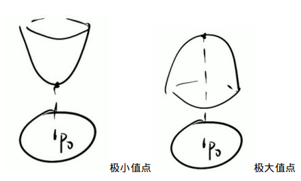
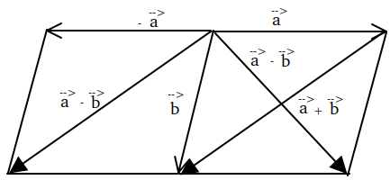
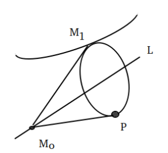
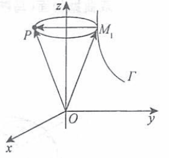
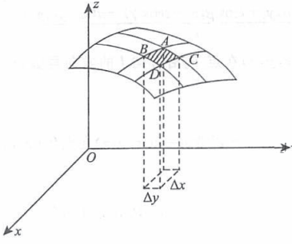

# 书籍链接
* [题目分册,43](file:///media/easul/D4B4E1AFB4E19470/Software/%E5%AD%A6%E4%B9%A0/%E8%80%83%E7%A0%94/%E8%B5%84%E6%96%99/%E6%95%B0%E5%AD%A6/%E8%B5%84%E6%96%99/2020%E5%BC%A0%E5%AE%87%E9%A2%98%E6%BA%90%E6%B7%B1%E6%9E%901000%E9%A2%98-%E4%B9%A0%E9%A2%98%E5%88%86%E5%86%8C%EF%BC%88%E6%95%B0%E5%AD%A6%E4%B8%80%EF%BC%89.pdf)
* [解析分册,114](file:///media/easul/D4B4E1AFB4E19470/Software/%E5%AD%A6%E4%B9%A0/%E8%80%83%E7%A0%94/%E8%B5%84%E6%96%99/%E6%95%B0%E5%AD%A6/%E8%B5%84%E6%96%99/2020%E5%BC%A0%E5%AE%87%E9%A2%98%E6%BA%90%E6%B7%B1%E6%9E%901000%E9%A2%98-%E8%A7%A3%E6%9E%90%E5%88%86%E5%86%8C%EF%BC%88%E6%95%B0%E5%AD%A6%E4%B8%80%EF%BC%89.pdf)

# 基础知识
1. 概念
    1. 极限
    ```tex
    \displaystyle
    \footnotesize
    \lim\limits_{\tiny{\begin{matrix} x \to x_0 \\ y \to y_0 \end{matrix}}} f(x, y) = A, 下边为其极限定义  \\
    设f(x, y)定义域为D, P_0(x_0, y_0)是D的聚点,   \\
    \forall \varepsilon > 0, \exists \delta,当P(x, y) \in D \bigcap \mathring{U}(P_0, \delta)时,有  \\
    |f(x, y) - A| < \varepsilon  \\
    聚点: 区域D的内点 + 边界位置的点(若D是开区域,则取不到边界)  \\
    \mathring{U}(P_0, \delta)就是以P_0为圆心,\delta为半径的去心邻域  \\
    ```
    2. 连续性
    ```tex
    \displaystyle
    \footnotesize
    若\lim\limits_{\tiny{\begin{matrix} x \to x_0 \\ y \to y_0 \end{matrix}}} f(x, y) = f(x_0, y_0),
    则f(x, y)在f(x_0, y_0)连续  \\
    若\lim\limits_{\tiny{\begin{matrix} x \to x_0 \\ y \to y_0 \end{matrix}}} f(x, y) \mathrlap{\,/}{=} f(x_0, y_0),
    则f(x, y)在f(x_0, y_0)叫做不连续,不讨论间断类型  \\
    ```
    3. 偏导数(z = f(x, y))
    ```tex
    \displaystyle
    \footnotesize
    \frac{\partial f}{\partial x}|_{(x_0, y_0)} = f'_x(x_0, y_0)  \\
    \frac{\partial f}{\partial y}|_{(x_0, y_0)} = f'_y(x_0, y_0)  \\
    f'_x(x_0, y_0) = \lim\limits_{\Delta x \to 0} \frac{f(x_0 + \Delta x, y_0) - f(x_0, y_0)}{\Delta x}  \\
    f'_x(x_0, y_0) = \lim\limits_{x \to x_0} \frac{f(x, y_0) - f(x_0, y_0)}{x - x_0}  \\
    f'_y(x_0, y_0) = \lim\limits_{\Delta y \to 0} \frac{f(x_0, y_0 + \Delta y) - f(x_0, y_0)}{\Delta y}  \\
    f'_y(x_0, y_0) = \lim\limits_{y \to y_0} \frac{f(x_0, y) - f(x_0, y_0)}{y - y_0}  \\
    如果一阶偏导数f'_x(x, y),f'_y(x, y)在邻域内仍有偏导数,则就是二阶偏导数  \\
    \frac{\partial (\frac{\partial z}{\partial x})}{\partial x} = \frac{\partial^2 z}{\partial x^2} = f^{"}_{xx}(x, y)  \\
    \frac{\partial (\frac{\partial z}{\partial x})}{\partial y} = \frac{\partial^2 z}{\partial x \partial y} = f^{"}_{xy}(x, y)  \\
    \frac{\partial (\frac{\partial z}{\partial y})}{\partial y} = \frac{\partial^2 z}{\partial y^2} = f^{"}_{yy}(x, y)  \\
    \frac{\partial (\frac{\partial z}{\partial y})}{\partial x} = \frac{\partial^2 z}{\partial y \partial x} = f^{"}_{yx}(x, y)  \\
    先对y求偏导再对x求偏导和先对x求偏导再对y求偏导不一样.可能对x求了偏导,就不能对y求偏导了  \\
    二阶及二阶以上的偏导数统称为高阶偏导数  \\
    ```
    4. 可微
    ```tex
    \displaystyle
    \footnotesize
    若z = f(x, y)在点(x, y)的全增量\Delta z = f(x + \Delta x, y + \Delta y) - f(x, y)
    可表示为\Delta z = A\Delta x + B\Delta y + o(\rho)  \\
    \rho = \sqrt{(\Delta x)^2 + (\Delta y)^2} \to 两点间的距离  \\
    A, B不依赖\Delta x, \Delta y,只跟x, y有关  \\
    则z = f(x, y)在点(x, y)可微, A\Delta x + B\Delta y为z = f(x, y)在点(x, y)的全微分,记为dz(dz = A\Delta x + B\Delta y)  \\
    这里A是f'_x(x_0, y_0), B是f'_y(x_0, y_0),故dz = f'_x(x_0, y_0)\Delta x + f'_y(x_0, y_0)\Delta y = \frac{\partial z}{\partial x}|_{(x_0, y_0)}dx + \frac{\partial z}{\partial y}|_{(x_0, y_0)}dy \\
    \Delta x可以写成 dx  \\
    ```
2. 计算
    1. 链式求导规则(复合多元函数求导)
    ```tex
    \displaystyle
    \footnotesize
    设z = f(u, v, w), u = u(y), v = v(x, y), w = w(x)  \\
    这里x, y是自变量, u, v, w是中间变量, z是因变量  \\
    求导即走路,将走到x的路加起来就是链式求导法则  \\
    多元函数微分用\partial, 一元函数微分用d  \\
    \frac{\partial z}{\partial x} = \frac{\partial z}{\partial v} * \frac{dv}{dx} + 
    \frac{\partial z}{\partial w} * \frac{dw}{dx}  \\
    ```
    ```dot
    digraph demo{
        z -> u;
        z -> v;
        z -> w;
        u -> y;
        v -> x;
        v -> y;
        w -> x;
    }
    ```
    2. 高阶偏导数
    ```tex
    \displaystyle
    \footnotesize
    不论z对谁求导,也不论z求了几阶导,求导之后的新函数与z有完全相同的复合结构  \\
    \frac{\partial^3 z}{\partial u \partial v \partial w}就是先对u求偏导,u再对x求导数,其他不动.求完了再求其他字母  \\
    按照考研答案写符号记法: 写1, 2  \\
    \frac{\partial^{10}f}{\partial^5x\partial^5y} = 分成x和y两部分式子,然后对x的式子求5阶导, y的式子当常数,求出来后再对y的式子求5阶导,x的式子当常数\orange{(4.5)} \\
    ```
3. 多元函数最值(必考)
    1. 无条件极值(没有约束条件来求极值)
    ```tex
    \displaystyle
    \footnotesize
    (1)必要条件  \\
    设z = f(x, y)在(x_0, y_0)一阶偏导数存在,且取极值, 则f'_x(x_0, y_0) = 0, f'_y(x_0, y_0) = 0  \\
    这条常用于3元以上  \\
    在一点P, \frac{\partial f}{\partial x}|_P = \frac{\partial f}{\partial y}|_P = 0, 则该点可能是极值点,然后可以用充分性看是否是极大极小值,一阶偏导不为0不是极值点  \\
    (2)充分条件  \\
    f_{xx}"(x_0, y_0) = A, f_{xy}"(x_0, y_0) = B, f_{yy}"(x_0, y_0) = C, 若  \\
    B^2 - AC < 0, 当A > 0, f(x_0, y_0)为极小值点  \\
    B^2 - AC < 0, 当A < 0, f(x_0, y_0)为极大值点  \\
    B^2 - AC > 0, f(x_0, y_0)为不是极值点  \\
    B^2 - AC = 0, 该法失效(因为可能是极大也可能不是极大,所以失效)  \\
    只用于2元  \\
    ```  
      
    ```tex
    \displaystyle
    \footnotesize
    计算步骤  \\
    (1)给出z = f(x, y)(显函数形式)或F(x,, y, z) = 0(隐函数形式),然后求z'_x, z'_y  \\
    (2)令z'_x = 0, z'_y = 0, 联立解出一些点P_i(x_i, y_i)  \\ 
    (3)得到z''_{xx}|_{P_i} = A, z''_{xy}|_{P_i} = B, z''_{yy}|_{P_i} = C  \\
    (4)根据B^2 - AC来判断这些点的情况
    ```
    2. 条件极值
    ```tex
    \displaystyle
    \footnotesize
    求u = f(x, y, z)在 g(x, y, z) = 0, h(x, y, z) = 0下的极值  \\
    使用拉氏乘数法  \\
    (1)构造辅助函数F(x, y, z, \lambda, \mu) = f(x, y, z) + \lambda g(x, y, z) + \mu h(x, y, z) \to (\lambda, \mu都是变量且可以为0) \\
    (2)令F'_x = 0, F'_y = 0, F'_z = 0, F'_{\lambda} = 0, F'_{\mu} = 0,   \\
    (3)解方程组得到多个P(x, y, z), 然后得到u的值,比较之后得到最大值和最小值  \\
    ```
4. 常用基础知识
    1. 向量  
      
    ```tex
    \displaystyle
    \footnotesize
    (1)向量相等: 两个向量大小相等,方向相同,就是相等的向量(与向量位置无关),这也叫\orange{向量的自由性}  \\
    (2)向量表达形式: \bold{a} = (a_x, a_y, a_z) = a_x\bold{i} + a_y\bold{j} + a_z\bold{k}  \\
    P(x_0, y_0, z_0), P_1(x_1, y_1, z_1), \overrightarrow{PP_1} = (x_1 - x_0, y_1 - y_0, z_1 - z_0)  \\
    a + b = b + a  \\
    (a + b) + c = a + (b + c)  \\
    |a|^2 = (a)^2 \to [|a|^2 = |a||a|cos\theta = a \cdotp a = (a)^2]  \\
    \overrightarrow{AB} = -\overrightarrow{BA}  \\
    0向量也可以进行点乘和叉乘  \\
    A, B, C三点共线, 则\overrightarrow{AC} = \lambda \overrightarrow{AB}, \overrightarrow{AC} // \lambda \overrightarrow{AB}  \\
    (3)向量数量积(内积, 点积)  \\
    交换律: a \cdotp b = b \cdotp a  \\
    分配率: a \cdotp (b + c) = a \cdotp c + b \cdotp c  \\
    a \cdotp b = (a_x, a_y, a_z) \cdotp ((b_x, b_y, b_z)) = a_xb_x + a_yb_y + a_zb_z  \\
    a \cdotp b = |a||b| cos\theta ,则cos\theta = \frac{a \cdot b}{|a||b|} = 
    \frac{a_xb_x + a_yb_y + a_zb_z}{\sqrt{a_x^2 + a_y^2 + a_z^2} + \sqrt{b_x^2 + b_y^2 + b_z^2}}, 
    |a|是向量a的长度,\theta是a,b夹角  \\
    向量a在向量b上的投影: \frac{a \cdotp b}{|b|} = \frac{a_xb_x + a_yb_y + a_zb_z}{\sqrt{b_x^2 + b_y^2 + b_z^2}}  \\
    a \perp b <=> \theta = \frac{\pi}{2} <=>  a \cdotp b = |a||b|cos\theta = 0 <=> a_xb_x + a_yb_y + a_zb_z = 0  \\
    (4)向量积(外积,叉积)  \\
    负交换律: a \times b = - b \times a  \\
    分配率; (a + b) \times c = a \times c + b \times c \to (可以直接用叉乘的定义算行列式来求解)  \\ 
    a \times b = 
    \begin{vmatrix}
    i & j & k \\
    a_x & a_y & a_z  \\
    b_x & b_y & b_z  \\
    \end{vmatrix} ,
    |a \times b| = |a||b|sin\theta, \theta为a, b夹角, 叉积模的几何意义是以向量a,b为边的平行四边形面积  \\
    平行四边形中,|a|是底, |b|sin\theta是高  \\
    右手定则确定叉乘向量方向:两向量移到同一起点,四指从a到b握住,拇指方向为向量方向.叉乘向量垂直于a,b向量所在平面(a \times b与 b \times a方向相反)  \\
    a // b <=> \theta = 0或\pi <=> |a \times b| = |a||b|sin\theta = 
    \begin{Vmatrix}
    i & j & k \\
    a_x & a_y & a_z  \\
    b_x & b_y & b_z  \\
    \end{Vmatrix} = 0,
    <=> \frac{a_x}{b_x} = \frac{a_y}{b_y} = \frac{a_z}{b_z}  \\
    a \times a = (0, 0, 0) = 0  \\
    两条竖线表示向量的长度(向量模长)  \\
    (5)混合积(三个向量相乘)  \\
    [abc] = (a \times b) \cdotp c = 
    \begin{vmatrix}
    a_x & a_y & a_z  \\
    b_x & b_y & b_z  \\
    c_x & c_y & c_z  \\
    \end{vmatrix}  \\
    \begin{vmatrix}
    a_x & a_y & a_z  \\
    b_x & b_y & b_z  \\
    c_x & c_y & c_z  \\
    \end{vmatrix}  = 0 <=> 三向量共面  \\
    混合积的几何意义是平行六面体体积|(a \times b) \cdotp c| = |a \times b||c|cosA,A为叉乘向量与c的夹角,|c|cosA是平行六面体高,叉乘是底面积  \\
    (6)方向角: 向量a与x轴,y轴,z轴正向的夹角\alpha, \beta, \gamma  \\
    (7)方向余弦: cos\alpha = \frac{a_x}{|a|}, cos\beta = \frac{a_y}{|a|}, cos\gamma = \frac{a_z}{|a|}, |a|是向量的模  \\
    (8)单位向量: a^o = \frac{a}{|a|} = (cos\alpha, cos\beta, cos\gamma)  \\
    (9)任意向量\bold{r} = x\bold{i} + y\bold{j} + z\bold{k} = (rcos\alpha, rcos\beta, rcos\gamma) = r(cos\alpha, cos\beta, cos\gamma)(cos\alpha, cos\beta, cos\gamma是\bold{r}的方向余弦, r是\bold{r}的模)  \\
    ```
    2. 平面方程
    ```tex
    \displaystyle
    \footnotesize
    设以下平面的法向量是\bold{n} = (A, B, C), 平面的  \\
    一般式: Ax + By + Cz + D = 0  \\
    点法式: A(x - x_0) + B(y - y_0) + C(z - z_0) = 0  \\
    三点式: 
    \begin{vmatrix}
    x - x_1 & y - y_1 & z - z_1 \\
    x - x_2 & y - y_2 & z - z_2 \\
    x - x_3 & y - y_3 & z - z_3
    \end{vmatrix} = 0 (这里平面过不共线的三点)  \\
    截距式: \frac{x}{a} + \frac{y}{b} + \frac{z}{c} = 1 (平面过(a,0,0), (0,b,0), (0,0,c))  \\
    平面束方程: 设A_1, B_1 ,C_1与A_2, B_2 ,C_2不成比例, 则
    \begin{cases}
    A_1x + B_1y + C_1z + D_1 = 0  \\
    A_2x + B_2y + C_2z + D_2 = 0  
    \end{cases}表示两个不平行平面的交线L(也是直线一般式方程),  \\
    \mu(A_1x + B_1y + C_1z + D_1) + \lambda(A_2x + B_2y + C_2z + D_2) = 0必过交线L  \\
    \mu, \lambda取不同的数,该平面就不同,但都过直线L,这个平面族就是就是平面束  \\
    若\mu = 1, A_1x + B_1y + C_1z + D_1 + \lambda(A_2x + B_2y + C_2z + D_2) = 0这个平面束不包括A_2x + B_2y + C_2z + D_2 = 0  \\
    若包括,则
    \begin{cases}
    A_1 + \lambda A_2 = A_2  \\
    BA_1 + \lambda B_2 = B_2  \\
    C_1 + \lambda C_2 = C_2  \\
    \end{cases},A_1, B_1 ,C_1与A_2, B_2 ,C_2成比例,故不包括  \\
    实际中用,若平面过L,但不是平面A_2x + B_2y + C_2z + D_2 = 0, 即可用 A_1x + B_1y + C_1z + D_1 + \lambda(A_2x + B_2y + C_2z + D_2) = 0  \\
    ```
    3. 直线方程
    ```tex
    \displaystyle
    \footnotesize
    设直线方向向量\tau = (l, m, n)(\tau这个字母是tao)  \\
    一般式: 
    \begin{cases}
    A_1x + B_1y + C_1z + D_1 = 0, n_1 = (A_1, B_1, C_1)  \\
    A_2x + B_2y + C_2z + D_2 = 0, n_2 = (A_2, B_2, C_2)
    \end{cases}, 两个平面的交线,直线方向向量\tau = n_1 \times n_2  \\
    点向式(标准式, 对称式): \frac{x - x_0}{l} = \frac{y - y_0}{m} = \frac{z - z_0}{n}  \\
    参数式: 
    \begin{cases}
    x = x_0 + lt  \\
    y = y_0 + mt  \\
    z = z_0 + nt  
    \end{cases}, (x_0, y_0, z_0)是直线已知点,t为参数  \\
    两点式: \frac{x - x_1}{x_2 - x_1} = \frac{y - y_1}{y_2 - y_1} = \frac{z - z_1}{z_2 - z_1} 
    (x_1, y_1, z_1),(x_2, y_2, z_2)是直线不同两点  \\ 
    ```
    4. 点,直线,平面的位置关系
    ```tex
    \displaystyle
    \footnotesize
    (1)点到平面距离  \\
    点P_0(x_0, y_0, z_0)到平面Ax + By + Cz + D = 0的距离d = \frac{|Ax_0 + By_0 + Cz_0 + D|}{\sqrt{A^2 + B^2 + C^2}}  \\
    (2)点到直线距离  \\
    直线过P_1(x_1, y_1, z_1), 方向向量\tau = (l, m, n), 点P_0(x_0, y_0, z_0)到直线的距离  \\
    d = \frac{|\tau \times \overrightarrow{P_0P_1}|}{|\tau|} = 
    \frac{
    \begin{Vmatrix}
    i & j & k \\
    x_1 - x_0 & y_1 - y_0 & z_1 - z_0  \\
    l & m & n  \\
    \end{Vmatrix}
    }{\sqrt{l^2 + m^2 + n^2}},   \\
    |\tau \times \overrightarrow{P_0P_1}|是两向量组成平行四边形面积,|\tau|是底,距离为高  \\
    (3)直线到直线距离  \\
    d = \frac{|\tau \times \overrightarrow{P_1P_2}|}{|\tau|} = 
    \frac{
    \begin{Vmatrix}
    i & j & k \\
    x_2 - x_1 & y_2 - y_1 & z_2 - z_1  \\
    l & m & n  \\
    \end{Vmatrix}
    }{\sqrt{l^2 + m^2 + n^2}},方法与点到直线距离相同  \\
    (4)两异面直线距离  \\
    \tau_1 = (l_1, m_1, n_1),\tau_2 = (l_2, m_2, n_2)是两异面直线方向向量, P_1(x_1, y_1, z_1), P_2(x_2, y_2, z_2)是两异面直线两点, 异面直线距离  \\
    d = \frac{|(\tau_1 \times \tau_2) \cdotp \overrightarrow{P_1P_2}|}{|\tau_1 \times \tau_2|} = 
    \frac{
    \begin{Vmatrix}
    x_2 - x_1 & y_2 - y_1 & z_2 - z_1  \\
    l_1 & m_1 & n_1  \\
    l_2 & m_2 & n_2  \\
    \end{Vmatrix}
    }{
    \begin{Vmatrix}
    i & j & k  \\
    l_1 & m_1 & n_1  \\
    l_2 & m_2 & n_2  \\
    \end{Vmatrix}
    }, |(\tau_1 \times \tau_2) \cdotp \overrightarrow{P_1P_2}|是体积, |\tau_1 \times \tau_2|是底面积  \\
    |(\tau_1 \times \tau_2) \cdotp \overrightarrow{P_1P_2}| = 0是,两平面距离为0, 两直线共面,但不一定平行  \\
    (4)两平行平面的距离d = \frac{|D_1 - D_2|}{\sqrt{A^2 + B^2 + C^2}}  \\
    设两平行平面为Ax + By + Cz + D_1 = 0, Ax + By + Cz + D_2 = 0,平面1上一点(a, b, c)到平面2距离  \\
    d = \frac{|Aa +Bb + Cc + D_2|}{\sqrt{A^2 + B^2 + C^2}}, Aa +Bb + Cc = -D_1,带入即得  \\
    (5)直线间的关系  \\
    设\tau_1 = (l_1, m_1, n_1),\tau_2 = (l_2, m_2, n_2)是直线L_1, L_2方向向量  \\
    L_1 \bot L_2 <=> \tau_1 \bot \tau_2 <=> \tau_1 \cdotp \tau_2 = l_1l_2 + m_1m_2 + n_1n_2 = 0  \\
    L_1 // L_2 <=> \tau // \tau <=> \frac{l_1}{l_2} = \frac{m_1}{m_2} = \frac{n_1}{n_2}  \\
    两直线夹角\theta = arccos\frac{a \cdot b}{|a||b|}(\theta = min\{(\widehat{a, b}), \pi - (\widehat{a, b})\}) \in (0, \frac{\pi}{2},表示两向量夹角中小的一个)  \\
    (6)平面间的关系  \\
    设平面\pi_1, \pi_2的法向量为n_1 = (A_1, B_1, C_1), n_2 = (A_2, B_2, C_2)  \\
    \pi_1 \bot \pi_2 <=> n_1 \bot n_2 = A_1A_2 + B_1B_2 + C_1C_2 = 0  \\
    \pi_1 // \pi_2 <=> n_1 // n_2 = \frac{A_1}{A_2} = \frac{B_1}{B_2} = \frac{C_1}{C_2}  \\
    两平面夹角\theta = arccos\frac{n_1 \cdot n_2}{|n_1||n_2|}(\theta = min\{(\widehat{n_1, n_2}), \pi - (\widehat{n_1, n_2})\}) \in (0, \frac{\pi}{2},表示两向量夹角中小的一个)  \\
    (7)平面和直线的关系  \\
    设直线L方向向量\tau = (l, m, n), 平面\pi法向量n = (A, B, C)  \\
    L \bot \pi <=> \tau // n <=> \frac{A}{l} = \frac{B}{m} = \frac{C}{n}  \\
    直线和平面垂直, 平面的法向量可以取直线的方向向量  \\
    L // \pi <=> \tau \bot n <=> Al + Bm + Cn = 0  \\
    直线L与平面\Pi夹角\theta = arcsin\frac{\tau \cdotp n}{|\tau||n|}, \theta = |\frac{\pi}{2} - \widehat{\tau, n})| \in (0, \frac{\pi}{2}, 法向量垂直平面, \pi与L的夹角 + n与L的夹角 = \frac{\pi}{2}  \\
    ```
    5. 空间曲线与曲面
    ```tex
    \displaystyle
    \footnotesize
    (1)空间曲线  \\
    一般式: 表示两个曲面的交线
    \begin{cases}
    F(x, y, z) = 0 \\
    G(x, y, z) = 0
    \end{cases}  \\
    参数方程:
    \begin{cases}
    x = f(t) \\
    y = g(t)  \\
    z = h(t)  
    \end{cases}, t \in [a, b]  \\
    空间曲线在坐标面投影  \\
    设曲线\Gamma: 
    \begin{cases}
    F(x, y, z) = 0 \\
    G(x, y, z) = 0
    \end{cases}, 求其在xOy面的投影曲线, 将\Gamma中的z消掉,得到g(x, y) = 0  \\
    曲线\Gamma在xOy上的投影曲线包含于曲线
    \begin{cases}
    g(x, y)  = 0 \\
    z = 0
    \end{cases}  \\
    求哪个平面的曲线投影,则消去曲线另一个字母  \\
    (2)空间曲面(图形样子可以看常用公式)  \\
    曲面方程: F(x, y, z) = 0  \\
    二次曲面  \\
    柱面: 平面图形平行移动形成  \\
    旋转曲面: 曲线C绕定直线旋转一周得到的曲面  \\
    曲线
    \begin{cases}
    F(x, y, z) = 0 \\
    G(x, y, z) = 0
    \end{cases}绕直线\frac{x - x_0}{m} = \frac{y - y_0}{n} = \frac{z - z_0}{p}旋转,   \\
    设M_0(x_0, y_0, z_0), L方向向量为s = (m, n, p), 取母线上一点M_1(x_1, y_1, z_1), 则过M_1的纬圆上任意一点P(x, y, z)满足  \\
    |\overrightarrow{M_0M_1}| = |\overrightarrow{M_0P}|且\overrightarrow{M_1P} \bot s,联立  \\
    \begin{cases}
    m(x - x_1) + n(y - y_1) + p(z - z_1) = 0  \\
    (x_1 - x_0)^2 + (y_1 - y_0)^2 + (z_1 - z_0)^2 = (x - x_0)^2 + (y - y_0)^2 + (z - z_0)^2  \\
    F(x_1, y_1, z_1) = 0  \\
    G(x_1, y_1, z_1) = 0
    \end{cases}
    得到旋转曲面方程  \\
    ```
      
    ```tex
    \displaystyle
    \footnotesize
    曲线
    \begin{cases}
    F(x, y, z) = 0 \\
    G(x, y, z) = 0
    \end{cases}绕z轴旋转得到的旋转曲面, 在母线上任取一点M_1(x_1, y_1, z_1), 则过M_1的纬圆上任意一点P(x, y, z)有  \\
    |\overrightarrow{OP}| = |\overrightarrow{OM_1}|和z = z_1,故x^2 + y^2 + z^2 = x_1^2 + y_1^2 + z_1^2,即x^2 + y^2 = x_1^2 + y_1^2  \\
    \begin{cases}
    F(x_1, y_1, z) = 0  \\
    G(x_1, y_1, z) = 0  \\
    x^2 + y^2 = x_1^2 + y_1^2
    \end{cases} 联立消去x_1, y_1,得到旋转曲面方程  \\
    若\begin{cases}
    F(x_1, y_1, z) = 0  \\
    G(x_1, y_1, z) = 0  \\
    \end{cases}可得到x_1 = f(z), y_1 = g(z), 则旋转曲面方程为x^2 + y^2 = f^2(z) + g^2(z)  \\
    ```  
      
4. 多元函数微分学几何应用
    1. 空间曲线的切线与法平面
    ```tex
    \displaystyle
    \footnotesize
    切向量是切线的方向向量, 法向量是法线的方向向量  \\
    (1)空间曲线由参数方程给出  \\
    设空间曲线由参数方程
    \begin{cases}
    x = f(t)  \\
    y = g(t)  \\
    z = h(t)
    \end{cases} 给出, f(t), g(t), h(t)都可导, P_0(x_0, y_0, z_0)是空间曲线上的点, 且t = t_0时,f'(t_0), g'(t_0), h'(t_0)都不为0,则  \\
    曲线在P_0(x_0, y_0, z_0)的切向量\tau = (f'(t_0), g'(t_0), h'(t_0))  \\
    曲线在P_0(x_0, y_0, z_0)的切线方程为\frac{x - x_0}{f'(t_0)} = \frac{y - y_0}{g'(t_0)} = \frac{z - z_0}{h'(t_0)}  \\
    曲线在P_0(x_0, y_0, z_0)的法平面方程为f'(t_0)(x - x_0) + g'(t_0)(y - y_0) + h'(t_0)(z - z_0) = 0  \\
    (2)空间曲线由两曲面给出  \\
    设空间曲线由\begin{cases}
    F(x, y ,z) = 0  \\
    G(x, y ,z) = 0  \\
    \end{cases}, 在以下表达式有意义的情况下,有  \\
    曲线在P_0(x_0, y_0, z_0)的切向量为: \tau = (
    \begin{vmatrix}
    F'_y & F'_z \\
    G'_y & G'_z
    \end{vmatrix}_{P_0}, 
    \begin{vmatrix}
    F'_z & F'_x \\
    G'_z & G'_x
    \end{vmatrix}_{P_0}, 
    \begin{vmatrix}
    F'_x & F'_y \\
    G'_x & G'_y
    \end{vmatrix}_{P_0} 
    ),  \\
    曲线在P_0(x_0, y_0, z_0)的切线方程为
    \frac{x - x_0}{
    \begin{vmatrix}
    F'_y & F'_z \\
    G'_y & G'_z
    \end{vmatrix}_{P_0}
    } = \frac{y - y_0}{
    \begin{vmatrix}
    F'_z & F'_x \\
    G'_z & G'_x
    \end{vmatrix}_{P_0}
    } = \frac{z - z_0}{
    \begin{vmatrix}
    F'_x & F'_y \\
    G'_x & G'_y
    \end{vmatrix}_{P_0}
    }   \\
    曲线在P_0(x_0, y_0, z_0)的法平面方程为
    \begin{vmatrix}
    F'_y & F'_z \\
    G'_y & G'_z
    \end{vmatrix}_{P_0}
    (x - x_0) + 
    \begin{vmatrix}
    F'_z & F'_x \\
    G'_z & G'_x
    \end{vmatrix}_{P_0}
    (y - y_0) + 
    \begin{vmatrix}
    F'_x & F'_y \\
    G'_x & G'_y
    \end{vmatrix}_{P_0}
    (z - z_0) = 0   \\
    ```
    2. 空间曲面的切平面与法线
    ```tex
    \displaystyle
    \footnotesize
    (1)空间曲面由二元隐函数F(x, y, z) = 0给出,点P_0(x_0, y_0, z_0)是曲面上的点,  \\
    曲面在P_0(x_0, y_0, z_0)的法向量为n = (F'_x(x_0, y_0, z_0), F'_y(x_0, y_0, z_0), F'_z(x_0, y_0, z_0))  \\
    曲面在P_0(x_0, y_0, z_0)的法线方程为\frac{x - x_0}{F'_x(x_0, y_0, z_0)} = \frac{y - y_0}{F'_y(x_0, y_0, z_0)} = \frac{z - z_0}{F'_z(x_0, y_0, z_0)}  \\
    曲线在P_0(x_0, y_0, z_0)的切平面方程为F'_x(x_0, y_0, z_0)(x - x_0) + F'_y(x_0, y_0, z_0)(y - y_0) + F'_z(x_0, y_0, z_0)(z - z_0) = 0  \\
    (2)空间曲面由二元显函数z = f(x, y)给出, 令F(x, y, z) = f(x, y) - z,则  \\
    曲面在P_0(x_0, y_0, z_0)的法向量为n = (f'_x(x_0, y_0), f'_y(x_0, y_0), -1)  \\
    曲面在P_0(x_0, y_0, z_0)的法线方程为\frac{x - x_0}{f'_x(x_0, y_0)} = \frac{y - y_0}{f'_x(x_0, y_0)} = \frac{z - z_0}{-1}  \\
    曲线在P_0(x_0, y_0, z_0)的切平面方程为f'_x(x_0, y_0)(x - x_0) +f'_y(x_0, y_0)(y - y_0) -(z - z_0) = 0  \\
    由该切平面方程得z - z_0 = f'_x(x_0, y_0)(x - x_0) +f'_y(x_0, y_0)(y - y_0)  \\
    故z = f(x, y)在(x_0, y_0)的全微分表示z = f(x, y)在(x_0, y_0, z_0)切平面竖坐标的增量(\orange{全微分的几何意义})  \\
    若用\alpha, \beta, \gamma表示曲面z = f(x, y)在(x_0, y_0, z_0)处法向量的方向角, 且法向量与z轴正向夹角\gamma是锐角,则法向量方向余弦为  \\
    cos\alpha = \frac{-f'_x(x_0, y_0)}{\sqrt{1 + f'^2_x(x_0, y_0) + f'^2_y(x_0, y_0)}},
    cos\beta = \frac{-f'_y(x_0, y_0)}{\sqrt{1 + f'^2_x(x_0, y_0) + f'^2_y(x_0, y_0)}},
    cos\gamma = \frac{1}{\sqrt{1 + f'^2_x(x_0, y_0) + f'^2_y(x_0, y_0)}}
    ```
    3. 空间曲面面积计算
    ```tex
    \displaystyle
    \footnotesize
    曲面S可以写成z = z(x, y), (x ,y) \in D, z(x, y)有连续偏导数,则曲面面积为  \\
    S = \iint_{D}\sqrt{1 + (z'_x)^2 + (z'_y)^2}  \\
    求解过程  \\
    取曲面在xOy面的一个小块区域坐标分别为(x_i, y_i), (x_i, y_i + \Delta y),(x_i + \Delta x, y_i), (x_i + \Delta x, y_i + \Delta y)  \\
    对应曲面坐标为A(x_i, y_i, z(x_i, y_i)), C(x_i, y_i + \Delta y, z(x_i, y_i + \Delta y)),  \\
    B(x_i + \Delta x, y_i, z(x_i + \Delta x, y_i)), D(x_i + \Delta x, y_i + \Delta y, z(x_i + \Delta x, y_i + \Delta y))  \\
    将曲面\Delta S_{ij}近似看做一个平行四边形  \\
    \overrightarrow{AB} = (\Delta x, 0, z(x_i + \Delta x, y_i) - z(x_i, y_i)) \approx (\Delta x, 0, z'_x *\Delta x) = u_{ij}  \\
    \overrightarrow{AC} = (0, \Delta y, z(x_i, y_i + \Delta y) - z(x_i, y_i)) \approx (0, \Delta y, z'_y *\Delta y) = v_{ij}  \\
    故小曲面面积\Delta S_{ij} \approx |u_{ij} \times v_{ij}| = 
    \begin{Vmatrix}
    i & j & k \\
    \Delta x & 0 & z'_x *\Delta x  \\
    0 & \Delta y & z'_y *\Delta y  \\
    \end{Vmatrix}  \\
    = |\Delta x\Delta yk - z'_x(x_i, y_i)\Delta x\Delta yi - z'_y(x_i, y_i)\Delta x\Delta yj|
    = \sqrt{1 + [z'_x(x_i, y_i)]^2 + [z'_y(x_i, y_i)]^2}\Delta x\Delta y  \\
    则曲面面积S = \sum_{i, j}\Delta S_{ij} \approx \sum_{i, j}\sqrt{1 + [z'_x(x_i, y_i)]^2 + [z'_y(x_i, y_i)]^2}\Delta x\Delta y   \\
    当max\{\Delta x_i, \Delta y_i\} \to 0, S的面积就趋向二重积分S = \iint_{D}\sqrt{1 + (z'_x)^2 + (z'_y)^2}  \\
    ```
    
5. 方向导数与梯度
    0. 偏导数: 函数沿坐标轴方向的变化率
    1. 方向导数: 函数在某点沿特定方向的变化率
    ```tex
    \displaystyle
    \footnotesize
    (1)方向导数的定义  \\
    三元函数u = u(x, y, z)的点P_0(x_0, y_0, z_0)在空间邻域有定义,l为从点P_0出发的射线, P(x, y, z)是l上且在邻域内的任一点,则  \\
    \begin{cases}
    x - x_0 = \Delta x = tcos\alpha  \\
    y - y_0 = \Delta y = tcos\beta  \\
    z - z_0 = \Delta z = tcos\gamma  \\
    \end{cases},t = \sqrt{(\Delta x)^2 + (\Delta y)^2 + (\Delta z)^2}表示P到P_0的距离  \\
    若\lim\limits_{x \to 0^+} \frac{u(P) - u(P_0)}{t} = \lim\limits_{x \to 0^+} \frac{u(x_0 + tcos\alpha, y_0 + tcos\beta, z_0 + tcos\gamma) - u(x_0, y_0, z_0)}{t}存在,则此极限是u = u(x, y, z)在点P_0沿l的方向导数,记为
    \frac{\partial u}{\partial l}|_{P_0}  \\
    (2)方向导数的计算  \\
    若u = u(x, y, z)在P_0(x_0, y_0, z_0)可微分,则u = u(x, y, z)在P_0任意方向l的方向导数都存在,  \\
    \frac{\partial u}{\partial l}|_{P_0}=u'_x(P_0)cos\alpha + u'_y(P_0)cos\beta + u'_z(P_0)cos\gamma  \\
    cos\alpha, cos\beta, cos\gamma是方向l的方向余弦  \\
    \orange{如果计算二元函数的方向导数则与该方式一样}
    ```
    2. 梯度: 研究函数在点P沿哪个方向的方向导数最大, 最大值是多少, 沿哪个方向增加速度最快
    ```tex
    \displaystyle
    \footnotesize
    三元函数u = u(x, y, z)在P_0(x_0, y_0, z_0)有一阶偏导数, 则  \\
    梯度则为grad u|_{P_0} = (u'_x(P_0), u'_y(P_0), u'_z(P_0))  \\
    ```
    3. 方向导数与梯度关系
    ```tex
    \displaystyle
    \footnotesize
    方向导数 = 梯度 \cdotp l^0(l^0是方向余弦的向量(\frac{a_x}{|a|}, \frac{a_y}{|a|}, \frac{a_z}{|a|}))  \\
    \frac{\partial u}{\partial l}|_{P_0} = (u'_x(P_0), u'_y(P_0), u'_z(P_0)) \cdotp (cos\alpha, cos\beta, cos\gamma)
    = |grad u|_{P_0}||l^0|cos \theta = |grad u|_{P_0}|cos\theta  \\
    \theta是grad u|_{P_0}与l^0的夹角,当cos\theta = 1,\frac{\partial u}{\partial l}|_{P_0}有最大值  \\
    结论: 函数在某点的梯度是一个向量, 他的方向与取得最大方向导数的方向一致,他的模为方向导数最大值  \\
    方向导数 = 梯度 \cdot cos\theta, cos\theta要小于等于1  \\
    |l^0| = \sqrt{(\frac{a_x}{|a|})^2 + (\frac{a_y}{|a|})^2 + (\frac{a_z}{|a|})^2} = 1  \\
    ```

# 自我总结
1. 二元函数是三维曲面
2. 二元函数没有复合函数,求导没有相加,有复合函数(有走路的过程)则有相加的情况
3. 一元函数和二元函数的区别
```tex
\displaystyle
\footnotesize
f(\frac{x}{y})是一元函数, 这里相当于给x的位置带入了\frac{x}{y}  \\
g(\frac{x}{y}, \frac{x}{y})是二元函数, 这里相当于给x的位置带入了\frac{x}{y}, y的位置带入了\frac{x}{y}  \\
```
4. 算偏微分的时候注意`z可能能被换成x和y的式子`,`y也可能是x的函数`
5. 非奇异线性变换形式如下(`4.27`)
```tex
\displaystyle
\footnotesize
(\xi, \eta) = (x, y) * 
\begin{pmatrix}
   \lambda_1 & \lambda_2 \\
   1 & 1
\end{pmatrix}  \\
等式后边第一行乘第一列是\xi,   \\
等式后边第一行乘第二列是\eta,   \\
若右边矩阵可逆,则才会有非奇异线性变换  \\
可逆则矩阵不为0, \lambda_1 \mathrlap{\,/}{=} \lambda_2  \\
```
6. 求某点一阶偏导和二阶偏导的区别
```tex
\displaystyle
\footnotesize
f(x, y) = xy\frac{x^2 - y^2}{x^2 + y^2}, f(0, 0) = 0  \\
f'_x(0, 0)  \\
在(0, 0)求一阶偏导数,y值不变,所以可以直接带入y=0  \\
求二阶偏导f"_{xy}(0, 0), 则可以先对x求偏导,此时y是变的,所以带入y = y  \\
可以用导数定义做  \\
```
7. F(x, y, z) = 0切平面的法向量就是平面方程对x, y, z各自的一阶导作为(x, y, z)三个坐标
8. 两个向量垂直,內积(数量积)为0
```tex
\displaystyle
\footnotesize
\overrightarrow{n} = {1, 1, -2}, \overrightarrow{m} = {1, 1, 1}  \\
\overrightarrow{n}  * \overrightarrow{m} = 1 * 1 + 1 * 1 + 1 * (-2) = 0  \\
两个向量垂直 
```
9. 柱面始终与一条直线平行,其切平面的法向量始终与一条直线垂直
10. 闭区域连续一定有最大最小值(`4.32`)
11. 二元函数定义域是面积,所以找函数值的时候可以考虑特殊的线y = x, y = -x
12. 找最大体积,可以让一阶导数 = 0, 再看二阶导数是否小于0即可
13. 闭区域
    1. 找极值只看内部,不看边界.假设有极值,找到该极值点坐标,然后ABC看该点是极大还是极小
    2. 找最值,先看内部,再将边界看做约束条件用`拉氏乘数法`或者`直接将边界条件带入`看.
        1. 拉氏乘数法找到约束条件的中间极值点,然后再看端点,将所有点比较找最值
        2. 代入法要是成为一元函数,直接求导数为0的点(极值点)和端点情况再比较找最值
14. 学会转化的思想
```tex
\displaystyle
\footnotesize
当求|z|最大值不好求,可以求z^2,z^2在某点最大,|z|在该点也最大  \\
当求d = \frac{3y\sqrt{16y^2 + x^2}}{x}的最大值不方便, 可以转成d* = \frac{y^2(16y^2 + x^2)}{x^2},d*最大,d在该点也最大  \\
若求v = \frac{(4-z)^3}{xy}的最小值不好求,可以转换成求lnv = \frac13 ln(4 - z) - lnxy,lnv在哪个点最小,v则在哪个点最小  \\
因为这些值都是正的  \\
转化后在用拉格朗日乘数法  \\
```
5. 母线: 形成曲面的动线
6. 

# 解题技巧
1. 概念
```tex
\displaystyle
\footnotesize
(一)求二元极限: 换元成一元极限(), 等价代换, 无穷小*有界, 夹逼准则(没有洛必达, 单调有界, 泰勒)  \\
一种特殊二元函数的极限f(x, y) = \frac{P(x, y)}{Q(x, y)} = \frac{\sum_{i = 0}^m a_i x^{m - i}y^i}{\sum_{i = 0}^n b_i x^{n - i}y^i},找f(x, y) \to (0, 0)的极限  \\
(1)  \\
当m > n(分子次方高), \\
若Q(1, y) = 0与Q(x, 1) = 0均无实根, 
\lim\limits_{\tiny{\begin{matrix} x \to 0 \\ y \to 0 \end{matrix}}} f(x, y) = 0  \\
若Q(1, y) = 0或Q(x, 1) = 0有实根,
\lim\limits_{\tiny{\begin{matrix} x \to 0 \\ y \to 0 \end{matrix}}} f(x, y)不存在  \\
(2)  \\
当m \leqslant n(次方相同或分母次方高)  \\
\lim\limits_{\tiny{\begin{matrix} x \to 0 \\ y \to 0 \end{matrix}}} f(x, y)不存在  \\
(二)求一点(x_0, y_0)的偏导数除了用偏导数定义,也可以用\orange{先代后求}的方法(二元函数化成一元函数再求导)  \\
f'_x(x_0, y_0) = x的偏导, y一直是y_0 = g'(x)|_{x = x_0} = [f(x, y_0)]|_{x = x_0}  \\
f'_y(x_0, y_0) = y的偏导, x一直是x_0 = h'(y)|_{y = y_0} = [f(x_0, y)]'|_{y = y_0}  \\
(三)判定f(x, y)在(x_0, y_0)是否可微  \\
f'_x(x_0, y_0)与f'_y(x_0, y_0)只要一个不存在,即不可微  \\
若都存在, 查看\lim\limits_{\tiny{\begin{matrix} x \to x_0 \\ y \to y_0 \end{matrix}}}
\frac{f(x, y) - f(x_0, y_0) - f'_x(x_0, y_0)(x - x_0) - f'_y(x_0, y_0)(y - y_0)}{\sqrt{(x - x_0)^2 + (y - y_0)^2}}是否为0  \\
(极限的分母看做是两点间距离)若为0,则可微,若不为0,则不可微  \\
(四)求偏导数在一点是否连续,则可以先求出该点的偏导数值,用定义法或先带后求,然后\frac{\partial z}{\partial x}求偏导数,算偏导数在这里的极限即可看偏导数在这一点是否连续  \\
```

# 题目
* 4.2
```tex
\displaystyle
\footnotesize
\sqrt{|xy|}, x和y地位相同,由对称性得到f'_x(0, 0) = f'_y(0, 0)  \\
f'_x(0, 0) = (0)'|_{x = 0} = 0  \\
用\lim\limits_{\tiny{\begin{matrix} x \to x_0 \\ y \to y_0 \end{matrix}}}
\frac{f(x, y) - f(x_0, y_0) - f'_x(x_0, y_0)(x - x_0) - f'_y(x_0, y_0)(y - y_0)}{\sqrt{(x - x_0)^2 + (y - y_0)^2}}  \\
得到式子之后,可以用二元函数的极限看次方来解决是否有极限, 上边|xy|相当于2次方, 下边x^2 + y^2也是2次方,两个都开根号都是1次方 \\
相等,所以二元函数极限不存在,故不可微  \\
```

* 4.3
```tex
\displaystyle
\footnotesize
第一问是初等二元函数,所以可以显然连续  \\
```

* 4.4
```tex
\displaystyle
\footnotesize
求偏导数,这里是分段函数,用定义法, 求一个偏导f'_x(0, 0) = 0, 另一个由对称性得, f'_y(0, 0) = 0  \\
函数的连续性可以用\lim\limits_{\tiny{\begin{matrix} x \to 0 \\ y \to 0 \end{matrix}}} \frac{x^2y^2}{(x^2 + y^2)^{\frac32}}看次方  \\
```

* 4.5  
求多阶偏导数  
```tex
\displaystyle
\footnotesize
f(x, y) = xe^x(y + y^2)e^y, 然后对x的式子求导,y的式子当常数,求出来之后再对y的式子求导,x的式子当常数  \\
\frac{\partial^{10} f}{\partial x^5 \partial y^5} = (xe^x)^{(5)}[(y + y^2)e^y]^{(5)}  \\
```

* 4.6

```tex
\displaystyle
\footnotesize
偏导数求n阶导数,其他字母看做常数  \\
```

* 4.8

```tex
\displaystyle
\footnotesize
因为函数连续,所以\frac{\partial^4 f}{\partial^2 y\partial^2 x} = \frac{\partial^4 f}{\partial^2 x\partial^2 y}  \\
不连续,就不能转换  \\
化简之后再求,ln里边的e可以消掉,然后化简 \\
```

* 4.9

```tex
\displaystyle
\footnotesize
f(1, 0) = 0  \\
f(x, y) = f(1 + x - 1, 0 + y) - f(1, 0) = -(x - 1) - 2y + o(\sqrt{(x - 1)^2 + y^2})  \\
使用微分的定义得  \\
f'_x(1, 0) = -1, f'_y(1, 0) = -2  \\
dz|_{(0, 0)} = \frac{\partial z}{\partial x}|_{(0, 0)}dx + \frac{\partial z}{\partial y}|_{(0, 0)}dy  
= f'_2(1, 0)* 1|_{(0,0)}dx + [f'_1(1, 0) * e^y|_{(0,0)} + f'_2(1, 0) * 1|_{(0,0)}]dy = -2dx + (-1 -2)dy   \\
这里1指的是f(x,y)的x的位置, 2是y的位置  \\
```

* 4.10  

使用了曲线积分  
```tex
\displaystyle
\footnotesize

```

* 4.11  

二元函数在一点的泰勒公式  
```tex
\displaystyle
\footnotesize
f(x, y) = f(x_0, y_0) + f'_x(x_0, y_0)(x - x_0) + f'_y(x_0, y_0)(y - y_0) + \frac{1}{2!}[f"_{xx}(x_0, y_0)(x - x_0)^2
+ 2f"_{xy}(x_0, y_0)(x - x_0)(y - y_0) + f"_{yy}(x_0, y_0)(y - y_0)^2] + R_2  \\
```

* 4.12

```tex
\displaystyle
\footnotesize
这里求导是先对x求偏导,其结果再对y求偏导  \\
因为结果中F'_1或F'_2都是求过一阶偏导的,所以这里用\orange{无论z对谁求导,无论求了几阶导数,仍与z有相同的复合结构},所以这里F'_1或F'_2求偏导和F求偏导走路相同  \\
因为是二阶连续偏导数,故F^{"}_{12} = F^{"}_{21}  \\
```

* 4.13

```tex
\displaystyle
\footnotesize
f(\frac{x}{y})是一元函数,所以他的求导直接写成f'(\frac{x}{y}),和求哪个字母无关,括号里相当于带入的数  \\
故\frac{\partial u}{\partial x} = f'(\frac{x}{y}) + g{\frac{y}{x}} - \frac{y}{x}g'(\frac{y}{x})  \\
\frac{\partial^2 u}{\partial x^2} = \frac{1}{y}f''(\frac{x}{y}) + \frac{y^2}{x^3}g''(\frac{y}{x})  \\
```

* 4.14

```tex
\displaystyle
\footnotesize
隐函数求偏导  \\
z是关于u的一元函数,u是关于x, y的二元函数 \to u = u(x, y)  \\
\frac{\partial z}{\partial x} = f'(u)\frac{\partial u}{\partial x}  \\
\frac{\partial u}{\partial x} = \phi '(u)\frac{\partial u}{\partial x} + p(x) \to 对x求偏导,y是常数,P(y)就没了  \\
```

* 4.16

```tex
\displaystyle
\footnotesize
这里f'_x(0, 0) = a就是f'_1(0, 0) = a, f'_y(0, 0) = b就是f'_2(0, 0) = b  \\
这里\phi '(t) = f'_1[t, f(t, t^2)]* 1 + f'_2[t, f(t, t^2)][f'_1(t, t^2) + f'_2(t, t^2) * 2t]  \\
然后求\phi '(0)  \\
```

* 4.17

```tex
\displaystyle
\footnotesize
\frac{d[u(x, 2x)]}{dx} = u'_1 + 2u'_2 = 1  \\
\frac{d^2[u(x, 2x)]}{dx^2} = u^{"}_{11} + 2u^{"}_{12} + 2u^{"}_{21} + 4u^{"}_{22} = 0  \\
因为\frac{\partial^2 u}{\partial x^2} = \frac{\partial^2 u}{\partial y^2}且二阶偏导连续  \\
5u^{"}_{11} = -4u^{"}_{12}  \\
\frac{d[u'_1(x, 2x)]}{dx} = u^{"}_{11} + 2u^{"}_{12} = 2x  \\
2u^{"}_{12} = 2x - u^{"}_{11}  \\
5u^{"}_{11} = -4x + 2u^{"}_{11}, u^{"}_{11} = -\frac43x  \\
```

* 4.19

将偏微分方程转为常微分方程,然后再找函数,注意积分的时候要加C
```tex
\displaystyle
\footnotesize
常识  \\
\frac{\partial^2 u}{\partial x^2} + \frac{\partial^2 u}{\partial y^2} = (x^2 + y^2)^{\frac32}叫做偏微分方程  \\
偏微分方程无法解,需要化成常微分方程(需要u = f的函数只有一元)  \\
极限的-1当做初始条件使用  \\
过程  \\
令t = ln\sqrt{x^2 + y^2}, u = f(t)  \\
这里t'_x求导注意根号的变形  \\
\frac{\partial^2 u}{\partial x^2} + \frac{\partial^2 u}{\partial y^2} = \frac{f''(t)}{x^2 + y^2} = (x^2 + y^2)^{\frac32}  \\
故f"(t) = x^2 + y^2)^{\frac52}, x^2 + y^2 = e^{2t},f"(t) = e^{5t}  \\
然后对f''(t)积分两次得到f(t) = \frac{1}{25}e^{5t} + C_1t + C_2  \\
再根据极限确定C_1和C_2(泰勒展开)  \\
或者可以这样想,极限中f(x)也趋向0, 且函数连续,f(0) = 0,然后导数定义得f'(0) = -2,然后带入计算  \\
```

* 4.20

```tex
\displaystyle
\footnotesize
题目应该改成具有二阶连续偏导数,因为连续不一定可导  \\
充分性  \\
\frac{\partial u}{\partial x} = f'(x)g(y), \frac{\partial u}{\partial y} = f(x)g'(y)  \\
\frac{\partial^2 u}{\partial x\partial y} = f'(x)g'(y)  \\
故u\frac{\partial^2 u}{\partial x\partial y} = \frac{\partial u}{\partial x}  \\
必要性  \\
u\frac{\partial^2 u}{\partial x\partial y} = \frac{\partial u}{\partial x}  \\
u(u'_x)'_y - u'_x * u'_x = 0 \to (然后想着凑原函数,用商的原函数)  \\
(\frac{u'_x}{u})'_y = 0, 故对y积分得到\frac{u'_x}{u} = h(x) \to (y求导,x是常数)  \\
对x积分得\int \frac{u'_x}{u} dx = ln|u| + \varphi (y)   \\
故ln|u| = \int h(x)dx + \varphi (y) = H(x) + \varphi (y)  \\
u = \pm e^{H(x)} e^{\varphi (y)}  \\
故 u = f(x)g(y)  \\
```

* 4.21

```tex
\displaystyle
\footnotesize
注意e^{xy} = y, e^z = xz  \\
```

* 4.22

```tex
\displaystyle
\footnotesize
F对x求偏导,1, 2, 3中的z是关于x,y的函数,所以不会被求成0  \\
```

* 4.24

```tex
\displaystyle
\footnotesize
算\frac{dy}{dx},因为通过两个式子z无法消掉, 所以需要算第一个式子z对x的偏导,再用第二个式子求出Z对x的偏导,带入第一个式子  \\
算\frac{dz}{dx},观察得可以通过第一个式子将第二个式子中的y^2消掉,所以最后可以化成z关于x的一元方程  \\
```

* 4.25

```tex
\displaystyle
\footnotesize
这里u和v都是关于x, y的式子,所以z对x, y的偏导,走路要走两个  \\
如\frac{\partial z}{\partial x} = \frac{\partial z}{\partial u} * 1 + \frac{\partial z}{\partial v} * (-\frac{y}{x^2})  \\
```

* 4.26

```tex
\displaystyle
\footnotesize
这个意思就是利用变换后的方程左右同时求偏导,得到结果  \\
然后让结果满足条件即可  \\
这里只要求一阶偏导数不存在,其他的如v(x, y)就算存在也可以  \\
```

* 4.27

```tex
\displaystyle
\footnotesize
非奇异线性变换就是一定有\lambda_1不等于\lambda_2  \\
这里证明存在\lambda_1不等于\lambda_2 ,使最后的二阶混合导数为0, 则  \\
A\lambda_1^2 + 2B\lambda_1 + c = 0  \\
A\lambda_2^2 + 2B\lambda_2 + c = 0  \\
2A\lambda_1\lambda_2 + 2B(\lambda_1 + \lambda_2) + 2c不为0  \\
A\lambda^2 + 2B\lambda + C = 0, 则(2B)^2 - 4AC > 0  \\
故一定有\lambda_1不等于\lambda_2,使方程为0  \\
则2[\lambda^1\lambda^2A + (\lambda^1 + \lambda^2)B + C]\frac{\partial^2 u}{\partial\xi \partial\eta} = 0  \\
用韦达定理,2[\frac{c}{A}A -\frac{2B}{A}B + C] = \frac{4(AC - B^2)}{A},不为0, {\partial\xi \partial\eta} = 0   \\
```

* 4.28

```tex
\displaystyle
\footnotesize
因为h(t)只有一元,故u可以化成常微分方程  \\
h(1)和h'(1)看做是初始条件  \\
令xyz = t, 则3th"(t) + h'(t) = 0  \\
然后微分方程求解  \\
令h'(t) = v, 3tv' + v = 0 \to (一阶线性方程),用变量可分离来算  \\
\frac{dy}{dx} = f(x)g(y), \int \frac{dy}{g(y)} =  \int f(x)dx  \\
解得v = h'(t) = t^{-\frac13}C, h(t) = C_1t^{\frac23} + C_2 \\
C = \frac23 C_1
然后带入h(1)和h'(1)算出C_1, C_2  \\
用偏导数的导数定求算出该点的f情况  \\
这里注意二阶偏导, 先算某一阶偏导的时候,带入的另一个字母是变化的x或y  \\
f^{"}_{xy}(0, 0) = -1, f^{"}_{yx} = 1  \\
C_1 = \frac32, C_2 = -\frac52  \\
题目求u的表达式,u是关于xyz的,所以写成u = \frac32(xyz)^{\frac23} -\frac52  \\
```

* 4.29

```tex
\displaystyle
\footnotesize
这里求z对u, v的偏导就是求微分方程,而一般表达式就是求原函数  \\
\frac{\partial^2 z}{\partial u^2} = \frac14相当于\frac{\partial z}{\partial u}对u求偏导  \\
对u求偏导是常数,且v看做是常数,则对u积分得到\frac{\partial z}{\partial u} = \frac14 u + C_1(v),  \\
再对u求积分,z = \frac18 u^2 + C_1(v)u + C_2(v)  \\
即z = \frac18(x + y)^2 + C_1(x-y)(x+y) + C_2(x - y)  \\
```

* 4.30

```tex
\displaystyle
\footnotesize
切平面要想法向量  \\
切平面与某直线平行,则切平面法向量与该直线垂直  \\
法向量就是三元函数对x, y, z各自的偏导  \\
令F(x, y, z) = f(ax - bz, ay - cz) = 0  \\
\overrightarrow{n} = (F'_x, F'_y, F'_z) = (af'_1, af'_2, -bf'_1-cf'_2)  \\
故\overrightarrow{s} = (b, c, a),其与\overrightarrow{n}内积为0,互相垂直  \\
故切平面\pi // L(\overrightarrow{s}为L的方向向量)  \\
```

* 4.31

柱面始终与一条直线平行
```tex
\displaystyle
\footnotesize
取该面法向量,始终与一条直线垂直即可  \\
```

* 4.32

```tex
\displaystyle
\footnotesize
闭区域连续,则有最大最小值,这里只需要看(0, 0)点极限即可  \\
这里(0, 0)极限为1,故f(x, y)在(0, 0)连续  \\
f(x, y)在D: x^2 + y^2 \leqslant 1 连续  \\
故m \leqslant f(x, y) \leqslant M
```

* 4.33

这里提示了邻域,就应该想到是一块区域,然后想到特殊的线`y = x, y = -x`等  
极限转换成函数,可以更好的判断函数的状态  
```tex
\displaystyle
\footnotesize
极限存在 \lim\limits_{\tiny{\begin{matrix} x \to x_0 \\ y \to y_0 \end{matrix}}} f(x, y) -4xy = 0  \\
且f(x, y)在(0, 0)连续, \lim\limits_{\tiny{\begin{matrix} x \to x_0 \\ y \to y_0 \end{matrix}}} f(x, y) = f(0, 0) = 0  \\
且极限 = 1 > 0,根据保号性当(x, y) \to (0, 0), f(x, y) > 4xy  \\
4xy可正可负, 则f(x, y) >0, f(x, y) < 0, 或者一部分大于0, 一部分小于0都可能, 无法确定结果  \\
但是极限I可以写成f(x, y) = (1 + \alpha)(x^2 + y^2) + 4xy,\alpha是无限趋于0的,很小,然后研究f(x, y).  \\
在y = x上, f(x, y) > 0 = f(0, 0), 在y = -x上, f(x, y) < 0 = f(0, 0), 故f(0, 0)不是极值点  \\
```

* 4.34

保号性不好用再用极限化函数
```tex
\displaystyle
\footnotesize
由保号性, 在(x, y) \to (0, 0)时, \frac{f(x, y) - f(0, 0)}{x^3 - 3x^2 + y^3 - 3y^2} > 0  \\
f(x, y)在(0, 0)的邻域内,无论x正负,x^3 < 3x^2((0, 0)邻域内,x是无限趋向0的)  \\
故x^3 - 3x^2 + y^3 - 3y^2 < 0, f(x, y) < f(0, 0)  \\
```

* 4.36

```tex
\displaystyle
\footnotesize
用保号性, f(x, y) < xy, xy可正可负,为正, f(x, y) >0 ,f(x, y) < 0,或者既大于0又小于0,可能是极限,可能不是极限  \\
所以要化成函数  \\
f(x, y) = (a + o)(x^2 + y^2) + xy  \\
2f(x, y) > (x + y)^2 > 0, f(x, y) > 0 = f(0, 0), 故是最小值  \\
```

* 4.37

```tex
\displaystyle
\footnotesize
二阶连续偏导,则f(x, y)肯定连续  \\
闭区域内一定有最大最小值  \\
若D内部点P(x_0, y_0)取得极值点, 则  \\
\frac{\partial^2 u}{\partial x^2} = A  \\
\frac{\partial^2 u}{\partial x\partial y} = B  \\
\frac{\partial^2 u}{\partial y^2} = C  \\
B^2 - AC > 0,D内部的点不是极值点,D内部没有极值点  \\
所以极值点在边界, 最值点也在边界  \\
```

* 4.38

```tex
\displaystyle
\footnotesize
若z(x, y)在P点取极值(P \in D) ,\frac{\partial z}{\partial x} = \frac{\partial z}{\partial x} = 0  \\
B^2 - AC > 0(AC = -c) ,故D内部没有极值点  \\
```

* 4.41

```tex
\displaystyle
\footnotesize
这里求备用点,可以先将方程对x和y求偏导,得到两个式子.  \\
如果是极值, 则一阶偏导为0,则两个式子可以小曲一阶偏导数,然后与原方程联立得到备用点, 三个变量三个式子 \\
然后求ABC,看这几个点哪些是极大极小值  \\
```

* 4.42

```tex
\displaystyle
\footnotesize
这里由极值的一阶偏导为0得到b = 2a  \\
然后由 B^2 -AC > 0得到 a > 0  \\
当B^2 - AC = 0时, 可能该点是极大值,也可能不是极大值,此时a = 0, b也为0  \\
f(x, y) = -e^{-x}y^2 \leqslant f(-1, 0) = 0  \\
故a = 0时,f(-1, 0) \geqslant f(x, y), 其邻域也有值为0, 所以这里用的是广义极值.故也是极大值  \\
所以这里需要a \geqslant 0 且 b = 2a  \\ 
```

* 4.43

条件极值的问题
```tex
\displaystyle
\footnotesize
如果想成一元函数,可以先求v',再求v",令v' = 0,得到r = \frac{2p}{3},然后带入v"后值小于0,  \\
由于r = \frac{2p}{3}为v'唯一的根,且r = \frac{2p}{3}时v有极大值,故r = \frac{2p}{3}时v有最大值  \\
也可以想二元函数,然后有约束条件,使用拉格朗日乘数法.  \\
长宽各用x, y  \\
x + y = p(x > 0, y > 0)  \\
v = \pi x^2y  \\
令F(x, y, \lambda) = \pi x^2y + \lambda(x + y - p)  \\
然后求F'_x = 0, F'_y = 0, F'_{\lambda} = 0,得到x = \frac{2p}{3},y = \frac{p}{3}  \\
由于存在最大值,且只得到一组解, 故当半径为为\frac{2p}{3},高为\frac{p}{3}时,体积最大 \\
```

* 4.44

```tex
\displaystyle
\footnotesize
第二问并不是直接将abc带入xyz,而是先将xyz^3 \leqslant \sqrt{27}(\frac{x^2 + x^2 + z^2}{5})^{\frac52}变成
x^2y^2z^6 \leqslant 27(\frac{x^2 + x^2 + z^2}{5})^{5}  \\
令a= x^2, b = y^2, c = z^2,即证  \\
直接将abc带入xyz和xyz直接算没区别,所以才应该想到有其他变换  \\
```

* 4.45

某个指定区域内找极值最值
```tex
\displaystyle
\footnotesize
可以直接对f求偏导,若内部有极值,则该点偏导数为0,若没有为0的点,则内部无极值  \\
这里注意求极值,区域D不包括x = 0, y = 0, x+y = 6三个边界,边界是单侧,没有极值,只有最值  \\
所以得到D内部的点(2, 1)  \\
然后用充分性证(2, 1),可以先带后求(求x偏导,y不变,所以可以带入)  \\
算最值的时候需要看边界的点,这里算上边界相当于有了约束条件,也就可以用拉氏乘数法了  \\
在x = 0, 0 \leqslant y \leqslant 6, f(x, y) = 0  \\
在y = 0, 0 \leqslant x \leqslant 6, f(x, y) = 0  \\
在x + y = 6, \leqslant x \leqslant 6,用拉氏乘数法(拉氏乘数法就是假设有极值,通过将点限制在某个条件下看f是否偏导为0)  \\
这里注意,找内部极值不用看端点,得到(4, 2)  \\
再把端点(0, 6), (6, 0)算上  \\
也可以直接将条件带入计算,成为一元函数找到最值,算导数为0的点得到极值点,再看端点  \\
得到极值点(0, 6),(4, 2),端点(6, 0)  \\
```

* 4.47

```tex
\displaystyle
\footnotesize
这里(-1, -\frac12)不在D内,所以D内没有极值点  \\
然后带入x^2 + y^2 = 1,再拉氏乘数法,这样简单点  \\
F(x, y, \lambda) = 1 + 2x + y + \lambda(x^2 + y^2 - 1)  \\
也可以将x,y化成三角函数(参数方程)  \\
则z = 1 + 2cost + sint(0 \leqslant x \leqslant 2\pi)  \\
然后看z' = 0, cost = 2sint   \\
4sin^2t + sin^2t = 1(带入x^2 + y^2 = 1), sint = \pm\frac{1}{\sqrt{5}}  \\
cost = \pm\frac{2}{\sqrt{5}}
```

* 4.48

```tex
\displaystyle
\footnotesize
内接于椭球面的长方体,8个顶点都在椭球面上,若在第一卦限, 长方体一顶点p(x, y, z)在椭球面上  \\
则该点带入椭球面方程是满足条件的  \\
又因为在每个卦限,长方体的体积是相同的,故只算第一卦限即可,体积为xyz  \\
长方体整体体积为V = 8xyz  \\
然后在约束条件下找到最大值  \\
这里x, y, z > 0,   \\
求得F'_x, F'_y ,F'_z,再分别乘x, y, z  \\
则\frac{2\lambda x}{a^2} = \frac{2\lambda y}{b^2} = \frac{2\lambda z}{c^2}  \\
若\lambda = 0, 则8xyz = 0,舍去  \\
故\frac{x}{a^2} = \frac{y}{b^2} = \frac{z}{c^2}  \\
得到x, y, z的唯一解.因为题设求长方体最大体积,故所得及所求,V_{max}再计算即可  \\  
另一种理解  \\
若求8xyz的最大值,那么与v* = \frac{x^2}{a^2}\frac{y^2}{b^2}\frac{z^2}{c^2}求最大值是同理的(因为x, y, z都是正数)  \\
\frac{\frac{x^2}{a^2} + \frac{y^2}{b^2} + \frac{z^2}{c^2}}{3} \geqslant \sqrt[3]{\frac{x^2}{a^2}\frac{y^2}{b^2}\frac{z^2}{c^2}}  \\
\frac{x^2}{a^2}\frac{y^2}{b^2}\frac{z^2}{c^2} \leqslant \frac{1}{27}  \\
当\frac{x^2}{a^2} = \frac{y^2}{b^2} = \frac{z^2}{c^2} = \frac{1}{3},等号成立  \\
然后可以解x, y, z,v*在该点值最大,则v也在该点值最大.这里不要直接开根号得到体积,而是用这个最大值算出体积  \\
```

* 4.49

```tex
\displaystyle
\footnotesize
注意各个象限不包括坐标轴  \\
隐函数求导后得到法线方程  \\
法线方程为\frac{4y}{x}X - Y -3y = 0  \\
一会用点到直线距离公式求出式子再求最大值,需要用拉氏乘数法,求导的时候若是\frac{x^n}{y^n}的形式,算偏导数为0的结果会很复杂.  \\
所以这里可以将法线方程化简一下,ABC中只留一个字母  \\
\frac{1}{x}X - \frac{1}{4y}Y - \frac{3}{4} = 0  \\
然后再算点到直线距离  \\
d = \frac{\frac{3}{4}}{\sqrt{\frac{1}{x^2} + \frac{1}{16y^2}}}  \\
这里直接求拉氏乘数法很复杂,可以令d^* = \frac{1}{x^2} + \frac{1}{16y^2},d*最小,同样的点d就最大  \\
F(x, y, \lambda) = d^* + \lambda(\frac{x^2}{4} + y^2 - 1)  \\
F'_x = -\frac{1}{x^3} + \frac{x^2}{2} = \lambda x^4 - 2 = 0 \to (x^3为正数,可以丢掉,以下相同)  \\
F'_y = 32\lambda y^4 - 2 = 0, F'_{\lambda} = \frac{x^2}{4} + y^2 - 1  \\ 
x = 2\sqrt{2}y, 带入F'_{\lambda},得x,y,  \\
由题意求该点法线与原点距离最大的点,此处仅有一个驻点,所得及所求  \\
```

* 4.50

```tex
\displaystyle
\footnotesize
椭圆包含圆,则任意椭圆的点带入圆要大于等于1,椭圆与圆要么相切,要么在外边  \\
\forall P(x, y) \in \frac{x^2}{a^2} + \frac{y^2}{y^2} = 1有f(x, y) = x^2 + (y - 1)^2 \geqslant 1  \\
因为要用椭圆的点带入圆来进行a, b的计算,所以用拉氏乘数法来把方程和函数联系起来  \\
求出的极值点就可使f(x, y)最小,即f(x, y) = 1,则椭圆才与圆相切,面积才能最小   \\
F(x, y, \lambda) = f(x, y) + \lambda(\frac{x^2}{a^2} + \frac{y^2}{y^2} - 1)  \\
这里x不为0, 得到\lambda, y, x^2, 然后带入f(x, y) = 1,找到椭圆与圆相切时ab的关系  \\
得到a^2b^2 - a^4 + b^2 = 0  \\
椭圆面积 = \pi ab  \\
若求最小的椭圆面积也要用拉氏乘数法  \\
然后求出b^2 = 2a^4, 与上边的方程联立求出a, b,然后用ab代替\pi ab  \\
当x = 0时, y = b, 因为与圆相切,所以带入圆可以求出b = 2  \\
然后得到椭圆在x = 0时, y = 2, 求a则需要用曲率的信息  \\
椭圆与圆在(0, 2)相切,所以圆在该点的y'(0)与y"(0)是与椭圆相等的  \\
然后就可以求出椭圆在这点的y'(0)与y"(0),从而求a  \\
得到x = 0时椭圆面积小于x不为0时的面积  \\\
故a, b值选x不为0时的  \\
```

* 4.51

!> 用到了行列式,可以后边再看
```tex
\displaystyle
\footnotesize
约束条件是椭圆,因为是封闭区域,故有最大值和最小值  \\
这里是存在最大值和最小值,可能求不出来,所以想设最大值和最小值点  \\
先带入f(x, y)得到最大值和最小值  \\
然后再构造拉氏乘数法,将三个偏导合并,消掉a^2和b^2,然后带入最大值和最小值点  \\
发现\lambda_1和\lambda_2刚好是带入最大值点和最小值点后的最大值和最小值  \\
因为两个式子有最大值和最小值,至少两组解,故至少有一个非零解  \\
则系数行列式为0, 得到  \\
\begin{vmatrix}
   A - \frac{\lambda}{a^2} & B \\
   B & C - \frac{\lambda}{b^2}
\end{vmatrix}  \\
对角乘则(A -\frac{\lambda}{a^2})(C - \frac{\lambda}{b^2}) - B^2 = 0  \\
化简的结果即是答案  \\
```

* 4.52

```tex
\displaystyle
\footnotesize
找到法向量,再找到切平面,然后找到坐标轴截距,算某点的切平面下围成的体积  \\
坐标轴截距需要先变成截距式(\frac{x}{a} + {y}{b} = 1的形式), 变不成不能用  \\
算出的体积可以再找其最小值  \\
```

* 4.53

```tex
\displaystyle
\footnotesize
第三问\frac{\partial x}{\partial z}可以由隐函数偏导数计算,最后变形得到\frac{\partial x}{\partial z}  \\
```

* 4.54

```tex
\displaystyle
\footnotesize
可以用中学不等式, 也可以用拉氏乘数法  \\
求F(x, y, \lambda) = e^xy^2|z| + \lambda(e^x + y^2 + |z| - 3)  \\
有绝对值不好求,那么可以把|z| = 3 - (e^x + y^2)带入  \\
令g(x, y) = e^xy^2(3 - e^x - y^2), 则|z| = 3 - e^x - y^2 \geqslant 0  \\
则边界为e^x - y^2 = 3  \\
然后求内部极值点和边界点  \\
内部极值假设有极值,然后求偏导为0得到极值点,最后比较看是否大于1  \\
内部偏导化简得到3 - 2e^x - y^2 = 0, 3 - e^x - 2y^2 = 0  \\
```

