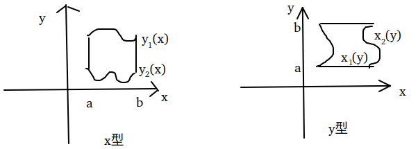
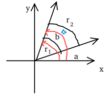
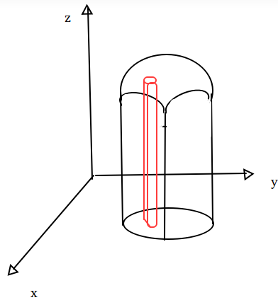
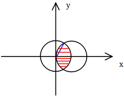
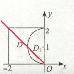
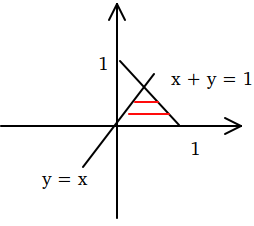
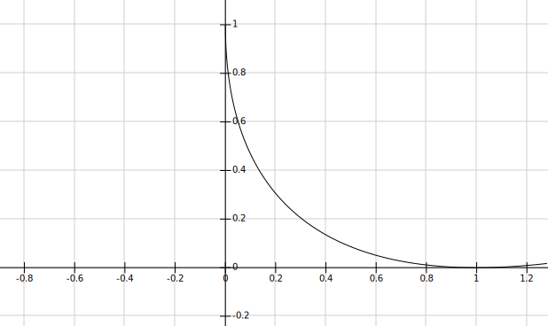
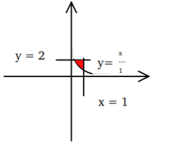

# 书籍链接
* [题目分册,48](file:///media/easul/D4B4E1AFB4E19470/Software/%E5%AD%A6%E4%B9%A0/%E8%80%83%E7%A0%94/%E8%B5%84%E6%96%99/%E6%95%B0%E5%AD%A6/%E8%B5%84%E6%96%99/2020%E5%BC%A0%E5%AE%87%E9%A2%98%E6%BA%90%E6%B7%B1%E6%9E%901000%E9%A2%98-%E4%B9%A0%E9%A2%98%E5%88%86%E5%86%8C%EF%BC%88%E6%95%B0%E5%AD%A6%E4%B8%80%EF%BC%89.pdf)
* [解析分册,132](file:///media/easul/D4B4E1AFB4E19470/Software/%E5%AD%A6%E4%B9%A0/%E8%80%83%E7%A0%94/%E8%B5%84%E6%96%99/%E6%95%B0%E5%AD%A6/%E8%B5%84%E6%96%99/2020%E5%BC%A0%E5%AE%87%E9%A2%98%E6%BA%90%E6%B7%B1%E6%9E%901000%E9%A2%98-%E8%A7%A3%E6%9E%90%E5%88%86%E5%86%8C%EF%BC%88%E6%95%B0%E5%AD%A6%E4%B8%80%EF%BC%89.pdf)

# 基础知识
1. 对称性
    1. 普通对称性,也叫偶倍奇零
    ```tex
    \displaystyle
    \footnotesize
    (1)f(x, y)的定义域关于y轴对称  \\
    z = f(x, y), (x, y) \in D, 且区域D关于y轴对称, 则  \\
    若f(x, y) = f(-x, y), \iint_{D} f(x, y) d\sigma = 2\iint_{D_1} f(x, y) d\sigma  \\
    若-f(x, y) = f(-x ,y), \iint_{D} f(x, y) d\sigma = 0  \\
    (2)f(x, y)的定义域关于x轴对称  \\
    z = f(x, y), (x, y) \in D, 且区域D关于x轴对称, 则  \\
    若f(x, y) = f(x, -y), \iint_{D} f(x, y) d\sigma = 2\iint_{D_1} f(x, y) d\sigma  \\
    若-f(x, y) = f(x ,-y), \iint_{D} f(x, y) d\sigma = 0  \\
    (3)f(x, y)的定义域关于原点对称  \\
    z = f(x, y), (x, y) \in D, 且区域D关于原点对称, 则  \\
    若f(x, y) = f(-x, -y), \iint_{D} f(x, y) d\sigma = 2\iint_{D_1} f(x, y) d\sigma  \\
    若-f(x, y) = f(-x, -y), \iint_{D} f(x, y) d\sigma = 0  \\
    d\sigma = dxdy  \\
    ```
    2. 轮换对称性
    ```tex
    \displaystyle
    \footnotesize
    若D关于y = x对称  \\
    \iint_{D} f(x, y)dxdy = \iint_{D} f(y, x)dxdy \to (积分在整个D上字母变换)  \\
    若D关于y = x对称  \\
    \iint_{D_1} f(x, y)dxdy = \iint_{D_2} f(y, x)dxdy, (D_1, D_2是对称的两块区域) \to (积分在各自区域,但字母可变)  \\
    ```
    3. 常用性质
    ```tex
    \displaystyle
    \footnotesize
    f(x) < g(x), \iint_{D} f(x)d\sigma < \iint_{D} g(x)d\sigma
    性质与定积分一样  \\
    可加性: \iint_{D} f(x, y) d\sigma + \iint_{D} g(x, y) d\sigma = \iint_{D} f(x, y) + g(x, y) d\sigma  \\
    亡羊补牢 \leqslant 未雨绸缪: \iint_{D} |f(x, y)| d\sigma \leqslant |\iint_{D} f(x, y)d\sigma|  \\
    积分中值定理: \iint_{D} f(x, y) d\sigma = f(\xi, \eta)\iint_{D} d\sigma \\
    ```
2. 计算
    ```tex
    \displaystyle
    \footnotesize
    使用后积先定限,线内画条线,先交写下限,后交写上限  \\
    画线则画先定限的轴的垂线  \\
    (1)直角坐标系
    若为X型区域(x更好写上下限或计算简单)  \\
    \iint_{D} f(x, y)d\sigma = \int_a^b dx\int_{y_1(x)}^{y_2{x}} f(x, y)dy  \\
    若为Y型区域(y更好写上下限或计算简单)  \\
    \iint_{D} f(x, y)d\sigma = \int_a^b dy\int_{x_1(y)}^{x_2{y}} f(x, y)dx  \\
    对x积分的时候,y看做常数,反之也如此  \\
    \int_{x_1(y)}^{x_2{y}} f(x, y)dx可以看做当y = y_0时从x_1(y_0)到x_2(y_0)这一条线上对f(x, y)体积的计算  \\
    ```
      
    ```tex
    \displaystyle
    \footnotesize
    (2)极坐标系  \\
    先积分极径, 再积分极角,同样使用后积先定限,线内画条线,先交写下限,后交写上限  \\
    d\sigma = rd\theta * dr, x = rcos\theta, y = rsin\theta  \\
    \iint_{D} f(x, y) d\sigma = \iint_{D} f(rcos\theta, rsin\theta) rd\theta dr = \int_{a}^{b}d\theta \int_{r_1(\theta)}^{r_2(\theta)} f(rcos\theta, rsin\theta) rdr  \\
    这里可以看做当\theta = \theta_0时, 先从r_1(\theta_0)到r_2(\theta_0)这条线上对f(x,y)积分, 积分后,每条线的宽看成是rd\theta ,然后再对线体积积分  \\
    极坐标系把每一个小积分区域看成了一个小矩形,这样宏观放大了看就成了求矩形而不是扇形的积分了,微观可以把一个小矩形看成一个矩形点的积分 \\ 
    ```
    


# 自我总结
1. 曲顶柱体的微分可以看成是平顶柱体  

2. `二重积分中的dxdy必须要大于0`(因为是面积), 小于0的要先转化为大于0再计算
3. 对于绝对值积分区间的转化理解
```tex
\displaystyle
\footnotesize
可以通过讨论x ,y的正负来转化为普通的不等式,  \\
当x >0, y > 0, x + y \geqslant 1  \\
当x >0, y < 0, x - y \geqslant 1  \\
当x <0, y > 0, -x + y \geqslant 1  \\
当x <0, y < 0, -x - y \geqslant 1  \\
```
4. 当碰到x<sup>2</sup> + y<sup>2</sup>, 可以想用极坐标的方式来处理问题
5. 对x ,y的二重积分要想到形心公式(如`5.5`)
6. 累次积分: 积分值由被积函数和积分区域共同确定
7. 二重积分就是直角坐标的变换积分次序,极坐标,普通对称性(注意奇函数), 轮换对称性, 形心公式
8. 做题之前应该观察下条件和图形之间有没有什么关系,不要越化简越复杂(`5.28`)
9. x<sup>2</sup> + y<sup>2</sup> = r<sup>2</sup>,r是半径
10. 被积函数中有绝对值的,则大概率时偶函数,这个时候注意使用二倍的情况
11. [a, b] X [c, d],这个符号表示长方形

# 解题技巧

# 题目
* 5.1

  
```tex
\displaystyle
\footnotesize
对于这个积分的积分区域可以看上图,红色区域为积分区域,积分区域关于x轴对称,所以可以看成2倍上半部分的积分  \\
这个用极坐标更好做,但是对于r的积分选择从哪里积分到哪里比较重要,这里选择蓝线的部分  \\
如果以两个圆上下交点的连线作为分割,\theta \in (0, \frac(\pi){3}),r \in (0, \frac{1}{2cos\theta}), 这样更麻烦  \\
另外注意这里\theta \in (\frac(\pi){3}, \frac(\pi){2})的时候有蓝线上边的一小部分面积需要积分(这里r上限是右圆)  \\
后边算到\int_{\frac{\pi}{3}}^{\frac{\pi}{2}} \frac{2^5}{5} cos^5\theta d\theta = 
\int_{\frac{\pi}{3}}^{\frac{\pi}{2}} \frac{2^5}{5} (1 - sin^2\theta)^2 dsin\theta, 下边就好算了  \\
```

* 5.2
```tex
\displaystyle
\footnotesize
这里积分区域关于y = x对称,故
\iint_{D} \sqrt{x^2 + y^2} d\sigma = \iint_{D_1} \sqrt{x^2 + y^2} d\sigma + \iint_{D_2} \sqrt{x^2 + y^2} d\sigma = 
2\iint_{D_1} \sqrt{x^2 + y^2} d\sigma  \\
```

* 5.3
```tex
\displaystyle
\footnotesize
有对称性,想到普通对称性的奇偶性,来消掉为0的积分  \\
这里用积分可加性,且D关于x对称,分子y的部分关于y是奇函数  \\
```

* 5.5

  
```tex
\displaystyle
\footnotesize
这里注意画图的准确性,如果想要以红线为分界线来算两部分的二重极坐标积分,发现上半部分r的上下限需要写两个曲线,下边r的上下限需要写两个曲线, 很麻烦  \\
可以想正方形减去半圆的积分,或者先积分y,再积分x,或者用形心公式  \\
在这里\bar{y} = \frac{\iint_{D}y d\sigma}{iint_{D} d\sigma}, 形心都在对称线上,\bar{y} = 1, iint_{D}y d\sigma是图形面积,用
4 - \frac{\pi}{2},   \\
\iint_{D}y d\sigma = 4 - \frac{\pi}{2} * 1 = 4 - \frac{\pi}{2}  \\
如果用先积分x,再积分y,会化出\int_0^2y\sqrt{2y - y^2} dy,这样无论是凑微分还是三角代换都不好算,所以要把根号下变成1 \pm m^2的形式  \\
\int_0^2y\sqrt{2y - y^2} dy = \int_0^2y\sqrt{1 - (y - 1)^2} dy, 然后令y - 1 = sint  \\
```

* 5.11
```tex
\displaystyle
\footnotesize
因为积分区域关于y = x对称, 所以具有轮换对称性  \\
故I_2 = \frac{1}{2} \iint_{D} [(e^{\lambda x} - e^{-\lambda x}) + (e^{\lambda y} - e^{-\lambda y})] d\sigma  \\
因为e^{\lambda x} -e^{-\lambda x}是f(x) - f(-x),奇函数,所以这里极限为0  \\
```

* 5.12 
```tex
\displaystyle
\footnotesize
这里通过轮换对称性,算I_1 - I_2. 后边因为f(x)与g(x)有相同单调性,故  \\
[f(y) - f(x)][g(x) - g(y)] \leqslant 0(若函数值相同则为0), I_1 \leqslant I_2  \\
```

* 5.13

```tex
\displaystyle
\footnotesize
这里可以看到D是圆域, 且x^2 + y^2 \leqslant 1, \\
故\sqrt{x^2 + y^2} \leqslant x^2 + y^2 \leqslant (x^2 + y^2)^2  \\
而cosx在[0, 1]单减, 故
cos\sqrt{x^2 + y^2} \leqslant cos(x^2 + y^2) \leqslant cos(x^2 + y^2)^2  \\
```

* 5.15

```tex
\displaystyle
\footnotesize
这里只需要比较x + y与1的大小关系, 也可以看圆域D与直线x+y = 1的关系  \\
圆心到直线的距离为\frac{|2 + 1 - 1|}{\sqrt{1^2 + 1^2}} = \sqrt{2}  \\
故圆域D在直线上方,当(x, y) \in D时, x + y > 1  \\ 
```

* 5.17

```tex
\displaystyle
\footnotesize
两个积分区域挨着,可以合到一起  \\
I = \int_0^1 dx \int_0^{e^x} \sqrt{e^{2x} - y^2}dy  \\
e^{2x} - y^2 = x^2可以看成半径为e^x的圆, 则\int_0^{e^x} \sqrt{e^{2x} - y^2}dy则可以看成从0到\frac{\pi}{2}圆的面积  \\
故I = \int_0^1 \frac14 e^{2x}\pi dx
```

* 5.27

```tex
\displaystyle
\footnotesize
I = \int_0^1 dy \int_y^1(\frac{e^{x^2}}{x} - e^{y^2})dx \\
这里可以把积分拆开,左边不好对x积分,则先对y积分,右边则直接对x积分  \\
最后发现两边都有\int_0^1 e^{y^2} dy这个值,然后抵消掉,就算出来了  \\
当然\int_0^1 e^{y^2} dy通过换成极坐标也能算出来  \\
```

* 5.28

  
```tex
\displaystyle
\footnotesize
图形不要画错,且这里应该观察下被积函数和图形之间的关系  \\
不要越化简越复杂  \\
红线区域为积分区域,且观察到积分中有x + y,这里应该选取x + y = 1作为边界,而不要选择x = \frac12  \\
这里不好积分,想着用极坐标试试  \\
\iint_{D} e^{\frac{y}{x + y}} d\sigma = \int_0^{\frac{\pi}{4}} d\theta \int_0^{\frac{1}{cos\theta + sin\theta}}
e^{\frac{sin\theta}{cos\theta + sin\theta}} rdr = 
\frac12\int_0^{\frac{\pi}{4}}(\frac{1}{cos\theta + sin\theta})^2 e^{\frac{sin\theta}{cos\theta + sin\theta}} d\theta  \\
e右上角有一堆,那么可以想是不是这一堆求导得到(\frac{1}{cos\theta + sin\theta})^2  \\
故I = \frac12\int_0^{\frac{\pi}{4}} e^{\frac{sin\theta}{cos\theta + sin\theta}} d\frac{sin\theta}{cos\theta + sin\theta}  \\
```

* 5.29

```tex
\displaystyle
\footnotesize
注意sec^2x = tan^2x + 1, sin^2x + cos^2x = 1  \\
```

* 5.31


```tex
\displaystyle
\footnotesize
上图是\sqrt{x} + \sqrt{y} = 1  \\
这里如果化成极坐标也不好算,所以使用变量代换  \\
I = \iint_{D} \sqrt[3]{\sqrt{x} + \sqrt{y}}dxdy = 
\int_0^1dy \int_0^{(1 - \sqrt{y})^2} \sqrt[3]{\sqrt{x} + \sqrt{y}} dx  \\
令\sqrt{x} + \sqrt{y} = t  \\
I = \int_0^1dy \int_{\sqrt{y}}^1 \sqrt[3]{t} d(t - \sqrt{y})^2
= \int_0^1dy \int_{\sqrt{y}}^1 \sqrt[3]{t} * 2(t - \sqrt{y})dt  \\
```

* 5.32


```tex
\displaystyle
\footnotesize
在这里\iint_{D} f(u,v)dudv 是一个常数, \iint_{D} yf(u,v)dudv可以写成y\iint_{D} f(u,v)dudv = yA  \\
然后两边再积分  \\
注意这里的D不要看错了
```

* 5.37

```tex
\displaystyle
\footnotesize
这里注意e^{|y|}是偶函数, sin(x^3y^3)是奇函数,  \\
这里的区域用y = -x分开,两块一个关于x轴对称,一个关于y轴对称,故奇函数也就不存在了.  \\
只算另一部分即可  \\
```

* 5.39

```tex
\displaystyle
\footnotesize
这里的f(x + y)和f(\sqrt{x^2 + y^2})都是要带入到f(x)中然后再计算其范围的,  \\
然后只需要找到两个式子比值不为0的区域进行积分即可  \\
```

* 5.42

```tex
\displaystyle
\footnotesize
通过这个题也就明白了二重积分其实就是二阶偏导数的逆用  \\
这里区域D是长方形,则  \\
I = \int_a^b dx \int_c^d \frac{\partial^2 f(x, y)}{\partial x\partial y}dy  \\
对y积分就相当于把\partial y还原, 故  \\
I = \int_a^b \frac{\partial f(x, y)}{\partial x}|_{y = c}^{y = d} dx  = f(b, d) + f(a, c) - [f(b, c) + f(a, d)]  \\
因为M,n是f(x, y)在D上最大值和最小值,故  \\
f(b, d) + f(a, c) \leqslant 2M, - [f(b, c) + f(a, d)] \leqslant -2m  \\
I \leqslant 2(M - m)  \\
```

* 5.43

```tex
\displaystyle
\footnotesize
区域为正方形,在上边有轮换对称性,故  \\
\iint_D e^{f(x) - f(y)} d\sigma = \iint_D e^{f(y) - f(x)} d\sigma  
= \frac12 \iint_D [e^{f(x) - f(y)} + e^{f(y) - f(x)}] d\sigma \geqslant 
\iint_D \sqrt{e^{f(x) - f(y) + f(y) - f(x)}} d\sigma = \iint_D d\sigma = 1  \\
也可以用泰勒公式  \\
e^x = 1 + x = \frac{\xi}{2}x^2 \geqslant 1 + x(\xi介于x与0)  \\
e^{f(x) - f(y)} \geqslant 1 + [f(x) - f(y)]   \\
I \geqslant \int_0^1dy \int_0^1 [1 + f(x) - f(y)] = 1  \\
```

* 5.44

```tex
\displaystyle
\footnotesize
这里\iint_D f(x, y) d\sigma = f(\xi, \eta) \iint_D f(x, y) d\sigma = f(\xi, \eta) \pi t^2  \\
故I = \lim\limits_{t \to 0^+} f(\xi, \eta), 这里f(x, y)是连续函数,故极限值等于函数值  \\
I = \lim\limits_{(\xi, \eta) \to (0, 0)} f(\xi, \eta) = f(0, 0)  \\ 
也可以算出\iint_D f(x, y) d\sigma  \\
\iint_D f(x, y) d\sigma = \int_0^{2\pi} \int_0^t f(rcos\theta, rsin\theta) rdr 
= 2\pi\int_0^t f(rcos\theta, rsin\theta) rdr(\theta \in [0, 2\pi])  \\
I = \lim\limits_{t \to 0^+} \frac{2\int_0^t f(rcos\theta, rsin\theta) rdr}{t^2} = 
\lim\limits_{t \to 0^+} \frac{f(tcos\theta, tsin\theta)t}{t} = f(0, 0)  
```

* 5.45

```tex
\displaystyle
\footnotesize
这里先化简出f(t)的式子 \\
f(t) = \pi(e^{t^2} - 1) - \frac{\pi k}{4}t^4  \\
因为函数单调增加,f'(t)需要\geqslant 0  \\
f'(t) = 2\pi te^{t^2} - \pi kt^3 = \pi t(2e^{t^2} - kt^2)  \\
因为t > 0
令g(u) = 2e^{u} - ku, 故k < \frac{2e^u}{u},找到\frac{2e^u}{u}的最小值,就可以确定k最大值  \\
令h(u) = \frac{2e^u}{u}, h'(u) = \frac{2ue^u - 2e^u}{u^2}  \\
h'(1) = 0, 且在1左h'(u) < 0, 在1右h'(u) > 0, 故h(1)为最小值, h(1) = 2e  \\
k \leqslant 2e  \\
```

* 5.47

```tex
\displaystyle
这个求截出体积可以看做在x^2 + y^2 \leqslant 2x的积分范围内, z = \sqrt{4 - x^2 - y^2}的积分
```