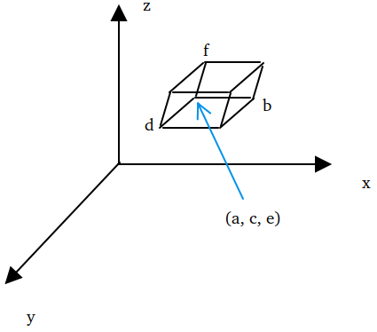
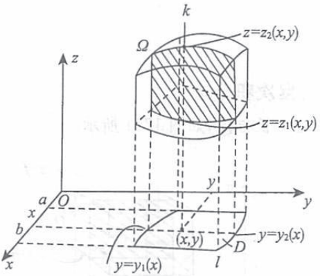
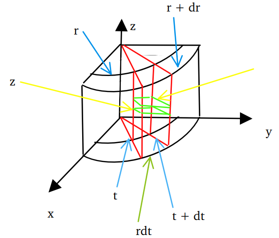
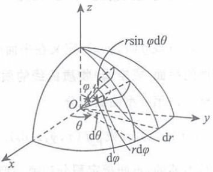
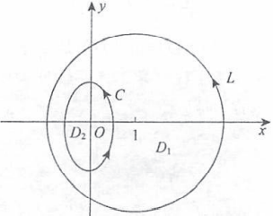
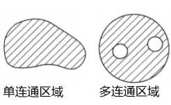
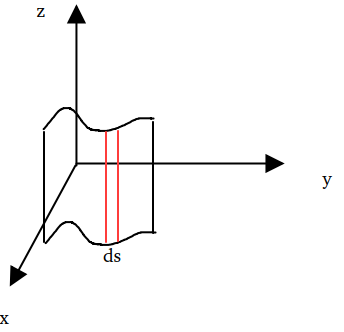

# 书籍链接
* [题目分册,55, 到了,57](file:///media/easul/D4B4E1AFB4E19470/Software/%E5%AD%A6%E4%B9%A0/%E8%80%83%E7%A0%94/%E8%B5%84%E6%96%99/%E6%95%B0%E5%AD%A6/%E8%B5%84%E6%96%99/2020%E5%BC%A0%E5%AE%87%E9%A2%98%E6%BA%90%E6%B7%B1%E6%9E%901000%E9%A2%98-%E4%B9%A0%E9%A2%98%E5%88%86%E5%86%8C%EF%BC%88%E6%95%B0%E5%AD%A6%E4%B8%80%EF%BC%89.pdf)
* [解析分册,154, 到了,163](file:///media/easul/D4B4E1AFB4E19470/Software/%E5%AD%A6%E4%B9%A0/%E8%80%83%E7%A0%94/%E8%B5%84%E6%96%99/%E6%95%B0%E5%AD%A6/%E8%B5%84%E6%96%99/2020%E5%BC%A0%E5%AE%87%E9%A2%98%E6%BA%90%E6%B7%B1%E6%9E%901000%E9%A2%98-%E8%A7%A3%E6%9E%90%E5%88%86%E5%86%8C%EF%BC%88%E6%95%B0%E5%AD%A6%E4%B8%80%EF%BC%89.pdf)

# 基础知识
1. 三重积分基础概念
    1. 概念
    ```tex
    \displaystyle
    \footnotesize
    \iiint_{\Omega} f(x, y, z)dv  \\
    其积分是四维空间的物体, 物理背景可以看做以f(x, y, z)为点密度的空间物体的质量  \\
    研究方式还是\orange{分割,近似,求和,取极限}  \\
    ```
    2. 三重积分存在性
    ```tex
    \displaystyle
    \footnotesize
    也叫三元函数的可积性  \\
    (1) 设空间有界闭区域\Omega的边界是分片光滑曲面, 当f(x, y, z)在\Omega连续时, f(x, y, z)可积分, 三重积分存在  \\
    (2) 设空间有界闭区域\Omega的边界是分片光滑曲面, 当f(x, y, z)在\Omega上有界, 且在\Omega上除了有限个点,有限条光滑曲线和有限块光滑曲面外都是连续的,则它在\Omega上可积, 三重积分存在  \\
    ```
    3. 三重积分的精确定义  
      
    ```tex
    \displaystyle
    \footnotesize
    \iiint_{\Omega} f(x, y, z)dv = \lim\limits_{n \to \infty} \sum_{i = 1}^n \sum_{j = 1}^n \sum_{k = 1}^n
    f(a + \frac{b-a}{n}i, c + \frac{d-c}{n}j, e + \frac{f-e}{n}k)\frac{b-a}{n} * \frac{d-c}{n} * \frac{f-e}{n}  \\
    = \int_a^b\int_c^d\int_e^ f(x, y, z)dxdydz  \\
    这里的空间有界闭区域\Omega可以看作是长方体区域  \\
    区域x方向从a到b,分成了n份,每份长\frac{b-a}{n}, 区域y方向从c到d,分成了n份,每份长\frac{d-c}{n}, 区域z方向从e到f,分成了n份,每份长\frac{f-e}{n}  \\
    \frac{b-a}{n} * \frac{d-c}{n} * \frac{f-e}{n}看做是每一个密度点的体积v,f(a + \frac{b-a}{n}i, c + \frac{d-c}{n}j, e + \frac{f-e}{n}k)看作是不同点的密度,相乘得到每个点的质量  \\
    然后把所有密度点的质量相加得到整个物体的质量, n取极限的时候,质量无限接近物体真实质量  \\
    将三重积分拆乘dxdydz的时候a + \frac{b-a}{n}i, c + \frac{d-c}{n}j, e + \frac{f-e}{n}k看做是x, y, z, \frac{b-a}{n}, \frac{d-c}{n}, \frac{f-e}{n}看成dx, dy, dz  \\
    如\lim\limits_{n \to \infty}\sum_{i = 1}^n \sum_{j = 1}^n \sum_{k = 1}^n \frac{k}{(n + i)(n^2 + j^2)n} = 
    \lim\limits_{n \to \infty}\sum_{i = 1}^n \sum_{j = 1}^n \sum_{k = 1}^n \frac{1}{(1 + \frac{i}{n})(1 + (\frac{j}{n})^2)}\frac{k}{n}*\frac{1}{n}*\frac{1}{n}*\frac{1}{n}  \\
    = \int_0^1\int_0^1\int_0^1\frac{z}{(1 + x)(1 + y^2)}dxdydz \\
    这里无需像二重积分一样交换积分次序, 因为交换积分次序是两个字母混到一起不好算,这里字母都分开了,  \\
    所以可以分开算.积分自己的字母, 别的字母看成是常数  \\
    = \int_0^1\frac{1}{1 + x}dx\int_0^1\frac{1}{(1 + y^2)}dy\int_0^1zdz = \frac{\pi}{8}ln2  \\
    ```
    4. 三重积分的性质
    ```tex
    \displaystyle
    \footnotesize
    设\Omega为空间有界闭区域  \\
    (1) 求空间区域的体积: \iiint_{\Omega} 1dv = \iiint_{\Omega}dv = V  \\
    (2) 可积必有界: 若f(x, y, z)在\Omega可积, 则f(x, y, z)在\Omega必有界  \\
    (3) 积分的线性性质: 设k_1, k_2为常数, \iiint_{\Omega} [k_1f(x, y, z) \pm k_2g(x, y, z)]dv = k_1\iiint_{\Omega} f(x, y, z) dv \pm k_2\iiint_{\Omega} g(x, y, z) dv  \\
    (4) 积分可加性: 若f(x, y, z)在\Omega可积, \Omega_1 \cup \Omega_2 = \Omega, \Omega_1 \cap \Omega_2 = \empty, 则
    \iiint_{\Omega_1 + \Omega_2} f(x, y, z)dv = \iiint_{\Omega_1} f(x, y, z)dv + \iiint_{\Omega_2} f(x, y, z)dv  \\
    (5) 积分保号性: 若f(x, y, z), g(x, y, z)在\Omega可积, 且在\Omega上f(x, y, z) \leqslant g(x, y, z), 则
    \iiint_{\Omega} f(x, y, z)dv \leqslant \iiint_{\Omega} g(x, y, z)dv  \\
    这里也有亡羊补牢\leqslant未雨绸缪: |\iiint_{\Omega} f(x, y, z)dv| \leqslant \iiint_{\Omega} |f(x, y, z)|dv  \\
    (6) 三重积分的估值定理: 设M, m是f(x, y, z)在\Omega上的最大值和最小值(可看成密度的最大最小值), V是\Omega体积, mV \leqslant \iiint_{\Omega} f(x, y, z)dv \leqslant MV  \\
    (7) 三重积分的中值定理: 设f(x, y, z)在\Omega连续, V为\Omega体积, 则在\Omega上至少有一点(a, b, c)使 \iiint_{\Omega} f(x, y, z)dv = f(a, b, c)V  = f(a, b, c)\iiint_{\Omega}dv  \\
    ```
    5. 普通对称性与轮换对称性
    ```tex
    \displaystyle
    \footnotesize
    (1)普通对称性: 关于某个面对称,则看另一个字母的正负是否导致函数变成奇偶函数  \\
    若\Omega关于yOz面对称, 则\iiint_{\Omega} f(x, y, z)dv
    \begin{cases}
    0, f(-x, y, z) = -f(x, y, z)  \\
    2\iiint_{\Omega_1} f(x, y, z)dv, f(-x, y, z) = f(x, y, z)  \\
    \end{cases}  \\
    (2)轮换对称性: 任意换两个字母,积分区域不变  \\
    若把x, y对调后, \Omega不变, \iiint_{\Omega} f(x, y, z)dv = \iiint_{\Omega} f(y, x, z)dv
    ```
    6. 三重积分的计算  
      
    ```tex
    \displaystyle
    \footnotesize
    (1) 直角坐标系的三重累次积分  \\
    若空间有界闭区域\Omega为长方体, x, y, z各有各的范围,则  \\
    \iiint_{\Omega} f(x, y, z) = \int_a^b dx \int_c^d dy \int_e^f f(x, y, z)dz  \\ 
    ```
      
    ```tex
    \displaystyle
    \footnotesize
    若空间有界闭区域\Omega为特殊柱体, x有确定范围, y是关于x的函数, z是关于x, y的函数,则柱体体积为  \\
    \iiint_{\Omega} dv = \int_a^b dx \int_{y_1(x)}^{y_2(x)} dy \int_{z_1{x, y}}^{z_2(x, y)} dz  \\
    \int_a^b dx \int_{y_1(x)}^{y_2(x)} dy = \iint_{D_{x, y}} d\sigma, 
    \int_{z_1{x, y}}^{z_2(x, y)} dz = z_2{x, y} - z_1(x, y), 则  \\
    \iiint_{\Omega} f(x, y, z) dv = \iint_{D_{x, y}} [z_2{x, y} - z_1(x, y)] d\sigma \to (三重积分化二重积分)  \\
    [z_2(x, y) - z_1(x, y)]d\sigma可以看做一条竖线的体积, 则上式积分就是整体柱体的体积  \\
    柱体质量则是\iiint_{\Omega} f(x, y, z) dv = \int_a^b dx \int_{y_1(x)}^{y_2(x)} dy \int_{z_1{x, y}}^{z_2(x, y)} f(x, y, z) dz  \\
    可以对z先积分, x, y看成是二重积分, 二重积分若用极坐标算更方便,可用x = rcos\theta, y = rsin\theta  \\
    \iiint_{\Omega} f(x, y, z) dv = \iint_{D_{x,y}} [\int_{z_1{x, y}}^{z_2(x, y)} f(x, y, z) dz] d\sigma = 
    \iint_{D_{x,y}} g(x, y) d\sigma = \iint_{D_{x,y}} g(rcos\theta, rsin\theta) d\sigma  \\
    ```  
      
    ```tex
    \displaystyle
    \footnotesize
    (2) 柱面坐标系三重积分的计算  \\
    可看做xOy面的极坐标和竖坐标z的合成,x = rcos\theta, y = rsin\theta  \\
    r是垂直x0y面的半径为r的柱面,范围[0, +\infty), \theta是过z轴且垂直与xOy面与x轴夹角为\theta的半面,范围在[0, 2\pi]  \\
    其中一个微元体可以近似看做长方体dv = rd\theta drdz  \\
    故积分公式可以写作\iiint_{\Omega} f(x, y, z)dxdydz = \iiint_{\Omega} f(rcos\theta, rsin\theta, z)rdrd\theta dz  \\
    ```
      
    ```tex
    \displaystyle
    \footnotesize
    (3) 球面坐标系三重积分的计算  \\
    r是从圆心出发的空间射线,可以看做球面 范围[0, +\infty),   \\
    \varphi是z轴为中心轴, 顶点为原点,与z轴夹角为\varphi的圆锥面,范围[0, \pi],   \\
    \theta是过z轴垂直于xOy面与x轴夹角为\theta的半面, 范围[0, 2\pi]  \\
    \begin{cases}
    x = rsin\varphi cos\theta  \\
    y = rsin\varphi sin\theta  \\
    z = rcos\varphi  \\
    \end{cases}  \\
    其中的微元体可以看做小长方形. r方向取dr,d\varphi造成夹角的长度为rd\varphi, \theta造成夹角的长度为rsin\varphi d\theta  \\
    故dv = r^2sin\varphi drd\varphi d\theta  \\
    三重积分公式写成\iiint_{\Omega} f(x, y, z)dxdydz = \iiint_{\Omega} f(rsin\varphi cos\theta, rsin\varphi sin\theta, rcos\varphi) r^2sin\varphi dr d\varphi d\theta  \\
    注意: 被积函数为f(x^2 + y^2 + z^2), f(x^2 + y^2)或积分区域为球,锥则用球面坐标法  \\
    定限时,从原点画射线, 先交的是r_1(\varphi, \theta), r_2(\varphi, \theta), 从z正轴,先交的是\varphi_1(\theta), 后交的是\varphi_2(\theta)  \\
    最后看\theta角的范围  \\
    则\iiint_{\Omega} f(x, y, z)dxdydz = \iiint_{\Omega} f(rsin\varphi cos\theta, rsin\varphi sin\theta, rcos\varphi) r^2sin\varphi drd\varphi d\theta   \\
    = \int_{\theta_1}^{\theta_2} \int_{\varphi_1(\theta)}^{\varphi_2(\theta)} \int_{r_1(\varphi, \theta)}^{r_2(\varphi, \theta)}
    f(rsin\varphi cos\theta, rsin\varphi sin\theta, rcos\varphi) r^2sin\varphi drd\varphi d\theta  \\
    ```
    7. 常用技巧
    ```tex
    \displaystyle
    \footnotesize
    普通对称性和轮换对称性  \\
    形心公式的逆用: \bar{x} = \frac{\iiint_{\Omega}xdv}{\iiint_{\Omega}dv}  \\
    \iiint_{\Omega}xdv = \bar{x}\iiint_{\Omega}dv = \bar{x} * V  \\
    ```
2. 第一型曲线积分
    1. 概念
    ```tex
    \displaystyle
    \footnotesize
    第一型曲线积分的被积函数f(x, y)(或f(x, y, z))定义在平面曲线L(或空间曲线\Gamma)上,  \\
    物理背景是以f(x, y)(或f(x, y, z))为线密度的平面(或空间)曲线的质量  \\
    还是可以用分割, 近似, 求和, 取极限写出第一型曲线积分  \\
    可以写成\int_{L} f(x, y)ds(或\int_{\Gamma} f(x, y, z)ds)  \\
    定积分是定义在直线段上, 第一型曲线积分是定义在曲线段上  \\
    ```
    2. 第一型曲线积分的存在性
    ```tex
    \displaystyle
    \footnotesize
    (1) 若空间曲线\Gamma是分段光滑曲线, f(x, y, z)在\Gamma上连续, 则f(x, y, z)在\Gamma上的第一型曲线积分存在  \\
    (2) 若空间曲线\Gamma是分段光滑曲线, 当f(x, y, z)在\Gamma有界, 且除了\Gamma上有限个点外都连续, 则f(x, y, z)在\Gamma的第一型曲线积分存在  \\
    ```
    3. 第一型曲线积分性质
    ```tex
    \displaystyle
    \footnotesize
    以下\Gamma都是有限长分段光滑曲线  \\
    (1) 空间曲线的长度为: \int_{\Gamma}1ds = l_{\Gamma}  \\
    (2) 可积函数必有界: f(x, y, z)在\Gamma上可积, 则f(x, y, z)在\Gamma上必有界  \\
    (3) 积分的线性性质: 设k_1, k_2为常数, 则\int_{\Gamma}[k_1f(x, y, z) \pm k_2g(x, y, z)]ds = 
    k_1\int_{\Gamma} f(x, y, z)ds \pm k_2\int_{\Gamma} g(x, y, z)ds  \\
    (4) 积分可加性: 若f(x, y, z)在\Gamma可积, 且\Gamma_1\cup\Gamma_2 = \Gamma, \Gamma_1 \cap \Gamma_2 = \empty, 
    \int_{\Gamma} f(x, y, z)ds = \int_{\Gamma_1} f(x, y, z)ds + \int_{\Gamma_2} f(x, y, z)ds  \\
    (5) 积分保号性: 若f(x, y, z), g(x, y, z)在\Gamma可积, 且在\Gamma上f(x, y, z) \leqslant g(x, y, z),则
    \int_{\Gamma} f(x, y, z)ds \leqslant \int_{\Gamma} g(x, y, z)ds  \\
    第一型曲线积分同样有亡羊补牢 \leqslant 未雨绸缪, |\int_{\Gamma} f(x, y, z)ds| \leqslant \int_{\Gamma} |f(x, y, z)|ds  \\
    (6) 积分估值定理: 设M,m为f(x, y, z)在\Gamma的最大值和最小值, l_{\Gamma}为\Gamma的长度,则
    ml_{\Gamma} \leqslant \int_{\Gamma} f(x, y, z)ds \leqslant Ml_{\Gamma}  \\
    (7) 积分中值定理: 设f(x, y, z)在\Gamma连续, l_{\Gamma}为\Gamma的长度, 则在\Gamma至少存在一点(a, b, c)使
    \int_{\Gamma} f(x, y, z)ds = f(a, b, c)l_r = f(a, b, c)\int_{\Gamma} ds  \\
    ```
    4. 普通对称性与轮换对称性
    ```tex
    \displaystyle
    \footnotesize
    (1) 普通对称性  \\
    若\Gamma关于yOz面对称, 则  \\
    \int_{\Gamma} f(x, y, z)ds = 
    \begin{cases}
    0, f(-x, y, z) = -f(x, y, z)  \\
    2\int_{\Gamma_1} f(x, y, z)ds, f(-x, y, z) = f(x, y, z)  \\
    \end{cases}  \\
    (2) 轮换对称性: 随便换两个字母,积分区域不变  \\
    若x与y对调后\Gamma不变, 则\int_{\Gamma} f(x, y, z)ds = \int_{\Gamma} f(y, x, z)ds
    ```
    5. 第一型曲线积分的计算
    ```tex
    \displaystyle
    \footnotesize
    将曲线积分化为定积分来计算,适用于参数方程  \\
    一般式也可以化为参数方程  \\
    (1) 对于空间情况  \\
    若空间曲线为
    \begin{cases}
    x = x(t)  \\
    y = y(t)  \\
    z = z(t)  \\
    \end{cases}, (a \leqslant t \leqslant b) 则  \\
    dx = x'(t)dt, dy = y'(t)dt, dz = z'(t)dt  \\
    ds = \sqrt{(dx)^2 + (dy)^2 + (dz)^2} = \sqrt{[x'(t)]^2 + [y'(t)]^2 + [z'(t)]^2}dt  \\
    \int_{\Gamma} f(x, y, z) = \int_a^b f[x(t), y(t), z(t)]\sqrt{[x'(t)]^2 + [y'(t)]^2 + [z'(t)]^2}dt  \\
    (2) 对于平面情况  \\
    若平面曲线L由y = y(x)(a \leqslant x \leqslant b)给出, y(x) = y'(x)dx, 则  \\
    ds = \sqrt{(dx)^2 + [y(x)]^2} = \sqrt{1 + [y'(x)]^2}dx  \\
    \int_{L}f(x, y)ds = \int_a^b f[x, y(x)] \sqrt{1 + [y'(x)]^2}dx  \\
    若平面曲线L由参数式
    \begin{cases}
    x = x(t)  \\
    y = y(t)  \\
    \end{cases}, (a \leqslant t \leqslant b)给出, dx = x'(t)dt, dy = y'(t)dt, 则  \\
    ds = \sqrt{(dx)^2 + (dy)^2} = \sqrt{[x'(t)]^2 + [y'(t)]^2}dt  \\
    \int_{L}f(x, y)ds = \int_a^b f[x(t), y(t)] \sqrt{[x'(t)]^2 + [y'(t)]^2}dt  \\
    若平面曲线L由极坐标r = r(\theta) (a \leqslant \theta \leqslant b)给出, 则  \\
    x = rcos\theta ,y = rsin\theta,  \\
    dx = (r'cos\theta - rsin\theta)d\theta, dy = (r'sin\theta + rcos\theta)d\theta,  \\
    ds = \sqrt{(dx)^2 + (dy)^2} = \sqrt{[r'(\theta)]^2 + [r(\theta)]^2}d\theta  \\
    \int_{L} f(x, y) ds = \int_a^b f[r(\theta)cos\theta, r(\theta)sin\theta]  \sqrt{[r'(\theta)]^2 + [r(\theta)]^2}d\theta  \\
    ```
    6. 常用技巧
    ```tex
    \displaystyle
    \footnotesize
    (1) 将边界方程带入被积函数,简化计算(被积函数就定义在边界方程, 所以可以带入边界方程)  \\
    (2) 注意使用普通对称性与轮换对称性  \\
    (3) 形心公式逆用, \bar{x} = \frac{\int_{\Gamma}xds}{\int_{\Gamma}ds}  \\
    \int_{\Gamma}xds = \bar{x}\int_{\Gamma}ds = \bar{x} * l_{\Gamma}  \\
    ```
3. 第一型曲面积分
    1. 概念
    ```tex
    \displaystyle
    \footnotesize
    第一型曲面积分的被积函数f(x, y, z)定义在空间曲面\varSigma上  \\
    物理背景是以f(x, y, z)为面密度的空间曲面的质量, 此处也可以用分割,近似,求和,取极限来找到第一型曲面积分  \\
    \iint_{\varSigma} f(x, y, z)dS  \\
    二重积分定义在二维平面上,第一型曲面积分定义在空间曲面上  \\
    ```
    2. 第一型曲面积分存在性
    ```tex
    \displaystyle
    \footnotesize
    (1) 设空间曲面\varSigma是分段光滑曲面, f(x, y, z)在\varSigma连续时, f(x, y, z)在\varSigma的第一型曲面积分存在  \\
    (2) 设空间曲面\varSigma是分段光滑曲面, f(x, y, z)在\varSigma有界, f(x, y, z)在\varSigma除了有限个点和有限条光滑曲线外都是连续的, 则其在\varSigma上的第一型曲面积分存在  \\
    ```
    3. 第一型曲面积分的性质
    ```tex
    \displaystyle
    \footnotesize
    设\varSigma是空间有限分片光滑曲面  \\
    (1) 空间曲面的面积: \iint_{\varSigma}1dS = \iint_{\varSigma}dS  \\
    (2) 可积函数必有界: 若f(x, y, z)在\varSigma可积, 在f(x, y, z)在\varSigma有界  \\
    (3) 积分的线性性质: 设k_1, k_2为常数, \iint_{\varSigma}[k_1f(x, y, z) \pm k_2g(x, y, z)]dS = 
    k_1\iint_{\varSigma}f(x, y, z)dS \pm k_2\iint_{\varSigma}g(x, y, z)dS  \\
    (4) 积分可加性: 若f(x, y, z)在\varSigma可积, \varSigma_1 \cup \varSigma_2 = \varSigma, \varSigma_1 \cap \varSigma_2 = \empty, 则  \\
    \iint_{\varSigma} f(x, y, z)dS = \iint_{\varSigma_1} f(x, y, z)dS + \iint_{\varSigma_2} f(x, y, z)dS  \\
    (5) 积分保号性: 若f(x, y, z), g(x, y, z)在\varSigma可积, 且在\varSigma上f(x, y, z) \leqslant g(x, y, z)  \\
    \iint_{\varSigma} f(x, y, z)dS \leqslant \iint_{\varSigma} g(x, y, z)dS  \\
    第一型曲面积分也满足亡羊补牢\leqslant未雨绸缪:|\iint_{\varSigma} f(x, y, z)dS| \leqslant \iint_{\varSigma} |f(x, y, z)|dS  \\
    (6) 积分估值定理: 设M,m为f(x, y, z)在\varSigma的最大值与最小值,S为\varSigma面积,则
    mS \leqslant \iint_{\varSigma} f(x, y, z)dS \leqslant MS  \\
    (7) 积分中值定理: 设f(x, y, z)在\varSigma连续,S为\varSigma面积,则在\varSigma上至少有一点(a, b, c), 使
    \iint_{\varSigma} f(x, y, z)dS = f(a, b, c)S = f(a, b, c)\iint_{\varSigma} dS  \\
    ```
    4. 普通对称性与轮换对称性
    ```tex
    \displaystyle
    \footnotesize
    (1) 普通对称性  \\
    若\varSigma关于yOz面对称, 则\int_{\varSigma} f(x, y, z)dS = 
    \begin{cases}
    0, f(-x, y, z) = -f(x, y, z)  \\
    2\int_{\varSigma_1} f(x, y, z)dS, f(-x, y, z) = f(x, y, z)  \\
    \end{cases}  \\
    (2) 轮换对称性:任意两个字母调换,\varSigma不变  \\
    x, y对调后, \varSigma不变, 则\int_{\varSigma} f(x, y, z)dS = \int_{\varSigma} f(y, x, z)dS
    ```
    5. 第一型曲面积分的计算
    ```tex
    \displaystyle
    \footnotesize
    将第一型曲面积分化为二重积分  \\
    (1) 将\varSigma投影到某一平面(如xOy面), 投影区域为D  \\
    (2) 将z = z(x, y)或F(x, y, z) = 0带入f(x, y, z),  \\
    (3) 计算z'_x, z'_y,得到dS = \sqrt{1 + (z'_x)^2 + (z'_y)^2}dxdy  \\
    故\iint_{\varSigma}f(x, y, z)dS = \iint_{D_{xy}}f(x, y, z(x, y)) \sqrt{1 + (z'_x)^2 + (z'_y)^2}dxdy  \\
    注意: 选投影面时\varSigma任意两点的投影点不能重合, 否则会算错, 这时可以投影到其他面, 也可以将\varSigma分为多个曲面积分区域再投影  \\
    这里计算dS可以认为一个曲面投到xOy平面上有一个平面面积，而将曲面微分后，可以理解为每一小部分的曲面是直的(矩形)，  \\
    那么该小部分的曲面面积S乘以其与xOy平面的夹角cos\theta等于对应小部分投影面积D_{xy}  \\
    曲面上该小部分直曲面取正方向后的一个法向量就是（z'_x,z'_y,1),作图发现法向量与z轴夹角cos\theta等于曲面与投影夹角cos\theta,故  \\
    cos\theta = \frac{1}{\sqrt{1 + (z'_x)^2 + (z'_y)^2}}, dS = \frac{dxdy}{cos\theta} = \sqrt{1 + (z'_x)^2 + (z'_y)^2}dxdy  \\
    ```
    6. 常用技巧
    ```tex
    \displaystyle
    \footnotesize
    (1) 将边界方程带入被积函数,从而化简被积函数(被积函数就定义在边界方程上)  \\
    (2) 使用普通对称性和轮换对称性  \\
    (3) 形心公式的逆用: \bar{x} = \frac{\iint_{\varSigma}xdS}{\iint_{\varSigma} dS}  \\
    \iint_{\varSigma}xdS = \bar{x} * \iint_{\varSigma}dS = \bar{x} * S  \\
    ```
    7. 重积分与第一型线面积分应用
    ```tex
    \displaystyle
    \footnotesize
    (1) 几何量  \\
    (一)对于平面区域  \\
    若D由y = f(x), x = a, x = b, x轴围成, 面积A = \int_a^b |f(x)|dx  \\
    面积A也可以理解为二重积分\iint_{D}d\sigma  \\
    (二)对于空间区域  \\
    若以区域D为底, 曲面z = z(x, y)为顶, 曲顶柱体的体积V = \iint_{D} |z(x, y)| d\sigma  \\
    若\Omega所占的是空间区域, 其体积V = \iiint_{\Omega}dv  \\
    (三)对于空间光滑曲线\Gamma, 若由参数式
    \begin{cases}
    x = x(t)  \\
    y = y(t)  \\
    z = z(t)  \\
    \end{cases}, (a \leqslant t \leqslant b)给出, 则空间曲线长度(弧长)为 \\
    L = \int_a^b \sqrt{[x'(t)]^2 + [y'(t)]^2 + [z'(t)]^2}dt  \\
    (四) 对于光滑曲面薄片\varSigma, 若\varSigma由单值函数z = z(x, y)给出, D_{xy}为\varSigma在xOy面上的投影区域, 则其面积为为  \\
    A = \iint_{D_{xy}}\sqrt{1 + (z'_x)^2 + (z'_y)^2}dxdy  \\
    x = x(y, z)是单值函数, 在yOz投影下得到A = \iint_{D_{yz}}\sqrt{1 + (x'_y)^2 + (x'_z)^2}dydz  \\
    y = y(x, z)是单值函数, 在xOz投影下得到A = \iint_{D_{xz}}\sqrt{1 + (y'_x)^2 + (y'_z)^2}dxdz  \\
    曲面面积就是第一型曲面积分被积函数是1时用投影法得出的积分  \\
    (2) 重心(质心)与形心  \\
    设\rho(x, y), \rho(x, y, z)在定义区域连续  \\
    (一) 平面薄片, 面密度\rho(x, y), D是平面薄片所在平面区域, 重心(\bar{x}, \bar{y})公式为  \\
    \bar{x} = \frac{\iint_{D}x\rho(x, y)d\sigma}{\iint_{D}\rho(x, y)d\sigma}, 
    \bar{y} = \frac{\iint_{D}y\rho(x, y)d\sigma}{\iint_{D}\rho(x, y)d\sigma}  \\
    (二) 空间物体, 体密度为\rho(x, y, z), \Omega是物体所占空间区域, 重心(\bar{x}, \bar{y}, \bar{z})公式为  \\
    \bar{x} = \frac{\iiint_{\Omega}x\rho(x, y, z)dv}{\iiint_{\Omega}\rho(x, y, z)dv}, 
    \bar{y} = \frac{\iiint_{\Omega}y\rho(x, y, z)dv}{\iiint_{\Omega}\rho(x, y, z)dv}, 
    \bar{z} = \frac{\iiint_{\Omega}z\rho(x, y, z)dv}{\iiint_{\Omega}\rho(x, y, z)dv}  \\
    (三) 光滑曲线L, 线密度为\rho(x, y, z), 重心(\bar{x}, \bar{y}, \bar{z})公式为  \\
    \bar{x} = \frac{\int_{L}x\rho(x, y, z)ds}{\int_{L}\rho(x, y, z)ds}, 
    \bar{y} = \frac{\int_{L}y\rho(x, y, z)ds}{\int_{L}\rho(x, y, z)ds}, 
    \bar{z} = \frac{\int_{L}z\rho(x, y, z)ds}{\int_{L}\rho(x, y, z)ds}  \\
    (四) 光滑曲面薄片\varSigma, 面密度为\rho(x, y, z), 重心(\bar{x}, \bar{y}, \bar{z})公式为  \\
    \bar{x} = \frac{\iint_{\varSigma}x\rho(x, y, z)dS}{\iint_{\varSigma}\rho(x, y, z)dS}, 
    \bar{y} = \frac{\iint_{\varSigma}y\rho(x, y, z)dS}{\iint_{\varSigma}\rho(x, y, z)dS}, 
    \bar{z} = \frac{\iint_{\varSigma}z\rho(x, y, z)dS}{\iint_{\varSigma}\rho(x, y, z)dS}  \\
    考研里,重心就是质心, 密度为常数时,重心就成了形心  \\
    (3) 转动惯量  \\
    (一) 平面薄片, 面密度\rho(x, y), D是平面薄片所占平面区域, 则  \\
    薄片对x轴转动惯量为I_x = \iint_{D}y^2\rho(x, y)d\sigma  \\
    薄片对y轴转动惯量为I_y = \iint_{D}x^2\rho(x, y)d\sigma  \\
    薄片对原点O转动惯量为I_o = \iint_{D}(x^2 + y^2)\rho(x, y)d\sigma  \\
    (二) 空间物体, 体密度为\rho(x, y, z), \Omega为物体所占空间区域, 则  \\
    物体对x轴转动惯量为I_x = \iiint_{\Omega}(y^2 + z^2)\rho(x, y, z)dv  \\
    物体对y轴转动惯量为I_y = \iiint_{\Omega}(x^2 + z^2)\rho(x, y, z)dv  \\
    物体对z轴转动惯量为I_z = \iiint_{\Omega}(x^2 + y^2)\rho(x, y, z)dv  \\
    物体对原点O转动惯量为I_o = \iiint_{\Omega}(x^2 + y^2 + z^2)\rho(x, y, z)dv  \\
    (三) 光滑曲线L, 线密度为\rho(x, y, z), 则  \\
    曲线对x轴转动惯量I_x = \int_{L}(y^2 + z^2)\rho(x, y, z)ds  \\
    曲线对y轴转动惯量I_y = \int_{L}(x^2 + z^2)\rho(x, y, z)ds  \\
    曲线对z轴转动惯量I_z = \int_{L}(x^2 + y^2)\rho(x, y, z)ds  \\
    曲线对原点O转动惯量I_o = \int_{L}(x^2 + y^2 + z^2)\rho(x, y, z)ds  \\
    (四) 光滑曲面\varSigma, 面密度为\rho(x, y, z), 则  \\
    曲面对x轴转动惯量I_x = \iint_{\varSigma}(y^2 + z^2)\rho(x, y, z)dS  \\
    曲面对y轴转动惯量I_y = \iint_{\varSigma}(x^2 + z^2)\rho(x, y, z)dS  \\
    曲面对z轴转动惯量I_z = \iint_{\varSigma}(x^2 + y^2)\rho(x, y, z)dS  \\
    曲面对原点O转动惯量I_o = \iint_{\varSigma}(x^2 + y^2 + z^2)\rho(x, y, z)dS  \\
    (4) 引力, G为引力常量  \\
    (一) 平面薄片, 面密度\rho(x, y), D是平面薄片所占平面区域, 则薄片对M_0(x_0, y_0, z_0)的质量m的质点引力(F_x, F_y, F_z)为  \\
    F_x = Gm\iint_{D}\frac{\rho(x, y)(x - x_0)}{[(x - x_0)^2 + (y - y_0)^2 + (z - z_0)^2]^{\frac32}}d\sigma  \\
    F_y = Gm\iint_{D}\frac{\rho(x, y)(y - y_0)}{[(x - x_0)^2 + (y - y_0)^2 + (z - z_0)^2]^{\frac32}}d\sigma  \\
    F_z = Gm\iint_{D}\frac{\rho(x, y)(z - z_0)}{[(x - x_0)^2 + (y - y_0)^2 + (z - z_0)^2]^{\frac32}}d\sigma  \\
    (二) 空间物体, 体密度\rho(x, y, z), \Omega是物体所占空间区域, 则物体对M_0(x_0, y_0, z_0)的质量m的质点引力(F_x, F_y, F_z)为  \\
    F_x = Gm\iiint_{\Omega}\frac{\rho(x, y, z)(x - x_0)}{[(x - x_0)^2 + (y - y_0)^2 + (z - z_0)^2]^{\frac32}}dv  \\
    F_y = Gm\iiint_{\Omega}\frac{\rho(x, y, z)(y - y_0)}{[(x - x_0)^2 + (y - y_0)^2 + (z - z_0)^2]^{\frac32}}dv  \\
    F_z = Gm\iiint_{\Omega}\frac{\rho(x, y, z)(z - z_0)}{[(x - x_0)^2 + (y - y_0)^2 + (z - z_0)^2]^{\frac32}}dv  \\
    (三) 光滑曲线L, 线密度\rho(x, y, z), 则线对M_0(x_0, y_0, z_0)的质量m的质点引力(F_x, F_y, F_z)为  \\
    F_x = Gm\int_{L}\frac{\rho(x, y, z)(x - x_0)}{[(x - x_0)^2 + (y - y_0)^2 + (z - z_0)^2]^{\frac32}}ds  \\
    F_y = Gm\int_{L}\frac{\rho(x, y, z)(y - y_0)}{[(x - x_0)^2 + (y - y_0)^2 + (z - z_0)^2]^{\frac32}}ds  \\
    F_z = Gm\int_{L}\frac{\rho(x, y, z)(z - z_0)}{[(x - x_0)^2 + (y - y_0)^2 + (z - z_0)^2]^{\frac32}}ds  \\
    (四) 光滑曲面\varSigma, 面密度\rho(x, y, z), 则曲面对M_0(x_0, y_0, z_0)的质量m的质点引力(F_x, F_y, F_z)为  \\
    F_x = Gm\iint_{\varSigma}\frac{\rho(x, y, z)(x - x_0)}{[(x - x_0)^2 + (y - y_0)^2 + (z - z_0)^2]^{\frac32}}dS  \\
    F_y = Gm\iint_{\varSigma}\frac{\rho(x, y, z)(y - y_0)}{[(x - x_0)^2 + (y - y_0)^2 + (z - z_0)^2]^{\frac32}}dS  \\
    F_z = Gm\iint_{\varSigma}\frac{\rho(x, y, z)(z - z_0)}{[(x - x_0)^2 + (y - y_0)^2 + (z - z_0)^2]^{\frac32}}dS  \\
    ```
4. 第二型曲线积分
    1. 预备概念
    ```tex
    \displaystyle
    \footnotesize
    (1) 场的概念  \\
    对于\Omega上任意一点M(x, y, z)对应一个数量, 则在\Omega确定了一个数量场(不讲究方向)u = u(x, y, z), 如温度场  \\
    对于\Omega上任意一点M(x, y, z)对应一个向量, 则在\Omega确定了一个向量场(讲究方向)F(x, y, z) = P(x, y, z)i + Q(x, y, z)j + R(x, y, z)k(这里是向量), 如引力场  \\ 
    P(x, y, z)是x轴方向的力, Q(x, y, z)是y轴方向的力, R(x, y, z)是z轴方向的力  \\
    (2) 变力沿曲线做功  \\
    设质点沿有向曲线\Gamma在M(x, y, z)点移动的微位移为dr = dxi + dyj + dzk, 此时变力F(x, y, z)近似看做常力, 则次微位移的微功为  \\
    dW = F(x, y, z) \cdotp dr, 变力F(x, y, z)沿\Gamma从起点A到终点B做功则为  \\
    W = \int_{\Gamma}dw = \int_{\Gamma}F(x, y, z) \cdotp dr = \int_{\Gamma}(P(x, y, z), Q(x, y, z)j, R(x, y, z)) \cdotp (dx, dy dz)  \\
    = \int_{\Gamma} P(x, y, z)dx +  Q(x, y, z)dy + R(x, y, z)dz  \\
    dx是x轴方向走的距离, dy是y轴方向走的距离, dz是z轴方向走的距离  \\
    因为功计算的时候就是点乘, 所以这里也是点乘  \\
    ```
    2. 第二型曲线积分概念
    ```tex
    \displaystyle
    \footnotesize
    第二型曲线积分的被积函数F(x, y) = P(x, y)i + Q(x, y)j(或F(x, y, z) = P(x, y, z)i + Q(x, y, z)j + R(x, y, z)k)定义在平面曲线L(或空间曲线\Gamma上)  \\
    物理背景是变力F(x, y)(或F(x, y, z))在平面曲线L(或空间曲线\Gamma)从起点移动到终点做的总功  \\
    为\int_{\Gamma} F \cdotp dr = \int_{\Gamma} P(x, y)dx + Q(x, y)dy(或\int_{\Gamma} P(x, y, z)dx + Q(x, y, z)dy + R(x, y, z)dz)  \\

    ```
    3. 第二型曲线积分存在性
    ```tex
    \displaystyle
    \footnotesize
    若空间曲线\Gamma是光滑分段曲线, F(x, y, z)在\Gamma连续, 则F(x, y, z)第二型曲线积分存在  \\
    ```
    4. 第二型曲线积分性质
    ```tex
    \displaystyle
    \footnotesize
    若\Gamma为空间有限长分段光滑曲线  \\
    (1) 积分线性性质: 设k_1, k_2为常数, \int_{\Gamma}(k_1F_1 \pm k_2F_2) \cdotp dr = k_1\int_{\Gamma}F_1 \cdotp dr \pm k_2\int_{\Gamma}F_2 \cdotp dr  \\
    (2) 积分有向性 \int_{\overgroup{AB}} F \cdotp dr = - \int_{\overgroup{BA}} F \cdotp dr, A到B的功 = -B到A的功  \\
    \int_{L} F \cdotp dr = -\int_{L^-} F \cdotp dr  \\
    (3) 积分可加行 \overgroup{AB} \cup \overgroup{BC} = \overgroup{AC}, 
    \int_{\overgroup{AC}} F \cdotp dr = \int_{\overgroup{AB}} F \cdotp dr + \int_{\overgroup{BC}} F \cdotp dr  \\
    ```
    5. 对称性
    ```tex
    \displaystyle
    \footnotesize
    \int_{\Gamma} P(x, y, z)dx + Q(x, y, z)dy + R(x, y, z)dz  \\
    第二型曲线积分各项积分元素不同, 故整体没有轮换对称性.  \\
    但P, Q, R只有一个字母可以这样换: P(x) dydz = P(y) dzdx = P(z)dxdy  \\
    这里可看做三项在积分  \\
    物理背景为做功,有正负之分,故对称性不同  \\
    若\Gamma关于yOz面对称  \\
    \int_{\Gamma} P(x ,y, z)dx  = 
    \begin{cases}
    2\int_{\Gamma_1} P(x ,y, z)dx, P(-x, y, z) = -P(x, y, z)  \\
    0, P(-x, y, z) = P(x, y, z)  \\
    \end{cases}  \\
    这里可以理解为曲线\Gamma关于yOz面对称, \\
    若力是奇函数, 曲线投影方向和力投影方向总是相同, 所以是2倍  \\
    若力是偶函数, 曲线投影到x轴正向, 力是x轴正向, 曲线投影到x轴负向, 力还是正向, 两侧做功抵消, 故为0  \\
    ```
    6. 计算
    ```tex
    \displaystyle
    \footnotesize
    平面第二型曲线积分的计算(空间第二型曲线积分的计算在第二型曲面积分的计算里)  \\
    (1) 直接计算法  \\
    平面有向曲线L由参数方程
    \begin{cases}
    x = x(t)  \\
    y = y(t)  \\
    \end{cases}, (t: a -> b)给出, t = a是起点, t = b是终点  \\
    则平面第二型曲线积分化为定积分为  \\
    \int_{\Gamma} P(x, y)dx + Q(x, y)dy = \int_a^b {P[x(t), y(t)]x'(t) + Q[x(t), y(t)]y'(t)} dt  \\
    这里a, b谁大谁小都可以, 这里只表示方向  \\
    这里没有进行平方操作是因为用的向量的运算法则, 直接相加即可  \\
    dr是线微分向量,dr = (dx, dy)  \\
    (2) 格林公式法  \\
    设平面有界闭区域D由分段光滑闭曲线L围成, P(x, y), Q(x, y)在D有一阶连续偏导数, L取正向, 则  \\
    \oint_{L}P(x, y)dx + Q(x, y)dy = \iint_{D}(\frac{\partial Q}{\partial x} - \frac{\partial P}{\partial y})d\sigma  \\
    L取正向是指, 当人沿L前进,左手始终在L围成的D内, 即逆时针.这里做功因为不同的点力不同, 所以走一圈做的功不一定能抵消掉  \\
    若简单推导, \oint_{L}P(x, y)dx = \int_{y = f(x)}P(x, y)dx + \int_{y = g(x)}P(x, y)dx = 
    \int_a^b P(x, f(x))dx + \int_b^aP (x, g(x))dx = \int_a^b P(x, y)|^{f(x)}_{g(x)} dx  \\
    然后这里在使用牛莱公式  \\
    = \int_a^b \int^{f(x)}_{g(x)} P(x, y) dxdy = \iint P(x, y) d\sigma  \\
    注意:,  \\ 
    (一)L不是封闭曲线, 不能直接使用格林公式  \\
    这时可以补线, 围出有界闭区域D  \\
    如补充\bar{L}, 则\int_{L} F(x, y) \cdotp dr = \oint_{L + \bar{L}} F(x, y) \cdotp dr - \int_{\bar{L}} F(x, y) \cdotp dr  \\
    后边补充的线可以用直接法计算,转成定积分  \\
    (二)P(x, y), Q(x, y), \frac{\partial Q}{\partial x}, \frac{\partial P}{\partial y}不在D连续, 不能直接使用格林公式  \\
    这时可以挖去不连续的点(奇点)  \\ 
    在内部做一个曲线C, 方向为逆时针, \oint_{L} Pdx + Qdy = \oint_{L + C^-} Pdx + Qdy - \oint_{C^-} Pdx + Qdy  \\
    前边用C^-是因为顺时针走, 左手在D_1内,如下图  \\
    ```  
      
    ```tex
    \displaystyle
    \footnotesize
    (3) 平面曲线积分与路径无关  \\
    第一组  \\
    设D是平面有界闭区域, 若P(x, y), Q(x, y)在D连续, 则以下五个条件等价  \\
    (一)沿任意一条全在D内的分段光滑闭曲线L, 有\oint_{L} Pdx + Qdy = 0  \\
    (二)\int_{L_{AB}} Pdx + Qdy值与D内路径无关, 只和L_{AB}的起点A和终点B有关  \\
    (三)在D内存在可微的单值数量函数u(x, y), 使Pdx + Qdy是u(x, y)的全微分, 即du = Pdx + Qdy  \\
    (四)矢量函数V = P(x, y)i + Q(x, y)j为某单值数量函数u(x ,y)的梯度, 即\bold{grad} u = V = P(x, y)i + Q(x, y)j  \\
    (五)Pdx + Qdy = 0为全微分方程  \\
    第二组  \\
    设D是平面单连通区域, 若P(x, y), Q(x, y)在D连续且有一阶连续偏导数, 则以下六个条件等价  \\
    (一)\frac{\partial P}{\partial y} = \frac{\partial Q}{\partial x}在D内处处成立  \\
    (二)沿D中任意分段光滑闭曲线L, 有\oint_{L} Pdx + Qdy = 0  \\
    (三)\int_{L_{AB}}Pdx + Qdy在D内与路径无关, 只与L_{AB}的起点A和终点B有关  \\
    (四)在D内存在可微的单值数量函数u(x, y), 使Pdx + Qdy是u(x, y)的全微分, 即du = Pdx + Qdy  \\
    (五)矢量函数V = P(x, y)i + Q(x, y)j是某单值数量函数u(x, y)的梯度, 即\bold{grad} u = V = P(x, y)i + Q(x, y)j  \\
    (六)Pdx + Qdy = 0为全微分方程  \\
    第三组  \\
    设D是平面有界区域, 若P(x, y), Q(x, y)在D连续且具有一阶连续偏导数, 则  \\
    (一)\int_{L_{AB}}Pdx + Qdy在D内与路径无关, 只与L_{AB}的起点A和终点B有关  \\
    (二)\frac{\partial P}{\partial y} = \frac{\partial Q}{\partial x}在D内处处成立  \\
    一是二的充分不必要条件(一可以推二, 二不能推一)  \\
    (4)第二型曲线积分与第一型曲线积分的联系  \\
    若cosa, cosb是L切向量方向余弦, \int_{L}(Pcosa + Qcosb)ds = \int_{L}Pdx + Qdy  \\
    Pcosa是P乘方向向量的第一个量, Qcosb是P乘方向向量的第二个量  \\
    ```
5. 第二型曲面积分
    1. 第二型曲面积分概念  
    ```tex
    \displaystyle
    \footnotesize
    第二型曲面积分的被积函数F(x, y, z) = P(x, y, z)i + Q(x, y, z)j + R(x, y, z)k定义在曲面\varSigma上,  \\
    物理背景是向量函数F(x, y, z)通过有向曲面\varSigma的通量(就是通过的流量, 没有几何量)  \\
    \iint_{\varSigma} \bold{F} \cdotp d\bold{S} = \iint_{\varSigma} \bold{F} \cdotp n\degree dS =
    \iint_{\varSigma} P(x, y, z)dydz + Q(x, y, z)dzdx + R(x, y, z)dxdy  \\
    n\degree = (cos\alpha, cos\beta, cos\gamma), 是有向曲面\varSigma指定侧的单位法向量  \\
    d\bold{S} = (dydz, dzdx, dxdy) = (cos\alpha, cos\beta, cos\gamma)dS   \\
    dydz是投影向i方向, dzdx是投影向j方向,dxdy是投影向k方向  \\
    ```
    2. 第二型曲面积分存在性
    ```tex
    \displaystyle
    \footnotesize
    设\varSigma是有向分片光滑曲面, 若F(x, y, z)在\varSigma连续, 则F(x, y, z)在\varSigma的第二型曲面积分存在  \\
    ```
    3. 第二型曲面积分的性质
    ```tex
    \displaystyle
    \footnotesize
    设\varSigma是有向分片光滑曲面  \\
    (1)积分的线性性质: 设k_1, k_2, \iint_{\varSigma}(k_1F_1 \pm k_2F_2) \cdotp dS = 
    k_1\iint_{\varSigma}F_1 \cdotp dS \pm k_2\iint_{\varSigma}F_2 \cdotp dS  \\
    (2)积分的方向性: \iint_{\varSigma^-} F \cdotp d\bold{S} = -\iint_{\varSigma^+} F \cdotp n\degree dS (\varSigma^+和\varSigma^-是平面的不同侧) \\
    (3)积分可加性\varSigma_1 \cup \varSigma_2 = \varSigma, \varSigma_1 \cap \varSigma_2 = \empty时,
    \iint_{\varSigma_1 + \varSigma_2} F \cdotp dS = \iint_{\varSigma_1} F \cdotp dS + \iint_{\varSigma_2} F \cdotp dS  \\
    ```
    4. 对称性
    ```tex
    \displaystyle
    \footnotesize
    \iint_{\varSigma} P(x, y, z)dydz + Q(x, y, z)dzdx + R(x, y, z)dxdy  \\
    整体没有轮换对称性,   \\
    但P, Q, R只有一个字母可以这样换: P(x) dydz = P(y) dzdx = P(z)dxdy  \\
    当单独计算某一部分,如\iint_{\varSigma} P(x, y, z)dydz可以讨论普通对称性  \\
    若\varSigma关于yOz面对称  \\
    \iint_{\varSigma} P(x, y, z)dydz = 
    \begin{cases}
    2\iint_{\varSigma} P(x, y, z)dydz, P(-x, y, z) = -P(x, y, z)  \\
    0, P(-x, y, z) = P(x, y, z)  \\
    \end{cases}  \\
    这里因为\varSigma有正负面, 所以这里\varSigma关于yOz对称时,dydz为曲面投影到x轴方向的面  \\
    若磁场的函数是奇函数, 磁场的方向和面投影方向总是相同, 故为2倍  \\ 
    若磁场的函数是偶函数, x轴正方向,面投影与磁场方向相同, 则x轴负方向,面投影和磁场方向相反, 故为0  \\  
    ```
    5. 计算
    ```tex
    \displaystyle
    \footnotesize
    (1) 直接计算法  \\
    第二型曲面积分的计算可以看成三个部分分别计算再相加  \\
    \iint_{\varSigma} P(x, y, z)dydz + Q(x, y, z)dzdx + R(x, y, z)dxdy = \iint_{\varSigma} P(x, y, z)dydz +
    \iint_{\varSigma} Q(x, y, z)dzdx + \iint_{\varSigma} R(x, y, z)dxdy  \\
    如算\iint_{\varSigma} R(x, y, z)dxdy, \\
    (一)将\varSigma投影到xOy平面, 投影区域为D_{xy}  \\
    (二)将z = z(x, y)或F(x, y, z) = 0带入R(x, y, z)  \\
    (三)dxdy此时是\pm dxdy, \varSigma方向取上侧, 是dxdy, \varSigma方向取下侧, 是-dxdy  \\
    则\iint_{\varSigma} R(x, y, z)dxdy = \iint_{D_{xy}} R(x, y, z(x, y))dxdy或-\iint_{D_{xy}} R(x, y, z(x, y))dxdy  \\
    注意: 投影时,\varSigma任意两点的投影点不能重合  \\
    (2) 高斯公式  \\
    设空间有界闭区域\Omega由有向分片光滑闭曲面\varSigma围成, P(x, y, z), Q(x, y, z), R(x, y, z)在\Omega上有一阶连续偏导数  \\
    则\oiint_{\varSigma} Pdydz + Qdzdx + Rdxdy = \iiint_{\Omega} (\frac{\partial P}{\partial x} + \frac{\partial Q}{\partial y} + \frac{\partial R}{\partial z})dv  \\
    高斯公式也可以表示为\oiint_{\varSigma} (Pcos\alpha + Qcos\beta + Rcos\gamma)dS = \iiint_{\Omega} (\frac{\partial P}{\partial x} + \frac{\partial Q}{\partial y} + \frac{\partial R}{\partial z})dv  \\
    这里\varSigma是\Omega边界曲面的外侧, cos\alpha, cos\beta, cos\gamma是\varSigma上点(x, y, z)处法向量的方向余弦  \\
    注意:,  \\
    (一)若\varSigma不是封闭曲面,   \\
    可以补面将\Omega围成空间有界闭区域  \\
    如取z = 0(x^2 + y^2 \leqslant a^2)的下侧和上半球面组成空间有界闭区域  \\
    (二)\varSigma围成了\Omega的空间有界闭区域, 但P(x, y, z), Q(x, y, z), R(x, y, z), \frac{\partial P}{\partial x}, 
    \frac{\partial Q}{\partial y}, \frac{\partial R}{\partial z}在\Omega不连续  \\
    则可以使用挖去法, 把不连续的点(奇点)挖去  \\
    在内部取一个椭球面的外侧, 则\oiint_{\varSigma} = \oiint_{\varSigma + \varSigma_1^-} - \oiint_{\varSigma_1^-} = \oiint_{\varSigma_1}  \\
    (3) 两类曲面积分的关系  \\
    \varSigma的法向量的单位向量n\degree = (cos\alpha, cos\beta, cos\gamma), \varSigma的面微分向量dS = (dydz, dzdx, dxdy)  \\
    这里n\degree // d\bold{S}, 故\frac{dydz}{cos\alpha} = \frac{dzdx}{cos\beta} = \frac{dxdy}{cos\gamma} = dS  \\
    故 dydz = cos\alpha dS, dzdx = cos\beta dS, dxdy = cos\gamma dS  \\
    \iint_{\varSigma} Pdydz + Qdzdx + Rdxdy = \iint_{\varSigma} (Pcos\alpha + Qcos\beta + Rcos\gamma)dS  \\
    这里将第二型曲面积分转为了第一型曲面积分  \\
    (4)转换坐标变量法: 将投影在一个坐标平面的曲面积分, 投影到另一个坐标平面(这样投影更好求,且投影点不重合)  \\
    (dydz, dzdx, dxdy)看成面微分向量的投影  \\
    设\varSigma(方向向上)的方程为z = z(x, y), z是曲面方程, 法向量的方向余弦为  \\
    cos\alpha = \frac{-z'_x}{\sqrt{1 + (z'_x)^2 + (z'_y)^2}}, 
    cos\beta = \frac{-z'_y}{\sqrt{1 + (z'_x)^2 + (z'_y)^2}}, 
    cos\gamma = \frac{1}{\sqrt{1 + (z'_x)^2 + (z'_y)^2}},  \\
    由\frac{dydz}{cos\alpha} = \frac{dzdx}{cos\beta} = \frac{dxdy}{cos\gamma} = dS得
    \frac{dydz}{-z'_x} = \frac{dzdx}{-z'_y} = \frac{dxdy}{1} = dS  \\
    这里可以都算成投影到xOy面
    则\iint_{\varSigma} P(x, y, z)dydz = \pm \iint_{D_{xy}} P(x, y, z(x, y)) (-z'_x)dxdy  \\
    则\iint_{\varSigma} Q(x, y, z)dzdx = \pm \iint_{D_{xy}} P(x, y, z(x, y)) (-z'_y)dxdy  \\
    则\iint_{\varSigma} R(x, y, z)dzdx = \pm \iint_{D_{xy}} P(x, y, z(x, y)) dxdy  \\
    因为这里投影的是xOy面,所以法向量与z轴正向夹角在[0, \frac{\pi}{2}], 等号右边为正, 夹角在(\frac{\pi}{2}, \pi],等号右边为负  \\
    将整体的第二型曲面积分加起来  \\
    \iint_{\varSigma} P(x, y, z)dydz + Q(x, y, z)dzdx + R(x, y, z)dxdy  \\
    = \iint_{D_{xy}} (P(x, y, z(x, y)), Q(x, y, z(x, y)), R(x, y, z(x, y))) \cdotp (-z'_x, -z'_y, 1) dxdy  \\
    同样也可以转成只投影到yOz面,xOz面  \\
    ```
    6. 空间第二型曲线积分计算
    ```tex
    \displaystyle
    \footnotesize
    使用斯托克斯公式  \\
    设\Omega为空间某区域, \varSigma为\Omega内的分片光滑有向曲面片, l为分段光滑的\varSigma的边界, l的方向与\varSigma的法向量成右手系  \\
    P(x, y, z), Q(x, y, z), R(x, y, z)在\Omega有一阶连续偏导数, 则  \\
    \oint_{L} Pdx + Qdy + Rdz = \iint_{\varSigma} 
    \begin{vmatrix}
    dydz & dzdx & dxdy \\
    \frac{\partial }{\partial x} & \frac{\partial}{\partial y} & \frac{\partial}{\partial z}  \\
    P & Q & R  \\
    \end{vmatrix} \to (化为了第二型曲面积分)  \\
    = \iint_{\varSigma} 
    \begin{vmatrix}
    cos\alpha & cos\beta & cos\gamma \\
    \frac{\partial}{\partial x} & \frac{\partial}{\partial y} & \frac{\partial}{\partial z}  \\
    P & Q & R  \\
    \end{vmatrix}dS \to (化为了第一型曲面积分)  \\
    这里求的偏导是对第三行求的  \\
    公式的成立与绷在l上的曲面大小形状无关  \\
    \oint_{L} = \iint_{\varSigma_1} = \iint_{\varSigma_2}  \\
    ```
    7. 散度与旋度
    ```tex
    \displaystyle
    \footnotesize
    设向量A(x, y, z) = (P(x, y, z), Q(x, y, z), R(x, y, z))  \\
    散度 div \bold{A} = \frac{\partial P}{\partial x} + \frac{\partial Q}{\partial y} + \frac\partial {R}{\partial z}  \\
    旋度 rot \bold{A} = 
    \begin{vmatrix}
    i & j & k \\
    \frac{\partial u}{\partial x} & \frac{\partial u}{\partial y} & \frac{\partial u}{\partial z}  \\
    P & Q & R  \\
    \end{vmatrix} = (?i, ?j, ? k) \\
    若u(x, y, z)有二阶连续偏导数,  \\
    div(\bold{grad} u) = \frac{\partial^2 u}{\partial x^2} + \frac{\partial^2 u}{\partial y^2} + \frac{\partial^2 u}{\partial z^2}  \\
    rot(\bold{grad} u) = 0  \\
    div(\bold{rot} A) = 0  \\
    ```

# 自我总结
1. 定积分,二重积分,三重积分,第一型曲线积分都是`数量函数`在`定义区域`算`几何量`(面积,体积,质量),第二型曲线积分是`向量函数`沿`有向曲线`的积分(没有几何量)
2. ∮是闭路积分, 路径积分的一种，其中路径是首尾相接的闭曲线
3. 第二型曲线积分因为是矢量相加, 所以相加方式是向量,会用平行四边形原理;第一型曲线积分是标量相加,所以相加的时候会用勾股定理
4. 单连通区域: 没有洞的区域  
  
5. 第二型曲面积分, ∑向外为正.
6. 三项平方和用球坐标,上下限就是先r,再φ,后θ
7. 一项或两项平方和用截面法或投影法
8. 具有轮换对称性就是`积分区间的函数表达式两个字母调换之后,函数表达式不变`, 与被积函数无关
```tex
\displaystyle
\footnotesize
x^2 + y^2 + z^2 = 0  \\
任意两个字母交换位置之后, 函数表达式不变  \\
```
9. 定积分是平面的面积, 第一型区间积分可以看做是曲线的质量,也可以看成柱面的面积(如7.15)
10. 不封闭的区间, 可以先检查是不是可以弄成积分与路径无关, 无关然后可以换一个路径算, 或者用折线算(`7.43`)
11. 散度是个数, 梯度和旋度是个向量

# 解题技巧
1. 三重积分
```tex
\displaystyle
\footnotesize
方法一: 先一后二(投影法,投影再穿线,穿线穿过的是面)和先二后一(截面法, 先算二重积分,再算定积分)  \\
方法二: 球面坐标  \\
方法三: 对称性  \\
方法四: 形心公式  \\
```

2. 第一型曲线积分
```tex
\displaystyle
\footnotesize
方法一: 化为定积分,可以写成直角坐标(算直线),极坐标(算椭圆, 摆线),参数方程(算圆)(\orange{将曲线方程带入被积函数}, 如7.13)  \\
方法二: 对称性(普通和轮换对称性)  \\
方法三: 形心公式  \\
注意: 在哪条线带哪条线的边界方程, 不然会算错, 如7.14  \\
```

3. 第一型曲面积分
```tex
\displaystyle
\footnotesize
方法一: 化为二重积分,(\orange{将曲线边界方程带入被积函数,不等式方程不能带入})  \\
方法二: 对称性(普通和轮换对称性)  \\
方法三: 形心公式  \\
```

4. 第二型曲线积分
```tex
\displaystyle
\footnotesize
方法一: 化为定积分,(\orange{将曲线边界方程带入被积函数,不等式方程不能带入})  \\
方法二: 利用格林公式(补线或者挖洞)  \\
方法三: 利用积分与路径无关(更换折线路径或原函数做差,做差的方法如下)  \\
du = pdx + qdy, \int_L du = \int_L pdx + qdy  \\
则可以带入A(x_0, y_0), B(x_1, y_1)点到u, u(x, y)|_A^B = u(B) - u(A)  \\
这里可以理解为u是做功公式,B点做的功-A点做的功就是总共做的功  \\
```

5. 第二型曲面积分
```tex
\displaystyle
\footnotesize
取上侧,投影下来是正的(dxdy),取下侧,(-dxdy)  \\
方法一: 化为二重积分,(\orange{将曲线边界方程带入被积函数,不等式方程不能带入})  \\
方法二: 高斯公式(补面或者挖洞)  \\
方法三: 利用转换公式(更换)  \\
```

# 题目
* 7.1
```tex
\displaystyle
\footnotesize
这个可以理解成在相同大的体积区域上点密度不同导致的质量不同  \\
就像e^x在平面图形上[-1, 0]和[0, 1]的面积不同一样,相同的宽,高不同  \\
```

* 7.2
```tex
\displaystyle
\footnotesize
使用截面法, 平行xOy切一刀  \\
I = \int_0^c z^2dz \iint_{D_{z}} dxdy  \\
D_z: \frac{x^2}{a^2} + \frac{y^2}{b^2} \leqslant 1 - \frac{z^2}{c^2}
\iint_{D_{z}} dxdy是一个椭圆面积, 需要将D_z化成标准式, 直接把1 - \frac{z^2}{c^2}除过去,不要化简,否则会麻烦  \\
```

* 7.3
```tex
\displaystyle
\footnotesize
可以用截面法  \\
I = \int_0^8 dz\iint_{D_z} (x^2 + y^2) d\sigma  \\
也可以用投影法  \\
I = \iint_{D_{xy}}d\sigma\int_{\frac{x^2 + y^2}{2}}^{8} (x^2 + y^2) dz  \\
如果要整体变成极坐标I = \int_0^{2\pi} d\theta\int_0^4rdr\int_{\frac{r^2}{2}}^{8} r^2dz  \\
后边dz不变是因为dz的积分里,r看成是常数, 因为r在被积函数和下限里都有,如果dz的积分是变限积分,被积函数不能有r  \\
而如果\Omega的z从4到8, 这个时候用截面法更方便,只需要改变z即可, 如果用投影法, 穿线在内部的圆柱穿一次,在外边的曲线穿一次,会麻烦  \\
```

* 7.4
```tex
\displaystyle
footnotesize
这里\iiint_{\Omega} = \iiint_{\Omega_1} (1 - x^2 - y^2 - z^2)dv + \iiint_{\Omega_2} (x^2 + y^2 + z^2 - 1)dv  \\
\Omega_1: x^2 + y^2 + z^2 \leqslant 1, \Omega_2: 1 < x^2 + y^2 + z^2 \leqslant \sqrt{2}  \\
然后可以用球坐标算, \iiint_{\Omega_1} = \int_0^{2\pi}d\theta \int_0^{\pi}d\varphi \int_0^1 (1 - r^2)r^2sin\varphi dr  \\
\theta从0到2\pi, \varphi从0到\pi, r从0到1  \\
```

* 7.5

```tex
\displaystyle
\footnotesize
用柱坐标系比较快  \\
也可以用截面法来用大的减去小的, 或截面法直接算  \\
如果用球坐标,r从原点出发,到了z = rcos\varphi = 4  \\
因为这里是圆锥面,1和\sqrt3是与z轴夹角的正切值, 所以可以得到角度,也可以带值算出来  \\
```

* 7.7

```tex
\displaystyle
\footnotesize
这里使用投影法投影到yOz面更好算, 然后穿线过左半球面和右边的直面  \\
后边算二重积分, 因为得到的x^2 + z^2不能化掉(不能直接带入x^2 + z^2 = 1,因为这里z不仅在边线上,也在内部, 两个和可以小于1)  \\
所以化成极坐标不方便,只能用直角坐标,后积分x[-1, 1],先积分z[-\sqrt{1 - x^2}, \sqrt{1 - x^2}]  \\
```

* 7.8

```tex
\displaystyle
\footnotesize
画一下图,大概就能看出来,然后用投影法  \\
```

* 7.9

```tex
\displaystyle
\footnotesize
这里f(x)连续, 则一定有原函数, 可以把f(z)的原函数写成F(z)  \\
故\int_0^1 dx \int_0^x dy \int_0^y f(x)f(y)f(z)dz = \int_0^1 dx \int_0^x dy \int_0^y f(x)f(y)dF(z)
= \int_0^1 dx \int_0^x f(x)f(y)[F(y) - F(0)]dy  \\
= \int_0^1 dx \int_0^x f(x)[F(y) - F(0)]d[F(y) - F(0)] = \frac12\int_0^1 [F(x) - F(0)]^2 dF(x)
= \frac{1}{3!}[F(x) - F(0)]^3|_0^1  \\
这里F(0)是常数, 所以可以减一个  \\
=\frac{1}{3!}[F(1) - F(0)]^3 = \frac{1}{3!}[\int_0^1 f(t)dt]^3  \\
```

* 7.10

```tex
\displaystyle
\footnotesize
这里密度与该点到原点的距离成正比, 则球的每一个圈上的密度相同  \\
故球关于z轴对称, 重心在z轴  \\
上边密度大, 下边密度小, 重心竖坐标应该大于a  \\
密度与该点到原点的距离成正比, 则\rho(x, y, z) = k\sqrt{x^2 + y^2 + z^2}  \\
r^2 = 2arcos\varphi  \\
故球坐标公式\bar{z}的分母可以写成\int_0^{2\pi} d\theta\int_0^{\frac{\pi}{2}}d\varphi \int_0^{2arcos\varphi} kr^3sin\varphi dr  \\
\bar{z} = \frac87a, 故重心坐标为(0, 0, \frac87a)  \\ 
```

* 7.11

```tex
\displaystyle
\footnotesize
上半是球体, 下半是柱体, 密度为1,故重心一定在z轴上  \\
这里需要求\bar{z}的值, 让球体加柱体的重心在0处  \\
显然该球柱体体积不为0, 故\iiint_{\Omega}zdv = \iiint_{\Omega_1}zdv + \iiint_{\Omega_2}zdv =0  \\
然后分别计算两个三重积分的值,让结果为0即可  \\
```

*  7.12

```tex
\displaystyle
\footnotesize
这里用三重积分构造了函数,然后可以通过球坐标将f(t)化简  \\
f(t) = 4\pi\int_0^t f(r)r^2dr + t^3  \\
这里有积分方程不好算,所以可以求导,变成微分方程  \\
f'(t) = 4\pi f(t)t^2 + 3t^2  \\
然后用一阶线性型进行进行积分, 这里f(0) = 0, 得到C, 再算f(1)  \\
```

* 7.13

```tex
\displaystyle
\footnotesize
这里L是球上的一个圈, 故在这条线上x^2, y^2, z^2做第一型曲线积分的效果是相同的(因为有轮换性)  \\
\int_{L} x^2ds = \int_{L} y^2ds = \int_{L} z^2ds  \\
故\int_{L}(3x^2 -y^2 - z^2)ds = \int_{L} x^2ds = \frac13 \int_{L}(x^2 + y^2 + z^2)ds  \\
然后带入边界方程x^2 + y^2 + z^2=9, 则为3\int_{L}ds = 18\pi  \\
```

* 7.14

```tex
\displaystyle
\footnotesize
I = \int_{L_1} + \int_{L_2} + \int_{L_3}  \\
\int_{L_1} = \int_0^{\frac{\sqrt{2}}{2}a} e^{\sqrt{2}x}\sqrt{2}dx, 这里带入y = x  \\
\int_{L_2} = \int_0^{\frac{\pi}{4}} e^a \sqrt{a^2 + 0}d\theta, 这里带入x^2 + y^2 = a^2  \\
\int_{L_3} = \int_0^a e^xdx, 这里带入y = 0  \\
这里不同的线带入不同的方程. 因为不同的线是由不同的方程确定的, 所以不能带入其他方程. 极坐标中r = r(\theta)  \\
```

* 7.15


```tex
\displaystyle
\footnotesize
若柱面介于z = 0和z = f(x, y), 柱面的面积, 可以理解为  \\
ds取很小时, 红色区域为长方形,ds x f(x, y)就是长方形面积  \\
\int_L f(x, y)ds就是柱面的面积  \\
本题的f(x, y) = y  \\
```

* 7.16

```tex
\displaystyle
\footnotesize
(1) 二阶偏导f^{"}_{xy} = [f'_x(0, y)]'_y|y = 0  \\
若y\mathrlap{\,/}{=} 0, f'_x(0, y) = 0  \\
若y = 0, 可以用导数定义f'_x(0, 0) = \lim\limits_{x \to 0} \frac{f(x, 0) - f(0, 0)}{x} = 0  \\
故f'_x(0, y) = 0, 再对y求导还是0   \\
(2) 后边的条件是y = 1的时候x = f^{"}_{xy} = 0  \\
这里直接找y'的情况好像不好找, 可以转成x'(x' = \frac{1}{y'}), 变成了x' + p(y)x = q(y)  \\
注意e^{ln}可以化简  \\
```

* 7.18

```tex
\displaystyle
\footnotesize
力F可以看做F = F_x + F_y + F_z = xi + yj + zk  \\
```

* 7.19

```tex
\displaystyle
\footnotesize
这个\varSigma理解为x = 0, y^2 + z^2 \leqslant  1  \\
I = \iint_{\varSigma}(y^2 + z^2)dS = \iint_{D_{yz}}(y^2 + z^2)\sqrt{1 + x^{'2}_y + x^{'2}_z}dydz  \\
这里x = 0, 所以x'_y, x'_z都是0  \\
这里要把x = 0写出来才能得到偏导数  \\
```

* 7.20

```tex
\displaystyle
\footnotesize
不要忘记形心公式  \\
```

* 7.22

```tex
\displaystyle
\footnotesize
如果不好用形心公式,就直接投影计算  \\
I = \iint_{D_{xy}}\sqrt{R^2 - x^2 - y^2} \sqrt{1 + z^{'2}_x + z^{'2}_y}dxdy  \\
这里求D_{xy}, 可以联立两个面,得到曲线  \\
\begin{cases}
x^2 + y^2 + z^2 = R^2  \\
z = \sqrt{Ax^2 + By^2}  \\
\end{cases}  \\
区域为(A + 1)x^2 + (B + 1)y^2 \leqslant R^2  \\
I中偏导和前边的根号可以消掉,故I可以计算  \\
```

* 7.24

```tex
\displaystyle
\footnotesize
这里求曲面的面积, 则看做I = \iint_{\varSigma} dS = \iint_{D_{xy}}\sqrt{1 + x^2 + y^2}dxdy  \\
这里的面积是对1积分,先写出第一型曲面积分,再写二重积分就不会算错了  \\
```

* 7.25

```tex
\displaystyle
\footnotesize
这里注意到\iint_{\varSigma}x^2 dS = \iint_{\varSigma}y^2 dS  = \iint_{\varSigma}z^2 dS, 轮换对称性  \\
故I = \frac43\iint_{\varSigma}dS = \frac{16}{3}\pi  \\ 
```

* 7.28

```tex
\displaystyle
\footnotesize
如果使用投影法,投影重合要看是不是有对称性, 没有对称性就需要分片投影,这里有对称性可以用普通对称性  \\
然后二重积分的时候直接化成直角坐标,后积先定限即可  \\
然后后边会出现\int_{-a}^{a}\sqrt{a^2 - y^2} dy, 这个注意要看成是半圆  \\
也可以用轮换对称性  \\
```

* 7.29

```tex
\displaystyle
\footnotesize
投影到xoy的区域需要联立x^2 + y^2 + (z - a)^2 = R^2与x^2 + y^2 + z^2 = a^2  \\
把第二个方程算出z,然后带入第一个方程,再变形  \\
z'_x, z'_y中的z是动球面,故需要从圆方程变形得到z = a \pm \sqrt{R^2 - x^2 - y^2}  \\
这里取的曲面在a下边,所以取z = a - \sqrt{R^2 - x^2 - y^2}  \\
这里x^2 + y^2 = r^2, 不能直接换成常数. 因为这里x^2 + y^2会变, 且带边界方程只能是在曲线曲面方程中带入  \\
然后算出S, 要表面积最大,则S' = 0,只有一个值,所以所得及所求  \\
```

* 7.30

```tex
\displaystyle
\footnotesize
格林公式要求的是曲线L取正向, 这里围成封闭区域, 曲线方向是反向,所以用格林公式需要加一个负号  \\
```

* 7.31

```tex
\displaystyle
\footnotesize
这里因为是闭曲线, 如果y^3的变力做功一圈可能不为0, 所以需要用格林公式  \\
用-\frac{\partial p}{\partial y}  \\
第二部分算起来可以用性质看成上边曲线的二倍,而上边曲线关于y轴对称, f(-x, y) = f(x, y), 所以第二性曲线积分为0  \\
```

* 7.32

```tex
\displaystyle
\footnotesize
挖洞的时候可以如下写  \\
取bar{L}: x^2 + y^2 = r^2, 方向与题示方向相同  \\
```

* 7.34

```tex
\displaystyle
\footnotesize
这里求摆线的面积, 可以用二重积分来算, 然后再换元成t  \\
\iint_{D}d\sigma = \int_0^{2\pi a} dx \int_0^{y(x)}dy = \int_0^{2\pi a} y(x) dx = 
int_0^{2\pi} a(1 - cost)*a(1 - cost)dt \\
```

* 7.35

```tex
\displaystyle
\footnotesize
这里的sinx < x, 且t - sint单增, 故只有在t = \frac{\pi}{2}, x = 2\pi a  \\ 
```

* 7.36

```tex
\displaystyle
\footnotesize
这里主要是使用曲线曲面积分的代入法  \\
y' = f(x, y), 这里y可以看成是x的函数,x也可以看成y的函数  \\
故dy = y'dx, y'dx = dy  \\ 
I = \oint_{L} xy'dx - \frac{y}{y'}dy = \oint_{L} xdy - \frac{y}{y'} y'dx = \oint_{L} xdy - ydx  \\
然后用格林公式算即可  \\
```

* 7.39

```tex
\displaystyle
\footnotesize
积分与路径无关,可以看上边的那三组等价, 有了无关,一定有\frac{\partial Q}{\partial x} = \frac{\partial P}{\partial y}  \\
```

* 7.41

全微分凑微分然后带入上下限
```tex
\displaystyle
footnotesize
先用\frac{\partial Q}{\partial x} = \frac{\partial P}{\partial y}得到f(x, y)  \\
f'_y = cosy, f(x, y) = siny + g(x)  \\
这里的积分看作是第二型曲线积分, (0, 0)和(t, t^2)看作是AB点,计算从A点到B点的第二型曲线积分就是t^2  \\
可以用凑微分来做  \\
I = \int_{L} (siny + g(x))dx + xcosydy = \int_{L} d(xsiny + \int_0^x g(m)dm)
= xsiny + \int_0^x g(m)dm|_{(0, 0)}^{(t, t^2)} = tsint^2 + \int_0^t g(m)dm = t^2  \\
g(t) = 2t - sint^2 + 2t^2cost^2  \\
f(x, y) = siny + 2x - sin小^2 + 2x^2cosx^2  \\
或者算从(0, 0)到(t, 0)和(t, 0)到(t, t^2)的第二重曲线积分  \\
I = \int_0^t g(x)dx + \int_0^{t^2} tcosydy = tsint^2 + \int_0^t g(x)dx = t^2  \\
这里要注意, 算(t, 0)到(t, t^2), \int_0^{t^2} [siny + g(t)]dt, t看做是常数, 所以这里对dt是0,然后就可以算了  \\
```

* 7.42

```tex
\displaystyle
\footnotesize
这里先求\frac{\partial Q}{\partial x} = \frac{\partial P}{\partial y}, 然后相加化简  \\
\frac{\partial Q}{\partial x} + \frac{\partial P}{\partial y} = xr^{\lambda} + x\lambda y^2r^{\lambda - 2} + x^3\lambda r^{\lambda - 2}  = 0  \\
然后两边除xr^{\lambda - 2}得到r^2 + \lambda{x^2 + y^2} = 0, \lambda = -1  \\
若x为0, \lambda可以取任何数, x不为0, x就可以被消掉  \\
```

* 7.43

```tex
\displaystyle
\footnotesize
这里\frac{\partial Q}{\partial x} = \frac{\partial P}{\partial y}, 积分与路径无关,  \\
当有单连通区域, 就可以重定义积分路径了  \\
在下边补线,然后积分区域改成x^2 + y^2 = \pi^2, 然后可以把积分中的x^2 + y^2换下来,就可以算了  \\
且没有x与y同时为0的点,所以不需要挖洞  \\
```

* 7.44

```tex
\displaystyle
\footnotesize
(1)因为特解的P_m(x)是0次方, 也即一个常数,所以特解g(x)^* = Ae^{2x}  \\
将g*', g*"带入到方程中可以得到A  \\
然后算C_1. C_2, 再得到g(x)  \\
(2)计算的时候直接用折线算即可  \\
```

* 7.45

全微分方程的计算,找通解(原函数), 可以用观察法和公式法
```tex
\displaystyle
\footnotesize
全微分方程的通解就是找原函数,然后让原函数等于C  \\
原方程 = d(x^2y + e^xsiny) = 0, 通解为x^2y + e^xsiny = c  \\
也可以用公式法. 公式法可以用  \\
\frac{\partial Q}{\partial x} = \frac{\partial P}{\partial y}, 则积分与路径无关, 可以来选择路径计算  \\
u(x, y) = \int_{(0, 0)}^{(x, y)} Pdx + Qdy  \\
这里起始点随便取,终点用(x,y), 算的时候就可以当做是第二型曲线积分来算, 可以用折线法  \\
```

* 7.46

```tex
\displaystyle
\footnotesize
(1) 积分到后边会得到lnf(x) = lny^2 + C_1 = ln(y^2e^{C_1}) = lnCy^2  \\
```

* 7.47

```tex
\displaystyle
\footnotesize
需要用到第一型曲线积分和第二型曲线积分的联系  \\
\begin{cases}
x = Rcost  \\
y = Rsint  \\
\end{cases}  \\
则L切向量\tau = (x'_t, y'_t) = (-sint, cost), 法向量n = (cost, sint)  \\
\frac{\partial u}{\partial n}是方向导数, 等于\frac{\partial u}{\partial n} = \frac{\partial u}{\partial x}cost
+ \frac{\partial u}{\partial y}sint  \\
I = \oint_{L} (\frac{\partial u}{\partial x}cost + \frac{\partial u}{\partial y}sint) ds =
\oint_{L} [-\frac{\partial u}{\partial y}* (-sint) + \frac{\partial u}{\partial x}cost]   \\
这里需要变成P*第一个切向量参数 + Q*第二个切向量参数, 然后可以化成第二型曲线积分  \\
= \oint_{L} -\frac{\partial u}{\partial y}dx + \frac{\partial u}{\partial x}dy  \\
然后用格林公式即可, 注意在二重积分中x^2 + y^2不能直接带公式,需要用极坐标算  \\
```

* 7.48

```tex
\displaystyle
\footnotesize
可以用直接法带入化成定积分算  \\
```

* 7.49

```tex
\displaystyle
\footnotesize
\varSigma封闭, 且取外侧, 所以可以用高斯公式  \\
```

* 7.50

```tex
\displaystyle
\footnotesize
曲线曲面要想到带入的技巧  \\
如果这里根号下边是x^2 + y^2 + z^2, 则可以先带入,成了2,然后再补面就不会有不能算的点了  \\
这里也可以先算根号下的,再带入,然后补面算  \\
补得面是z = 0, 带入之后,补的面积分就是0  \\
算到\frac{\partial Q}{\partial y}时,上边有\frac{1}{2}和-\frac{1}{2}次方, 所以上下同时乘\frac{1}{2}次方,一个变成1次方,一个变成0次方  \\
三重积分可以用投影法, 球坐标不好算  \\
投影法之后,先一后二的一积分区域是个半球面,不好用极坐标,则用直角坐标  \\
二重积分算的时候是球面,也不好用直角坐标,所以从下向上穿线, 下边是-\sqrt{4 - y^2}上边是\sqrt{4 - y^2}  \\
dx积分的是半个圆,所以可以用圆面积计算半圆的式子  \\
然后dy计算的时候有\frac{3}{2}次方, 不好算, 则让sqrt{5 - 2y} = t  \\
```

* 7.51

```tex
\displaystyle
\footnotesize
这里如果用高斯公式需要求导,但是f只是连续,不一定有导数,所以高斯公式不能用  \\
所以可以直接将侧壁转换投影面,投影到下边相当于投影成了一个圆环  \\
投影的公式为\frac{dydz}{-z'_x} = \frac{dzdx}{-z'_y} = \frac{dxdy}{1}  \\
则I = -\iint_{S}zdxdy \\
然后一投二代三计算即可  \\
7.52可以用坐标转换, 也可以转为第一型曲线积分, 最后\iint_{S}dS可以用三边长计算计算三角形面积, 每个边都是\sqrt{2}  \\
```

* 7.53

```tex
\displaystyle
\footnotesize
这里注意补面的话, 补的面是z = 0, x^2 + y^2 \leqslant a^2, 所以可以直接化成定积分算, dz = 0  \\
然后再进行计算  \\
这里算到后边\iint_{D}y^2dxdy, 因为轮换对称性,x与y地位相同,所以这里可以写成\frac12\iint_{D}(x^2 + y^2)dxdy  \\
```

* 7.54

```tex
\displaystyle
\footnotesize
这里可以用第二型曲面积分和第一型曲面积分的互换(因为有cos)  \\
然后换成第一型曲面积分I = \oiint_{\varSigma} (\frac{2}{cos^2x} + \frac{y}{cos^2y} - \frac{1}{cos^2z}) dS  \\
这里球面有对称性, 所以x, y, z等价,可以换成一个字母算, 且奇函数为0  \\
之后可以用第一型曲面积分的直接法算  \\
也可以直接使用轮换对称性,换成一个字母,然后普通对称性换成2倍直接算(一投二代三计算)  \\
```

* 7.55

```tex
\displaystyle
\footnotesize
(2)因为是闭区域,也不用补面,所以可以用高斯公式  \\
I = \iiint_{\Omega} (1 + 2xyz)dv  \\
区域关于y0z对称,所以I = \iiint_{\Omega}dv  \\
这里锥面口朝前, 如果改成x^2 + y^2 = z^2, 口朝上, 体积也一样, 所以可以转换图形位置这样算  \\
然后用球坐标算体积  \\
```

* 7.56

```tex
\displaystyle
\footnotesize  
这里需要将三重积分写成曲面积分(也可以二重积分写成曲线积分)  \\
比较难  \\
若构造I' = \oiint{\varSigma}(\frac{\partial f}{\partial x}dydz + \frac{\partial f}{\partial y}dzdx + 
\frac{\partial f}{\partial z}dxdy), \varSigma为\Omega的外侧面, 故可以用高斯公式  \\
I' =  \oiint{\varSigma}[(x^2 + y^2 + z^2)\frac{\partial f}{\partial x}dydz + (x^2 + y^2 + z^2)\frac{\partial f}{\partial y}dzdx + (x^2 + y^2 + z^2)\frac{\partial f}{\partial z}dxdy]  \\
然后再用高斯公式, 两个I'相等, 中间刚好有I,故可以解出来  \\
```

* 7.57

```tex
\displaystyle
\footnotesize  
使用斯托克斯公式  \\
截面的线相当于在球面上来了一个椭圆, 计算的时候可以想转换公式都投影到xoy  \\
投影了之后发现有些式子可以用对称性变成0, 接下来就好算了  \\
```

* 7.61

```tex
\displaystyle
\footnotesize
l = grad v = (v'_x, v'_y, v'_z)  \\
u在P点沿l的方向导数为\frac{\partial u}{\partial l}|_{P} = u'_x(P)cos\alpha + u'_y(P)cos\beta + u'_z(P)cos\gamma  \\
```

* 7.62

```tex
\displaystyle
\footnotesize
方向导数是u的偏导 \cdotp (法线的方向余弦), 法线方向没有给,所以法线的向量需要有正负  \\
\pm(1, 2, 0)  \\
```

* 7.63

```tex
\displaystyle
\footnotesize
指向外侧, 先算一下法向量的坐标, 然后取正号, 指向内侧就是负号  \\
```

* 7.64

```tex
\displaystyle
\footnotesize
方向导数沿着梯度方向最大, 沿着梯度的反方向最小  \\
\frac{\partial u}{\partial l} = grad l * cos\theta  \\
这里grad f(x, y)|_M = (1, 1)  \\
这里求函数的方向导数, 方向导数与x轴正向夹角为\alpha  \\
```

* 7.65

```tex
\displaystyle
\footnotesize
求出该点的梯度, 沿梯度方向的方向导数最大, 升高最快  \\
从P_0出发沿某路径升高最快, 则还是沿梯度方向升高最快  \\
设路径为y = y(x), 任意一点P(x, y)的切向量\tau = (dx)i + (dy)j与梯度方向一致  \\
故\frac{dx}{-2x} = \frac{dy}{-8y}, 且曲线过(1, -2)  \\
然后直接两边积分得到路径为y = -2x^4, 故沿着该路径出发u(x, y)升高最快  \\
```

* 7.66

```tex
\displaystyle
\footnotesize
函数沿梯度方向导数最大, 且最大值为梯度的模长  \\
所以这里先算出函数梯度, grad f|_{(1, 2, -1)} = (4a+3c, 4a - b, 2b - 2c)  \\
沿z轴正向有最大方向导数, 故梯度与z轴平行,且梯度模长为64  \\
\sqrt{(4a+3c)^2 + (4a - b)^2 + (2b - 2c)^2} = 64  \\
\frac{0}{4a+3c} = \frac{0}{4a - b} = \frac{1}{2b - 2c}  \\
```