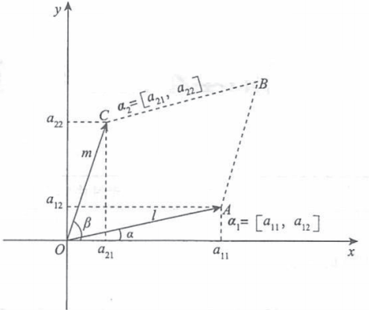
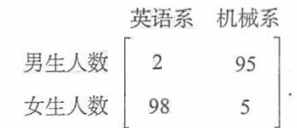

# 书籍链接
* [题目分册,75, 到了,79](file:///media/deepin/C4D3-8268/%E5%B8%B8%E7%94%A8%E8%BD%AF%E4%BB%B6/%E7%B3%BB%E7%BB%9F%E8%BD%AF%E4%BB%B6/%E7%AC%94%E8%AE%B0/%E8%AF%BE%E7%A8%8B/2020%E5%BC%A0%E5%AE%87%E9%A2%98%E6%BA%90%E6%B7%B1%E6%9E%901000%E9%A2%98-%E4%B9%A0%E9%A2%98%E5%88%86%E5%86%8C%EF%BC%88%E6%95%B0%E5%AD%A6%E4%B8%80%EF%BC%89.pdf)
* [解析分册,213, 到了,224](file:///media/deepin/C4D3-8268/%E5%B8%B8%E7%94%A8%E8%BD%AF%E4%BB%B6/%E7%B3%BB%E7%BB%9F%E8%BD%AF%E4%BB%B6/%E7%AC%94%E8%AE%B0/%E8%AF%BE%E7%A8%8B/2020%E5%BC%A0%E5%AE%87%E9%A2%98%E6%BA%90%E6%B7%B1%E6%9E%901000%E9%A2%98-%E8%A7%A3%E6%9E%90%E5%88%86%E5%86%8C%EF%BC%88%E6%95%B0%E5%AD%A6%E4%B8%80%EF%BC%89.pdf)

# 基础知识
1. 行列式
    1. 定义
    ```tex
    \displaystyle
    \footnotesize
    (1)几何法  \\
    二阶行列式就是在算平行四边形面积  \\
    平行四边形一条边是(a_{11}, a_{12}), 另一条边是(a_{21}, a_{22})  \\
    S = l * m * sin(b - a) = l * m *(sinbcosa - cosbsina)  = a_{11}a_{22} - a_{12}a_{21} = 
    \begin{vmatrix}
    a_{11} & a_{12}  \\
    a_{21} & a_{22}  \\
    \end{vmatrix}  \\
    ```  
      
    ```tex
    \displaystyle
    \footnotesize
    三阶行列式就是在算平行六面体体积  \\
    n阶行列式就是算n维图形的体积(n阶行列式可以看做n个n维向量组成的)  \\
    D_n = 
    \begin{vmatrix}
    a_{11} & a_{12} & ... & a_{1n} \\
    a_{21} & a_{22} & ... & a_{2n} \\
    . & . &   & .  \\
    . & . &   & .  \\
    . & . &   & .  \\
    a_{n1} & a_{n2} & ... & a_{nn} \\
    \end{vmatrix}  \\
    (2)逆序数法  \\
    排列: 1到n组成了n级排列(1到n的每一个数都有才能组成该排列),n级排列可以有n!个(即n个数可以组成n!个不同的数)  \\
    顺序是左小右大, 逆序是左大右小  \\
    逆序数: 两两构成的逆序的个数  \\
    奇排列和偶排列: 排列的逆序数是奇数, 这个排列叫做奇排列; 排列的逆序数是偶数, 这个排列叫偶排列  \\
    \tau(2, 5, 1, 3, 4) = 4, 这个逆序数为4(求这里边有几个两两的逆序数对)  \\
    \begin{vmatrix}
    a_{11} & a_{12} & ... & a_{1n} \\
    a_{21} & a_{22} & ... & a_{2n} \\
    . & . &   & .  \\
    . & . &   & .  \\
    . & . &   & .  \\
    a_{n1} & a_{n2} & ... & a_{nn} \\
    \end{vmatrix} = \sum_{j_1j_2...j_n}(-1)^{\tau(j_1j_2...j_n)} a_{1j_1}a_{2j_2}...a_{nj_n} \\
    \sum_{j_1j_2...j_n}表示对n个列下标排列求和, 故可以有n!项求和  \\
    \tau(j_1j_2...j_n)求的时候先按行下标顺排,然后比较列下标找逆序数  \\
    行列式的结果等于所有不同行不同列n个元素乘积再乘-1的逆序数次方的和  \\
    注: 二阶和三阶行列式都可以用画线法解决(沙路法), 逆序数法可以用来确定某项的符号, 检验某项是否正确  \\
    (3)展开式法  \\
    余子式: 去掉某个元素所在行列剩下的元素组成的行列式是余子式  \\
    \begin{vmatrix}
    a_{11} & a_{12} & a_{13}  \\
    a_{21} & a_{22} & a_{23}  \\
    a_{31} & a_{32} & a_{33}  \\
    \end{vmatrix}的a_{22}的余子式是M_{22}
    \begin{vmatrix}
    a_{11} & a_{13}  \\
    a_{31} & a_{33}  \\
    \end{vmatrix}  \\
    代数余子式: A_{ij} = (-1)^{i + j}M_{ij}, 所以余子式M_{ij} = (-1)^{i + j}A_{ij}  \\
    展开公式(需要化出尽可能多的0元素, 将a_{ik}, a_{kj}化成0)  \\
    D_n = |A| = \begin{cases}
    a_{i1}A_{i1} + a_{i2}A_{i2} + ... + a_{in}A_{in}, (按第i行展开)  \\
    a_{1j}A_{1j} + a_{2j}A_{2j} + ... + a_{nj}A_{nj}, (按第j列展开)  \\
    \end{cases}  \\
    行列式某行(列)元素乘另一行(列)元素的代数余子式求和, 结果为0  \\
    D_n = |A| = \begin{cases}
    a_{i1}A_{k1} + a_{i2}A_{k2} + ... + a_{in}A_{kn} = 0, k \mathrlap{\,/}{=} i (按第i行展开)  \\
    a_{1j}A_{1k} + a_{2j}A_{2k} + ... + a_{nj}A_{nk} = 0, k \mathrlap{\,/}{=} j (按第j列展开)  \\
    \end{cases}  \\
    注: 一阶行列式|a_{11}| = a_{11}  \\
    ```  
    2. 性质
    ```tex
    \displaystyle
    \footnotesize
    (1)|A| = |A^T|, (行列式等于转置, 故行的性质也适用于列)  \\
    (2)\begin{vmatrix}
    a_{11} & a_{12}  \\
    0 & 0  \\
    \end{vmatrix}, (某行为0, 行列式为0)  \\
    (3)\begin{vmatrix}
    a_{11} & a_{12}  \\
    ka_{11} & ka_{12}  \\
    \end{vmatrix}, (某两行成比例, 行列式为0)  \\
    (4)\begin{vmatrix}
    a_{11} & a_{12}  \\
    b_{1} + c_{1} & b_{2} + c_{2}  \\
    \end{vmatrix} = 
    \begin{vmatrix}
    a_{11} & a_{12}  \\
    b_{1}  & b_{2}  \\
    \end{vmatrix} + 
    \begin{vmatrix}
    a_{11} & a_{12}  \\
    c_{1}  & c_{2}  \\
    \end{vmatrix}, (行列式单行单列可拆, 其他行不动)  \\
    (5)\begin{vmatrix}
    a_{11} & a_{12}  \\
    a_{21} & a_{22}  \\
    \end{vmatrix} = -
    \begin{vmatrix}
    a_{21} & a_{22}  \\
    a_{11} & a_{12}  \\
    \end{vmatrix}, (互换, 两行互换位置, 添加负号)  \\
    (6)k\begin{vmatrix}
    a_{11} & a_{12}  \\
    a_{21} & a_{22}  \\
    \end{vmatrix} = 
    \begin{vmatrix}
    a_{11} & a_{12}  \\
    ka_{21} & ka_{22}  \\
    \end{vmatrix}, (倍乘, k倍行列式等于某一行的k倍)  \\
    (7)\begin{vmatrix}
    a_{11} & a_{12}  \\
    a_{21} & a_{22}  \\
    \end{vmatrix} = 
    \begin{vmatrix}
    a_{11} & a_{12}  \\
    ka_{11} + a_{21} & ka_{11} + a_{22}  \\
    \end{vmatrix}, (倍加, 原行列式等于某行k倍加到另一行)  \\
    ```
    3. 具体型行列式计算
    ```tex
    \displaystyle
    \footnotesize
    具体型行列式: 告诉了a_{ij}  \\
    (1)可以化为"12 + 1"法  \\
    (一)右上三角行列式=左下三角行列式=主对角线行列式  \\
    \begin{vmatrix}
    a_{11} & a_{12} & ... & a_{1n} \\
    0 & a_{22} & ... & a_{2n} \\
    . & . &   & .  \\
    . & . &   & .  \\
    . & . &   & .  \\
    0 & 0 & ... & a_{nn} \\
    \end{vmatrix} = 
    \begin{vmatrix}
    a_{11} & 0 & ... & 0 \\
    a_{21} & a_{22} & ... & 0 \\
    . & . &   & .  \\
    . & . &   & .  \\
    . & . &   & .  \\
    a_{n1} & a_{n2} & ... & a_{nn} \\
    \end{vmatrix} = 
    \begin{vmatrix}
    a_{11} & 0 & ... & 0 \\
    0 & a_{22} & ... & 0 \\
    . & . &   & .  \\
    . & . &   & .  \\
    . & . &   & .  \\
    0 & 0 & ... & a_{nn} \\
    \end{vmatrix} = a_{11}a_{22}...a_{nn} = \prod_{i = 1}^n a_{ii}  \\
    (二)左上三角行列式=右下三角行列式=副对角线行列式  \\
    \begin{vmatrix}
    a_{11} & a_{12} & ... & a_{1n} \\
    a_{21} & a_{22} & ... & 0 \\
    . & . &   & .  \\
    . & . &   & .  \\
    . & . &   & .  \\
    a_{n1} & 0 & ... & 0 \\
    \end{vmatrix} = 
    \begin{vmatrix}
    0 & 0 & ... & a_{1n} \\
    0 & 0 & ... & a_{2n} \\
    . & . &   & .  \\
    . & . &   & .  \\
    . & . &   & .  \\
    a_{n1} & a_{n2} & ... &  a_{nn}\\
    \end{vmatrix} = 
    \begin{vmatrix}
    0 & 0 & ... & a_{1n} \\
    0 & 0 & ... & 0 \\
    . & . &   & .  \\
    . & . &   & .  \\
    . & . &   & .  \\
    a_{n1} & 0 & ... & 0 \\
    \end{vmatrix} = (-1)^{\frac{n(n+1)}{2}}a_{1n}...a_{n1}  \\
    (三)拉普拉斯展开式(分块矩阵)  \\
    A是m阶矩阵, B是n阶矩阵, C是任意矩阵, 0是零矩阵  \\
    右上分块矩阵 = 左下分块矩阵 = 主对角线分块矩阵  \\
    \begin{vmatrix}
    A & C  \\
    0 & B  \\
    \end{vmatrix} = 
    \begin{vmatrix}
    A & 0  \\
    C & B  \\
    \end{vmatrix} = 
    \begin{vmatrix}
    A & 0  \\
    0 & B  \\
    \end{vmatrix} = |A||B|  \\
    (四)左上分块矩阵 = 右下分块矩阵 = 副对角线分块矩阵  \\
    \begin{vmatrix}
    C & A  \\
    B & 0  \\
    \end{vmatrix} = 
    \begin{vmatrix}
    0 & A  \\
    B & C  \\
    \end{vmatrix} = 
    \begin{vmatrix}
    0 & A  \\
    B & 0  \\
    \end{vmatrix} = (-1)^{mn}|A||B|  \\
    (五)范德蒙德行列式  \\
    \begin{vmatrix}
    1 & 1 & ... & 1 \\
    x_1 & x_2 & ... & x_n \\
    x_1^2 & x_2^2 & ... & x_n^2 \\
    . & . &   & .  \\
    . & . &   & .  \\
    . & . &   & .  \\
    x_1^{n - 1} & x_2^{n - 1} & ... & x_n^{n - 1}  \\
    \end{vmatrix}  =  \prod_{1 \leqslant i < j \leqslant n} (x_j - x_i)  \\
    = (x_n - x_{n - 1})(x_n - x_{n - 2})...(x_n - x_1)  \\
    (x_{n - 1} - x_{n - 2})(x_{n - 1} - x_{n - 3})...(x_{n - 1} - x_1)  \\
    ...  \\
    (x_2 - x_1)  \\
    (2)加边法: n阶行列式加一行或一列变成n+1阶行列式  \\
    第一列添加[1, 0, ..., 0]^T, 则第一行除第一个数为1外,其余数任意添加,行列式值不变  \\
    |A| = \begin{vmatrix}
    a_{11} & a_{12} & ... & a_{1n} \\
    a_{21} & a_{22} & ... & a_{2n} \\
    . & . &   & .  \\
    . & . &   & .  \\
    . & . &   & .  \\
    a_{n1} & a_{n2} & ... & a_{nn} \\
    \end{vmatrix} = 
    \begin{vmatrix}
    1 & * & * & ... & * \\
    0 & a_{11} & a_{12} & ... & a_{1n} \\
    0 & a_{21} & a_{22} & ... & a_{2n} \\
    . & . & . &   & .  \\
    . & . & . &   & .  \\
    . & . & . &   & .  \\
    0 & a_{n1} & a_{n2} & ... & a_{nn} \\
    \end{vmatrix} = 1 * |A|  \\
    (3)递推法: 用于n阶和n-1阶有相同规律(由高阶到低阶推)  \\
    (一)可以递推式阶数不同, 规律相同  \\
    (二)D_n从爪子根上长  \\
    (4))归纳法: (由低阶向高阶推)  \\
    (一)第一数归法(用于一阶差, F(D_n, D_{n - 1})) = 0  \\
    验证n = 1成立, 设n - 1成立, 验证n成立  \\
    (二)第二数归法(用于二阶差, F(D_n, D_{n - 1}, D_{n - 2})) = 0)  \\
    验证n = 1, 2成立, 设n < k成立, 验证n = k成立  \\
    (5)A_{ij}和M_{ij}的计算  \\
    用行列式: 用展开一行或一列得到代数余子式  \\
    \begin{vmatrix}
    {*} & * & * & ... & * \\
    a_{i1} & a_{i2} & a_{i3}  & ... & a_{in} \\
    {*} & * & * & ... & * \\
    \end{vmatrix} = a_{i1}A_{i1} +  a_{i2}A_{i2} + ... + a_{in}A_{in}  \\ 
    \begin{vmatrix}
    {*} & * & * & ... & * \\
    k_1 & k_2 & k_3 & ... k_n \\
    {*} & * & * & ... & * \\
    \end{vmatrix} = k_1A_{i1} +  k_2A_{i2} + ... + k_nA_{in}  \\ 
    M_{ij} = (-1)^{i + j}A_{ij}  \\
    ```
    4. 抽象型行列式计算
    ```tex
    \displaystyle
    \footnotesize
    抽象型行列式(a_{ij}没给出来)  \\
    (1)用列向量表示行列式  \\
    a_i表示n维列向量, 则行列式性质可写成下边的形式  \\
    (一)|a_1, a_2, ... , a_n| = |[a_1, a_2, ... , a_n]^T| = 
    \begin{vmatrix}
    a_1^T  \\
    a_2^T  \\
    ...  \\
    a_n^T  \\
    \end{vmatrix}  \\
    (二)|a_1, a_2, ..., 0, ..., a_n| = 0  \\
    (三)|a_1, ..., a_i, ..., ka_i, ..., a_n| = 0  \\
    (四)|a_1, a_2, ..., a_i + b_i, ..., a_n| = |a_1, a_2, ..., a_i, ..., a_n| + |a_1, a_2, ..., b_i, ..., a_n|  \\
    (五)|a_1, ..., a_i, ..., a_j, ..., a_n| = -|a_1, ..., a_j, ..., a_i, ..., a_n|  \\
    (六)k|a_1, ..., a_i, ..., a_j, ..., a_n| = |a_1, ..., ka_i, ..., a_j, ..., a_n|  \\
    (七)|a_1, ..., a_i, ..., a_j, ..., a_n| = |a_1, ..., a_i, ..., ka_i + a_j, ..., a_n|  \\
    (2)克拉默法则  \\
    (一)n个方程n个未知量构成非齐次线性方程组  \\
    \begin{cases}
    a_{11}x_1 + a_{12}x_2 + ... + a_{1n}x_n = b_1  \\
    a_{21}x_1 + a_{22}x_2 + ... + a_{2n}x_n = b_2  \\
    ...  \\
    a_{n1}x_1 + a_{n2}x_2 + ... + a_{nn}x_n = b_n  \\
    \end{cases}  \\
    若系数行列式|A| \mathrlap{\,/}{=} 0, 则方程组有唯一解, x_i = \frac{|A_i|}{|A|}, |A_i|是把行列式第i列数换成右端常数项  \\
    (二)n个方程n个未知量构成齐次线性方程组  \\
    \begin{cases}
    a_{11}x_1 + a{12}x_2 + ... + a{1n}x_n = 0  \\
    a_{21}x_1 + a{22}x_2 + ... + a{2n}x_n = 0  \\
    ...  \\
    a_{n1}x_1 + a{n2}x_2 + ... + a{nn}x_n = 0  \\
    \end{cases}  \\
    若系数行列式|A| \mathrlap{\,/}{=} 0, 则方程组有唯一零解  \\
    若齐次线性方程组有非零解, 系数行列式|A| = 0  \\
    (3)看解题技巧 \to 1. 行列式  \\
    (4)证明|A| = 0  \\
    |A| = 0 \iff |A| = k|A|, k\mathrlap{\,/}{=}1 \iff Ax = 0有非零解 \iff A不可逆 \iff A有0特征值  \\
    需要注意|A| = 0 与A = 0是不同的  \\
    ```
2. 矩阵
    1. 定义
    ```tex
    \displaystyle
    \footnotesize
    矩阵可以看成一个数表, 如下  \\
    ```  
      
    ```tex
    \displaystyle
    \footnotesize
    这就是一个m行n列的矩阵  \\
    A_{m x n} = 
    \begin{pmatrix}
    a_{11} & a_{12} & ... & a_{1n} \\
    . & . &   & .  \\
    . & . &   & .  \\
    . & . &   & .  \\
    a_{m1} & a_{m2} & ... & a_{mn} \\
    \end{pmatrix}  \\
    ```
    2. 矩阵常用概念与矩阵和行列式的关系
    ```tex
    \displaystyle
    \footnotesize
    (1)常用概念  \\
    (一)矩阵也是由若干行(列)向量拼成的  \\
    (二)矩阵不能运算, 但其行(列)向量之间存在某种联系(矩阵的秩)  \\
    (2)关系  \\
    (一) 区别  \\
    矩阵可方可长, 行列式一定是方的  \\
    矩阵本身无法运算,行列式是算出来的一个体积  \\
    (二) 联系  \\
    矩阵和行列式都由向量组成  \\
    (3)常用名词  \\
    n阶方阵: 当m = n, A就是n阶矩阵(n阶方阵)  \\
    同型矩阵: 有两个矩阵A_{mxn}, B_{sxk}, 若m = s, n = k, 则A与B为同型矩阵  \\
    相等矩阵: 两个矩阵是同型矩阵, 且对应元素相同  \\
    单位矩阵: 主对角线全为1, 其余全为0, 即
    E = I = \begin{pmatrix}
    1 & 0 & ... & 0  \\
    0 & 0 & ... & 0  \\
    . & . &   & .  \\
    . & . &   & .  \\
    . & . &   & .  \\
    0 & 0 & ... & 1  \\
    \end{pmatrix}  \\ 
    零矩阵: 每个元素都是0, 记为\bold{0}  \\
    \red{数量矩阵: 数k和单位矩阵E的乘积}  \\
    可交换矩阵: AB = BA  \\
    增广矩阵: 系数矩阵右边添加一列等号右边的值(用于线性方程组)  \\
    对角矩阵: 非主对角元素均为0的矩阵  \\
    上下三角矩阵: 上边三角或下边三角都是0  \\
    \red{对称矩阵}: A^T = A(也即a_{ij} = a_{ji})  \\
    \red{反对称矩阵}: A^T = -A, (即a_{ii} = 0, a_{ij} = -a_{ji}, i \mathrlap{\,/}{=} j)  \\
    \red{正交矩阵}: A是方阵, 有A^TA = E(A是正交矩阵 \iff A^TA = E \iff A^T = A^{-1} \iff A的行(列)向量组是标准正交向量组))  \\
    A = 
    \begin{pmatrix}
    a_1 & a_2 & a_3  \\
    b_1 & b_2 & b_3  \\
    c_1 & c_2 & c_3  \\
    \end{pmatrix}, a = [a_1, a_2, a_3]^T, b = [b_1, b_2, b_3]^T, c = [c_1, c_2, c_3]^T  \\ 
    AA^T = E = \begin{pmatrix}
    1 & 0 & 0  \\
    0 & 1 & 0  \\
    0 & 0 & 1  \\
    \end{pmatrix}, 有  \\
    a_1^2 + a_2^2 + a_3^2 = 1 => ||a|| = 1  \\
    b_1^2 + b_2^2 + b_3^2 = 1 => ||b|| = 1  \\
    c_1^2 + c_2^2 + c_3^2 = 1 => ||c|| = 1  \\
    a_1b_1 + a_2b_2 + a_3b_3 = 0 => (a, b) = 0, a与b正交  \\
    a_1c_1 + a_2c_2 + a_3c_3 = 0 => (a, c) = 0, a与c正交  \\
    b_1c_1 + b_2c_2 + b_3c_3 = 0 => (b, c) = 0, b与c正交  \\
    \red{则A由两两正交的单位向量组组成}  \\
    ```
    3. 运算
    ```tex
    \displaystyle
    \footnotesize
    (1) 相等: A, B是同型矩阵, 且对应元素相等  \\
    (2) 加法: A + B = (a_{ij} + b_{ij})(需要两个矩阵同型, 对应元素相加)  \\
    行列式相加只能是一行不同其他行相同才能加, 矩阵是每个元素相加  \\
    \begin{pmatrix}
    1 & 2  \\
    3 & 4  \\
    \end{pmatrix} + 
    \begin{pmatrix}
    5 & 6  \\
    7 & 8  \\
    \end{pmatrix} = 
    \begin{pmatrix}
    6 & 8  \\
    10 & 12  \\
    \end{pmatrix}  \\
    (3) 数乘: kA = Ak = (ka_{ij})_{mxn}  \\
    若矩阵A是n阶方阵  \\
    |kA| = k^n|A| \mathrlap{\,/}{=} k|A| (n \geqslant 2, k \mathrlap{\,/}{=} 0, 1)  \\
    一般|A + B| \mathrlap{\,/}{=} |A| + |B|  \\
    A \mathrlap{\,/}{=} 0无法推出|A| \mathrlap{\,/}{=} 0  \\
    A \mathrlap{\,/}{=} B无法推出|A| \mathrlap{\,/}{=} |B|  \\
    (4) 矩阵运算律  \\
    (一)交换律: A + B = B + A  \\
    (二)结合律: (A + B) + C = A + (B + C)  \\
    (三)分配律: k(A + B) = kA + kB  \\
    (四)多个数的结合律: k(lA) = (kl)A = l(kA)  \\
    (5) 乘法: A_{mxn}B_{nxs}(需要A的列数 = B的行数), 然后算向量的内积, 结果是C_{mxs}  \\
    c_{ij} = a_{i1}b_{1j} + ... + a_{in}b_{nj}(一行乘一列, 结果放i行j列)  \\
    \begin{pmatrix}
    a_{11} & a_{12} & a_{13}  \\
    a_{21} & a_{22} & a_{23}  \\
    \end{pmatrix}
    \begin{pmatrix}
    b_{11} \\
    b_{21} \\
    b_{31} \\
    \end{pmatrix} = 
    \begin{pmatrix}
    c_{11} \\
    c_{21} \\
    \end{pmatrix}  \\
    矩阵乘法的运算律  \\
    (一)结合律: (A_{mxs}B_{sxr})C_{rxn} = A_{mxs}(B_{sxr}C_{rxn})  \\
    (二)分配律: A_{mxs}(B_{sxn} + C_{sxn}) = A_{mxs}B_{sxn} + A_{mxs}C_{sxn} \\
    (三)数与矩阵乘积的结合律: (kA_{mxn})B_{nxs} = A_{mxn}(kB_{nxs}) = k(A_{mxn}B_{nxs}) \\
    \exists A \mathrlap{\,/}{=} 0, B \mathrlap{\,/}{=} 0, AB = 0, 故AB = 0无法推出 A = 0或B = 0  \\
    若AB = AC, A \mathrlap{\,/}{=} 0, 则A(B - C) = 0, 且即使A \mathrlap{\,/}{=} 0, B也不一定等于C  \\
    ```
    4. 可逆矩阵(可逆矩阵一定是方阵, 长方形不可逆)
    ```tex
    \displaystyle
    \footnotesize
    (1)定义  \\
    (一)可逆矩阵: 若A, B均为方阵, 且AB = BA = E, 则A是可逆矩阵, B是A的逆, 且逆矩阵唯一  \\
    A^{-1} = B, B^{-1} = A  \\
    (二)伴随矩阵: 矩阵A的n^2个元素的代数余子式放到原本元素的位置再转置就是伴随矩阵(原来行的代数余子式现在变为列), 记为A^*  \\
    对任意A, 有AA^* = A^*A = |A|E, |A^*| = |A|^{n - 1}  \\
    当|A| \mathrlap{\,/}{=} 0时, A^{-1} = \frac{1}{|A|}A^*, A = |A|(A^*)^{-1}  \\
    (三)A可逆 \iff |A|\mathrlap{\,/}{=} 0  \\
    (2)性质  \\
    若A, B是同阶可逆矩阵  \\
    (A^{-1})^{-1} = A, A^{-1}A = E  \\
    k\mathrlap{\,/}{=}0, (kA)^{-1} = \frac{1}{k}A^{-1}  \\
    AB可逆, 即(AB)^{-1} = B^{-1}A^{-1}, ([A(BB^{-1})A^{-1}] = E) \to (穿脱原则)  \\
    A^T可逆, (A^T)^{-1} = (A^{-1})^T  \\
    |A^{-1}| = |A|^{-1}  \\
    |AB| = |A||B|
    注意: (A + B) \mathrlap{\,/}{=} A^{-1} + B^{-1}  \\
    (3)求逆矩阵  \\
    (一)用伴随矩阵: |A| \mathrlap{\,/}{=} 0, 且A可逆, A^{-1} = \frac{A^*}{|A|}   \\
    (二)初等变换[A|E] \to [E|A^{-1}](初等行变换, 这里只能进行行变换, 因为相当于是左乘, 如果同时进行了列变换, 那么找到的逆就不对了)  \\ 
    \begin{bmatrix}
    A  \\
    E
    \end{bmatrix} \to
    \begin{bmatrix}
    E  \\
    A^{-1}
    \end{bmatrix}(初等列变换)  \\
    (三)定义法: 得到B, 有AB = E, 故A可逆, A^{-1} = B  \\
    (四)分解A为可逆矩阵乘积, 乘积仍可逆: 有A = BC, B,C可逆, 则A可逆, A^{-1} = (BC)^{-1} = C^{-1}B^{-1}  \\
    (五)分块矩阵: 若A, B为可逆方阵 则
    \begin{pmatrix}
    A & 0 \\
    0 & B  \\
    \end{pmatrix}^{-1} = 
    \begin{pmatrix}
    A^{-1} & 0 \\
    0 & B^{-1}  \\
    \end{pmatrix},
    \begin{pmatrix}
    0 & A  \\
    B & 0 \\
    \end{pmatrix}^{-1} = 
    \begin{pmatrix}
    0 & B^{-1}  \\
    A^{-1} & 0 \\
    \end{pmatrix}  \\
    ```
    5. 矩阵的秩
    ```tex
    \displaystyle
    \footnotesize
    (1)矩阵的秩: 设A是mxn矩阵, A中最高阶非零子式的阶数称为矩阵A的秩, 记为r(A)  \\
    若k阶子式不为0, 任意k+1阶子式全为0, 则r(A) = k, 且r(A_{nxn}) = n \iff |A| \mathrlap{\,/}{=} 0 \iff A可逆  \\
    (2)初等变换不改变矩阵的秩: 若A_{mxn}, P, Q是m, n阶可逆矩阵, r(A) = r(PA) = r(AQ) = r(PAQ)  \\
    证明: 令A = p^{-1}(PA), \because r(AB) \leqslant min\{r(A), r(B)\}, 则r(A) = r(p^{-1}(PA)) \leqslant r(PA) \leqslant r(A)  \\
    故r(A) = r(PA)  \\
    (3)秩的等式与不等式  \\
    有A_{mxn}  \\
    (一)0 \leqslant r(A) \leqslant min\{m, n\}(A的子式阶数最大为min\{m, n\})  \\
    (二)r(kA) = r(A) (k \mathrlap{\,/}{=} 0)  \\
    (三)r(AB) \leqslant min\{r(A), r(B)\}  \\
    (四)r(A + B) \leqslant r(A) + r(B)  \\
    (五)r(
        \begin{bmatrix}
        A & 0 \\
        0 & B \\
        \end{bmatrix}
    ) = r(A) + r(B)  \\
    (六)r(A) + r(B) \leqslant r(
        \begin{bmatrix}
        A & 0 \\
        C & B \\
        \end{bmatrix}
    ) \leqslant r(A) + r(B) + r(C)  \\
    (七)r(AB) \geqslant r(A) + r(B) - n  \\
    当AB = 0, r(A) + r(B) \leqslant n(n是A的列数或B的行数)  \\
    (八)r(A) = r(A^T) = r(AA^T) = r(A^TA)  \\
    (九)r(A^*) = \begin{cases}
    n, r(A) = n  \\
    1, r(A) = n - 1  \\
    0, r(A) < n - 1  \\
    \end{cases}, 这里A是n阶方阵  \\
    (十)若A为n阶方阵, A^2 = A, r(A) + r(E - A) = n  \\
    (十一)若A为n阶方阵, A^2 = E, r(A + E) + r(A - E) = n  \\
    ```
    
    6. 转置矩阵
    ```tex
    \displaystyle
    \footnotesize
    (A^T)^T = A  \\
    (kA)^T = kA^T  \\
    (A + B)^T = A^T + B^T  \\
    (AB)^T = B^TA^T  \\
    若m = n, |A^T| = |A|  \\
    ```
    7. 向量的内积与正交
    ```tex
    \displaystyle
    \footnotesize
    内积: a = [a_1, a_2, ..., a_n]^T, b = [b_1, b_2, ..., b_n]^T是两个向量  \\
    a^Tb就是向量a, b的内积, 记为(a, b) = a^Tb  \\
    正交: a^Tb = 0, 则向量a, b是正交向量  \\
    模: ||a|| = \sqrt{\sum_{i = 1}^n a_i^2}称为向量a的模(长度)  \\
    ||a|| = 1, a就是单位向量  \\
    标准正交向量: 列向量组a_1, a_2, ..., a_n满足a_i^Ta_j = 
    \begin{cases}
    0, i \mathrlap{\,/}{=} j  \\
    1, i = j  \\
    \end{cases}, 则a_1, a_2, ..., a_n为标准或单位正交向量组  \\
    ```
    8. 施密特标准正交化
    ```tex
    \displaystyle
    \footnotesize
    线性无关向量组a_1, a_2, ..., a_n的标准正交化公式为  \\
    b_1 = a_1  \\
    b_2 = a_2 - \frac{(a_2, b_1)}{(b_1, b_1)}b_1  \\
    b_n = a_n - \frac{(a_n, b_{n - 1})}{(b_{n - 1}, b_{n - 1})}b_{n - 1} - \frac{(a_n, b_{n - 2})}{(b_{n - 2}, b_{n - 2})}b_{n - 2} - ... - \frac{(a_n, b_{1})}{(b_{1}, b_{1})}b_{1}  \\
    得到b_1, b_2, ..., b_n的正交向量组  \\
    c_1 = \frac{b_1}{||b_1||}, c_2 = \frac{b_2}{||b_2||}, ...., c_n = \frac{b_n}{||b_n||}, 得到标准正交向量组  \\
    ```
    9. 分块矩阵
    ```tex
    \displaystyle
    \footnotesize
    (1)计算法则  \\
    (一)加法: 需要同型  \\
    \begin{pmatrix}
    A_{1} & A_{2}  \\
    A_{3} & A_{4}  \\
    \end{pmatrix} + 
    \begin{pmatrix}
    B_{1} & B_{2}  \\
    B_{3} & B_{4}  \\
    \end{pmatrix} = 
    \begin{pmatrix}
    A_{1} + B_{1} & A_{2} + B_{2}  \\
    A_{3} + B_{3} & A_{4} + B_{4}  \\
    \end{pmatrix}  \\
    (二) 数乘  \\
    k\begin{pmatrix}
    B_{1} & B_{2}  \\
    B_{3} & B_{4}  \\
    \end{pmatrix} =
    \begin{pmatrix}
    kB_{1} & kB_{2}  \\
    kB_{3} & kB_{4}  \\
    \end{pmatrix}  \\
    (三)乘法  \\
    \begin{pmatrix}
    A_{1} & A_{2}  \\
    A_{3} & A_{4}  \\
    \end{pmatrix} 
    \begin{pmatrix}
    B_{1} & B_{2}  \\
    B_{3} & B_{4}  \\
    \end{pmatrix} =
    \begin{pmatrix}
    A_{1}B_{1} + A_{2}B_{3} & A_{1}B_{2} + A_{2}B_{4}  \\
    A_{3}B_{1} + A_{4}B_{3} & A_{3}B_{2} + A_{4}B_{4}  \\
    \end{pmatrix}  \\
    (四) A, B为m,n阶方阵, 则分块对角矩阵的幂为
    \begin{pmatrix}
    A & 0 \\
    0 & B  \\
    \end{pmatrix}^n =  
    \begin{pmatrix}
    A^n & 0 \\
    0 & B^n  \\
    \end{pmatrix}  \\
    (五)AB = 0, B, 0按列分块, A看成一整块  \\
    AB = A[b_1, b_2, ..., b_n] = [Ab_1, Ab_2, ..., Ab_n] = [0, 0, ..., 0]  \\
    (六)AB = C, B, C按行分块, 有  \\
    \begin{pmatrix}
    a_{11} & a_{12} & ... & a_{1n} \\
    a_{21} & a_{22} & ... & a_{2n} \\
    . & . &   & .  \\
    . & . &   & .  \\
    . & . &   & .  \\
    a_{n1} & a_{n2} & ... & a_{nn} \\
    \end{pmatrix}  
    \begin{pmatrix} 
    b_1  \\
    b_2  \\
    .  \\
    .  \\
    .  \\
    b_n  \\
    \end{pmatrix} =
    \begin{pmatrix} 
    c_1  \\
    c_2  \\
    .  \\
    .  \\
    .  \\
    c_n  \\
    \end{pmatrix}, C的行向量就是B的行向量的线性组合  \\ 
    (六)AB = C, A, C按列分块, 有  \\
    \begin{pmatrix}
    a_1, a_2, ..., a_n
    \end{pmatrix}
    \begin{pmatrix}
    b_{11} & b_{12} & ... & b_{1n} \\
    b_{21} & b_{22} & ... & b_{2n} \\
    . & . &   & .  \\
    . & . &   & .  \\
    . & . &   & .  \\
    b_{n1} & b_{n2} & ... & b_{nn} \\
    \end{pmatrix} =
    \begin{pmatrix}
    c_1, c_2, ..., c_n
    \end{pmatrix}  \\
    C的列向量是A的列向量的线性组合  \\
    ```
    10. 初等变换与初等矩阵
    ```tex
    \displaystyle
    \footnotesize
    (1)初等变换: 就是互换, 倍乘, 倍加  \\
    (一)一个非零常数乘矩阵的某一行(列)  \\
    (二)互换矩阵的某两行(列)  \\
    (三)将矩阵的一行(列)的k倍加到另一行(列)  \\
    (2)初等矩阵: 由单位矩阵经过一次初等变换得到的矩阵  \\
    (一)E的第二行(列)乘k倍(倍乘初等矩阵), E_2(k) = 
    \begin{bmatrix}
    1 & 0 & 0 \\
    0 & k & 0 \\
    0 & 0 & 1 \\
    \end{bmatrix}  \\
    (二)E的1,2行(列)互换(互换初等矩阵), E_{12} = 
    \begin{bmatrix}
    0 & 1 & 0 \\
    1 & 0 & 0 \\
    0 & 0 & 1 \\
    \end{bmatrix}  \\
    (三)E的3行(列)的k倍加到1行, (倍加初等矩阵), E_{13}(k) = 
    \begin{bmatrix}
    1 & 0 & k \\
    0 & 1 & 0 \\
    0 & 0 & 1 \\
    \end{bmatrix}  \\
    (3)初等矩阵的性质  \\
    (一)初等矩阵的转置仍是初等矩阵  \\
    (二)|E_i(k)| = k \mathrlap{\,/}{=} 0, |E_{ij}| = -1 \mathrlap{\,/}{=} 0, || = 1 \mathrlap{\,/}{=} 0,  
    故初等矩阵都是可逆矩阵,   \\
    且[E_i(k)]^{-1} = E_i(\frac{1}{k}), E_{ij}^{-1} = E_{ij}, [E_{ij}(k)]^{-1} = E_{ij}(-k), 逆矩阵仍是原类型的初等矩阵  \\
    (三)若A为可逆矩阵, A可以表示成有限个初等矩阵的乘积  \\
    (四)方阵A进行初等行变换, 相当于矩阵A左乘初等矩阵, 方阵A进行初等列变换, 相当于矩阵A右乘初等矩阵  \\
    ```
    11. 等价矩阵与矩阵的等价标准形
    ```tex
    \displaystyle
    \footnotesize
    等价矩阵: A, B是mxn矩阵, 若有可逆矩阵P_{mxm}, Q_{nxn}, 使PAQ = B, 则A, B为等价矩阵, A \cong B(PQ是用来给A进行初等变换的)  \\
    也可以表述为A, B相似, 则A, B同型且秩相同  \\
    等价标准形: A是mxn, r(A) = r, 则有可逆矩阵P, Q, 使PAQ = 
    \begin{bmatrix}
    E_r & 0  \\
    0 & 0  \\
    \end{bmatrix} (后边的矩阵为等价标准形, 该标准形唯一. E_r中的r就是秩) \\
    ```
3. 向量
    1. 定义
    ```tex
    \displaystyle
    \footnotesize
    矩阵由n个向量组成, 其中某些向量可由其中某一个向量表示, 则这些向量留一个即可表示其他向量  \\
    如[1, 2, 3]和[2, 4, 6]可用前一个向量表示后一个,留一个做代表即可(他们线性相关)  \\
    所有的代表向量之间则线性无关(每个代表向量可以看做一个独立信息)  \\
    \red{向量之间要么线性相关(向量是多余的), 要么线性无关(向量是独立的)}  \\
    极大线性无关组: 能够代表向量组中所有成员的一组向量, 其个数为向量组的秩(也就是独立信息的个数)  \\
    ```
    2. 向量及向量组的线性相关性
    ```tex
    \displaystyle
    \footnotesize
    (1) 向量的概念  \\
    n维向量: n个数构成的有序数组. a = [a_1, a_2, ..., a_n]是n维行向量, a^T是n维列向量  \\
    相等向量: a, b都是n维向量, 当且仅当a_i = b_i, 则向量a, b相等  \\
    (2) 向量的计算  \\
    加法: a + b = [a_1 + b_1, a_2 + b_2, ..., a_n + b_n]  \\
    数乘: ka = [ka_1, ka_2, ..., ka_n]  \\
    (3) 向量组的线性相关性概念  \\
    线性组合: 有m个n维向量a_i和m个数k_i, 则向量k_1a_1 + k_2a_2 + ... + k_ma_m是向量组a_1, ... a_m的线性组合  \\
    线性表出: 向量b能够表示成向量组a_i的线性组合, 即b = k_1a_1 + k_2a_2 + ... + k_ma_m, 则向量b可以被向量组a_i线性表出  \\
    线性相关: 有m个n维向量a_i和m个不全为0的数k_i, k_1a_1 + k_2a_2 + ... + k_ma_m = \bold{0}, 则向量组a_1, ... a_m线性相关  \\
    含有零向量或成比例向量的向量组必定线性相关  \\
    线性无关: 有m个n维向量a_i, 若不存在不全为0的数k_i, 使k_1a_1 + k_2a_2 + ... + k_ma_m = \bold{0}, 则向量组a_1, ... a_m线性无关  \\
    只有k_i全为0, 向量组的线性组合才是0向量  \\
    单个非零向量, 两个不成比例的向量都线性无关  \\
    (4) 向量组线性相关判定(证明可看91页)  \\
    (一) 向量组a_1, a_2, ..., a_n(n \geqslant 2)线性相关 的充要条件是 向量组中至少有一个向量可由其余n-1个向量线性表出  \\
    逆否命题: 向量组a_1, a_2, ..., a_n(n \geqslant 2)线性无关 的充要条件是 向量组中任一向量都不能由其余n-1个向量线性表出  \\
    (二) 若向量组a_1, a_2, ..., a_n线性无关, 而b, a_1, a_2, ..., a_n线性相关, 则b可由a_1, a_2, ..., a_n线性表出, 且表示法唯一  \\
    (三) 若向量组b_1, b_2, ..., b_t可由a_1, a_2, ..., a_s线性表示, 且t > s, 则向量组b_1, b_2, ..., b_t线性相关(以少表多, 多的相关)  \\
    向量组b_i的每一个向量都有向量组a_i线性表出  \\
    等价表示: 若向量组b_1, b_2, ..., b_t可由a_1, a_2, ..., a_s线性表示, 且向量组b_1, b_2, ..., b_t线性无关, 则t \leqslant s  \\ 
    (四) 有m个n维向量a_1, a_2, ..., a_m, (每个向量都是列向量, 如a_1 = [a_{11}, a_{21}, ..., a_{n1}]^T), \\
    则a_1, a_2, ..., a_m线性相关的充要条件是齐次线性方程组\bold{Ax} = \bold{0}有非零解  \\
    A = [a_1, a_2, ..., a_m] = \begin{bmatrix}
    a_{11} & a_{12} & ... & a_{1m} \\
    a_{21} & a_{22} & ... & a_{2m} \\
    . & . &   & .  \\
    . & . &   & .  \\
    . & . &   & .  \\
    a_{n1} & a_{n2} & ... & a_{nm} \\
    \end{bmatrix}  ,
    x = \begin{bmatrix}
    x_{1} \\
    x_{2} \\
    .  \\
    .  \\
    .  \\
    x_{m} \\
    \end{bmatrix}  \\
    Ax = \begin{bmatrix}
    a_{11} & a_{12} & ... & a_{1m} \\
    a_{21} & a_{22} & ... & a_{2m} \\
    . & . &   & .  \\
    . & . &   & .  \\
    . & . &   & .  \\
    a_{n1} & a_{n2} & ... & a_{nm} \\
    \end{bmatrix}
    \begin{bmatrix}
    x_{1} \\
    x_{2} \\
    .  \\
    .  \\
    .  \\
    x_{m}
    \end{bmatrix} = [a_1, a_2, ..., a_m]
    \begin{bmatrix}
    x_{1} \\
    x_{2} \\
    .  \\
    .  \\
    .  \\
    x_{m}
    \end{bmatrix} = 0  \\
    等价命题: a_1, a_2, ..., a_m线性无关的充要条件是齐次线性方程组\bold{Ax} = \bold{0}只有零解  \\
    (五)向量b可由向量组a_1, a_2, ..., a_s线性表出 \iff 非齐次线性方程组[a_1, a_2, ..., a_s]
    [x_1, x_2, ..., x_s]^T = a_1x_2 + a_2x_2 + ... + a_sx_s = b有解  \\
    \iff r([a_1, a_2, ..., a_s])  = r([a_1, a_2, ..., a_s, b])  \\
    (六)若向量组a_1, a_2, ..., a_m中有一部分向量线性相关, 则整个向量组也线性相关  \\
    逆否命题: 如果a_1, a_2, ..., a_m线性无关, 则其任意部分向量组也线性无关  \\
    (七)若一组n维向量a_1, a_2, ..., a_s线性无关, 则每个向量任意添加m个分量得到一组n+m维的向量a_1^*, a_2^*, ..., a_s^*仍旧线性无关  \\
    若一组n维向量a_1, a_2, ..., a_s线性相关, 则每个向量去掉相同若干分量所得新向量组也线性相关  \\
    ```
    3. 极大线性无关组, 等价向量组, 向量组的秩
    ```tex
    \displaystyle
    \footnotesize
    (1)极大线性无关组  \\
    在向量组a_1, a_2, ..., a_n中, 有部分组a_{i1},a_{i2}, ..., a_{in}线性无关, 且向量组中任一向量可由部分组线性表出,  \\
    则部分组即为向量组的极大线性无关组  \\
    向量组的极大线性无关组一般不唯一  \\
    向量组只有一个零向量组成, 则不存在极大线性无关组  \\
    线性无关向量组的极大线性无关组就是该向量组本身  \\
    (2)等价向量组  \\
    有两个向量组(1)a_1, a_2, ..., a_s和(2)b_1, b_2, ..., b_t, (1)中每个向量都可由(2)的向量组线性表出, 则称向量组(1)可由向量组(2)线性表出  \\
    若向量组(1)和向量组(2)可以相互线性表出, 向量组(1)与向量组(2)为等价向量组, 记为(1)\cong(2)  \\
    等价向量组满足  \\
    (一)(1) \cong (1)  \\
    (二)若(1) \cong (2), 则(2) \cong (1)  \\
    (三)若(1) \cong (2), (2) \cong (3), 则(1) \cong (3)  \\
    向量组和其极大线性无关组是等价向量组  \\
    (3) 向量组的秩  \\
    向量组的极大线性无关组所含向量个数, 记为r(a_1, a_2, ,..., a_n) = rank(a_1, a_2, ,..., a_n) = r  \\
    (4) 有关向量组的秩的重要定理和公式  \\
    (一)三秩相等  \\
    r(A)(矩阵的秩) = A的行秩(A的行向量组的秩) = A的列秩(A的列向量组的秩)  \\
    行向量就是一行一个向量, 列向量就是一列一个向量  \\
    (二)若矩阵A经过初等行变换到矩阵B, 则  \\
    A的行向量组和B的行向量组是等价向量组  \\
    A和B的任何相应的部分列向量组具有相同的线性相关性  \\
    (三)若向量组a_1, a_2, ..., a_s和b_1, b_2, ..., b_t, 有b_i的每个向量可由a_i的向量组线性表出, 则r(b_1, b_2, ..., b_t) \leqslant 
    r(a_1, a_2, ..., a_s)  \\
    ```
    4. 向量空间
    ```tex
    \displaystyle
    \footnotesize
    (1)定义  \\
    \xi_1, \xi_2, ..., \xi_n是n维向量空间R^n中的线性无关的有序向量组(\xi_i都是n维列向量), 则任一向量a \in R^n均可由\xi_1, \xi_2, ..., \xi_n线性表出  \\
    即a = a_1\xi_1 + a_2\xi_2 + ... + a_n\xi_n  \\
    \xi_1, \xi_2, ..., \xi_n是R^n的一个基, 基向量的个数n是向量空间维数, [a_1, a_2, ..., a_n]
    ([a_1, a_2, ..., a_n]^T)是向量a在基\xi_1, \xi_2, ..., \xi_n下的坐标, 或称为向量a的坐标行(列)向量  \\
    (2)基变换  \\
    \eta_1, \eta_2, ..., \eta_n, \xi_1, \xi_2, ..., \xi_n是R^n的两个基, 且  \\
    [\eta_1, \eta_2, ..., \eta_n] = [\xi_1, \xi_2, ..., \xi_n]
    \begin{vmatrix}
    c_{11} & c_{12} & ... & c_{1n} \\
    c_{21} & c_{22} & ... & c_{2n} \\
    . & . &   & .  \\
    . & . &   & .  \\
    . & . &   & .  \\
    c_{n1} & c_{n2} & ... & c_{nn} \\
    \end{vmatrix} = [\xi_1, \xi_2, ..., \xi_n]C  \\
    则该公式为基\xi_1, \xi_2, ..., \xi_n到基\eta_1, \eta_2, ..., \eta_n的基变换公式  \\
    矩阵C是基\xi_1, \xi_2, ..., \xi_n到基\eta_1, \eta_2, ..., \eta_n的的过渡矩阵  \\
    C的第i列是\eta_i在基\xi_1, \xi_2, ..., \xi_n下的坐标列向量, 且过渡矩阵C是可逆矩阵  \\
    (3)坐标变换  \\
    设a在基\xi_1, \xi_2, ..., \xi_n和基\eta_1, \eta_2, ..., \eta_n下的坐标分别为
    x = [x_1, x_2, ..., x_n]^T, y = [y_1, y_2, ..., y_n]^T  \\
    即a = [\xi_1, \xi_2, ..., \xi_n]x = [\eta_1, \eta_2, ..., \eta_n]y  \\
    基[\xi_1, \xi_2, ..., \xi_n]到基[\eta_1, \eta_2, ..., \eta_n]的过渡矩阵为C  \\
    即[\eta_1, \eta_2, ..., \eta_n] = [\xi_1, \xi_2, ..., \xi_n]C  \\
    则a = [\xi_1, \xi_2, ..., \xi_n]x = [\eta_1, \eta_2, ..., \eta_n]y = [\xi_1, \xi_2, ..., \xi_n]Cy  \\
    即 x = Cy或y = C^{-1}x, 此即为坐标变换公式  \\ 
    ```
4. 线性方程组
    1. 定义
    ```tex
    \displaystyle
    \footnotesize
    方程组和向量组是同一个问题的两种表现形式, 本质一样, 解决方法也一样  \\
    解线性方程组: 对增广矩阵做初等行变换, 化成行阶梯型矩阵再求解  \\
    ```
    2. 齐次线性方程组
    ```tex
    \displaystyle
    \footnotesize
    (1)方程形式  \\
    m个方程n个未知数方程组形式: \begin{cases}
    a_{11}x_1 + a_{12}x_2 + ... + a_{1n}x_n = 0  \\
    a_{21}x_1 + a_{22}x_2 + ... + a_{2n}x_n = 0  \\
    ...  \\
    a_{m1}x_1 + a_{m2}x_2 + ... + a_{mn}x_n = 0  \\
    \end{cases}  \\
    向量形式: x_1a_1 + x_2a_2 + ... + x_na_n = 0  \\
    矩阵形式: \bold{Ax = 0}  \\
    (2)有解的条件  \\
    当r(A) = n(向量组线性无关), 方程组有唯一0解  \\
    当r(A) = r < n(向量组线性相关), 方程组有非零解, 有n-r个线性无关解  \\
    (3)解的性质  \\
    若A\xi_1 = 0, A\xi_2 = 0, 则A(k_1\xi_1 + k_2\xi_2) = 0, (k_1, k_2为任意常数, \xi_1, \xi_2是解)  \\
    (4)基础解系  \\
    设\xi_1, \xi_2, ..., \xi_{n -r}满足(1)是方程组Ax = 0的解, (2)线性无关, (3)Ax = 0的任一解均可由\xi_1, \xi_2, ..., \xi_{n -r}线性表出,  \\
    则\xi_1, ..., \xi_2, \xi_{n -r}是Ax = 0的基础解系  \\
    (5)通解: 设\xi_1, \xi_2, ..., \xi_{n -r}是Ax = 0的基础解系, 则k_1\xi_1 + k_2\xi_2 + ... + k_{n -r}\xi_{n -r}是Ax = 0的通解  \\
    (6)求解方法  \\
    (一)将系数矩阵A做初等行变换化成阶梯形矩阵B, 初等行变换将方程组化为同解方程组, 则Ax = 0与Bx = 0同解, 设r(A) = r  \\
    (二)对B按列找到一个秩为r的子矩阵, 剩余列的位置的未知数即为自由变量  \\
    (三)按基础解系定义求出\xi_1, \xi_2, ..., \xi_{n -r}, 写出通解  \\
    ```
    3. 非齐次线性方程组
    ```tex
    \displaystyle
    \footnotesize
    (1)方程形式  \\
    m个方程n个未知数方程组形式: \begin{cases}
    a_{11}x_1 + a_{12}x_2 + ... + a_{1n}x_n = b_1  \\
    a_{21}x_1 + a_{22}x_2 + ... + a_{2n}x_n = b_2  \\
    ...  \\
    a_{m1}x_1 + a_{m2}x_2 + ... + a_{mn}x_n = b_m  \\
    \end{cases}  \\
    向量形式: x_1a_1 + x_2a_2 + ... + x_na_n = b  \\
    矩阵形式: \bold{Ax = b}  \\
    A的增广矩阵记为[A | b]或[A, b]  \\
    (2)有解的条件  \\
    当r(A) \mathrlap{\,/}{=} r([A, b])(b不能由a_1, a_2, ..., a_n线性表出), 方程组无解  \\
    当r(A) = r([A, b]) = n(a_1, a_2, ..., a_n线性无关, a_1, a_2, ..., a_n, b线性相关), 方程组有唯一解  \\
    当r(A) = r([A, b]) = r < n, 方程组有无穷多解  \\
    (3)解的性质  \\
    若\eta_1, \eta_2, \eta是非齐次线性方程组Ax = b的解, \xi是齐次线性方程组Ax = 0的解, 则  \\
    \eta_1 - \eta_2是Ax = 0, k\xi + \eta是Ax = b的解  \\
    (4)求解方法  \\
    将增广矩阵A做初等行变换化成阶梯形矩阵B, 求出对应齐次线性方程组通解, 再加一个非齐次线性方程组特解就是非齐次线性方程组通解  \\
    (一)求出Ax = 0的通解k_1\xi_1 + k_2\xi_2 + ... + k_{n -r}\xi_{n -r}  \\
    (二)求出Ax = b的一个特解\eta  \\
    (三)Ax = b的通解为k_1\xi_1 + k_2\xi_2 + ... + k_{n -r}\xi_{n -r} + \eta  \\
    ```
    4. 行阶梯型
    ```tex
    \displaystyle
    \footnotesize
    (1)一个阶梯一行  \\
    (2)阶梯下边都是0  \\
    (3)阶梯右边都非0  \\
    ```
5. 特征值与特征向量
    1. 基本概念  
    ```tex
    \displaystyle
    \footnotesize
    设A是n阶矩阵, \lambda是一个数, 若存在n维非零列向量(\xi \mathrlap{\,/}{=} 0), 使A\xi = \lambda\xi, 则  \\
    \lambda是矩阵A的特征值, \xi是矩阵A的特征向量  \\
    注: 由A\xi = \lambda\xi得, (\lambda E - A)\xi = 0, 因\xi \mathrlap{\,/}{=} 0, 且\xi为列向量,  \\
    将\xi看成齐次线性方程组的解, 有非零解, 故前边的矩阵线性相关, 行列式|\lambda E - A| = 0  \\
    |\lambda E - A| = \begin{vmatrix}
    \lambda - a_{11} & -a_{12} & ... & -a_{1n} \\
    {-}a_{21} & \lambda - a_{22} & ... & -a_{2n} \\
    . & . &   & .  \\
    . & . &   & .  \\
    . & . &   & .  \\
    {-}a_{n1} & -a_{n2} & ... & \lambda - a_{nn} \\
    \end{vmatrix} = 0  \\
    |\lambda E - A| = 0是矩阵A的特征方程(\lambda的n次方程), \lambda E - A是特征矩阵, |\lambda E - A|是特征多项式  \\
    ```
    2. 基本性质
    ```tex
    \displaystyle
    \footnotesize
    注意: 特征值是特征方程的根  \\
    (1)特征值的性质  \\
    A是n阶矩阵, \lambda_i是A的特征值, 有  \\
    \sum_{n = 1}^\infty \lambda_i = \sum_{n = 1}^\infty a_{ii}  \\
    \prod_{n = 1}^\infty \lambda_i = |A|  \\
    证法在153页, 或者可以看\href{https://www.bilibili.com/video/BV1DW411S72a}{视频}, 由三阶行列式得|\lambda E - A| = \lambda^3 - (a_{11} + a_{22} + a_{33})\lambda^2
    {+} (A_{11} + A_{22} + A_{33})\lambda + |A|(将三阶行列式通过可拆行拆成这样)  \\
    这个行列式可以因式分解为(\lambda - \lambda_1)(\lambda - \lambda_2)(\lambda - \lambda_3)(特征值是特征方程的跟), 然后由对应系数得到该性质  \\
    这里可以认为一元n次方程的根若都是实数, 则有n个根, 则式子就可以因式分解成上边这样  \\
    (2)特征向量的性质  \\
    (一)k重特征值\lambda至多只有k个线性无关的特征向量  \\
    (二)\xi_1, \xi_2是A不同特征值的特征向量, 则\xi_1, \xi_2线性无关  \\
    (三)\xi_1, \xi_2是A同一特征值的特征向量, 则k_1\xi_1 + k_2\xi_2(k_1, k_2不同时为0)仍是A特征值\lambda的特征向量  \\
    (四)A是n阶矩阵, A\xi_1 = \lambda_1\xi_1, A\xi_2 = \lambda_2\xi_2, \lambda_1 \mathrlap{\,/}{=} \lambda_2, \xi_1 \mathrlap{\,/}{=} 0, \xi_2 \mathrlap{\,/}{=} 0, 则  \\
    k_1 \mathrlap{\,/}{=} 0, k_2 \mathrlap{\,/}{=} 0, k_1\xi_1 + k_2\xi_2不是A的特征向量  \\
    ```
6. 相似矩阵与相似对角化
    1. 矩阵的相似
    ```tex
    \displaystyle
    \footnotesize
    (1)定义  \\
    设A, B是两个n阶方阵, 若存在n阶可逆矩阵P, 有P^{-1}AP = B, 则A相似于B, 即A \enspace\text{\textasciitilde}\enspace B  \\
    拓展{:}   \\
    (一)A \enspace\text{\textasciitilde}\enspace A(反身性)  \\
    (二)若A \enspace\text{\textasciitilde}\enspace B , 则B \enspace\text{\textasciitilde}\enspace A(对称性)  \\
    (三)若A \enspace\text{\textasciitilde}\enspace B, B \enspace\text{\textasciitilde}\enspace C, 则A \enspace\text{\textasciitilde}\enspace C  \\
    (2)性质  \\
    若A \enspace\text{\textasciitilde}\enspace B  \\
    (一)r(A) = r(B)  \\
    (二)|A| = |B|  \\
    (三)|\lambda E - A| = |\lambda E - B|  \\
    (四)A, B有相同特征值  \\
    注意: 上边只能相似推右边,不能右边推相似  \\
    以下f(x)为多项式  \\
    (五)若A \enspace\text{\textasciitilde}\enspace B , A^m \enspace\text{\textasciitilde}\enspace B^m, f(A) \enspace\text{\textasciitilde}\enspace f(B)  \\
    (六)若A \enspace\text{\textasciitilde}\enspace B , A可逆, 则A^{-1} \enspace\text{\textasciitilde}\enspace B^{-1}, f(A^{-1}) \enspace\text{\textasciitilde}\enspace f(B^{-1})  \\
    (七)若A \enspace\text{\textasciitilde}\enspace B, 则A^{T} \enspace\text{\textasciitilde}\enspace B^{T} \\
    (八)若A \enspace\text{\textasciitilde}\enspace B, 且A可逆 则A^{*} \enspace\text{\textasciitilde}\enspace B^{*} \\
    (九)若P^{-1}A_1P = B_1, P^{-1}A_2P = B_2, 则P^{-1}A_1A_2P = P^{-1}A_1PP^{-1}A_2P = B_1B_2, 即A_1A_2 \enspace\text{\textasciitilde}\enspace B_1B_2  \\
    ```
    2. 矩阵的相似对角化
    ```tex
    \displaystyle
    \footnotesize
    (1)定义  \\
    设A是n阶方阵, 若存在n阶可逆矩阵P, 有P^{-1}AP = \Lambda(\Lambda为对角矩阵), 则A可相似对角化, 即A \enspace\text{\textasciitilde}\enspace \Lambda , \Lambda是A的相似标准形 \\
    (2)矩阵可相似对角化的条件  \\
    若A可相似对角化, 则P^{-1}AP = \Lambda, AP = P\Lambda, 记P = [\xi_1, \xi_2, ..., \xi_n],
    \Lambda = \begin{bmatrix}
    \lambda_{1} & & &  \\
    & \lambda_{2} & &  \\
    .  \\
    .  \\
    .  \\
    & & & \lambda_{n}  \\
    \end{bmatrix}  \\
    则A[\xi_1, \xi_2, ..., \xi_n] = [\xi_1, \xi_2, ..., \xi_n]\begin{bmatrix}
    \lambda_{1} & & &  \\
    & \lambda_{2} & &  \\
    & & . &  \\
    & & . &  \\
    & & . &  \\
    & & & \lambda_{n}  \\
    \end{bmatrix}  \\
    [A\xi_1, A\xi_2, ..., A\xi_n] = [\lambda_1\xi_1, \lambda_2\xi_2, ..., \lambda_n\xi_n],  A\xi_i = \lambda_i\xi_i  \\
    因为P可逆, |P|不为0, \xi_1, \xi_2, ..., \xi_n线性无关, 且上述过程可逆, 故  \\
    (一)n阶矩阵A可相似对角化 \iff A有n个线性无关的特征向量 \iff A对应于每个k_i重特征值都有k_i个线性无关的特征向量 \\
    (二)n阶矩阵A有n个不同的特征值 \to A可相似对角化   \\
    (三)n阶矩阵A为实对称矩阵 \to A可相似对角化  \\
    ```
    3. 实对称矩阵必可相似于对角矩阵
    ```tex
    \displaystyle
    \footnotesize
    实对称矩阵: A的元素都是实数, 且A^T = A  \\
    若A是实对称矩阵  \\
    (1)A的特征值都是实数, 特征向量都是实向量  \\
    (2)A的不同特征值的特征向量相互正交  \\
    (3)A必相似于对角矩阵  \\
    即必有n个线性无关的特征向量\xi_1, \xi_2, ..., \xi_n, 即必有可逆矩阵P = [\xi_1, \xi_2, ..., \xi_n], 使P^{-1}AP = \Lambda,  \\
    其中\Lambda = \begin{bmatrix}
    \lambda_{1} & & &  \\
    & \lambda_{2} & &  \\
    .  \\
    .  \\
    .  \\
    & & & \lambda_{n}  \\
    \end{bmatrix}  \\
    且存在正交矩阵Q, 有Q^{-1}AQ = Q^TAQ = \Lambda, A正交相似于\Lambda  \\
    ```
7. 二次型
    1. 定义
    ```tex
    \displaystyle
    \footnotesize
    (1)二次型: 也叫n元二次型, 即n元变量的二次多项式  \\
    f(x_1, x_2, ..., x_n) = a_{11}x_1^2 + 2a_{12}x_1x_2 + ... + 2a_{1n}x_1x_n  \\
    {+} a_{22}x_2^2 + ... + 2a_{2n}x_2x_n  \\
    {+} ... + \\
    {+} a_{nn}x_n^2  \\
    (2)实二次型: a_{ij} \in R, (i \leqslant j, i, j = 1, 2, ...)(二次型的系数都是实数), 考研只研究二次型系数  \\
    (3)完全展开式: f(x_1, x_2, ..., x_n) = a_{11}x_1^2 + a_{12}x_1x_2 + ... + a_{1n}x_1x_n  \\
    {+} a_{21}x_2x_1 + a_{22}x_2^2 + ... + a_{2n}x_2x_n  \\
    {+} ... + \\
    {+} a_{n1}x_nx_1 + a_{n2}x_nx_2 + ... + a_{nn}x_n^2  \\
    (4)和式: \sum_{i = 1}^{n}\sum_{j = 1}^{n}a_{ij}x_ix_j  \\
    (5)二次型的矩阵表达式: f(x) = x^TAx, 实对称矩阵A是二次型f(x)的矩阵  \\
    A = \begin{bmatrix}
    a_{11} & a_{12} & ... & a_{1n} \\
    a_{21} & a_{22} & ... & a_{2n} \\
    . & . &   & .  \\
    . & . &   & .  \\
    . & . &   & .  \\
    a_{n1} & a_{n2} & ... & a_{nn} \\
    \end{bmatrix}, 
    x = \begin{bmatrix}
    x_{1}  \\
    x_{2}  \\
    .  \\ 
    .  \\ 
    .  \\ 
    x_{n}  \\
    \end{bmatrix}  \\
    如果A不是实对称矩阵, 则可表示的二次型矩阵不唯一  \\
    (6)二次型f(x)的秩: 即二次型矩阵表达式中A的秩  \\
    ```
    2. 合同变换, 二次型的合同标准形, 规范形
    ```tex
    \displaystyle
    \footnotesize
    (1)线性变换的定义(从x的二次型转到y的二次型)  \\
    若有\begin{cases}
    x_1 = c_{11}y_1 + c_{12}y_2 + ... + c_{1n}y_n  \\
    x_2 = c_{21}y_1 + c_{22}y_2 + ... + c_{2n}y_n  \\
    ...  \\
    x_n = c_{n1}y_1 + c_{n2}y_2 + ... + c_{nn}y_n  \\
    \end{cases}, 记  \\
    x = \begin{bmatrix}
    x_{1}  \\
    x_{2}  \\
    .  \\ 
    .  \\ 
    .  \\ 
    x_{n}  \\
    \end{bmatrix}, C = \begin{bmatrix}
    c_{11} & c_{12} & ... & c_{1n} \\
    c_{21} & c_{22} & ... & c_{2n} \\
    . & . &   & .  \\
    . & . &   & .  \\
    . & . &   & .  \\
    c_{n1} & c_{n2} & ... & c_{nn} \\
    \end{bmatrix}, y = \begin{bmatrix}
    y_{1}  \\
    y_{2}  \\
    .  \\ 
    .  \\ 
    .  \\ 
    y_{n}  \\
    \end{bmatrix}  \\
    则x = Cy, 此为y_1, y_2, ..., y_n到x_1, x_2, ..., x_n的线性变换  \\
    若C可逆, 即|C|不为0, 则为可逆线性变换  \\
    因为f(x) = x^TAx = y^TC^TACy = y^T(C^TAC)y, 令B = C^TAC, 
    则f(x) = y^TBy = g(y), 由原二次型f(x)得到了新的二次型g(y)  \\ 
    (2)矩阵合同的定义与性质  \\
    合同: A, B为n阶实对称矩阵, 若有可逆矩阵C, 使B = C^TAC, 则A, B合同, 记为 A \simeq B, f(x)与g(y)为合同二次型  \\
    常用性质: A \simeq A(反身性)  \\
    若A \simeq B, 则B \simeq A(对称性)  \\
    若A \simeq B, 则B \simeq C, 则A \simeq C(传递性)  \\
    r(A) = r(B), 故可逆线性变换不会改变二次型的秩  \\
    二次型的矩阵是对称矩阵, 与二次型合同的矩阵也是对称矩阵  \\
    (3)二次型的标准形, 规范形  \\
    二次型的标准型: 二次型只有平方项, 没有交叉项(f(x) = d_1x_1^2 + d_2x_2^2 + .. + d_nx_n^2)  \\
    二次型的规范形: 标准形的系数只有1, -1, 0(f(x) = x_1^2 - x_2^2 + .. + x_n^2)  \\
    f(x)的合同标准形: f(x) = x^TAx合同于d_1x_1^2 + d_2x_2^2 + .. + d_nx_n^2  \\
    f(x)的合同规范形: f(x) = x^TAx合同于x_1^2 - x_2^2 + .. + x_n^2  \\
    任何二次型都可通过配方法(做可逆线性变换)化成标准形或规范形, 即任何实对称矩阵A, 必存在可逆矩阵C, 使C^TAC = \Lambda  \\
    \Lambda = \begin{bmatrix}
    d_1 & & &  \\
    & d_2 & &  \\
    & & . &  \\  
    & & . &  \\  
    & & . &  \\  
    & & & d_n  \\
    \end{bmatrix}或\Lambda = \begin{bmatrix}
    1 & & &  \\
    & 0 & &  \\
    & & . &  \\  
    & & . &  \\  
    & & . &  \\  
    & & & -1  \\
    \end{bmatrix}  \\
    任何二次型也可以正交变换化成标准形, 即任何实对称矩阵A, 一定存在正交矩阵Q, 使Q^{-1}AQ = Q^TAQ  \\
    \Lambda = \begin{bmatrix}
    \lambda_1 & & &  \\
    & \lambda_2 & &  \\
    & & . &  \\  
    & & . &  \\  
    & & . &  \\  
    & & & \lambda_n  \\
    \end{bmatrix} \\
    ```
    3. 惯性定理
    ```tex
    \displaystyle
    \footnotesize
    (1)定义  \\
    无论选什么样的可逆线性变换, 将二次型化为标准形或规范形, 其正项个数p, 负项个数q都是不变的  \\
    p是正惯性指数, q是负惯性指数  \\
    (2)若二次型秩为r, r = p + q, 合同不改变正负惯性指数  \\
    (3)两个二次型(实对称矩阵)合同的充要条件是有相同正负惯性指数, 或有相同的秩及正或负惯性指数  \\
    ```
    4. 正定二次型及其判别
    ```tex
    \displaystyle
    \footnotesize
    (1)定义  \\
    f(x) = x^TAx, 若有任意x = [x_1, x_2, ..., x_n]^T \mathrlap{\,/}{=} \bold{0}, x^TAx > 0, 
    则f为正定二次型, A为正定矩阵  \\
    (2)二次型正定的充要条件  \\
    f(x) = x^TAx正定 \iff 对任意\bold{x} \mathrlap{\,/}{=} \bold{0}, x^TAx >0 \iff 
    f的正惯性指数p = n \iff 存在可逆矩阵D, 使A = D^TD  \\
    \iff A \simeq E \iff A的特征值\lambda_i > 0 \iff A的全部顺序主子式 > 0  \\
    A是n阶矩阵, det A_k = \begin{vmatrix}
    a_{11} & a_{12} & ... & a_{1k} \\
    a_{21} & a_{22} & ... & a_{2k} \\
    . & . &   & .  \\
    . & . &   & .  \\
    . & . &   & .  \\
    a_{k1} & a_{k2} & ... & a_{kk} \\
    \end{vmatrix}是A的k阶顺序主子式  \\ 
    k = 1, 2, ..., n, 得到A的n个顺序主子式  \\
    (3)二次型正定的必要条件  \\
    (一)a_{ii} > 0  \\
    (二)|A| > 0  \\
    ```


# 自我总结
1. `行列式是一个数`, 且行列式由向量组成
2. n阶行列式就是n维向量组成的图形的体积, `行列式为0, 体积为0, 组成行列式的n个向量线性相关; 行列式不为0, 体积不为0, 组成行列式的n个向量线性无关`
3. 子式是行列式, 子矩阵是矩阵
4. A是矩阵, |A|是行列式
5. 对于线性相关方程组(方程结果为0),  未知数个数大于方程个数, 必有非零解
6. 单位矩阵E的常用情况
```tex
\displaystyle
\footnotesize
E^n = E  \\
E^T = E  \\
E^{-1} = E  \\
AE = EA = A  \\
```
7. A + B的伴随,逆不能直接算, 但是转置可以直接算, 等于各自的转置
8. 矩阵相关证明

```tex
\displaystyle
\footnotesize
(1)|AB| = |A||B|, 证明使用拉普拉斯证明  \\
设A = \begin{bmatrix}
a_{11} & a_{12} & ... & a_{1n} \\
a_{21} & a_{22} & ... & a_{2n} \\
. & . &   & .  \\
. & . &   & .  \\
. & . &   & .  \\
a_{n1} & a_{n2} & ... & a_{nn} \\
\end{bmatrix}, B = \begin{bmatrix}
b_{11} & b_{12} & ... & b_{1n} \\
b_{21} & b_{22} & ... & b_{2n} \\
. & . &   & .  \\
. & . &   & .  \\
. & . &   & .  \\
b_{n1} & b_{n2} & ... & b_{nn} \\
\end{bmatrix}, 构造2n阶行列式D_{2n}  \\
D_{2n} = \begin{vmatrix}
A & 0 \\
{-E} & B \\
\end{vmatrix} = |A||B|  \\
{=} \begin{vmatrix}
a_{11} & a_{12} & ... & a_{1n} & 0      & 0      & ... & 0      \\
a_{21} & a_{22} & ... & a_{2n} & 0      & 0      & ... & 0      \\
.      & .      &     & .      & .      & .      &     & .      \\
.      & .      &     & .      & .      & .      &     & .      \\
.      & .      &     & .      & .      & .      &     & .      \\
a_{n1} & a_{n2} & ... & a_{nn} & 0      & 0      & ... & 0      \\
-1     & 0      & ... & 0      & b_{11} & b_{12} & ... & b_{1n} \\
0      & -1     & ... & 0      & b_{21} & b_{22} & ... & b_{2n} \\
.      & .      &     & .      & .      & .      &     & .      \\
.      & .      &     & .      & .      & .      &     & .      \\
.      & .      &     & .      & .      & .      &     & .      \\
0      & 0      & ... & -1     & b_{n1} & b_{n2} & ... & b_{nn} \\
\end{vmatrix}, 然后消掉右下角的b_{ij}  \\
{=} \begin{vmatrix}
a_{11} & a_{12} & ... & a_{1n} & a_{11}b_{11} + ... + a_{1n}b_{n1} & a_{11}b_{12} + ... + a_{1n}b_{n2} & ... & a_{11}b_{1n} + ... + a_{1n}b_{nn}  \\
a_{21} & a_{22} & ... & a_{2n} & a_{21}b_{11} + ... + a_{2n}b_{n1} & a_{21}b_{12} + ... + a_{2n}b_{n2} & ... & a_{21}b_{1n} + ... + a_{2n}b_{nn} \\
.      & .      &     & .      & .      & .      &     & .      \\
.      & .      &     & .      & .      & .      &     & .      \\
.      & .      &     & .      & .      & .      &     & .      \\
a_{n1} & a_{n2} & ... & a_{nn} & a_{n1}b_{11} + ... + a_{nn}b_{n1} & a_{n1}b_{12} + ... + a_{nn}b_{n2} & ... & a_{n1}b_{1n} + ... + a_{nn}b_{nn} \\
-1     & 0      & ... & 0      & 0      & 0      & ... & 0     \\
0      & -1     & ... & 0      & 0      & 0      & ... & 0     \\
.      & .      &     & .      & .      & .      &     & .     \\
.      & .      &     & .      & .      & .      &     & .     \\
.      & .      &     & .      & .      & .      &     & .     \\
0      & 0      & ... & -1     & 0      & 0      & ... & 0     \\
\end{vmatrix}  \\
右上角就是AB, 故这里拉普拉斯 = \begin{vmatrix}
A & AB \\
{-E} & 0 \\
\end{vmatrix} = |AB| \\
(2)(ab)^T = b^Ta^T, 这个证明步骤只需要用矩阵乘法公式算出来对应元素相等即可,   \\
(3)(ab)^{-1} = b^{-1}a^{-1}  \\
(ab)^{-1}(ab) = E, 等号左边的右边先乘b^{-1}再乘a^{-1}即可  \\
(4)(ab)^{*} = b^{*}a^{*}  \\
(ab)^{*}(ab) = |a||b|E, 等号左边的右边先乘b^{*}再乘a^{*}即可, 两边消掉|a|和|b|即可得到  \\
(5)(a^{-1})^{*} = (a^{*})^{-1}  \\
(aa^{-1})^{*} = E^{*} = E(E^{*}E = E^{*} = |E|E = E)  \\
(aa^{-1})^{*} = (a^{-1})^{*}a^{*} = E, (a^{-1})^{*} = (a^{*})^{-1}  \\
(6)(a^{-1})^{T} = (a^{T})^{-1}  \\
(aa^{-1})^{T} = E^{T} = E = (a^{-1})^{T}a^{T}, (a^{-1})^{T} = (a^{T})^{-1}  \\
(7)(a^{*})^{T} = (a^{T})^{*}  \\
(aa^{*})^{T} = (|a|E)^{T} = |a|E = (a^{*})^{T}a^{T}, 两边同时乘(a^{T})^{*}   \\
|a|(a^{T})^{*} = |a|(a^{*})^{T}, (a^{T})^{*} = (a^{*})^{T}  \\
(8) 正交矩阵的特征值只有1或-1  \\
A^TA = E, A\xi = \lambda \xi, 考虑\lambda\xi与\lambda\xi的内积  \\
(\lambda\xi^T, \lambda\xi) = \lambda^2(\xi^T, \xi)  \\
(\lambda\xi^T, \lambda\xi) = ((A\xi)^T, A\xi) = (\xi^T, \xi)  \\
\xi \mathrlap{\,/}{=} 0, 故 (\xi^T, \xi) > 0  \\
\lambda^2 = 1, \lambda = \pm 1  \\
(9) 得到A的特征值, 即可得到A - E(A+E)的特征值  \\
A\xi = \lambda\xi, 则(A - E)\xi = A\xi - E\xi = \lambda\xi - \xi = (\lambda - 1)\xi  \\
故A - E的特征值就是\lambda - 1  \\
(10) A^3 = 0, 则A^3\xi = \lambda^3\xi  \\
\because A\xi = \lambda \xi, A(A\xi) = A(\lambda \xi) = \lambda(A\xi) = \lambda^2\xi  \\
\therefore A^3\xi = \lambda^3\xi , \xi \mathrlap{\,/}{=} 0, A^3 = 0, 故\lambda^3 = 0, \lambda = 0  \\
A是n阶矩阵就只能有n个0特征值  \\
(11) 若A可对角化, 矩阵A的秩 = 特征值的个数  \\
A的对角化就是在进行初等变换(P^{-1}AP就是初等变换), 初等变换不改变矩阵的秩  \\
r(A) = r(P^{-1}AP) = r(\Lambda) = 非零特征值的个数  \\
对角阵的元素是特征值  \\
(12) 秩为1的方阵, 有n - 1个0的特征值, 不为0的特征值\lambda = 矩阵的迹  \\
若A秩为1则一定可以对角化, r(A) = r(\Lambda) = 非零特征值的个数  \\
故只有一个特征值不为0, 其余n个特征值都为0 \\
则该特征值\lambda = \sum_{i = 1}^na_{ii}  \\
(13) \alpha, \beta是n维非零列向量,  \\
\alpha\alpha^T, \alpha\beta^T是秩为1的方阵  \\
\alpha^T\alpha, \beta^T\alpha是方阵的迹  \\
(14) A是正交矩阵, A^{T}, A^{-1}, A^{*}也是正交矩阵  \\
A^{*}(A^{*})^T = |A|^2E = E(正交矩阵|A| = \pm 1)  \\
(15) A是实对称, A^T, A^{-1}, A^{*}也是实对称  \\
(16) 正交矩阵的行列式为\pm 1  \\
因为正交矩阵的特征值为\pm , 故正交矩阵的行列式为\pm 1  \\
或者|A||A^T| = 1, |A| = |A^T|, 故|A|^2 = 1, |A| = \pm 1  \\
```

9. 注意矩阵不是一个数, 故可以看下边的情况

```tex
\displaystyle
\footnotesize
A只能写成A^{-1}, 不能写成\frac{1}{A}, 因为A是矩阵, 不是数, 故A只有逆, 没有分数  \\
但是|A|是一个数, 故可以写成\frac{1}{|A|}  \\
```

10. 奇异矩阵就是不满秩, 不可逆;非奇异矩阵就是满秩, 即可逆矩阵
11. 秩的情况

```tex
\displaystyle
\footnotesize
若r(A) = 0, A = 0  \\
若r(A) = 1, \alpha\beta^T = A, A^2 = (\beta^T\alpha)A, (\alpha,\beta都是n维非0列向量,\beta^T\alpha是一个数)  \\
```

12. 代数余子式是行列式
13. A或B包括A, B同时发生

# 解题技巧
1. 行列式
```tex
\displaystyle
\footnotesize
(1)数值型行列式, 基本方法就是展开公式(0比较多的时候, 一般一行两个不为0,其他都为0就展开), 技巧有化成三角形, 加边法, 递推法, 数学归纳法  \\
(2)抽象型行列式, 计算方法用行列式性质, 矩阵的性质, 特征值及相似, 主要公式有  \\
若A, B为n阶矩阵,  \\
(一)|A^T| = |A|  \\
(二)|kA| = k^n|A|  \\
(三)|AB| = |A||B|  \\
(四)|A^*| = |A|^{n-1}  \\
(五)A为n阶可逆矩阵|A^{-1}| = |A|^{-1}  \\
(六)若\lambda_1, \lambda_2, ..., \lambda_n为n阶矩阵A的特征值, |A| = \lambda_1\lambda_2...\lambda_n  \\
(七)A, B相似, |A| = |B|  \\
(八)C = A + B \to |C| = |A + B|  \\
(九)|(A^*)^*| = |A|^{(n - 1)^2}  \\
```
2. 矩阵
```tex
\displaystyle
\footnotesize
(1) 方阵的幂A^n  \\
(一)秩为1型  \\
若A = \alpha\beta^T, \alpha, \beta是n维非零列向量, A^n = l^{n - 1}A(l = 
\sum_{i = 1}^n a_{ii}, 也即l为迹)  \\
A^n = A \cdot A ... A = \alpha\beta^T\alpha\beta^T ... \alpha\beta^T = (n-1)(\beta^T\alpha)\alpha\beta^T  \\
A = \alpha\beta^T(\alpha, \beta是n维非零列向量) \iff A秩为1  \\
l = \sum_{i = 1}^n a_{ii} = \beta^T\alpha, 是一个数  \\
(二)A = \begin{bmatrix}
0 & a & c  \\
0 & 0 & b  \\
0 & 0 & 0  \\
\end{bmatrix}, 数都在一个角上(这个只是三阶的情况)  \\
则A^2 = \begin{bmatrix}
0 & 0 & ab  \\
0 & 0 & 0  \\
0 & 0 & 0  \\
\end{bmatrix}, 第二条斜线的乘积放到了角上  \\
A^3 = A^4 = ... = A^n = 0  \\
四阶矩阵的情况, A = \begin{bmatrix}
0 & a & b & c  \\
0 & 0 & d & e  \\
0 & 0 & 0 & f  \\
0 & 0 & 0 & 0  \\
\end{bmatrix}, 
A^2 = \begin{bmatrix}
0 & 0 & ad & ae + bf  \\
0 & 0 & 0 & df  \\
0 & 0 & 0 & 0  \\
0 & 0 & 0 & 0  \\
\end{bmatrix}, A^3 = \begin{bmatrix}
0 & 0 & 0 & adf  \\
0 & 0 & 0 & 0  \\
0 & 0 & 0 & 0  \\
0 & 0 & 0 & 0  \\
\end{bmatrix}  \\
A^4 = A^5 = A^n = 0  \\
(三)相似
若P^{-1}AP = \Lambda, 则P^{-1}A^nP = \Lambda^n, 故A^n = P\Lambda^nP^{-1}  \\
\begin{bmatrix}
\lambda_1 & &  \\
& \lambda_2 &  \\
...  \\
& & \lambda_n  \\
\end{bmatrix}^n = \begin{bmatrix}
\lambda_1^n & &  \\
& \lambda_2^n &  \\
...  \\
& & \lambda_n^n  \\
\end{bmatrix}  \\
(四)归纳法  \\
先看A^2, A^3, 得到规律,就可以看出A^n  \\
(五)常用公式  \\
(一) (A + B)^2 = A^2 + AB + BA + B^2 \mathrlap{\,/}{=} A^2 + 2AB + B^2  \\
(二) (A - B)^2 = A^2 - AB - BA + B^2 \mathrlap{\,/}{=} A^2 - 2AB + B^2  \\
(三) (A - B)(A + B) = A^2 - AB + BA - B^2 \mathrlap{\,/}{=} A^2 - B^2  \\
(六)主对角的n次方  \\
A^n = \begin{vmatrix}
a_{11}^n & 0 & ... & 0 \\
0 & a_{22}^n & ... & 0 \\
. & . &   & .  \\
. & . &   & .  \\
. & . &   & .  \\
0 & 0 & ... & a_{nn}^n 
\end{vmatrix}  \\
\red{副对角无法直接相乘}  \\
(七) 主对角分块矩阵的n次方
A^n = \begin{bmatrix}
A & 0  \\
0 & B  \\
\end{bmatrix}^n = \begin{bmatrix}
A^n & 0  \\
0 & B^n  \\
\end{bmatrix}
(2)伴随矩阵  \\
(一)性质  \\
(A^*)^* = |A|^{n - 2}A  \\
(kA)^* = k^{n - 1}A^*  \\
(AB)^* = B^*A^*  \\
|A^*| = |A|^{n - 1}  \\
(kA)(kA)^* = |kA|E  \\
A^{-1}(A^{-1})^* = |A^{-1}|E  \\
A^{T}(A^{T})^* = |A^{T}|E  \\
A^*(A^*)^* = |A^*|E  \\
(A^T)^* = (A^*)^T, (A^{-1})^* = (A^*)^{-1}  \\
注意: (A + B)^* \mathrlap{\,/}{=} A^* + B^*  \\
(二)求法  \\
定义法: 得到代数余子式, 然后原来的行变成现在的列  \\
公式法: 若A可逆, A^* = |A|A^{-1}  \\
(3)逆矩阵  \\
(一)性质  \\
(A^{-1})^{-1} = A  \\
(kA)^{-1} = \frac{1}{k}A^{-1}  \\
(AB)^{-1} = B^{-1}A^{-1}  \\
|A^{-1}| = |A|^{-1}  \\
(二)求法  \\
定义法: 用于抽象矩阵  \\
公式法: A^{-1} = \frac{A^*}{|A|}, 用于二阶矩阵  \\
A = \begin{bmatrix}
a & b  \\
c & d  \\
\end{bmatrix}, A^* = \begin{bmatrix}
d & -b  \\
{-}c & a  \\
\end{bmatrix}(二阶伴随是主对调,副变号)  \\
初等变换法: (A|E) \to (E | A^{-1})用于三阶及以上  \\
(4)初等矩阵  \\
(一)左乘右乘: 左乘行变换, 右乘列变换  \\
(二)求逆公式  \\
(5)秩  \\
```


# 题目
* 10.1

```tex
\displaystyle
\footnotesize
这里发现每行的数,后一个都是前一个的c倍, 所以可以把每一行变成相同c的情况  \\
第二行提出c^{-1}, 第三行提出c^{-2}  \\
然后发现还能继续提出来  \\
```

* 10.3

```tex
\displaystyle
\footnotesize
这个可以将第二行, 第三行加到提一行,然后提出去第一行的倍数, 第一行可以再化成1 ,0, 0,再展开  \\
```

* 10.4

```tex
\displaystyle
\footnotesize
这个可以将所有行都加到第一行, 然后提出n-1, 然后第一行的-1倍加到下边每一行, 所有1变成0, 所有0变成-1, 得到了右上三角  \\
故为(-1)^{n - 1}(n - 1)  \\
```

* 10.5

```tex
\displaystyle
\footnotesize
一行有两个不为0就可以展开了, 另外也要注意按照行还是列展开  \\
```

* 10.6

```tex
\displaystyle
\footnotesize
可以第一行的-1倍加到下边,得到\red{爪型行列式}  \\
\red{则可以变形三角形, 用斜线去消水平或垂直的那一行}  \\
也可以第一列加1, 0, ..., 0, 第一行都加x, 然后第一行的-1倍加到下边得到爪型行列式  \\
```

* 10.7

```tex
\displaystyle
\footnotesize
\red{三斜线(三对角)行列式, 每条线数据一样, 可以用递推来找关系, 用展开公式}  \\
按第一行展开D_5 = (1 - x)D_4 + xD_3 , 故D_5 - D_4 = -x(D_4 - D_3)  \\
\red{注意一定要找到D_5, D_4, D_3的递推关系, 不然无法化简}
```

* 10.8
`比较难, 可以再看看`, 这个和矩阵相关联, 并且需要看结果是否为正, 因为有行列式的平方  

```tex
\displaystyle
\footnotesize
这里AA^T可以抵消非主对角线的数据  \\
|AA^T| = (a^2 + b^2 + c^2 + d^2)^4 = |A|^2  \\
然后得|A|, 这里原行列式4阶展开, a*三阶, 三阶中a^3为正的, 故a^4为正的, 所以这里要正数  \\
```

* 10.9

```tex
\displaystyle
\footnotesize
范德蒙德行列式是n阶, 这里是n+1阶, 且范德蒙德行列式第一行是0次方,这里第一行是n次方,所以需要进行换行操作  \\
```

* 10.10

```tex
\displaystyle
\footnotesize
D_n - D_{n - 1} = D_{n - 1} - D_{n - 2}就是等差数列  \\
有了D_2和D_1就可以知道公差了  \\
```

* 10.11

```tex
\displaystyle
\footnotesize
这里如果按列展开看不出比较的结果,如果按行展开则可以看到比较的结果  \\
\red{行展开不行,可以试试列展开, 反之也一样}  \\  
或者也可以试算  \\
```

* 10.13

```tex
\displaystyle
\footnotesize
这里可以用行列式的性质进行变换, 也可以看成|B| = |AC| = |A||C|, \red{B看成[a_1, a_2, a_3]和一个矩阵相乘得到}  \\
```

* 10.15

```tex
\displaystyle
\footnotesize
\red{|A + B|没公式不好算,则常用E恒等变形来算}  \\
|A - E| = |A - AA^T| = \red{|A||E - A^T| = |A||E^T - A^T| = |A||(E - A)^T| = |A||E - A|}  \\
{=} |A||-(A - E)| = (-1)^{2n - 1}|A||A - E| = -|A||A - E|  \\
\because |A| > 0, 故-|A| \mathrlap{\,/}{=} 0, \therefore |A - E| = 0  \\
\red{另解}  \\
AA^T = E \iff A是正交矩阵  \\
正交矩阵的实特征值是1或-1  \\
|A| = \lambda_1 ... \lambda_{2n - 1}, 且|A| > 0, 故特征值\lambda必有1  \\ 
故A - E的特征值必有0, 故|A - E| = 0  \\
10.16, 特征值\lambda必有-1, A + E特征值必有0  \\
```

* 10.17

```tex
\displaystyle
\footnotesize
\red{注意, 一阶矩阵可以等于本身这个数}  \\
```

* 10.18

```tex
\displaystyle
\footnotesize
这里可以用单位矩阵恒等变形  \\
\red{(EA^{-1} + B^{-1}E)^{-1}这样补E可以进行恒等变形, 加法的左右分别补E}  \\
{=}(B^{-1}BA^{-1} + B^{-1}AA^{-1})^{-1} = (B^{-1}(B + A)A^{-1})^{-1} = A(A + B)^{-1}B  \\
这里就是为了用E创造公因子, 然后提走用  \\
```

* 10.19

```tex
\displaystyle
\footnotesize
A^3 + E^3 = 0 + E = E = (A + E)(A^2 - A + E^2)  \\
A^3 - E^3 = 0 - E = -E = (A - E)(A^2 + A + E^2)  \\
AB = E, 故A + E, A^2 - A + E^2,E - A, A^2 + A + E^2可逆  \\
另解, \red{需要后边再看一下}  \\
A^3 = 0, \lambda^3 = 0, 故\lambda = 0(n重)  
A + E特征值为1(n重)  \\
A - E特征值为-1(n重)  \\
A^2 + A + E特征值为1(n重)  \\
A^2 - A + E特征值为1(n重)  \\
特征值不为0, 行列式不为0, 故可逆  \\
```

* 10.21

```tex
\displaystyle
\footnotesize
这里可以用初等变换求, 也可以用矩阵的算式求(更简单)  \\
A = B - E(B为元素全为1的矩阵)  \\
B^2 = 4B = 4(A + E) = (A + E)^2  \\
A(A- 2E) = 3E  \\
A^{-1} = \frac{1}{3}(A - 2E)  \\
```

* 10.22

```tex
\displaystyle
\footnotesize
这里可以将B看成是分块矩阵, 右上角为n-1阶, 左下角为1阶  \\
```

* 10.24

```tex
\displaystyle
\footnotesize
这里A^2求出来之后, 设A^2 = xA + yE, 得到  \\
\begin{bmatrix}
   a^2 + bc & b(a + d)  \\
   c(a + d) & d^2 + bc  \\
\end{bmatrix} = 
\begin{bmatrix}
   ax + y & bx \\
   cx & dx + y  \\
\end{bmatrix}  \\
\begin{cases}
a^2 + bc = ax + y  \\
b(a + d) = bx  \\
c(a + d) = cx  \\
d^2 + bc = dx + y  \\
\end{cases}, x = a + d, y = bc - ad  \\
故A^2 = (a + d)A + (bc - ad)E  \\
证明充分性  \\
A^2 = 0, 则A^k = 0, (k > 2)  \\
证明必要性  \\
第一种  \\
A^k = 0, |A^k| = |A|^k = 0 = |A| = ad - bc  \\
因为A^2 = (a + d)A + (bc - ad)E , 故A^2 = (a + d)A   \\
A^k = (a + d)^{k - 1}A = 0, (a + d) = 0或A = 0  \\
故A^2 = 0  \\
第二种  \\
因为A为2阶矩阵, |A| = 0, 故r(A) \leqslant 1  \\
若r(A) = 0, A = 0, A^2 = 0  \\
若r(A) = 1, A = \alpha\beta^T, A^2 = (\beta^T\alpha)A (\alpha, \beta都是2维非零列向量)  \\
A^k = (\beta^T\alpha)^{k-1}A = 0, (\beta^T\alpha) = 0 或 A= 0, 故A^2 = 0  \\
```

* 10.25

```tex
\displaystyle
\footnotesize
证明A, D, 则可以  \\
|M| = |A||D| \mathrlap{\,/}{=} 0, 即, |A|与|D| \mathrlap{\,/}{=} 0  \\
A, D可逆  \\
求逆矩阵, 可以设M^{-1} = X = 
\begin{vmatrix}
X_1 & X_2  \\
X_3 & X_4  \\
\end{vmatrix}, MX = \begin{vmatrix}
E_1 & 0  \\
0 & E_2  \\
\end{vmatrix}  \\
故\begin{cases}
AX_1 + BX_3 = E_1  \\
AX_2 + BX_4 = 0  \\
DX_3 = 0  \\
DX_4 = E_2  \\
\end{cases}
```

* 10.26

```tex
\displaystyle
\footnotesize
(1)化简第二行乘第二列得到 -a^TA^{*}a + b|A|, 因为A是非奇异矩阵, 可逆, 故可以写成|A|(b - a^TA^{*}a)  \\
(2)\alpha是n维列向量, A是n阶矩阵, a^TA^{*}a就是一个数  \\
|PQ| = |A||A|(b - a^TA^{*}a)(因为|A|(b - a^TA^{*}a)是一个数, 所以直接写即可, 不必看平方)  \\
即|P||Q| = |A|^2(b - a^TA^{*}a)  \\
A可逆, |A| \mathrlap{\,/}{=} 0, |P| = |A||E| \mathrlap{\,/}{=} 0, P可逆  \\
故|Q| \mathrlap{\,/}{=} 0的充要条件即为b \mathrlap{\,/}{=} a^TA^{*}a \\
```

* 10.27

使用n次方的归纳法  
```tex
\displaystyle
\footnotesize
因为可以有主对角线的n次方直接算, 这里可以先看一下副对角线的平方情况, 刚好可以变成主对角线 \\
即为\begin{bmatrix}
-A^{49} & 0  \\
0 & -A^{49}  \\
\end{bmatrix} = \begin{bmatrix}
-(A^{3})^{16}A & 0  \\
0 & -(A^{3})^{16}A  \\
\end{bmatrix} = \begin{bmatrix}
-A & 0  \\
0 & -A  \\
\end{bmatrix}
```

* 10.29

可以再看看,元素等于代数余子式, 那么转置=伴随  
```tex
\displaystyle
\footnotesize
\red{a_{ij} = A_{ij}},   \\
A = \begin{bmatrix}
a_{11} & a_{12} & a_{13}  \\
a_{21} & a_{22} & a_{23}  \\
a_{31} & a_{32} & a_{33}  \\
\end{bmatrix}, A^* = \begin{bmatrix}
A_{11} & A_{21} & A_{31}  \\
A_{12} & A_{22} & A_{32}  \\
A_{13} & A_{23} & A_{33}  \\
\end{bmatrix}, 则\red{A^T = A^*}  \\
(1)|A^T| = |A^*| = |A| = |A|^2  \\
|A| = 0或|A| = 1  \\
因为A \mathrlap{\,/}{=} 0, 不妨设a_{11} \mathrlap{\,/}{=} 0, \\
则|A| = a_{11}A_{11} + a_{12}A_{12} + a_{13}A_{13} = a_{11}^2 + a_{12}^2 + a_{13}^3 > 0(a_{11} = A_{11})  \\
故|A| = 1, A可逆  \\
AA^T = AA^* = |A|E = E, A是正交矩阵  \\  
```

* 10.30

```tex
\displaystyle
\footnotesize
A, B等价, 则A, B同型且秩相同; A为方阵, 秩为n \iff |A| \mathrlap{\,/}{=} 0 \iff A可逆  \\
若A可逆, 则A为方阵, B也为方阵, B可逆, 故BB^{-1} = E, \exists P = B^{-1}成立  \\
若A, E等价, 则A, B为方阵, r(E) = n, r(A) = r(B) = n,|B|不为0  \\
若A, B等价, 则有可逆矩阵PQ, PAQ = B  \\ 
但|PAQ| = |P||A||Q| = |B|, |P|,|Q|不一定同号, 故|A|, |B|的符号不一定相同  \\
或者可以说|A| >0, r(A) = n, r(B) = n, 故|B|不为0, 而不能说大于0  \\
```

* 10.31

```tex
\displaystyle
\footnotesize
这里将B带入(E + B)^{-1}, 然后(E + A)有逆, 故可以将E变形成E = (E + A)^{-1}(E + A), 然后化简即可  \\
```

* 10.32

```tex
\displaystyle
\footnotesize
可以直接算出A, |A| \mathrlap{\,/}{=} 0, 故A可逆, [A|E]得到逆  \\
或者利用B^4 = 0(四阶矩阵的n次方)  \\
E^4 - B^4 = E = (E + B)(E - B + B^2 - B^3), A = E + B, 故A可逆, A^{-1} = E - B + B^2 - B^3  \\
```

* 10.33

```tex
\displaystyle
\footnotesize
充分性: 若A是对角阵, 显然A与任意同阶对角阵可交换  \\
必要性: 设A = \begin{bmatrix}
a_{11} & a_{12} & ... & a_{1n} \\
a_{21} & a_{22} & ... & a_{2n} \\
. & . &   & .  \\
. & . &   & .  \\
. & . &   & .  \\
a_{n1} & a_{n2} & ... & a_{nn} \\
\end{bmatrix}与任意同阶对角矩阵可交换  \\
则必与对角元素互不相同的对角矩阵B = \begin{bmatrix}
b_{1} & 0 & ... & 0 \\
0 & b_{2} & ... & 0 \\
. & . &   & .  \\
. & . &   & .  \\
. & . &   & .  \\
0 & 0 & ... & b_{n} \\
\end{bmatrix}可交换  \\
AB = BA = \begin{bmatrix}
a_{11}b_{1} & a_{12}b_{2} & ... & a_{1n}b_{n} \\
a_{21}b_{1} & a_{22}b_{2} & ... & a_{2n}b_{n} \\
. & . &   & .  \\
. & . &   & .  \\
. & . &   & .  \\
a_{n1}b_{1} & a_{n2}b_{2} & ... & a_{nn}b_{n} \\
\end{bmatrix} = \begin{bmatrix}
a_{11}b_{1} & a_{12}b_{1} & ... & a_{1n}b_{1} \\
a_{21}b_{2} & a_{22}b_{2} & ... & a_{2n}b_{2} \\
. & . &   & .  \\
. & . &   & .  \\
. & . &   & .  \\
a_{n1}b_{n} & a_{n2}b_{n} & ... & a_{nn}b_{n} \\
\end{bmatrix}   \\
两个矩阵相同, a_{ij}b_i = a_{ij}b_j, b_i \mathrlap{\,/}{=} b_j, 故a_{ij} = 0(i \mathrlap{\,/}{=} j)  \\
故A为对角矩阵  \\
```

* 10.34

```tex
\displaystyle
\footnotesize
\alpha, \beta是单位列向量(是[0, 1, 0, 0]^T这种形式)  \\
该方阵秩为1, 有n - 1个0的特征值, 一个不为0的特征值 = 方阵的迹  \\
\alpha\alpha^T是秩为1的方阵, \alpha^T\alpha方阵的迹, 也是方阵唯一不为0的特征值  \\
这里\alpha^T\alpha, \beta^T\beta的不为0的特征值都是1  \\
故A有特征值0, |A| = 0  \\
故D没有特征值0, |A|不为0, 故可逆  \\  
B, C取P = E, \alpha, \beta = [1, 0, 0, 0]^T, \alpha^TP\alpha = \alpha^TP^{-1}\beta = 1, 情况与A相同, 有0特征值  \\
```

* 10.35

```tex
\displaystyle
\footnotesize
(1)(E_n + BA)可逆, 且逆为后边的, 故可以验证(E_n + BA)[E_n - B(E_m + AB)^{-1}A] = E  \\
{=}E_n + BA - B(E_m + AB)(E_m + AB)^{-1}A = E_n + BA - BA = E  \\
等式成立  \\
(2)W = E + [a_1, a_2, a_3]^T[b_1, b_2, b_3]^T = E + AB  \\
由(1), 若E + BA可逆, E + AB可逆, 且可以找到逆的式子  \\
```

* 10.37

```tex
\displaystyle
\footnotesize
A = E + 新矩阵  \\
A^n = (E + B)^n = E + C_n^1EB + C_n^2EB^2 + C_n^3EB^3 = 
```

* 10.38

```tex
\displaystyle
\footnotesize
A^2 = 2A  \\
A^n - 2A^{n - 1} = A^{n - 2}(A^2 - 2A) = 0  \\
```

* 10.39

```tex
\displaystyle
\footnotesize
可以用数学归纳法, A^3 = A + A^2 - E  \\
设n - 1(n > 3)时成立, 即A^{n - 1} = A^{n - 3} + A^2 - E   \\
A^n = A^{n - 2} + (A + A^2 - E) - A = A^{n - 2} + A^2 - E  \\
故A^n = a^{n - 2} + A^2 - E对任意n \geqslant 3成立  \\
A^{100} = A^{98} + A^2 - E = A^{96} + 2(A^2 - E) =.. = A^2 + 49(A^2 - E)
```

* 10.40

```tex
\displaystyle
\footnotesize
这里可以切成分块矩阵, 然后主对角分块矩阵算n次方  \\
左上块 = 3E + B, 右下块^2 = 6右下块  \\
```

* 10.41

A的平方可以用来找逆  
```tex
\displaystyle
\footnotesize
(1)可以用秩为1的矩阵有n-1个0特征值, 一个迹特征值  \\
(2)可以用A^n = l^{n - 1}A, 但这样化成的不是最简形式, 或者用二项式定理  \\
(E + \alpha\beta^T)^n = E + n\alpha\beta^T  \\
\alpha\beta^T的平方及以上, 因为有\beta^T\alpha = 0, 故都为0了  \\
(3)A^2 = E + 2\alpha\beta^T = 2E + 2\alpha\beta^T - E = 2A - E  \\
(2E - A)A = E, A^{-1} = 2E - A = E - \alpha\beta^T  \\
```

* 10.51

找伴随或按行展开(按行展开是行列式, 串行展开是0)
```tex
\displaystyle
\footnotesize
因为行列式有一行元素为1, 故按这行展开, |A| = 这行代数余子式直接相加(因为代数余子式系数为1)  \\
而其他的代数余子式相加, 相当于这行为1的元素乘另一行元素的代数余子式, 故代数余子式相加 = 0  \\
故行列式的值 = 全部代数余子式的和  \\
如果某行(列)没有1, 可以直接算, \red{找全部代数余子式可以找伴随}  \\
先找A^{-1}, 然后得到A^*  \\
然后加A^*的每个元素  \\
```

* 10.52

```tex
\displaystyle
\footnotesize
这里因为A是非零实矩阵, 不妨设a_{11} \mathrlap{\,/}{=} 0, |A| = a_{11}A_{11} + ... + a_{1n}A_{1n}
= a_{11}^2 + ... + a_{1n}^2{a_{ij} = A_{ij}} > 0, |A|则不为0  \\
A^TA = A^*A化为A^T = A^*, 需要A可逆, 这样才能消掉,正好|A| \mathrlap{\,/}{=} 0  \\
```

* 10.55

```tex
\displaystyle
\footnotesize
A_1B_1 = E_{23}(-2)ABE_{12}  \\
AB = E_{23}^{-1}A_1B_1E_{12}^{-1}  \\
算的时候不需要真的乘, 只需要读出初等矩阵的变换情况即可  \\
```

* 10.56

```tex
\displaystyle
\footnotesize
这里只能将左右初等矩阵先算出来, 然后再整体求逆, 因为这里有行列的同时变换, 用A|E只能进行初等行变换, 不能进行列变换  \\
\begin{bmatrix}
0 & 1 & 0  \\
1 & 0 & 0  \\
0 & 0 & 1  \\
\end{bmatrix}^5相当于\begin{bmatrix}
0 & 1 & 0  \\
1 & 0 & 0  \\
0 & 0 & 1  \\
\end{bmatrix}^4\begin{bmatrix}
0 & 1 & 0  \\
1 & 0 & 0  \\
0 & 0 & 1  \\
\end{bmatrix}, 即对行列式进行四次1, 2行变换, 结果为\begin{bmatrix}
0 & 1 & 0  \\
1 & 0 & 0  \\
0 & 0 & 1  \\
\end{bmatrix}  \\
\begin{bmatrix}
1 & 0 & 0  \\
0 & 1 & 1  \\
0 & 0 & 1  \\
\end{bmatrix}^4相当于\begin{bmatrix}
1 & 0 & 0  \\
0 & 1 & 1  \\
0 & 0 & 1  \\
\end{bmatrix}\begin{bmatrix}
1 & 0 & 0  \\
0 & 1 & 1  \\
0 & 0 & 1  \\
\end{bmatrix}^3, 即行列式第二列加到第三列, 加三次, 为\begin{bmatrix}
1 & 0 & 0  \\
0 & 1 & 4  \\
0 & 0 & 1  \\
\end{bmatrix}  \\
A = \begin{bmatrix}
0 & 1 & 0  \\
1 & 0 & 0  \\
0 & 0 & 1  \\
\end{bmatrix}\begin{bmatrix}
1 & 0 & 0  \\
0 & 5 & 0  \\
0 & 0 & 3  \\
\end{bmatrix}\begin{bmatrix}
1 & 0 & 0  \\
0 & 1 & 4  \\
0 & 0 & 1  \\
\end{bmatrix}  \\
然后算A^{-1} = \begin{bmatrix}
1 & 0 & 0  \\
0 & 1 & -4  \\
0 & 0 & 1  \\
\end{bmatrix}\begin{bmatrix}
1 & 0 & 0  \\
0 & 5 & 0  \\
0 & 0 & 3  \\
\end{bmatrix}^{-1}\begin{bmatrix}
0 & 1 & 0  \\
1 & 0 & 0  \\
0 & 0 & 1  \\
\end{bmatrix}, 原来的列变换现在成了行变换, 行变换成了列变换  \\
```

* 10.57

是否可逆用行列式很方便
```tex
\displaystyle
\footnotesize
B = E_{ij}A, |B| = |E_{ij}||A| = -|A| \mathrlap{\,/}{=} 0  \\
B可逆, B^{-1} = A^{-1}(E_{ij})^{-1} = A^{-1}E_{ij}, 故B^{-1}就是A^{-1}的i, j行互换得到  \\
```

* 10.61

从方程中找到逆, 那么就单位矩阵放到一边, A放到一边, 提一个A, A乘的另一部分就是逆
```tex
A^2 - 3A - 2E = 0  \\
A(A - 3E) = 2E  \\
A\frac12(A - 3E) = E  \\
```