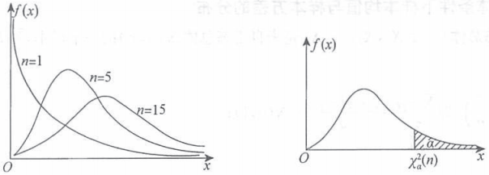
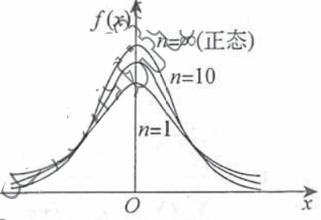
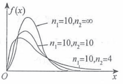
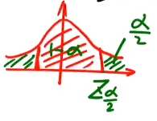
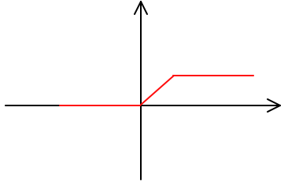
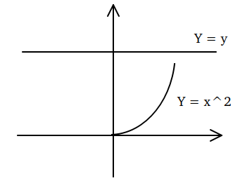
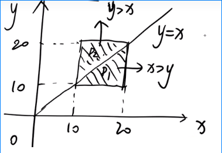
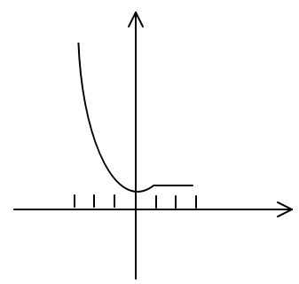
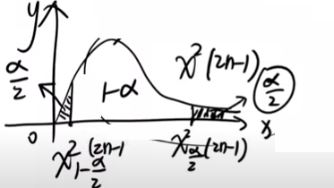

# 书籍链接
* [题目分册,101, 到了,113](file:///media/easul/D4B4E1AFB4E19470/Software/%E5%AD%A6%E4%B9%A0/%E8%80%83%E7%A0%94/%E8%B5%84%E6%96%99/%E6%95%B0%E5%AD%A6/%E8%B5%84%E6%96%99/2020%E5%BC%A0%E5%AE%87%E9%A2%98%E6%BA%90%E6%B7%B1%E6%9E%901000%E9%A2%98-%E4%B9%A0%E9%A2%98%E5%88%86%E5%86%8C%EF%BC%88%E6%95%B0%E5%AD%A6%E4%B8%80%EF%BC%89.pdf)
* [解析分册,284, 到了,322](file:///media/easul/D4B4E1AFB4E19470/Software/%E5%AD%A6%E4%B9%A0/%E8%80%83%E7%A0%94/%E8%B5%84%E6%96%99/%E6%95%B0%E5%AD%A6/%E8%B5%84%E6%96%99/2020%E5%BC%A0%E5%AE%87%E9%A2%98%E6%BA%90%E6%B7%B1%E6%9E%901000%E9%A2%98-%E8%A7%A3%E6%9E%90%E5%88%86%E5%86%8C%EF%BC%88%E6%95%B0%E5%AD%A6%E4%B8%80%EF%BC%89.pdf)

# 基础知识
1. 随机事件与概率  
    概率论是使用微积分研究随机现象背后的客观规律  
    1. 随机事件与样本空间

    ```tex
    \displaystyle
    \footnotesize
    随机试验: 简称试验, 用E表示, 需满足  \\
    (1)试验可以在相同条件下重复进行  \\
    (2)试验所有可能结果明确知道, 且不止一个  \\
    (3)每次试验出现哪个结果事先不确定  \\
    随机事件: 简称事件, 用A, B, C表示, 是一次试验中可能出现, 也可能不出现的结果  \\
    必然事件: 记为\Omega, 为每次试验一定发生的事件 \\
    不可能事件: 记为\varnothing, 为每次试验一定不发生的事件  \\
    样本点: 记为\omega, 为随机试验每一个可能结果  \\
    样本空间: 也叫基本事件空间, 记为\Omega, 为样本点全部集合, \Omega = \{\omega\}  \\
    基本事件: 一个样本点构成的事件,  \\
    随机事件A由若干基本事件组成, 即A \subset \Omega,  \\
    \varnothing : 不可能事件  \\
    \Omega : 必然事件  \\
    事件A发生 \iff 构成A的基本事件必有一个发生  \\   
    ```

    2. 事件的关系与运算

    ```tex
    \displaystyle
    \footnotesize
    (1)关系: 包含, 相等, 相容, 对立  \\
    (2)运算: 和(并), 差, 交(积)  \\
    (3)相关名词解析  \\
    包含: A发生必导致B发生, 即B包含A(A被B包含), A \subset B  \\
    相等: A \subset B, B \subset A, A = B(A, B由相同试验结果构成)  \\
    交: A与B同时发生, 记为A \cap B或AB. 有限个事件同时发生, 即这些事件的交, 记为\bigcap_{i = 1}^n A_i  \\ 
    相容: AB \mathrlap{\,/}{=} \varnothing  \\
    互斥: 即A, B不相容, AB = \varnothing. 一些事件中任意两件事互斥, 则这些事互斥  \\
    并: (也叫和), 即A与B至少一个发生, 记为A \cup B. 有限个事件至少有一个发生, 即这些事件的并, 记为\bigcup_{i = 1}^n A_i  \\ 
    差: 即A发生, B不发生, 记为A - B  \\
    逆事件: (也叫对立事件), 即事件A不发生的事件, 记为\overline{A}  \\
    完备事件组: 由有限个(可列个)事件构成. 若\bigcup_{i = 1}^n = \Omega, 则A_iA_j = \varnothing (i \mathrlap{\,/}{=} j)  \\
    有限: 1 \to n  \\
    可列: 1 \to \infty  \\
    (4)定义推论
    由定义有: A - B = A - AB = A\overline{B}, B = \overline{A} \iff AB = \varnothing 且A \cup B = \Omega  \\
    样本空间是必然事件\Omega  \\
    (5)事件的运算律  \\
    先逆后交, 再并或差  \\
    吸收律: 若A \subset B, A \cap B = A, A \cup B = B  \\
    交换律: A \cup B = B \cup A, A \cap B = B \cap A  \\
    结合律: (A \cup B) \cup C = A \cup (B \cup C), (A \cap B) \cap C = A \cap (B \cap C)  \\
    分配率: A \cap (B \cup C) = (A \cap B) \cup (A \cap C), A \cup (B \cap C) = (A \cup B) \cap (A \cup C)  
    A \cap (B - C) = (A \cap B) - (A \cap C)  \\
    对偶率: (德摩根律)\overline{A \cup B} = \overline{A} \cap \overline{B}, \overline{A \cap B} = \overline{A} \cup \overline{B}  \\
    ```

    3. 概率的三种定义

    ```tex
    \displaystyle
    \footnotesize
    (1)概率描述性定义  \\
    P(A): 随机事件A发生的可能性大小  \\
    (2)概率统计性定义  \\
    频率: 相同条件下的重复试验, 事件A出现次数k与总试验次数n比值, 即\frac{k}{n}  \\
    概率: 当总试验次数充分大, 频率将稳定于p, p即概率  \\
    故频率只是概率的估计(如一批产品抽取样品估计合格率(概率))  \\
    (3)概率公理化定义  \\
    设随机事件的样本空间为\Omega, 每个事件A都有P(A), 且P(*)满足  \\
    非负性: P(A) \geqslant 0  \\
    规范型: P(\Omega) = 1  \\
    可列可加性: 对任意个互不相容事件(A_iA_j = \varnothing)有P(\bigcup_{i = 1}^\infty A_i) = \sum_{i = i}^\infty P(A_i)  \\
    则P(*)为概率, P(A)为A的概率  \\
    ```

    4. 古典概型和几何概型 

    ```tex
    \displaystyle
    \footnotesize
    (1)古典概型: 随机试验的概率模型, 其基本事件空间(样本空间)满足  \\
    (一)只有有限个基本事件(样本点), (二)每个基本事件(样本点)发生的可能性一样  \\
    若古典概型的基本事件有n个, 事件A的基本事件有k个(也叫有利于A的基本事件有k个), A的概率定义为  \\
    P(A) = \frac{k}{n} = \frac{A的基本事件数}{基本事件总数}, 古典概型算出的概率为古典概率  \\
    (2)几何概型: 随机试验的概率模型, 其基本事件空间(样本空间)满足  \\
    (一)基本事件空间(样本空间)\Omega是一个可度量的有界区域(二)每个基本事件(样本点)发生的可能性相同  \\
    几何概型基本事件发生的可能性为样本点落入\Omega子区域s的可能性(与s大小有关, 与位置,形状无关)  \\
    若几何概型的S_A为\Omega的可度量子区域, A = \{样本点落入S_A\}的概率为P(A) = \frac{S_A}{\Omega}, 结果为几何概率  \\
    (3)古典概型和几何概型区别  \\
    古典概型: 基本事件有限, 等可能性的随机试验  \\
    几何概型: 基本事件无限且有几何度量, 等可能性的随机试验  \\
    ```

    5. 概率的基本性质与公式

    ```tex
    \displaystyle
    \footnotesize
    (1)性质  \\
    有界性: 任意事件A, 有0 \leqslant P(A) \leqslant 1, P(\varnothing) = 0, P(\Omega) = 1  \\
    P(A) = 0并不代表A是不可能事件(如9点到10点到教室, 9点半到的概率)  \\
    P(A) = 1并不代表A是必然事件(如9点到10点到教室, 9点半一定不到的概率)  \\
    单调性: A, B是两个事件, 若A \subset B, P(B - A) = P(B) - P(A) \geqslant 0, P(B) \geqslant P(A)  \\
    (2)公式  \\
    逆事件概率公式: P(\overline{A}) = 1 - P(A)  \\
    加法公式: 任意两个事件A, B, P(A \cup B) = P(A) + P(B) - P(A \cap B) = P(A) + P(B) - P(AB)  \\
    推广加法公式1: 任意三个事件A, B, C, P(A \cup B \cup C) = P(A) + P(B) + P(C) - P(AB) - P(BC) - P(AC) + P(ABC)  \\
    推广加法公式2: 任意n个事件A_i, P(\bigcup_{i = 1}^n A_i) = \sum_{i = 1}^n P(A_i) -  \sum_{1 \leqslant i < j \leqslant n} P(A_iA_j) + \sum_{1 \leqslant i < j < k \leqslant n} P(A_iA_jA_k) + ... + (-1)^{n - 1}P(A_1...A_n)  \\
    推广加法公式3: 任意n个互斥事件, P(\bigcup_{i = 1}^n A_i) = \sum_{i = 1}^n P(A_i)  \\
    减法公式: 任意两个事件A, B, P(A - B) = P(A) - P(AB) = P(A\overline{B})  \\
    条件概率: 在已知事件A发生的条件下, B发生的概率  \\
    任意两个事件A, B, 若P(A) > 0, P(B|A) = \frac{P(AB)}{P(A)}  \\
    概率的一切性质都适用于条件概率: P(\overline{B}|A) = 1 - P(B|A),  \\
    P(B - C|A) = P(B | A) - P(BC|A) = P(B\overline{C}|A), 就后边多个|A  \\
    乘法公式: 若P(A) > 0, P(AB) = P(A)P(B|A) = P(B)P(A|B)  \\
    如果A, B是独立事件, P(AB)=P(A)P(B)  \\
    推广乘法公式: 若n >2, P(A_1...A_n) = P(A_1)P(A_2|A_1)P(A_3|A_1A_2)...P(A_n|A_1...A_{n-1})  \\
    全概率公式: 若\bigcup_{i = 1}^n A_i = \Omega, A_iA_j = \varnothing(i \mathrlap{\,/}{=} j), P(A_i) > 0, 则对任一事件B  \\
    有B = \bigcup_{i = 1}^n A_iB, P(B) = \sum_{i = 1}^n P(A_i)P(B | A_i)  \\
    P(B) = P(\bigcup_{i = 1}^n A_iB) = \sum_{i = 1}^n P(A_i)P(B | A_i) + P(A_1BA_2B) + ... + P(A_{n - 1}BA_nB) + ... + P(A_1B...A_nB)  \\
    因为任意A_i和A_j不会同时发生(基本事件不同时发生), 故A_1BA_2B = \varnothing, 所以除了第一个求和式子, 后边的概率都是0  \\
    贝叶斯公式: (逆概率公式)若\bigcup_{i = 1}^n A_i = \Omega, A_iA_j = \varnothing(i \mathrlap{\,/}{=} j), P(A_i) > 0, \\
    则对任一事件B, 若P(B) > 0, P(A_j | B) =  \frac{P(A_jB)}{P(B)} = \frac{P(A_j)P(B | A_j)}{\sum_{i = 1}^n P(A_i)P(B | A_i)}  \\
    (3)相关解析  \\
    P(B)是在\Omega下发生的概率, P(B | A)是在A下发生的概率, 样本空间变小了  \\
    全概率公式是用于计算在所有原因A_i下结果B发生的可能性大小, 全概率公式计算P(B)是全集分解法  \\
    贝叶斯公式是用于计算导致结果B的原因A_i的可能性大小  \\
    ```

    6. 事件的独立性和独立重复试验

    ```tex
    \displaystyle
    \footnotesize
    (1)独立定义  \\
    事件独立描述定义: (A_i独立)任何一个或几个事件发生的概率不受另一个或几个事件发生概率的影响  \\
    事件独立数学定义: P(AB) = P(A)P(B), 则A,B独立  \\
    若有A, B, C  \\
    P(AB) = P(A)P(B)  \\
    P(AC) = P(A)P(C)  \\
    P(BC) = P(B)P(C)  \\
    P(ABC) = P(A)P(B)P(C)  \\
    如果不满足上边第四条, 则A, B, C两两独立, 如果都满足, 则A, B, C相互独立  \\
    (2)独立的判定  \\
    (一)A, B独立 \iff A, \overline{B}独立 \iff \overline{A}, B独立 \iff \overline{A}, \overline{B}独立  \\
    (二)若P(A) > 0, A, B独立 \iff P(B|A) = P(B)  \\
    若0 < P(A) < 1, A, B独立 \iff P(B|\overline{A}) = P(B|A) = P(B) \iff P(\overline{B}|\overline{A}) + P(B|A) = 1  \\
    (三)相互独立的事件组中任意几个事件换成其对立事件, 新事件组仍相互独立  \\
    (四)独立事件不含相同事件做运算, 新事件组仍独立(A, B, C, D独立, AB, CD独立, A, B - CD独立)  \\
    (五)P(A) = 0或P(A) = 1, 则A与任意事件独立  \\
    A = \Omega或A = \varnothing, A与任意事件独立  \\
    (3)独立与包含, 互斥的关系  \\
    0 < P(A) < 1, 0 < P(B) < 1, A, B互斥或包含(P(AB) = 0, P(AB) = P(A)), 则A, B一定不独立  \\
    (现实世界往往几个事件两两独立, 则相互独立)
    (4)试验独立性: 各个实验结果相互独立(有E_1结果A_1, E_2结果A_2, (P(A_1A_2)=P(A_1)P(A_2))  \\
    若E_i的结果A_i相互独立, 则n个试验相互独立  \\
    (5)两种试验概型  \\
    独立试验序列概型: 独立重复试验下, 每次试验结果和结果概率不变, 每次试验相互独立  \\
    n重伯努利概型: 独立重复试验下, 每次试验只有两种结果, 且结果概率不变, 每次试验相互独立  \\
    A发生k次的概率P(A) = C_n^kp^k(1 - p)^{n - k}, 若X为发生的次数, 则X服从二项分布B(n, p)  \\
    (6)常识  \\
    排列: A_n^m = \frac{n!}{(n - m)!}  \\
    全排列: m = n时的情况, 即A_n^m = n!  \\
    组合: C_n^m = \frac{n!}{(n - m)!m!}  \\
    \sqrt{p(A)P(B)} \leqslant \frac{P(A) + P(B)}{2}, P(B|A) = \frac{P(BA)}{B} \geqslant P(BA)  \\
    \{max\{X, Y\} \leqslant a\} = \{X \leqslant a, Y \leqslant a\} = \{X \leqslant a\} \cap \{ Y \leqslant a\}(大的在小部分, 所以取交)  \\
    \{max\{X, Y\} \geqslant a\} = \{X \geqslant a\} \cup \{ Y \geqslant a\}(大的在大部分, 所以取并)  \\
    \{min\{X, Y\} \leqslant a\} = \{X \leqslant a, Y \leqslant a\} = \{X \leqslant a\} \cup \{ Y \leqslant a\}(小的在大部分, 所以取并)  \\
    \{min\{X, Y\} \geqslant a\} = \{X \geqslant a\} \cap \{ Y \geqslant a\}(小的在小部分, 所以取交)  \\
    \{max\{X, Y\} \leqslant a\} = \{X \leqslant a, Y \leqslant a\} \subset \{X + Y \leqslant 2a\} \subset \{X \leqslant a\} \cup \{Y \leqslant a\} \subset \{min\{X, Y\} \leqslant a\}  \\
    \{min\{X, Y\} > a\} = \{X > a, Y > a\} \subset \{X > a\} \cup \{Y > a\} \subset \{max\{X, Y\} > a\}  \\
    ```

2. 一维随机变量及其分布
    1. 随机变量及其分布函数
    
    ```tex
    \displaystyle
    \footnotesize
    随机变量: 记为X, 表示随机事件对应的结果, 实质是实值单值函数, 定义域不一定是实数集  \\
    分布函数  \\
    (概念)若X是随机变量, x是任意实数, 则F(x) = P\{X \leqslant x\}是X的分布函数, X服从F(x)(X \sim F(x))  \\
    分布函数描述了随机变量的概率规律性  \\
    (性质: 分布函数的充要条件)  \\
    F(x)是x的单调不减函数, 即若x_1 < x_2, 有F(x_1) < F(x_2)  \\
    F(x)是x的右连续函数, \lim\limits_{x \to x_0^+}F(x) = F(x_0+0) = F(x_0)  \\
    F(-\infty) = \lim\limits_{x \to -\infty}F(x) = 0, F(+\infty) = \lim\limits_{x \to +\infty}F(x) = 1  \\
    满足上边三条性质的F(x)必为某个随机变量的分布函数, 为F(x)是否为随机变量X的分布函数的充要条件  \\
    分布函数是事件的概率(相当于很多样本点概率的相加), 故0 \leqslant F(x) \leqslant 1, F(x)是有界函数  \\
    (应用: 求概率)  \\
    P\{X \leqslant a\} = F(a)  \\
    P\{X < a\} = F(a-0)  \\
    P\{X = a\} = F(a) - F(a-0)  \\
    ```

    2. 常见随机变量

    ```tex
    \displaystyle
    \footnotesize
    (1)离散型随机变量及其概率分布  \\
    离散型随机变量: 随机变量取值为有限个或可列个  \\
    分布列: (分布律, 概率分布)为p_i = P\{X = x_i\}, 记为X \sim p_i, 表格表示为
    \boxed{\def\arraystretch{1.5}
        \begin{array}{c|c}
               X & x_1 \space x_2  \\
        \hline P & p_1 \space p_2  \\
    \end{array}}  \\
    \{p_i\}是离散型随机变量的概率分布 \iff p_i \geqslant 0 且\sum p_i = 1  \\
    分布函数: F(x) = P\{X \leqslant x\} = \sum_{x_i \leqslant x}P\{X = x_i\}  \\
    p_i = P\{X = x_i\} = P\{X \leqslant x_i\} - P\{X < x_i\} = F(x_i) - F(x_i-0)  \\
    P\{a < X \leqslant b\} = P\{X \leqslant b\} - P\{X \leqslant a\} = F(b) - F(a)  \\
    对实数轴任一集合B, 有P\{X \in B\} = \sum_{x_i \in B}P\{X = x_i\}  \\
    \red{总结理解}: X是随机事件对应的数, 而p_i = P\{X = x_i\}相当于列举出了所有可列的随机事件的概率  \\
    F(x) = P\{X \leqslant x\}相当于用一个小于等于号来总的包括所有事件, 其实际就是所有单个事件概率p_i = P\{X = x_i\}的总和  \\
    (2)连续型随机变量及其概率概率密度  \\
    连续型随机变量: 随机变量有无数个  \\
    分布函数: F(x) = \int_{-\infty}^x f(t)dt(x \in R), 其中f(x)非负可积  \\
    连续型随机变量: 分布函数中的X  \\
    概率密度(函数): 分布函数的f(x), 记为X \sim f(x)  \\
    f(x)是X的概率密度 \iff f(x) \geqslant 0, \int_{-\infty}^{+\infty}f(x)dx = 1(去掉有限个点, f(x)仍是概率密度)  \\
    P\{a < X < b \} = P\{a < X \leqslant b \} = P\{a \leqslant X < b \} = P\{a \leqslant X \leqslant b \} = \int_a^b f(x)dx = F(b) - F(a)  \\
    F(x)是概率, F'(x) = f(x)  \\
    若X \sim f(x), 有任意实数c, 则P\{X = c\} = 0 = P\{X \leqslant c\} - P\{X < c\}  \\
    若X \in B, 则P\{X \in B\} = \int_{B} f(x)dx  \\
    注: 若X \sim f(x), 则分布函数F(x)为连续函数, 在f(x)的连续点x_0处, F'(x_0) = f(x_0)  \\
    若F(x)连续, 除有限个点, F'(x)存在且连续, 则随机变量X为连续型随机变量, f(x) = F'(x)(F'(x)连续且存在的位置)  \\
    连续型随机变量的分布函数不可导的点, 概率密度看成0, 因为改变概率密度个别点的值不影响分布函数  \\
    ```

    3. 常见随机变量的分布类型

    ```tex
    \displaystyle
    \footnotesize
    (1)离散型  \\
    0-1分布: B(1,p)(只有两个随机变量, 叫做X服从参数为p的0-1分布)  \\
    二项分布: B(n, p)(只有两种情况, 某种情况发生了k次, X服从参数为(n, p)的二项分布, P\{X = k\}=C_n^kp^K(1 - p)^{n - k}, k = 0, 1, 2...)  \\
    X是n重伯努利试验A发生的次数, 则X \sim B(n, p),p = P(A)  \\
    泊松分布: P(\lambda)(X服从参数为\lambda的泊松分布, P\{X = k\}=\frac{\lambda^k}{k!}e^{-\lambda}, \lambda>0), k = 0, 1, 2...  \\
    若X \sim B(n, p), n很大, p很小, \lambda = np适中, 则C_n^kp^k(1 - p)^{n - k} \approx \frac{\lambda^k}{k!}e^{-\lambda}
    n \geqslant 20, p \leqslant 0.05逼近效果较好, n \geqslant 100, np \leqslant 10逼近效果更好  \\
    几何分布: G(p)(X服从参数为p的几何分布, P\{X = k\}=(1 - p)^{k - 1}p), k = 1, 2...  \\
    若X表示伯努利试验中A首次发生所需试验次数, X \sim G(p), p = P(A)  \\  
    超几何分布: H(n, N, M)(X服从参数为(n, N, M)的超几何分布, P\{X = k\} = \frac{C_M^kC_{N-M}^{n - k}}{C_N^n}), 这里  \\
    max\{0, n - N + M\} \leqslant k \leqslant min\{M, n\}, n, N, M为正整数且M \leqslant N, n \leqslant N  \\
    一次取出n个, 有k个次品的概率是超几何分布  \\
    (2)连续型  \\
    均匀分布: U(a, b), 随机变量的概率密度为f(x) = \begin{cases}
    \frac{1}{b - a}, a < x < b  \\
    0, 其他  \\
    \end{cases}, 分布函数为F(x) = \begin{cases}
    0, x < a  \\
    \frac{x - a}{b - a}, a \leqslant x < b  \\
    1, x \geqslant b  \\
    \end{cases}  \\
    X服从参数为(a, b)的均匀分布  \\
    几何概型是均匀分布的背景, 计算几何概率可以用均匀分布  \\
    指数分布: E(\lambda), 随机变量X的概率密度为f(x) = \begin{cases}
    \lambda e^{-\lambda x}, x > 0  \\
    0, 其他  \\
    \end{cases}, 分布函数为F(x) = \begin{cases}
    1 - e^{-\lambda x}, x \geqslant 0  \\
    0, x < 0  \\
    \end{cases}  \\
    X服从参数为\lambda的指数分布  \\
    正态分布: N(\mu, \sigma^2), 随机变量X的概率密度为f(x) = \frac{1}{\sqrt{2\pi}\sigma}e^{-\frac12(\frac{x - \mu}{\sigma})^2}(-\infty < x < +\infty), -\infty < \mu < +\infty, \sigma > 0  \\
    X服从参数为(\mu, \sigma^2)的正态分布(正态变量), f(x)关于x=\mu对称, x = \mu是对称轴, f(\mu - x) = f(\mu + x), f(x)_{max} = f(\mu) = \frac{1}{\sqrt{2\pi}\sigma}  \\
    标准正态分布: \mu = 0, \sigma = 1, 概率密度为\varphi(x) = \frac{1}{\sqrt{2\pi}}e^{-\frac12x^2},
    分布函数为\varPhi(x) = \frac{1}{\sqrt{2\pi}}\int_{-\infty}^x e^{-\frac{t^2}{2}}dt  \\
    \varphi(x)为偶函数, \varPhi(0) = \frac12, \varPhi(-x) = 1 - \varPhi(x)  \\
    若X \sim N(0, 1), P\{X > \mu_a\} = a, 则\mu_a为标准正态分布的上侧a分位数(上a分位点)  \\
    若X \sim N(\mu, \sigma^2), F(x) = P\{X \leqslant x\} = \varPhi(\frac{x - \mu}{\sigma})  \\
    F(\mu - x) + F(\mu + x) = 1, P\{a < X < b\} = \varPhi(\frac{b - \mu}{\sigma}) - \varPhi(\frac{a - \mu}{\sigma})  \\
    aX + b \sim N(a\mu + b, a^2\sigma^2)(a \mathrlap{\,/}{=} 0)  \\
    \red{重点注意}正态分布的标准化和对称性  \\
    标准化: 若X \sim N(\mu, \sigma^2), 则\frac{X - \mu}{\sigma} \sim N(0, 1)  \\
    正态分布的分布函数严格单调递增(概率密度的面积始终是正的)  \\
    正态分布的分布函数有反函数  \\
    ```
3. 一维随机变量函数的分布

```tex
\displaystyle
\footnotesize
(1)随机变量X的函数: 随机变量X做自变量, Y = g(X)的Y也是随机变量, g(X)就是随机变量X的函数, 可为一元二次函数, 分段函数, 绝对值函数等  \\
(2)随机变量函数的分布  \\
(一)离散型  \\
X是离散型随机变量, 概率分布为p_i = P\{X = x_i\}, X的函数Y =g(X)也是离散型随机变量  \\
概率分布为p_i = P\{Y = g(x_i)\}, 即 \boxed{\def\arraystretch{1.5}
    \begin{array}{c|c}
           Y & g(x_1) \space g(x_2) ... \\
    \hline P & p_1 \space p_2 ...  \\ 
\end{array}}  \\
多个g(x_k)相同, 则相加合并即可  \\
(二)连续型  \\
X是连续型随机变量, 概率密度和分布函数为f_X(x), F_X(x), 随机变量函数为Y = g(X), Y的分布函数或概率密度为  \\
定义法(分布函数法)  \\
F_Y(y) = P\{Y \leqslant y\} = P\{g(X) \leqslant y\} = \int_{g(X) \leqslant y} f_X(x)dx  \\
若F_Y(y)连续, F_Y'(y)除有限个点都存在且连续, 则f_Y(y) = F_Y'(y)  \\
公式法  \\
若y = g(x)在(a, b)上关于x严格单调可导, 则有反函数x = h(y)  \\
y = g(x)单调增加, 则x = h(y)单调增加, h'(y) > 0  \\
F_Y(y) = P\{Y \leqslant y\} = P\{g(X) \leqslant y\} = P\{X \leqslant h(y)\} = \int_{-\infty}^{h(y)}f_X(x)dx  \\
f_Y(y) = f_X(h(y))*h'(y)  \\
y = g(x)单调减少, 则x = h(y)单调减少, h'(y) < 0  \\
F_Y(y) = P\{Y \leqslant y\} = P\{g(X) \leqslant y\} = P\{X \geqslant h(y)\} = \int_{h(y)}^{+\infty}f_X(x)dx  \\
f_Y(y) = -f_X(h(y))*h'(y)f_X(h(y))*[-h'(y)]  \\
故f_Y(y) = \begin{cases}
f_X(h_1(y))*|h_1'(y)| + f_X(h_2(y))*|h_2'(y)| + ... + f_X(h_n(y))*|h_n'(y)|, c < y < d  \\
0, 其他  \\
\end{cases}  \\
a = min\{g(a), g(b)\}, b = max\{g(a), g(b)\}, x的范围就是概率密度不为0的范围  \\
若区间是分段单调可导的, 则可以每段上使用公式法, 即  \\
f_Y(y) = \begin{cases}
f_X(h(y))*|h'(y)|, c < y < d  \\
0, 其他  \\
\end{cases}  \\
若X是连续型, Y = g(X)是离散型, 则先得到Y取值a, 然后通过P\{Y = a\}得到Y的概率分布  \\ 
```

4. 多维随机变量及其分布
    1. 二维随机变量及分布函数
        
    ```tex
    \displaystyle
    \footnotesize
    n维随机变量: 定义在同一个样本空间\Omega上的n个随机变量X_1, X_2, ..., X_n  \\
    二维随机变量: 定义在同一个样本空间\Omega上的2个随机变量(X, Y)  \\
    n维随机变量联合分布函数: F(x_1, x_2, ..., X_n) = P\{X_1 \leqslant x_1, X_2 \leqslant x_2, ..., X_n \leqslant x_n\}  \\
    二维随机变量联合分布函数: F(x, y) = P\{X \leqslant x, Y \leqslant y\}, 记为(X, Y) \sim F(x, y)  \\
    F(x, y)是事件A = \{X \leqslant x\}, B = \{Y \leqslant y\}同时发生的概率, 则0 \leqslant F(x, y) \leqslant 1  \\
    二元函数F(x, y)为二元随机变量(X, Y)分布函数的充要条件{:}  \\
    (1)单调性: F(x, y)单调不减[x_1 < x_2, F(x_1, y) \leqslant F(x_2, y); y_1 < y_2, F(x, y_1) \leqslant F(x, y_2)]  \\
    (2)右连续: F(x, y)是右连续函数\lim\limits_{x \to x_0^+} F(x, y) = F(x_0+0, y) = F(x_0, y),
    \lim\limits_{y \to y_0^+} F(x, y) = F(x, y_0+0) = F(x, y_0)  \\
    (3)有界性: F(-\infty, y) = F(x, -\infty) = F(-\infty, -\infty) = 0, F(+\infty, y) = F(x, +\infty) = F(+\infty, +\infty) = 1  \\
    (4)非负性: 若x_1 < x_2, y_1 < y_2, P\{x_1 < X \leqslant x_2, y_1 < Y \leqslant y_2\} = F(x_2, y_2) - F(x_2, y_1) - F(x_1, y_2) + F(x_1, y_1)  \geqslant 0  \\
    边缘分布函数: (X, Y)联合分布函数为F(x, y), 随机变量X, Y的分布函数F_X(x), F_Y(y)是(X, Y)关于X, Y的边缘分布函数  \\
    F_X(x) = P\{X \leqslant x\} = P\{X \leqslant x, Y < +\infty\} = \lim\limits_{y \to +\infty} P\{X \leqslant x, Y \leqslant y\}
    = \lim\limits_{y \to +\infty} F(x, y) = F(x, +\infty)  \\
    F_Y(y) = F(+\infty, y)  \\
    ```

    2. 常见二维随机变量

    ```tex
    \displaystyle
    \footnotesize
    (1)二维离散型随机变量: 只能取可列或有限对值(x_1, y_1), (x_1, y_2), ..., (x_n, y_n)  \\
    联合分布律: p_{ij} = P\{X = x_i, Y = y_j\}, i, j = 1, 2,..., 叫做(X, Y)的分布律或随机变量X, Y的联合分布律(概率分布), 记为(X, Y) \sim p_{ij}   \\
    联合分布律可用矩阵表示: \boxed{\def\arraystretch{1.5}
        \begin{array}{c|c|c|c|c|c}
               X\searrow Y & y_1 & y_2 & ... & y_j & P\{X = x_i\} \\
        \hline x_1 & p_{11} & p_{12} & ... & p_{1j} & p_{1.} \\
        \hline x_2 & p_{21} & p_{22} & ... & p_{2j} & p_{2.} \\
        \hline ... & ... & ... & ... & ... & ...  \\
        \hline x_i & p_{i1} & p_{i2} & ... & p_{ij} & p_{i.} \\
        \hline P\{Y = y_j\} & p_{.1} & p_{.2} & ... & p_{.j} & 1 \\
    \end{array}}  \\
    数列\{p_{ij}\}, i, j = 1, 2, ...为二维离散型随机变量的概率分布 \iff p_{ij} \geqslant 0 且 \sum_{i = 1}^n\sum_{j = 1}^n p_{ij} = 1  \\
    联合分布函数: (X, Y)的概率分布为p_{ij}, (X, Y)的联合分布函数F(x, y) = P\{X \leqslant x, Y \leqslant y\} = \sum_{x_i \leqslant x}\sum_{y_j \leqslant y}^y p_{ij}  \\
    P\{(X, Y) \in G\} = \sum_{(x_i, y_j) \in G} p_{ij}  \\ 
    边缘分布: X的边缘分布p_{i.} = P\{X = x_i\} = \sum_{j = 1}^n P\{X = x_i, Y = y_j\} = \sum_{j = 1}^n p_{ij}(i = 1, 2...) \\
    Y的边缘分布p_{.j} = P\{Y = y_j\} = \sum_{i = 1}^n P\{X = x_i, Y = y_j\} = \sum_{i = 1}^n p_{ij}(j = 1, 2...)  \\
    条件分布: (X, Y) \sim p_{ij}  \\
    对于固定j, p_{.j} = P\{Y = y_j\} > 0, P\{X = x_i| Y = y_j\} = \frac{P\{X = x_i, Y = y_j\}}{P\{Y = y_j\}} = \frac{p_{ij}}{p_{.j}}(i = 1, 2...)为X在Y = y_j下的条件分布 \\
    P\{Y = y_j| X = x_i\} = \frac{P\{X = x_i, Y = y_j\}}{P\{X = x_i\}} = \frac{p_{ij}}{p_{i.}}(j = 1, 2..)为Y在X = x_i下的条件分布  \\
    (2)二维连续型随机变量: 能取无限对值  \\
    联合分布函数: F(x, y) = P\{X \leqslant x, Y \leqslant y\} = \int_{-\infty}^x\int_{-\infty}^y f(u, v)dudv, (x, y) \in R^2  \\
    概率密度: f(x, y), (X, Y) \sim f(x, y)  \\
    二元函数f(x, y)是某二维随机变量的概率密度 \iff f(x, y) \geqslant 0, \int_{-\infty}^{+\infty}\int_{-\infty}^{+\infty} f(x, y)dxdy = 1  \\
    改变f(x, y)有限个点值(仍取非负值), f(x, y)仍是概率密度  \\
    P\{(X, Y) \in G\} = \iint_{G} f(x, y)dxdy  \\
    f(x, y) = \begin{cases}
    \frac{\partial^2 F(x, y)}{\partial x\partial y} = f(x, y), F(x, y)在(x, y)二阶可偏导数  \\
    0, F(x, y)在(x, y)二阶不偏导  \\ 
    \end{cases}  \\ 
    边缘概率密度: (X, Y) \sim f(x, y) \\
    X的边缘分布函数F_X(x) = F(x, +\infty) = \int_{-\infty}^x\int_{-\infty}^{+\infty}f(u, v)dudv, X是连续型随机变量  \\
    X的边缘概率密度f_X(x) = \int_{-\infty}^{+\infty}f(x, y)dy  \\
    Y的边缘分布函数F_Y(y) = F(+\infty, y) = \int_{-\infty}^y\int_{-\infty}^{+\infty}f(u, v)dudv, Y是连续型随机变量  \\
    Y的边缘概率密度f_Y(y) = \int_{-\infty}^{+\infty}f(x, y)dx  \\
    条件概率密度: (X, Y) \sim f(x, y) \\
    f_X(x) > 0, f_{Y|X}(y|x) = \frac{f(x, y)}{f_X(x)}是Y在X=x下的条件概率密度  \\
    f_Y(y) > 0, f_{X|Y}(x|y) = \frac{f(x, y)}{f_Y(y)}是X在Y=y下的条件概率密度  \\
    f_X(x) > 0, f_Y(y) > 0, f(x, y) = f_X(x)f_{Y|X}(y|x) = f_Y(y)f_{X|Y}(x|y)  \\
    F_{Y|X}(y|x) = \int_{-\infty}^y f_{Y|X}(y|x)dy = \int_{-\infty}^y \frac{f(x, y)}{f_X(x)} dy为Y在X=x下的条件分布函数  \\
    F_{X|Y}(x|y) = \int_{-\infty}^x f_{X|Y}(x|y)dx = \int_{-\infty}^y \frac{f(x, y)}{f_Y(y)} dy为X在Y=y下的条件分布函数  \\
    (3)常见二维分布  \\
    (一)二维均匀分布  \\
    若(X, Y)概率密度为f(x, y) = \begin{cases}
    \frac{1}{S_D}, (x, y) \in D  \\
    0, 其他  \\
    \end{cases},  (X, Y)在D服从二维均匀分布,  \\
    (二)二维正态分布  \\
    若(X, Y)概率密度为f(x, y) = \frac{1}{2\pi\sigma_1\sigma_2\sqrt{1 - \rho^2}}e^{-\frac{1}{2(1 - \rho^2)}
    [(\frac{x - \mu_1}{\sigma_1})^2 - 2\rho(\frac{x - \mu_1}{\sigma_1})(\frac{y - \mu_2}{\sigma_2}) + (\frac{y - \mu_2}{\sigma_2})^2]}  \\
    (X, Y)服从参数为(\mu_1, \mu_2, \sigma_1^2, \sigma_2^2, \rho)的二维正态分布  \\
    X \sim N(\mu_1, \sigma_1^2), Y \sim N(\mu_2, \sigma_2^2), \rho为X, Y相关系数, \rho = \frac{Cov(X, Y)}{\sqrt{DX}\sqrt{DY}} =\frac{Cov(X, Y)}{\sigma_1\sigma_2}  \\
    X, Y的条件分布, 边缘分布都是正态分布  \\
    X \sim N(\mu_1, \sigma_1^2), Y \sim N(\mu_2, \sigma_2^2)且X, Y独立, 则aX + bY服从正态分布  \\
    X与Y相互独立, 协方差为0, X与Y不相关, 即\rho = 0; 但X, Y不相关, X, Y可能不独立(参考11.131)  \\
    ```

    3. 随机变量的相互独立性

    ```tex
    \displaystyle
    \footnotesize
    (1)基础概念  \\
    X与Y独立: (X, Y)联合分布函数为F(x, y), 边缘分布函数为F_X(x), F_Y(y), 若对任意实数x, y有  \\
    F(x, y) = F_X(x)F_Y(y)(事件\{X \leqslant x\}, \{Y \leqslant y\}独立), 则X, Y独立  \\
    X_1, X_2, ..., X_n独立: F(x_1, x_2, ...,x_n) = F_1(x_1)F_2(x_2)...F_n(x_n)  \\
    X_1, X_2, ..., X_n相互独立, 则任意X_1, x_2, ..., X_k(k \geqslant 2)相互独立  \\
    两个多维随机变量(X_1, X_2, ..., X_n)与(Y_1, Y_2, ..., Y_m)相互独立, 则对任意实数x_i, y_j有  \\
    P\{X_1 \leqslant x_1, X_2 \leqslant x_2, ..., X_n \leqslant x_n;Y_1 \leqslant y_1, Y_2 \leqslant y_2, ..., Y_m \leqslant y_m\} = P\{X_1 \leqslant x_1, X_2 \leqslant x_2, ..., X_n \leqslant x_n\}P\{Y_1 \leqslant y_1, Y_2 \leqslant y_2, ..., Y_m \leqslant y_m\}  \\
    联合分布函数 = 各自分布函数相乘  \\
    F(x_1, x_2, ..., x_n;y_1, y_2, ...,y_m) = F_1(x_1, x_2, ..., x_n)F_2(y_1, y_2, ...,y_m)  \\
    (2)相互独立的充要条件  \\
    n个随机变量X_1, X_2, ..., X_n相互独立 \iff n个事件\{X_1 \leqslant x_1\}, \{X_2 \leqslant x_2\}, ..., \{X_n \leqslant x_n\}相互独立  \\
    (X, Y)为二维离散型随机变量, 则X, Y相互独立 \iff 联合分布 = 边缘分布相乘, P\{X = x_i, Y = y_j\} = P\{X = x_i\}P\{Y = y_j\}(i,j=1,2...)  \\
    n个离散型随机变量X_1, X_2, ..., X_n相互独立 \iff P\{X_1 = x_1, ..., X_n = x_n\} = \prod_{i = 1}^nP\{X_i = x_i\}  \\
    (X, Y)为二维连续型随机变量, 则X, Y相互独立 \iff 概率密度 = 边缘概率密度相乘, f(x, y) = f_X(x)f_Y(y)  \\
    (X_1, X_2, ..., X_n)为n维连续型随机变量, X_1, X_2, ..., X_n相互独立 \iff 概率密度 = 边缘概率密度相乘, f(x_1, x_2, ..., x_n) = f_1(x_1)f_2(x_2)...f_n(x_n)  \\
    (3)相互独立的性质  \\
    X_1, X_2, ..., X_n相互独立, 则任意X_1, x_2, ..., X_k(k \geqslant 2)相互独立  \\
    (X, Y)为二维离散型随机变量, 则条件分布等于边缘分布  \\
    P\{X = x_i|Y = y_j\} = P\{X = x_i\}(P\{Y = y_j\} > 0)  \\
    P\{Y = y_j|X = x_i\} = P\{Y = y_j\}(P\{X = x_i\} > 0)  \\
    (X, Y)为二维连续型随机变量, 则条件概率密度 = 边缘概率密度   \\
    f_{X|Y}(x|y) = \frac{f(x, y)}{f_Y(y)} = f_X(x)(f_Y(y) > 0)  \\
    f_{Y|X}(y|x) = \frac{f(x, y)}{f_X(x)} = f_Y(y)(f_X(x) > 0)  \\
    X_1, X_2,..., X_n相互独立, g_1(x), g_2(x), ..., g_n(x)为一元连续函数, g_1(X_1), g_2(X_2), ..., g_n(X_n)相互独立  \\
    ```
    4. 总结
    
    ```tex
    \displaystyle
    \footnotesize
    \begin{cases}
    Z = X + Y, X是离散型随机变量, Y是连续型随机变量, 则Z是连续型随机变量, F_Z(z)处处连续  \\
    Z = XY, X是离散型随机变量, Y是连续型随机变量, 则 {\begin{cases}
    Z必为连续型随机变量, F_Z(z)处处连续, P\{X = 0\} = 0(X不取0)  \\
    Z既不是离散也不是连续型随机变量(奇异型随机变量), F_Z(z)有且仅有z = 0一个间断点, P\{X = 0\} \mathrlap{\,/}{=} 0(X取0)  \\
    \end{cases}}  \\
    \end{cases}  \\
    ```

5. 多维随机变量函数的分布

```tex
\displaystyle
\footnotesize
(1)概念  \\
随机变量X, Y的函数: U = g(X, Y)  \\
(2)二维离散型随机变量函数的分布{:}  \\
有p_{ij} = P\{X = x_i, Y = y_j\}(i, j = 1, 2...), 则  \\
(一)U = g(X, Y)也是离散型随机变量, 分布列为P\{U = g(x_i, y_j)\} = P\{X = x_i, Y = y_j\} = p_{ij}  \\
若多个g(x_i, y_j)相同, 需要把概率加起来  \\
U的分布函数F_U(u) = P\{U \leqslant u\} = P\{g(X, Y) \leqslant u\} = \sum_{g(x_i, y_j) \leqslant u} P\{X = x_i, Y = y_j\}  \\
(二)U = g_1(X, Y), V = g_2(X, Y), (U, V)是二维离散型随机变量, 求(U, V)的联合分布  \\
直接法  \\
P\{U = a, V = b\} = \sum_{g_1(x_i, y_j) =a  \\ g_2(x_i, y_j) =b} P\{X = x_i, Y = y_j\}  \\
边缘分布与条件分布法  \\
矩阵法  \\
(3)二维连续型随机变量函数的分布{:}  \\
(X, Y)是二维连续型随机变量, 有概率密度f(x, y)  \\
(一)U = g(X, Y)是离散型随机变量, U的概率分布为  \\
P\{U = u_i\} = \iint_{D} f(x, y)dxdy(i = 1, 2, ...)  \\
(二)U = g(X, Y)是非离散型随机变量, U的分布函数为  \\
F_U(u) = P\{U \leqslant u\} = \iint_{g(x, y) \leqslant u} f(x, y)dxdy  \\
(三)U = g(X, Y)是连续型随机变量  \\
(四)U = g_1(X, Y), V = g_2(X, Y)  \\
(U, V)联合分布函数F(u, v) = P\{g_1(X, Y) \leqslant u, g_2(X, Y) \leqslant v\} = \iint_{g_1(x, y) \leqslant u  \\ g_2(x, y) \leqslant v} f(x, y)dxdy  \\
若(U, V)是二维离散型随机变量, 求联合分布可如下  \\
直接法: P\{U = u_i, V = v_j\} = P\{g_1(X, Y) = u_i, g_2(X, Y) = v_j\} = P\{(X, Y) \in D\} = \iint_{D}f(x, y)dxdy(i, j = 1, 2,...)  \\
边缘分布法  \\
若(U, V)是二维连续型随机变量, 则先求联合分布函数, 再求概率密度  \\
(4)相互独立随机变量函数的分布  \\
(一)和的分布  \\
若(X, Y) \sim f(x, y), 则Z = X + Y的概率密度为f_Z(z) = \int_{-\infty}^{+\infty}f(x, z - x)dx = \int_{-\infty}^{+\infty}f(z - y, y)dy  \\
若X, Y相互独立, 有卷积公式f_Z(z) = \int_{-\infty}^{+\infty}f_X(x)f_Y(z - x)dx = \int_{-\infty}^{+\infty}f_X(z - y)f_Y(y)dy  \\
\red{X, Y独立, f(x, y) = g(x)h(y)}  \\
(二)差的分布  \\
若(X, Y) \sim f(x, y), 则Z = X - Y的概率密度为f_Z(z) = \int_{-\infty}^{+\infty}f(x, x - z)dx = \int_{-\infty}^{+\infty}f(y + z, y)dy  \\
若X, Y独立, 上式 = \int_{-\infty}^{+\infty}f_X(y + z)f_Y(y)dy = \int_{-\infty}^{+\infty}f_X(x)f_Y(x - z)dx   \\
若(X, Y) \sim f(x, y), 则Z = Y - X的概率密度为f_Z(z) = \int_{-\infty}^{+\infty}f(x, x + z)dx = \int_{-\infty}^{+\infty}f(y - z, y)dy  \\
若X, Y独立, 上式 = \int_{-\infty}^{+\infty}f_X(y - z)f_Y(y)dy = \int_{-\infty}^{+\infty}f_X(x)f_Y(x + z)dx   \\
(三)积的分布  \\
(随机变量可以为负)  \\
若(X, Y) \sim f(x, y), 则Z = XY的概率密度为f_Z(z) = \int_{-\infty}^{+\infty}\frac{1}{|x|}f(x, \frac{z}{x})dx = \int_{-\infty}^{+\infty}\frac{1}{|y|}f(\frac{z}{y}, y)dy  \\
若X, Y相互独立, 有f_Z(z) = \int_{-\infty}^{+\infty}\frac{1}{|x|}f_X(x)f_Y(\frac{z}{x})dx = \int_{-\infty}^{+\infty}\frac{1}{|y|}f_X(\frac{z}{y})f_Y(y)dy  \\
\red{在-\infty到0, x或y是负的}  \\
(四)商的分布  \\
若(X, Y) \sim f(x, y), 则Z = \frac{X}{Y}的概率密度为f_Z(z) = \int_{-\infty}^{+\infty} |y|f(yz, y)dy  \\
这里不先x后y是因为y有两个部分,算起来比较麻烦  \\
若X, Y独立, 有f_Z(z) = \int_{-\infty}^{+\infty} |y|f_X(yz)f_Y(y)dy  \\
\red{当y > 0, x \leqslant zy, 当y < 0, x \geqslant zy}  \\
若(X, Y) \sim f(x, y), 则Z = \frac{Y}{X}的概率密度为f_Z(z) = \int_{-\infty}^{+\infty} |x|f(x, zx)dy  \\
若X, Y独立, 有f_Z(z) = \int_{-\infty}^{+\infty} |x|f_X(x)f_Y(zx)dy  \\
(五)max\{X, Y\}的分布  \\
(X, Y) \sim F(x, y), 则Z = max\{X, Y\}的分布函数为F_Z(z) = P\{max\{X, Y\} \leqslant z\} = P\{X \leqslant z, Y \leqslant z\} = F(z, z)  \\
若X, Y独立, F_Z(z) = F_X(z)*F_Y(z)  \\
(六)min\{X, Y\}的分布  \\
(X, Y) \sim F(x, y), 则Z = min\{X, Y\}的分布函数为F_Z(z) = P\{min\{X, Y\} \leqslant z\} = P\{\{X \leqslant z\} \cup \{Y \leqslant z\}\} = P\{X \leqslant z\} + P\{Y \leqslant z\} - P\{X \leqslant z, Y \leqslant z\} = F_X(z) + F_Y(z) - F(z,z)  \\
若X, Y独立, F_Z(z) = F_X(z) + F_Y(z) - F_X(z)F_Y(z) = 1 - [1 - F_X(z)][1 - F_Y(z)]  \\
若n个随机变量独立, Z = min\{X_1, X_2, ..., X_n\}, F_Z(z) = 1 - [1 - F_{X_1}(z)][1 - F_{X_2}(z)]...[1 - F_{X_n}(z)]
若X_i独立且有相同分布函数F(x)与概率密度f(X), 则  \\
F_{min}(x) = [F(x)]^n, f_{min}(x) = n[F(x)]^{n - 1}f(x)  \\
F_{max}(x) = 1 - [1 - F(x)]^n, f_{max}(x) = n[1 - F(x)]^{n - 1}f(x)  \\
(七)常见分布可加性  \\
相互独立且服从同类型分布的随机变量, 其和的分布也是同类型的有: 二项分布, 泊松分布, 正态分布, \chi^2分布  \\
有X, Y相互独立,则有(有n个随机变量独立也有如下结论)  \\
若X \sim B(n, p), Y \sim B(m, p), 则X + Y \sim B(n + m, p)(p需要相等)  \\
若X \sim P(\lambda_1), Y \sim P(\lambda_2), 则X + Y \sim P(\lambda_1 + \lambda_2)  \\
若X \sim N(\mu_1, \sigma_1^2), Y \sim N(\mu_2, \sigma_2^2), 则X + Y \sim N(\mu_1 + \mu_2, \sigma_1^2 + \sigma_2^2)  \\
若X \sim \chi^2(n), Y \sim \chi^2(m), 则X + Y \sim \chi^2(n + m)  \\
```

6. 随机变量的数字特征
    1. 一维随机变量的数字特征

    ```tex
    \displaystyle
    \footnotesize
    EX, DX, \sqrt{DX}都只是一个数  \\
    (1)随机变量的数学期望  \\
    (一)定义  \\
    数学期望: 期望, 均值, 即所有随机变量的平均值  \\
    若有Y = g(X)  \\
    当X为离散型随机变量, 分布列为p_i = P\{X = x_i\}(i = 1, 2,...)  \\
    若\sum_{i = 1}^{\infty}x_ip_i绝对收敛, X数学期望存在, 为EX或E(X), 不绝对收敛则不存在  \\
    若\sum_{i = 1}^{\infty}g(x_i)p_i绝对收敛, Y数学期望存在, 为E[g(X)], 不绝对收敛则不存在  \\
    当X为连续型随机变量, 概率密度为f(x)  \\
    若\int_{-\infty}^{+\infty}xf(x)绝对收敛, X数学期望存在, 为EX或E(X), 不绝对收敛则不存在  \\
    若\int_{-\infty}^{+\infty}g(x)f(x)绝对收敛, Y数学期望存在, 为E[g(X)], 不绝对收敛则不存在  \\
    这里要求绝对收敛是因为X的期望与X的取值顺序无关, x_i取值顺序改变, 期望都应该存在  \\
    a \leqslant X \leqslant b, Ea \leqslant Ex \leqslant Eb  \\
    (二)性质  \\
    E(\sum_{i = 1}^{n}a_iX_i) = \sum_{i = 1}^na_iEX_i(和的期望 = 期望的和)  \\
    Ec = c, E(aX + c) = aEX + c, E(X \pm Y) = EX \pm EY  \\
    若X, Y独立, E(XY) = EXEY, E[g_1(X)g_2(Y)] = E[g_1(X)]E[g_2(Y)]  \\
    若X_1, X_2, ..., X_n独立, E(\prod_{i = 1}^nX_i) = \prod_{i = 1}^nEX_i, E[\prod_{i = 1}^ng_i(X_i)] = \prod_{i = 1}^nE[g_i(X_i)]  \\
    (2)随机变量的方差, 标准差, 切比雪夫不等式  \\
    (一)概念  \\
    方差: DX(Var(X)) = E[(X - EX)^2] = E[X^2 - 2XEX + (EX)^2] = E(X^2) - 2EXEX + (EX)^2 = E(X^2) - (EX)^2  \\
    标准差: (均方差)\sqrt{DX} = \sigma(X) = \sqrt{E(X^2) - (EX)^2}  \\
    标准化随机变量: X^* = \frac{X - EX}{\sqrt{DX}}, EX^* = 0, DX^* = 1(化简一下即得)  \\
    (二)性质  \\
    DX \geqslant 0, E(X^2) = DX + (EX)^2 \leqslant (EX)^2  \\
    Dc = 0(c为常数), DX = 0 \iff X处处为某个常数a, 即P\{X = a\} = 1  \\
    D(aX + b) = a^2DX  \\
    D(X \pm Y) = DX + DY \pm 2Cov(X, Y), D(\sum_{i = 1}^na_iX_i) = \sum_{i = 1}^na_i^2DX_i + 2\sum_{1 \leqslant i < j \leqslant 1}a_ia_jCov(X_i, X_j)  \\
    若X, Y独立, D(aX + bY) = a^2DX + b^2DY, D(X \pm Y) = DX + DY, D(XY) = DX*DY + DX(EY)^2 + DY(EX)^2 \geqslant DXDY  \\
    若X_1, X_2, ..., X_n独立, g_i(x)连续, D(\sum_{i = 1}^na_iX_i) = \sum_{i = 1}^na_i^2DX_i, D[\sum_{i = 1}^ng_i(X_i)] = \sum_{i = 1}^nD[g_i(X_i)]  \\
    对任意常数c, 有DX = E[(X - EX)^2] \leqslant E[(X - c)^2][化简即可得]  \\
    (3)切比雪夫不等式  \\
    若随机变量X的方差DX存在, \varepsilon > 0, 有P\{|X - EX| \geqslant \varepsilon\} \leqslant \frac{DX}{\varepsilon^2}, 
    P\{|X - EX| < \varepsilon\} \geqslant 1 - \frac{DX}{\varepsilon^2}  \\
    方差可用来描述随机变量与期望的偏离程度(DX小, P\{|X - EX| < \varepsilon\}大)  \\
    \boxed{\def\arraystretch{1.5}
        \begin{array}{c|c|c|c}
               分布 & 分布列p_i或概率密度f(x) & 期望 & 方差  \\
        \hline 0-1分布 & P\{X = k\} = p^k(1 - p)^{1 - k}, k = 0, 1 & p & p(1 - p)  \\
        \hline 二项分布B(n, p) & P\{X = k\} = C_n^kp^k(1 - p)^{n - k}, k = 0, 1, ..., n  & np & np(1 - p)  \\
        \hline 泊松分布P(\lambda) & P\{X = k\} = \frac{\lambda^k}{k!}e^{-\lambda}, k = 0, 1, ... & \lambda & \lambda  \\
        \hline 超几何分布H(n, N, M) & P\{X = k\} = \frac{C_M^kC_{N - M}^{n - k}}{C_N^n} max\{0, n - N + M\} \leqslant k \leqslant min\{n, M\}, k为整数 & n\frac{M}{N} & \frac{nM(N - M)(N - n)}{N^2(N - 1)}  \\
        \hline 几何分布G(p) & P\{X = k\} = (1 - p)^{1 - k}p, k = 1, 2 & \frac{1}{p} & \frac{1 - p}{p^2}  \\
        \hline 正态分布N(\mu, \sigma^2) & f(x) = \frac{1}{\sqrt{2\pi}\sigma}e^{-\frac12(\frac{x - \mu}{\sigma})^2}, -\infty < x < +\infty & \mu & \sigma^2  \\
        \hline 均匀分布U(a, b) & f(x) = \frac{1}{b - a}, a < x < b & \frac{a + b}{2} & \frac{(b - a)^2}{12}  \\
        \hline 指数分布E(\lambda) & f(x) = \lambda e^{-\lambda x}, x>0 & \frac{1}{\lambda} & \frac{1}{\lambda^2}  \\
        \hline \chi^2(n)分布 & f(x) = \frac{x^{\frac{n}{2} - 1}e^{-\frac{x}{2}}}{\Gamma(\frac{n}{2})2^\frac{n}{2}}, x> 0(不记) & n & 2n  \\
    \end{array}}  \\
    上表仅有概率密度非零的部分  \\
    ```

    2. 多维随机变量的数字特征

    ```tex
    \displaystyle
    \footnotesize
    (1)二维随机变量函数的数学期望  \\
    X, Y是随机变量, g(X, Y)是随机变量的函数  \\
    若(X, Y)是二维离散型随机变量, 联合分布为p_{ij} = P\{X = x_i, Y = y_j\}, \sum_i\sum_j g(x_i, y_j)p_{ij}绝对收敛, 则  \\
    E[g(X, Y)] = \sum_i\sum_j g(x_i, y_j)p_{ij}  \\
    若(X, Y)是二维连续型随机变量, 概率密度为f(x, y), 若\int_{-\infty}^{+\infty}\int_{-\infty}^{+\infty}g(x, y)f(x, y)dxdy绝对收敛, 则  \\
    E[g(X, Y)] = \int_{-\infty}^{+\infty}\int_{-\infty}^{+\infty}g(x, y)f(x, y)dxdy  \\
    (2)两个随机变量的协方差与相关系数  \\
    (一)概念  \\
    若随机变量X, Y方差存在且DX > 0, DY > 0, 协方差Cox(X, Y) = E[(X - EX)(Y - EY)] = E(XY) - EXEY  \\
    E(XY) = \begin{cases}
    \sum_i\sum_j g(x_i, y_j)p_{ij}, (离散型随机变量)  \\
    \int_{-\infty}^{+\infty}\int_{-\infty}^{+\infty}g(x, y)f(x, y)dxdy, (连续型随机变量)  \\
    \end{cases}  \\
    相关系数: \rho_{XY} = \frac{Cov(X, Y)}{\sqrt{DX}\sqrt{DY}}, \rho_{XY} = 0, X, Y不相关, \rho_{XY} \mathrlap{\,/}{=} 0, X, Y相关  \\
    协方差用来描述两个随机变量间的偏差程度, 相关系数用来描述随机变量间的线性依赖性  \\
    X, Y不相关, 即二者之间不存在线性关系, 但可能存在非线性关系  \\
    (二)性质  \\
    对称性: Cov(X, Y) = Cov(Y, X), \rho_{XY} = \rho_{YX}  \\
    线性性: Cov(X, c) = 0, Cov(aX + b, Y) = aCov(X, Y), Cov(X_1 + X_2, Y) = Cov(X_1, Y) + Cov(X_2, Y)  \\
    Cov(\sum_{i = 1}^n a_iX_i, Y) = \sum_{i = 1}^na_iCov(X_i, Y)  \\
    D(\sum_{i = 1}^n a_iX_i) = \sum_{i = 1}^na_i^2DX_i + 2\sum_{1 \leqslant i < j \leqslant n} a_ia_jCov(X_i, X_j)  \\
    若X_i两两不相关, D(\sum_{i = 1}^n a_iX_i) = \sum_{i = 1}^na_i^2DX_i  \\
    相关系数有界性: |\rho_{XY}| \leqslant 1  \\
    |\rho_{XY}| = 1 \iff 存在常数a, b, 使P\{Y = aX + b\} = 1, a = \begin{cases}
    \sqrt{\frac{DX}{DY}}, \rho_{XY} = 1  \\
    {-}\sqrt{\frac{DX}{DY}}, \rho_{XY} = -1  \\
    \end{cases}, b = EY - aEX  \\
    (3)线性变换下的相关系数  \\
    若Y = aX + b, \rho_{XY} = \begin{cases}
    1, a > 0  \\
    {-}1, a < 0  \\
    \end{cases}  \\
    若X, Y的相关系数为\rho, \xi = aX + b, \eta = cY + d(ac \mathrlap{\,/}{=} 0)  \\
    \rho_{\xi\eta} = \frac{ac}{|ac|}\rho = \frac{Cov(aX + b, cY + d)}{\sqrt{D(aX + b)}\sqrt{D(cY + d)}}  = \frac{acCov(X, Y)}{|ac|\sqrt{DXDY}} \\
    (4)矩与协方差矩阵  \\
    若a_k = E(X^k)(k = 1, 2...), a_k是X的k阶原点矩  \\
    若b_k = E[(X - EX)^k](k = 1, 2...), b_k是X的k阶中心矩  \\
    X = (X_1, X_2, ..., X_n)^T是n维随机变量, 若DX_i存在, \Sigma = (Cov(X_i, X_j))_{n x n}是n维随机变量X的协方差矩阵  \\
    二维随机变量(X, Y)的协方差矩阵为 \begin{bmatrix}
    Cov(X, X), Cov(X, Y)  \\
    Cov(Y, X), Cov(Y, Y)  \\
    \end{bmatrix}, 二维协方差矩阵为对称矩阵  \\
    ```
7. 大数定律与中心极限定理
    1. 大数定律

    ```tex
    \displaystyle
    \footnotesize
    (1)依概率收敛  \\
    (一)  \\
    有随机变量X与随机变量序列\{X_n\}(n = 1, 2, 3), 对任意\epsilon > 0, 有  \\
    \lim\limits_{n \to \infty}P\{|X_n - X| \geqslant \epsilon\} = 0或
    \lim\limits_{n \to \infty}P\{|X_n - X| < \epsilon\} = 1  \\
    即随机变量序列\{X_n\}依概率收敛于随机变量X, 记为\lim\limits_{n \to \infty}X_n = X(P)或X_n \xrightarrow{P} X(n \to \infty)  \\
    \red{随机变量X可以写成数a}  \\
    (二)性质  \\
    X_n \xrightarrow{P} X, Y_n \xrightarrow{P} Y, g(x, y)是二元连续函数  \\
    则g(X_n, Y_n) \xrightarrow{P} g(X, Y)  \\
    \red{若有m元函数g(x_1, ..., x_m)仍旧成立}  \\
    (2)大数定律  \\
    (一)切比雪夫大数定律  \\
    \{X_n\}(n = 1, 2, ...)是相互独立的随机变量序列, 若方差D_i(i \geqslant 1)存在且都有上界(\exists C \in N, 当i \geqslant 1, D_i \leqslant C)  \\
    \{X_n\}服从大数定律: \frac{1}{n}\sum_{i = 1}^nX_i \xrightarrow{P} \frac{1}{n}\sum_{i = 1}^nEX_i  \\
    (二)伯努利大数定律  \\
    设\mu_n是n重伯努利实验中A事件发生的次数, A发生概率为p(0 < p < 1), 则\frac{\mu_n}{n} \xrightarrow{P} p  \\
    即\exists \epsilon > 0, \lim\limits{n \to \infty}P\{|\frac{\mu_n}{n} - p| < \epsilon \} = 1  \\
    (三)辛钦大数定律  \\
    设\{X_n\}为独立同分布的随机变量序列, 若EX_i= \mu(i = 1, 2, ...)存在, 则  \\
    \frac{1}{n}\sum_{i = 1}^nX_i \xrightarrow{P} \mu  \\
    即\exists \epsilon > 0, \lim\limits{n \to \infty}P\{|\frac{1}{n}\sum_{i = 1}^nX_i - \mu| < \epsilon \} = 1  \\
    ```

    2. 中心极限定理

    ```tex
    \displaystyle
    \footnotesize
    (1)列维-林德伯格定理(独立同分布中心极限定理)  \\
    设\{X_n\}为独立同分布的随机变量序列, 若EX_i = \mu, DX_i = \sigma_2 >0, 则\{X_n\}服从中心极限定理  \\
    对任意x有\lim\limits_{n \to \infty}P\{\frac{\sum_{i = 1}^nX_i - n\mu}{\sqrt{n}\sigma} \leqslant x\}
    = \frac{1}{\sqrt{2\pi}}\int_{-\infty}^x e^{-\frac12 t^2}dt = \varPhi(x)  \\
    \red{需要独立同分布, 期望方差都存在}  \\
    当\{X_n\}满足条件且n很大, \sum_{i = 1}^nX_i近似服从正太分布N(n\mu, n\sigma^2)  \\
    P\{a < \sum_{i = 1}^nX_i < b\} \approx \varPhi(\frac{b - n\mu}{\sqrt{n}\sigma}) - \varPhi(\frac{a - n\mu}{\sqrt{n}\sigma}), n超过45就很大了, 也就可以约等于  \\
    \red{当有独立同分布随机变量的和就考虑独立同分布中心极限定理}  \\
    (2)棣莫弗-拉普拉斯定理(二项分布以正态分布为极限的分布定理)  \\
    设Y_n \sim B(n, p)(0 < p < 1, n \geqslant 1)(Y_n独立同分布), 对任意实数x有  \\
    \lim\limits_{n \to \infty}P\{\frac{Y_n - np}{\sqrt{np(1 - p)}} \leqslant x\}
    = \frac{1}{\sqrt{2\pi}}\int_{-\infty}^x e^{-\frac12 t^2}dt = \varPhi(x)  \\
    若X_i \sim B(1, p), 则Y_n = \sum_{i = 1}^nX_i \sim B(n, p)  \\
    (3)二项分布计算概率的三种方法: X \sim B(n, p)  \\
    (一)n不大(n \leqslant 10), P\{X = k\} = C_n^kp^k(1 - p)^{n - k}(k = 0, 1, ..., n)  \\
    (二)n较大, p较小, (n > 10, p < 0.1), \lambda = np适中, 二项分布近似于泊松分布  \\
    P\{X = k\} = C_n^kp^k(1 - p)^{n - k} \approx \frac{\lambda^k}{k!}e^{-\lambda}, k = 1, 2, ..., n  \\
    (三)n较大, p不太大, 根据中心极限定理  \\
    P\{a < X < b\} \approx \varPhi(\frac{b - np}{\sqrt{np(1 - p)}}) - \varPhi(\frac{a - np}{\sqrt{np(1 - p)}})  \\
    ```

8. 数理统计基本概念
    1. 总体与样本

    ```tex
    \displaystyle
    \footnotesize
    总体: 研究对象全体(如灯泡寿命, 全体市民收入水平), 总体等同于随机变量X, 总体的分布等同于随机变量X的分布  \\
    个体: 组成总体的元素  \\
    样本: (简单随机样本)n个独立且与总体X有相同概率分布的随机变量X_i组成的整体(即来自总体X, 容量为n的简单随机样本)  \\
    简单随机样本: 独立同分布  \\
    观测值: (样本值)抽样结果的n个具体数值x_1, ..., x_n为样本X_1, ..., X_n的观测值  \\
    样本空间: (子样空间)X_1, ..., X_n所有可能取值(样本空间是R^n的子集)  \\
    样本的分布: 有容量为n的样本X_1, X_2, ..., X_n  \\
    若总体X的分布函数为F(x),概率密度为f(x)(或概率分布为p_i = P\{X = x_i\}), 则  \\
    (X_1, X_2, ..., X_n)的联合分布函数为F(x_1, x_2, ..., x_n) = \prod_{i = 1}^nF(x_i)  \\
    (X_1, X_2, ..., X_n)的联合分布为 P\{X_1 = x_1, X_2 = x_2, ..., X_n = x_n\} = \prod_{i = 1}^n P\{X_i = x_i\}  \\
    (X_1, X_2, ..., X_n)的联合概率密度为f(x_1, x_2, ..., x_n) = \prod_{i = 1}^nf(x_i)  \\
    ```

    2. 抽样分布

    ```tex
    \displaystyle
    \footnotesize
    (1)统计量  \\
    X_1, X_2, ..., X_n为来自总体X的一个样本, g(x_1, x_2, ..., x_n)为n元函数(X_i看作灯泡寿命, x_i看作灯泡寿命值)  \\
    统计量: 若g不含未知参数, g(X_1, X_2, ..., X_n)为样本X_1, X_2, ..., X_n的统计量  \\
    观测值: 若(x_1, x_2, ..., x_n)为样本值, g(x_1, x_2, ..., x_n)为g(X_1, X_2, ..., X_n)的观测值  \\
    统计量由统计数据得来, 不依赖任何未知参数, 也是随机变量  \\
    (2)常用统计量  \\
    (一)样本数字特征: 设X_1, X_2, ..., X_n为来自总体X的一个样本  \\
    样本均值: (数学期望)\overline{X} = \frac{1}{n}\sum_{i = 1}^nX_i  \\
    样本方差: S^2 = \frac{1}{n - 1}\sum_{i = 1}^n(X_i - \overline{X})^2 = \frac{1}{n - 1}\sum_{i = 1}^nX_i^2 - n\overline{X}^2
    样本标准差: S = \sqrt{\frac{1}{n - 1}\sum_{i = 1}^n(X_i - \overline{X})^2}  \\
    样本k阶原点矩: (原点矩就是减原点0: x_i - 0)A_k = \frac{1}{n}\sum_{i = 1}^nX_i^k(k = 1, 2, 3, ...)  \\
    样本k阶中心矩: (中心矩就是减均值:x_i - \overline{X})B_k = \frac{1}{n}\sum_{i = 1}^n(X_i - \overline{X})^k(k = 2, 3, ...)  \\
    (二)顺序统计量  \\
    将样本X_1, X_2, ..., X_n的观测值按从小到大排列得X_{(1)} \leqslant X_{(n)} \leqslant ...\leqslant X_{(n)}  \\
    X_{(k)}为第k顺序统计量, X_{(1)}为最小顺序统计量, X_{(n)}为最大顺序统计量  \\
    X_{(1)} = min\{X_{(1)}, X_{(2)}, ..., X_{(n)}\}, X_{(n)} = max\{X_{(1)}, X_{(2)}, ..., X_{(n)}\}  \\
    X_{(n)}分布函数F_{(n)}(x) = P\{max\{X_{(1)}, X_{(2)}, ..., X_{(n)}\} \leqslant x\} = P\{X_1 \leqslant x\}P\{X_2 \leqslant x\}...P\{X_n \leqslant x\} = [F(X)]^n  \\
    概率密度为f_{(n)}(x) = n[F(X)]^{n - 1}f(x)  \\
    X_{(1)}分布函数F_{(1)}(x) = P\{min\{X_{(1)}, X_{(2)}, ..., X_{(n)}\} \leqslant x\}  \\
    {=} 1 - P\{min\{X_{(1)}, X_{(2)}, ..., X_{(n)}\} > x\}  \\
    {=} 1 - P\{X_1 > x\}P\{X_2 > x\}...P\{X_n > x\}  \\
    {=} 1 - (1 - P\{X_1 \leqslant x\})(1 - P\{X_2 \leqslant x\})...(1 - P\{X_n \leqslant x\})  \\
    {=} 1 - (1 - F(x))^n  \\
    概率密度为f_{(1)}(x) = n(1 - F(x))^{n - 1}f(x)  \\
    注意: X_1, X_2, ..., X_n独立且与总体X同分布, X_{(1)}, X_{(2)}, ..., X_{(n)}既不独立也不同分布  \\
    (3)常用统计量性质  \\
    (一)总体X期望EX = \mu, 方差DX = \sigma^2, X_1, X_2, ..., X_n为来自总体X, 容量为n的简单随机样本  \\
    \overline{X}, S^2为样本均值与方差, 则  \\
    EX_i = \mu, DX_i = \sigma^2(i = 1, 2, ..., n)  \\
    E(\bar{X}) = EX = \mu,  \\
    D(\bar{x}) = \frac{DX}{n} = \frac{\sigma^2}{n}  \\
    E(S^2) = DX = \sigma^2(可以展开算一下)  \\
    (二)总体X的k(k =1, 2, ..., m)阶原点矩E(X^k) = a_k存在, X_1, X_2, ..., X_n为来自总体X的一个样本, g(t_1, t_2, ..., t_m)为m元连续函数  \\
    A_k = \frac{1}{n}\sum_{i = 1}^nX_i^k \xrightarrow{P} E(X^k) = a_k(n \to \infty), \overline{X} \xrightarrow{P} EX  \\
    g(A_1, A_2, ..., A_m) \xrightarrow{P} g(a_1, a_2, ..., a_m)(n \to \infty), S^2 \xrightarrow{P} DX  \\
    (3)三大抽样分布  \\
    统计量的分布为抽样分布, 抽样分布可有参数,  \\
    (一)\chi^2分布  \\
    典型模式  \\
    X_1, X_2, ..., X_n相互独立, 都服从标准正态分布, X = \sum_{i = 1}^nX_i^2服从自由度为n的\chi^2分布  \\
    即X \sim \chi^2(n), 且X_i^2 \sim \chi^2(1)  \\
    对给定的a(0 < a < 1), 有P\{\chi^2 > \chi^2_a(n)\} = \int_{\chi^2_a(n)}^{+\infty}f(x)dx = a  \\
    则\chi^2_a(n)为\chi^2(n)分布的上a分位点(\chi^2_a(n)是自由度为n, 右侧面积为a)  \\
    \red{自由度: \sum中独立变量个数}  \\
    \red{某分布上a分位点(上侧a分位数)为\mu_0: 点\mu_0上侧(右侧), 概率密度线下方, x轴上方面积为a}  \\
    常用性质  \\
    X_1 \sim \chi^2(n_1), X_2 \sim \chi^2(n_2), X_1, X_2独立, X_1 + X_2 \sim \chi^2(n_1 + n_2)  \\
    X_i \sim \chi^2(n_i), X_1, ..., X_m独立, \sum_{i = 1}^mX_i \sim \chi^2(\sum_{i = 1}^m n_i)  \\
    X \sim \chi^2(n), 则EX = n, DX = 2n  \\
    下图为\chi^2(n)分布的概率密度图线  \\
    ```

    

    ```tex
    \displaystyle
    \footnotesize
    (二)t分布  \\
    典型模式  \\
    随机变量X \sim N(0, 1), Y \sim \chi^2(n), X, Y独立, t = \frac{X}{\sqrt{\frac{Y}{n}}}服从自由度为n的t分布, 即t \sim t(n)  \\
    t分布概率密度图线关于x = 0对称, Et = 0(n \geqslant 2)  \\
    t分布的性质:  \\
    P\{t > -t_a(n)\} = P\{t > t_{1 - a}(n)\}, 即t_{1 - a}(n) = -t_a(n)  \\
    下图为t分布的概率密度图线  \\
    ```

    

    ```tex
    \displaystyle
    \footnotesize
    (三)F分布  \\
    典型模式  \\
    X \sim \chi^2(n_1), Y \sim \chi^2(n_2), X, Y独立, 则F = \frac{\frac{X}{n_1}}{\frac{Y}{n_2}}服从自由度为(n_1, n_2)的F分布  \\
    即F \sim F(n_1, n_2), n_1是第一自由度, n_2是第二自由度  \\
    F分布的性质:  \\
    若F \sim F(n_1, n_2), \frac{1}{F} = \frac{\frac{Y}{n_2}}{\frac{X}{n_1}} \sim F(n_2, n_1)  \\
    F_{1 - a}(n_1, n_2) = \frac{1}{F_a(n_2, n_1)}  \\
    P\{F > F_a(n_2, n_1)\} = a  \\
    P\{F \leqslant F_a(n_2, n_1)\} = 1- a  \\
    P\{\frac{1}{F} \geqslant \frac{1}{F_a(n_2, n_1)}\} = 1- a  \\
    P\{T \geqslant F_{1 - a}(n_1, n_2)\} = 1- a(\frac{1}{F} = T \sim F(n_1, n_2))  \\
    \frac{1}{F_a(n_2, n_1)} = F_{1 - a}(n_1, n_2)  \\
    F分布概率密度图线如下  \\
    ```

    

    ```tex
    \displaystyle
    \footnotesize
    (4)正态总体下样本均值与样本方差的分布  \\
    (一)单正态总体  \\
    设X_1, X_2, ..., X_n为来自正态总体N(\mu, \sigma^2)的一个样本, \overline{X}, S^2是样本的均值与方差  \\
    \overline{X} \sim N(\mu, \frac{\sigma^2}{n}), \frac{\overline{X} - \mu}{\frac{\sigma}{\sqrt{n}}} = \frac{\sqrt{n}(\overline{X} - \mu)}{\sigma} \sim N(0, 1)  \\
    \frac{1}{\sigma^2}\sum_{i = 1}^n(X_i - \mu)^2 \sim \chi^2(n)  \\
    \frac{(n - 1)S^2}{\sigma^2} = \sum_{i = 1}^n(\frac{X_i - \overline{X}}{\sigma})^2 \sim \chi^2(n - 1)  \\
    正态总体下的\overline{X}, S^2是相互独立的, \frac{\sqrt{n}(\overline{X} - \mu)}{S} \sim t(n - 1), \frac{n(\overline{X} - \mu)^2}{S^2} \sim F(1, n - 1)  \\
    (二)双正态总体  \\
    设X_1, X_2, ..., X_m为来自正态总体N(\mu_1, \sigma_1^2), Y_1, Y_2, ..., Y_n为来自正态总体N(\mu_2, \sigma_2^2)  \\
    两随机样本独立(即(X_1, X_2, ..., X_m)与(Y_1, Y_2, ..., Y_n)相互独立), \overline{X}, \overline{Y}, S_X^2, S_Y^2独立  \\
    \overline{X} - \overline{Y} \sim N(\mu_1 - \mu_2, \frac{\sigma_1^2}{m} + \frac{\sigma_2^2}{n}), 
    \frac{(\overline{X} - \overline{Y}) - (\mu_1 - \mu_2)}{\sqrt{\frac{\sigma_1^2}{m} + \frac{\sigma_2^2}{n}}} \sim N(0, 1)  \\
    \frac{\frac{\sum_{i = 1}^m(X_i - \mu_1)^2}{m\sigma_1^2}}{\frac{\sum_{i = 1}^n(Y_i - \mu_2)^2}{n\sigma_2^2}} \sim F(m ,n)  \\
    \frac{\frac{S_X^2}{\sigma_1^2}}{\frac{S_Y^2}{\sigma_2^2}} = \frac{\frac{\sum_{i = 1}^m(X_i - \overline{X})^2}{(m - 1)\sigma_1^2}}{\frac{\sum_{i = 1}^n(Y_i - \overline{Y})^2}{(n - 1)\sigma_2^2}} \sim F(m - 1 ,n - 1)  \\
    当\sigma_1^2 = \sigma_2^2 = \sigma^2, 记S_W^2 = \frac{(m - 1)S_X^2 + (n - 1)S_Y^2 }{m + n - 2}, 则  \\
    \frac{(m + n - 2)S_W^2}{\sigma^2} =  + \frac{(n - 1)S_Y^2}{\sigma^2} \sim \chi^2(m + n - 2)  \\
    \frac{(\overline{X} - \overline{Y}) - (\mu_1 - \mu_2)}{\sqrt{\frac{1}{m} + \frac{1}{n}}S_W} \sim t(m + n - 2)  \\
    \frac{S_X^2}{S_Y^2} \sim F(m - 1, n - 1)  \\
    若X为任意总体, EX = \mu, DX = \sigma^2存在, 根据独立同分布中心极限定理, \frac{\overline{X} - \mu}{\frac{\sigma}{\sqrt{n}}} \sim N(0, 1), 此时无需正态总体  \\
    ```

9. 参数估计和假设检验
    0. 相关视频
        * [区间估计假设检验及两类错误](http://localhost:33001/%E5%A4%A9%E7%BF%BC%E5%AE%B6%E5%BA%AD%E4%BA%91/postgraduate/%E5%8C%BA%E9%97%B4%E4%BC%B0%E8%AE%A1%E5%81%87%E8%AE%BE%E6%A3%80%E9%AA%8C%E5%8F%8A%E4%B8%A4%E7%B1%BB%E9%94%99%E8%AF%AF05.mp4?preview)
        * [点估计法及估计量评价标准](http://localhost:33001/%E5%A4%A9%E7%BF%BC%E5%AE%B6%E5%BA%AD%E4%BA%91/postgraduate/%E7%82%B9%E4%BC%B0%E8%AE%A1%E6%B3%95%E5%8F%8A%E4%BC%B0%E8%AE%A1%E9%87%8F%E7%9A%84%E8%AF%84%E4%BB%B7%E6%A0%87%E5%87%8606.mp4?preview)

    1. 参数的点估计

    ```tex
    \displaystyle
    \footnotesize
    (1)矩估计  \\
    f或p_i都有了参数f(x,\theta), p_i(\theta), 然后估计参数\theta  \\
    一阶原点矩就是样本均值: \overline{x} = \frac{1}{n} \sum_{i = 1}^nX_i^1  \\
    \overline{x}是样本均值, EX是实际均值(客观存在的均值)  \\
    令样本均值\overline{x} = 总体期望EX就是矩估计(强行相等), 结果的估计写为\hat{\theta}  \\
    样本均值的次方等于总体期望的次方: \frac{1}{n} \sum_{i = 1}^nX_i^l = EX^l  \\
    性质:  \\
    样本原点矩\frac{1}{n}\sum_{i = 1}^nX_i^k是总体原点矩E(X^k)的无偏, 一致估计  \\
    E(\frac{1}{n}\sum_{i = 1}^nX_i^k) = E(X^k), 
    E(\frac{1}{n}\sum_{i = 1}^nX_i^k) \xrightarrow{P} E(X^k)(n \to \infty)  \\
    样本原点矩的函数A_l = \frac{1}{n}\sum_{i = 1}^nX_i^l是总体原点矩函数a_l = E(X^l)的一致估计(不一定是无偏估计)  \\
    g(A_1, ..., A_k) \xrightarrow{P} g(a_1, ..., a_k), 但Eg(A_1, ..., A_k)不一定等于g(a_1, ..., a_k)  \\
    (2)最大似然估计  \\
    就是\theta = ?这组数据出现的概率最大, P\{X_1 = x_1, ..., X_n = x_n|\theta = ?\} = 最大  \\
    若为连续型随机变量, f(x_1, x_2, ..., x_n;\theta) = \prod_{i = 1}^nf(x_i;\theta) = L(\theta)  \\
    求\theta为多少时L(\theta)最大(求导找最值)  \\
    若为离散型随机变量, P\{X_1 = x_1, ..., X_n = x_n\} = P\{X_1 = x_1\} ...P\{X_n = x_n\} = \prod_{i = 1}^np\{X_i = x_i; \theta\} = L(\theta)  \\
    求\theta为多少时L(\theta)最大(求导找最值)  \\
    步骤:  \\
    先找到L(\theta), 有几个样本就有几个概率密度(f(x_i))或概率分布(P(X_i = x_i))  \\
    将概率密度相乘, 然后求导, 令结果为0(有多项乘除,可以先取ln再求导), 令结果 = 0, 则结果为最大值  \\
    如果有多个未知参数, 要对每个未知参数求偏导, 令每个偏导为0, 解出每个\hat{未知参数估计}, 然后带入所求估计量, 得到最大值  \\
    估计量, X_i大写, 估计值, x_i小写  \\
    注: 因为lnx和x严格单增, 故导数为0的点是x和lnx的最大值点  \\
    性质:\hat{\theta}是\theta最大似然估计, 若u = u(x)有单值反函数x = x(u), 则\hat{u} = u(\hat{\theta}) \\
    (3)估计量的评价  \\
    无偏性: 若E\hat{\theta} = \theta, 则\hat{\theta}为\theta的无偏估计量  \\
    ES^2 = \sigma^2, 则S^2为\sigma^2的无偏估计  \\
    有效性: (最小方差性)\hat{\theta}_1, \hat{\theta}_2都是\theta的无偏估计量, D(\hat{\theta}_1) < D(\hat{\theta}), 则\hat{\theta}_1比\hat{\theta}_2更有效  \\
    一致性: 若\lim\limits_{n \to \infty}P\{|\hat{\theta} - \theta| < \epsilon\} = 1即\hat{\theta} \xrightarrow{P} \theta(n \to \infty), 则\hat{\theta}为\theta的一致估计量(相合估计量)  \\
    ```

    2. 区间估计
    ```tex
    \displaystyle
    \footnotesize
    样本均值: \overline{X},一部分产品的平均值  \\
    真实均值: \mu, 所有产品的平均值, \red{样本均值与真实均值没有关系}  \\
    样本均值离真实均值的距离不会太远, 故 P\{|\overline{X} - \mu| < \Delta\} = 1 - \alpha  \\
    显著性水平: \alpha, 一般取很小的数(0.025, 0.01等)  \\
    置信度: (置信水平)1 - \alpha  \\
    估计和检验都是正态总体下的, 故设X \sim N(\mu, \sigma^2)(由独立同分布中心极限定理, n个相加就服从正态分布)  \\
    故\overline{X} \sim N(\mu, \frac{\sigma^2}{n})  \\
    P\{\vert\frac{\overline{X} - \mu}{\frac{\sigma}{\sqrt{n}}}\vert < \frac{\Delta}{\frac{\sigma}{\sqrt{n}}}\} = 1 - \alpha  \\
    令Z = \vert\frac{\overline{X} - \mu}{\frac{\sigma}{\sqrt{n}}}\vert, Z \sim N(0, 1)  \\
    P\{Z < \frac{\Delta}{\frac{\sigma}{\sqrt{n}}}\} = 1 - \alpha  \\
    中间面积为1 - \alpha, 两边对称, 故右边面积为\frac{\alpha}{2}, 上\alpha分位数为Z_{\frac{\alpha}{2}}  \\
    ```

      

    ```tex
    \displaystyle
    \footnotesize
    故\frac{\Delta}{\frac{\sigma}{\sqrt{n}}} = Z_{\frac{\alpha}{2}}  \\
    \Delta = Z_{\frac{\alpha}{2}}\frac{\sigma}{\sqrt{n}}  \\
    故当置信水平为1 - \alpha, P\{|\overline{X} - \mu| < \Delta\} = 1 - \alpha的\Delta = Z_{\frac{\alpha}{2}}\frac{\sigma}{\sqrt{n}}  \\
    故\overline{X} - \Delta < \mu < \overline{X} + \Delta, P\{\overline{X} - \Delta < \mu < \overline{X} + \Delta\} = 1 - \alpha  \\
    区间估计: 用区间估计\mu, 即\mu落到(\overline{X} - \Delta, \overline{X} + \Delta)的概率为1 - \alpha  \\
    置信上限: \overline{X} + \Delta  \\
    置信下限: \overline{X} - \Delta  \\
    置信区间: (\overline{X} - \Delta, \overline{X} + \Delta)  \\
    故\red{当\sigma^2已知, \mu以1 - \alpha的概率落到(\overline{X} - Z_{\frac{\alpha}{2}}\frac{\sigma}{\sqrt{n}}, \overline{X} + Z_{\frac{\alpha}{2}}\frac{\sigma}{\sqrt{n}})}  \\
    当\sigma^2未知, 统计量中不能有未知参数, 故使用S^2  \\
    P\{\vert\frac{\overline{X} - \mu}{\frac{S}{\sqrt{n}}}\vert < \frac{\Delta}{\frac{S}{\sqrt{n}}}\} = 1 - \alpha  \\
    令t = \frac{\overline{X} - \mu}{\frac{S}{\sqrt{n}}}, t \sim t(n - 1)  \\
    故\frac{\Delta}{\frac{S}{\sqrt{n}}} = t_{\frac{\alpha}{2}}(n - 1), \Delta = t_{\frac{\alpha}{2}}(n - 1)\frac{S}{\sqrt{n}}  \\
    故\overline{X} - t_{\frac{\alpha}{2}}(n - 1)\frac{S}{\sqrt{n}} < \mu < \overline{X} + t_{\frac{\alpha}{2}}(n - 1)\frac{S}{\sqrt{n}}  \\
    故求得置信上限, 置信下限, 置信区间  \\
    置信区间中心值是\overline{x}  \\
    ```

    3. 假设检验

    ```tex
    \displaystyle
    \footnotesize
    区间估计: 不知\mu, 估计\mu  \\
    P\{|\overline{X} - \mu_0| < \Delta\} = 1 - \alpha  \\
    若\sigma^2已知, \Delta = Z_{\frac{\alpha}{2}}\frac{\sigma}{\sqrt{n}}  \\
    若\sigma^2未知, \Delta = t_{\frac{\alpha}{2}}(n - 1)\frac{S}{\sqrt{n}}  \\
    假设检验: 已经有了某说法H_0: \mu = \mu_0, 有H_1: \mu \mathrlap{\,/}{=} \mu_0, 当H_1发生, 则拒绝原假设H_0 \\
    检验的时候检验\overline{x}是否在拒绝域  \\
    原假设: H_0: \mu = \mu_0, 一般为经验总结, 且受保护, 一般不推翻  \\
    备则假设: H_1: \mu \mathrlap{\,/}{=} \mu_0  \\
    小概率原理的小概率: P\{|\overline{X} - \mu_0| \geqslant \Delta\} = \alpha的\alpha  \\
    \mu_0 - \Delta < \overline{x} < \mu_0 + \Delta  \\
    其中(mu_0 - \Delta, \mu_0 + \Delta)H_0发生区间  \\
    (-\infty, \mu_0 - \Delta] \cup [\mu_0 + \Delta, +\infty)为H_1发生区间(小概率事件发生)  \\
    假设检验中心值是\mu_0  \\
    拒绝域: (-\infty, \mu_0 - \Delta] \cup [\mu_0 + \Delta, +\infty)  \\
    若\sigma^2已知, 拒绝域为(-\infty, \mu_0 - Z_{\frac{\alpha}{2}}\frac{\sigma}{\sqrt{n}}] \cup [\mu_0 + Z_{\frac{\alpha}{2}}\frac{\sigma}{\sqrt{n}}, +\infty)  \\
    若\sigma^2未知, 拒绝域为(-\infty, \mu_0 - t_{\frac{\alpha}{2}}(n - 1)\frac{S}{\sqrt{n}}] \cup [\mu_0 + t_{\frac{\alpha}{2}}(n - 1)\frac{S}{\sqrt{n}}, +\infty)  \\
    单边检验:  \\
    \sigma^2已知, H_0: \mu \leqslant \mu_0, H_1: \mu > \mu_0  \\
    拒绝域为[\mu_0 + z_a\frac{\sigma}{\sqrt{n}}, +\infty)  \\
    P\{\overline{X} - \mu_0 < \Delta\} = 1 - a  \\
    Z = \frac{\overline{X} - \mu_0}{\frac{\sigma}{\sqrt{n}}} < \frac{\Delta}{\frac{\sigma}{\sqrt{n}}}  \\
    Z_a = \frac{\Delta}{\frac{\sigma}{\sqrt{n}}}, \Delta = Z_a\frac{\sigma}{\sqrt{n}}  \\
    \sigma^2已知, H_0: \mu \geqslant \mu_0, H_1: \mu < \mu_0  \\
    拒绝域为(-\infty, \mu_0 - z_a\frac{\sigma}{\sqrt{n}}]  \\
    P\{\overline{X} - \mu_0 > -\Delta\} = 1 - a  \\
    Z = \frac{\overline{X} - \mu_0}{\frac{\sigma}{\sqrt{n}}} > \frac{-\Delta}{\frac{\sigma}{\sqrt{n}}}  \\
    Z_{1 - a} = -Z_a \frac{-\Delta}{\frac{\sigma}{\sqrt{n}}}, \Delta = Z_a\frac{\sigma}{\sqrt{n}}  \\
    \sigma^2为知, H_0: \mu \leqslant \mu_0, H_1: \mu > \mu_0  \\
    拒绝域为[\mu_0 + t_a(n - 1)\frac{S}{\sqrt{n}}, +\infty)  \\
    \sigma^2为知, H_0: \mu \geqslant \mu_0, H_1: \mu < \mu_0  \\
    拒绝域为(-\infty, \mu_0 - t_a(n - 1)\frac{S}{\sqrt{n}}]  \\
    当\overline{x}落入拒绝域, 则拒绝H_0  \\
    ```

    4. 两类错误

    ```tex
    \displaystyle
    \footnotesize
    弃真: \alpha = P\{拒绝H_0|H_0为真\}, 如P\{判无病|有病\}, 需要严格控制, 要让\alpha尽量小  \\
    取伪: \beta = P\{接受H_0|H_0为假\}, 如P\{判有病|无病\}  \\
    控制\alpha的情况下, 让\beta小  \\
    两类错误\alpha \mathrlap{\,/}{=} 1 - \beta  \\
    ```

# 自我总结
1. 常用公式

```tex
\displaystyle
\footnotesize
泊松积分: \int_{-\infty}^{+\infty} e^{-x^2}dx = \sqrt{\pi}  \\
柯西分布的概率密度: \frac{1}{\pi(1 + x^2)}  \\
```

# 解题技巧

# 题目

* 11.1

```tex
\displaystyle
\footnotesize
P(AB) = 0.3  \\
(1)P(A \cup \overline{B}) = P(A) + P(\overline{B}) - P(A\overline{B})  \\
P(A\overline{B}) = P(A) - P(AB)  \\
故P(A \cup \overline{B}) = P(\overline{B}) + P(AB) = 0.7  \\
(2)P(A \cup \overline{B}) = 1 - P(\overline{A \cup \overline{B}}) = 1 - P(\overline{A} \cap B)
```

* 11.2

`条件概率`
```tex
\displaystyle
\footnotesize
条件概率关键字: 已知...则;当...求;在...条件下, 求;  \\
设A = \{两件产品有一件不合格\}(已知条件), B = \{两件产品都不合格\}(翻译一下则的要求)  \\
故结果 = P(B|A) = \frac{P(AB)}{P(A)} = \frac{P(B)}{P(A)}  \\
B \subset A, P(AB) = P(B)(两件产品有一件不合格, 另一个未知, 故可能不合格)  \\
A, B是古典概型, P(B) = \frac{C_4^2}{C_{10}^2}, P(A) = \frac{C_4^1C_6^1 + C_4^2}{C_{10}^2} \\
总的事件是取两件, 不管合不合格, A是取的两件一件合格, 另一个未知, B是取得两件都不合格  \\
```

* 11.4

```tex
\displaystyle
\footnotesize
P(A_1 \cup A_2 | B) = \frac{P((A_1 \cup A_2)B)}{P(B)} = \frac{P(A_1B \cup A_2B)}{P(B)} \\
```

* 11.5

```tex
\displaystyle
\footnotesize
(2)若A = \overline{B}, 则\overline{A}\overline{B} = \varnothing  \\
(3)AB = \varnothing, P(AB) = 0, 但P(A)P(B)不一定为0  \\
```

* 11.6

```tex
\displaystyle
\footnotesize
(1)P(A|B) = 1 - P(\overline{A}|\overline{B}) = P(A|\overline{B})  \\
\frac{P(AB)}{P(B)} = \frac{P(A\overline{B})}{P(\overline{B})} = \frac{P(A) - P(AB)}{1 - P(B)}  \\ 
(2)P(B|A) = 1 = \frac{P(AB)}{P(A)}, 故P(AB) = P(A), P(A - B) = P(A) - P(AB) = 0  \\
(3)(A - B) \cup B = (A\overline{B})\cup B = (A \cup B)(\Omega)\red{注意减法再交才能拆开}  \\
(4)AB \subset C, P(C - AB) = P(C) - P(AB) \geqslant 0  \\
P(C) \geqslant P(AB) = P(A) + P(B) - P(A \cup B)  \\
\because P(A \cup B) \leqslant 1, 故P(A) + P(B) - P(A \cup B) \geqslant P(A) + P(B) - 1  \\
```

* 11.7

`关系的翻译`
```tex
\displaystyle
\footnotesize
(1)B与C最多有一个发生 \iff B与C不能同时发生  \\
同时发生是BC, 不能同时发生是\overline{BC}  \\
(2)B与C最多有一个发生 \iff B与C至少有一个不发生  \\
即(\overline{B}C) \cup (\overline{B}\overline{C}) \cup (\overline{C}B) = \overline{B} \cup \overline{C} = \overline{BC}  \\
```

* 11.8

```tex
\displaystyle
\footnotesize
P(\varnothing \cap B) = P(\varnothing) = 0  \\
对偶率和求逆的公式可以一起用  \\
P(\overline{A_1}\overline{A_2}|B) = P(\overline{A_1 \cup A_2}|B) = 1 - P(A_1 \cup A_2 | B), 则不一定为1  \\
```

* 11.9

```tex
\displaystyle
\footnotesize
算废品率, 可能第一道是废品, 可能就第二道是废品, 可能第一第二道都是废品, 1需要减3个  \\
但是成品率就第一道工序和第二道工序同时发生即可  \\
```

* 11.10

```tex
\displaystyle
\footnotesize
(1)古典概型: 结果为\frac{r个人的生日不相同情况}{r个人所有生日情况}  \\
r个人所有生日情况: 一个人有365种, r个人有365^r种  \\
r个人生日不相同的情况: 为365*...*(365 - r + 1), 为排列数A_{365}^r, 也可以理解为取r个人的生日位置C_{365}^r, 然后r个人全排列得到所有情况(还是排列数)  \\
(2)如果找至少两个人在同一月, 则情况较多, 可以找逆事件, 没有两个人在同一月, 也即每个人都在不同月  \\
(3)单词排列有顺序, 所以用排列数, 但有字母重复,重复字母不算顺序 所以需要除去重复字母的排列数\frac{1}{\frac{A_7^7}{A_2^2A_2^2}}  \\
```

* 11.11

```tex
\displaystyle
\footnotesize
\red{A, B至少有一个发生, 即A \cup B}  \\
P(A \cup B) = \frac{8}{9}, P(\overline{A}\overline{B}) = \frac{1}{9} = P(\varnothing{A})P(\varnothing{B})  \\
P(A\overline{B}) = P(\overline{A}B) = P(A) - P(AB) = P(B) - P(AB), P(A) = P(B)  \\
故P(\overline{A}) = P(\overline{B}), P(\overline{A}) = \frac{1}{3}, P(A) = \frac{2}{3}  \\
```

* 11.12

```tex
\displaystyle
\footnotesize
注意P(A) = P(B) = P(C)  \\
得到-3[P(A)^2 - P(A)], 配方得到-3[P(A) - \frac{1}{2}] + \frac34  \\
故当P(A) = \frac12, 结果最大为\frac34  \\
```

* 11.13

```tex
\displaystyle
\footnotesize
\overline{ABC} = \overline{A} \subset \overline{B} \subset \overline{C}, 这个是A, B, C至少有一个不发生, 即A, B, C不同时发生  \\
\overline{A}\overline{B}\overline{C}, 这个是A, B, C同时不发生  \\ 
A \cup B \supset AB, \overline{A \cup B} \subset \overline{AB}  \\
试题解析: C \subset AB, 求P(\overline{A}\overline{B}\overline{C})  \\
(1)P(\overline{A}\overline{B}\overline{C}) = 1 - P(A \cup B \cup C)(对偶率去拔)  \\
{=} 1-[P(A) + P(B) + P(C) - P(AB) - P(BC) - P(AC) + P(ABC)]  \\
C \subset AB \subset A/B, 故=1 - [P(A) + P(B) + P(C) - P(A)P(B) - P(C) - P(C) + P(C)]  \\
{=} 1 - a - b + ab = (1 - a)(1 - b)  \\
(2) C \subset AB, 故\overline{C} \supset \overline{AB} = \overline{A} \cup \overline{B} \supset \overline{A}\overline{B}  \\
故P(\overline{A}\overline{B}\overline{C}) = P(\overline{A}\overline{B}) = P(\overline{A})P(\overline{B})  \\
```

* 11.16

```tex
\displaystyle
\footnotesize
抽签原理: 抽签的顺序和中签的概率无关(10万张彩票, 10个有奖, 则10万个人抽彩票每个人中奖概率为\frac{1}{10000})(用于先后不放回)  \\
已知第一个阶段, 求第二个阶段是全概率公式  \\
已知第二个阶段, 求第一个节点是贝叶斯公式  \\
试题解析: 这个是抽签中签的概率计算, 中签概率与抽签顺序无关, 第一个抽和最后一个抽(不放回), 抽到次品的概率都是\frac{2}{12}  \\
也可以用全概率公式: 第一次先抽, 在第一次的条件下, 第二次为次品的概率  \\
设A_i为第i次抽中次品, i = 1, 2, 则P(A_2) = P(A_1)P(A_2|A_1) + P(\overline{A_1})P(A_2|\overline{A_1}) = \frac16  \\
```

* 11.17

```tex
\displaystyle
\footnotesize
(1)5个球放入5个指定的盒子, 因为放入盒子顺序不同, 结果不同, 放入的时候就有A_5^5种排列法  \\
(2)可以取5个盒子, 然后全排列盒子放入球, C_{10}^55!, 或者直接取盒子的时候就弄好顺序A_{10}^5  \\
(3)某个盒子不空, 则情况较多,考虑对立事件, 某个盒子必空, 则5个球只能放入其他9个盒子, 每个盒子等可能性, 故为9^5, 算出来再1减去  \\
```

* 11.19

```tex
\displaystyle
\footnotesize
若P(A) > 0, P(B) > 0, 则A, B相互独立与A, B互不相容不会同时发生  \\
```

* 11.21

```tex
\displaystyle
\footnotesize
这个题是要在取出同一颜色的情况下, 都是黑色的情况  \\
取出同一颜色和取出是黑色都是古典概型  \\
```

* 11.22

```tex
\displaystyle
\footnotesize
这个是全概率公式: 第一阶段: 甲袋取两个球放入已袋, 第二阶段: 乙袋取的白球  \\
B_i = \{从甲袋取出i个白球\}, (i = 0, 1, 2)  \\
```

* 11.23

```tex
\displaystyle
\footnotesize
设A_i=\{第i周中奖\}(i = 1, 2, ..., 520), B = \{从未中奖\}  \\
P(B) = P(\overline{A_1}\overline{A_2}...\overline{A_{520}}) = P(\overline{A_1})P(\overline{A_2})...P(\overline{A_{520}})
=(1 - 10^{-5})^{520}  \\
```

* 11.24

```tex
\displaystyle
\footnotesize
这个是几何概型  \\
A = \{x + y \leqslant 1且xy \geqslant 0.09\}, 这个事件看成同一个, 只是表明范围  \\
找到全集\Omega的面积, 找到事件A的面积, 比一下即可  \\
A的面积可以通过x + y = 1, xy = 0.09找到交点  \\
注意ln9 = 2ln3  \\
```

* 11.25

```tex
\displaystyle
\footnotesize
(1)是贝叶斯公式: 第一阶段: 选人, 第二阶段: 射击  \\
这里已知击中目标, 需要查看选的是甲的概率(知二求一)  \\
这里任选甲乙, 故选到每个人的概率都是0.5  \\
(2)没有选人, 直接射击, 没有两个阶段, 不需要考虑全概率和贝叶斯, 看成普通的条件概率  \\
A_1 = \{甲命中\}, A_2 = \{乙命中\}, B = \{命中\}  \\
P(A_1|B) = \frac{P(A_1B)}{P(B)} = \frac{P(A_1)}{P(A_1 \cup A_2)}
```

* 11.26

```tex
\displaystyle
\footnotesize
(1)求的是一次通过验收. 阶段为: 先检查这一箱是否有残次品, 然后再验收. 求第二阶段, 为全概率  \\
A_i = \{有i件残次品\}(i = 0, 1, 2), B = \{通过验收\}  \\
P(B) = P(A_0)P(B|A_0) + P(A_1)P(B|A_1) + P(A_2)P(B|A_2)  \\
P(B|A_1)是求有1件残品通过验收的概率, 即总情况有C_{24}^4, 然后取四个都是好的, 则必须从23个中取, 分子为C_{23}^4才能验收  \\
(2)求的是确实无残次品. 阶段为: 先检查这一箱是否有残次品, 然后再验收. 已得第二阶段, 求第一阶段中情况, 为贝叶斯  \\
这里P(A_0|B) = \frac{P(A_0B)}{P(B)}, P(A_0B)不好直接算, 那么用乘法公式转一下P(A_0B) = P(A_0)P(B|A_0)  \\
```

* 11.28

```tex
\displaystyle
\footnotesize
这里学生能借到张宇十八讲, 并未说要借几本, 故可能借多本, 所以找对立事件, 该生借不到张宇十八讲  \\
设A_i = \{他在第i个图书馆能借到\}(i = 1, 2, 3), B = \{借到了\}  \\
P(B) = 1 - P(\overline{B}) = 1 - P(\overline{A_1}\overline{A_2}\overline{A_3}) = 1 - P(\overline{A_1})P(\overline{A_2})P(\overline{A_3})  \\
P(A_1) = 0.5 * 0.5 = 0.25 = P(A_2) = P(A_3), 故可以得到P(B)  \\
```

* 11.29

```tex
\displaystyle
\footnotesize
P(A_1) = \frac12 = P(A_2) = P(A_3)(P(A_1)就是卡片上有a_1)  \\
P(A_1A_2)就是卡片上同时有a_1,a_2, 即P(A_1A_2) = P(A_1)P(A_2)  \\
P(A_1A_2A_3) = \frac14 \mathrlap{\,/}{=} P(A_1)P(A_2)P(A_3)  \\
故两两独立不一定有相互独立  \\
```

* 11.30

```tex
\displaystyle
\footnotesize
设A_i = \{第i胎为男孩\}, \overline{A_i} = \{第i胎为女孩\}  \\
令p_1 = P(A_1A_2), p_2 = P(A_1\overline{A_2}), p_3 = P(\overline{A_1}A_2), p_4 = P(\overline{A_1}\overline{A_2})  \\
p_1 + p_2 + p_3 + p_4 = 1  \\
p_2 = p_3  \\
p_1 + p_4 = 3(p_2 + p_3)  \\
又\because P(A_1) = P(A_1(A_2 \cup \overline{A_2})) = P(A_1A_2) + P(A_1\overline{A_2}) = p_1 + p_2 = 0.51  \\
P(A_2|A_1) = \frac{P(A_1A_2)}{P(A_1)} = \frac{p_1}{0.51}  \\
```

* 11.31

```tex
\displaystyle
\footnotesize
离散型随机变量的分布函数充要条件为F(x)单调不减, F(-\infty) = 0, F(+\infty) = 1, 且F(x)右连续  \\
证明: F_1(x)F_2(x)是r.v. X = max\{X_1, X_2\}的分布函数  \\
F_X(x) = P\{X \leqslant x\} = P\{max\{X_1, X_2\} \leqslant x\} = P\{\{X_1 \leqslant x\}\{X_2 \leqslant x\}\} = P\{X_1 \leqslant x\}P\{X_2 \leqslant x\}  \\
(最大的小于等于x, 这两个就取交集, 且X_1, X_2独立, 所以可以拆开)  \\
```

* 11.32

```tex
\displaystyle
\footnotesize
连续型随机变量的分布函数充要条件为f(x) \geqslant 0, \int_{-\infty}^{+\infty}f(x)dx = 1
故a\int_{-\infty}^{+\infty} f_1(x)dx + b\int_{-\infty}^{+\infty} f_2(x)dx = 1  \\
因为f_1(x), f_2(x)也都是概率密度, 故他们的积分也都是1, a + b = 1  \\
F(0) = \int_{-\infty}^0 f(t)dt = a \int_{-\infty}^0 f_1(t)dt + b \int_{-\infty}^0 f_2(t)dt = \frac{1}{8}  \\
f_1(x)是正态分布, 对称轴为x = 0, \int_{-\infty}^0 f_1(t)dt = \frac12  \\
f_2(x)是指数分布, \int_{-\infty}^0 f_2(t)dt = 0(指数分布的概率密度在(-\infty, 0)为0)  \\
故\frac{1}{2}a = \frac{1}{8}, a = \frac14, b = \frac{3}{4}  \\
```

* 11.33

```tex
\displaystyle
\footnotesize
不要忘了连续型随机变量分布函数的充要条件: \int_{-\infty}^{+\infty} f(x)dx = 1, 故可以得到A  \\
```

* 11.35

```tex
\displaystyle
\footnotesize
题目中有多个正态分布, 则考察正态分布的标准化(标准化之后, 概率就容易算了)  \\
p_1 = P\{X \leqslant \mu - 4\} = P\{\frac{X - \mu}{4} \leqslant -1\} = \varPhi(-1)  \\
p_2 = P\{X \geqslant \mu + 5\} = P\{\frac{X - \mu}{5} \geqslant 1\} = 1 - \varPhi(1) \\
标准正态分布, \varPhi(-1) = 1 - \varPhi(1), 故无论\mu为多少, p_1 = p_2  \\
P\{\frac{X - \mu}{5} \geqslant 1\}看成一个事件, 逆事件就是改一下符号的方向  \\
```

* 11.36

```tex
\displaystyle
\footnotesize
概率密度不能直接得到, 需要先把分布函数求出来, 然后再求导得到概率密度  \\
(1)定义法: (分布函数法)  \\
F_Y(y) = P\{Y \leqslant y\} = P\{2X \leqslant y\} = P\{X \leqslant frac{y}{2}\} = F_X(\frac{y}{2})  \\
Y的p.d.f(概率密度)为F_Y'(y) = F_X'(\frac{y}{2}) = f_X(\frac{y}{2})* \frac12  \\
(2)公式法(需要随机变量函数严格单调可导)  \\
Y = 2X, y = 2x(-\infty < x < +\infty, 因为X的取值范围就是概率密度非零范围, 也即x取值范围)  \\
则x = g(y) = \frac{1}{2}y(-\infty < y < +\infty), g'(y) > 0, 故  \\
F_Y(y) = \int_{-\infty}^{\frac{1}{2}y} f(t)dt  \\
f_Y(y) = f(\frac{1}{2}y)* \frac12, (-\infty < y < +\infty)  \\
分布函数法是一步一步的变, 公式法是直接得到  \\
```

* 11.37

```tex
\displaystyle
\footnotesize
用定义法讨论Y = F(X)的分布函数的情况, 可以用代数法和几何法  \\
代数法(讨论y取值范围, 然后解不等式, 积分)  \\
F_Y(y) = P\{Y \leqslant y\} = P\{F(X) \leqslant y\}  \\
因为F(x)为分布函数, 故0 \leqslant F(X) \leqslant 1  \\
故当y < 0时, F_Y(y) = 0, 当y \geqslant 1时, F_Y(y) = 1  \\
当0 \leqslant y < 1时, F_Y(y) = P\{F(X) \leqslant y\} = P\{X \leqslant F^{-1}(y)\}(因为F(x)严格单增, 故有反函数)  \\
F^{-1}(y)是常数, 故F_Y(y) = F(F^{-1}(y)) = y  \\
故F_Y(y) = \begin{cases}
0, y < 0  \\
y, 0 \leqslant y < 1  \\
1, y \geqslant 1  \\
\end{cases}  \\
故F_Y(y)有两个不可导点  \\
(2)使用经典结论  \\
\red{经典结论}: 自己的分布函数作用到自己的随机变量上(Y = F(X)), 得到的新随机变量服从U(0, 1), 即Y \sim U(0, 1)  \\
定理: F(x)是r.v. X的分布函数, 且F(x)连续, 则Y = F(X) \sim U(0, 1)  \\
Y = F(X) \sim U(0, 1), 则可以直接得到Y的概率密度和分布函数  \\
```


* 11.38

```tex
\displaystyle
\footnotesize
用分布函数求参数, 使用分布函数的充要条件(右连续, 正负无穷, 单调不减)  \\
使用右连续, F(0) = F(0 + 0)和F(\frac{pi}{2}) = F(\frac{pi}{2} + 0)  \\
```

* 11.39

```tex
\displaystyle
\footnotesize
用条件算出\lambda, 就可以写出结果了  \\
P\{X \leqslant 1\}, k = 0, 1  \\
```

* 11.40

```tex
\displaystyle
\footnotesize
设X = \{五次重复掷硬币, 出现正面的次数\}, Y = \{五次重复掷硬币, 出现反面的次数\}  \\
则X \sim B(5, \frac12), Y = 5 - X  \\
设A = \{正反面至少出现两次\}  \\
P(A) = P\{2 \leqslant X \leqslant 5, 2 \leqslant Y \leqslant 5\} = P\{2 \leqslant X \leqslant 3\} = P\{X = 2\} + P\{X = 3\}  \\
```

* 11.41

```tex
\displaystyle
\footnotesize
这里不仅有事件, 还有事件发生的次数, 所以还需要设随机变量X  \\
设A = \{成功\}, P(A) = p  \\
\red{设X为"n次独立重复试验中A发生的次数", 故X \sim B(n, p)}(有这个随机变量就会服从二项分布)  \\
故结果 = P\{X \geqslant 2|X \geqslant 1\} = \frac{P\{X \geqslant 2, X \geqslant 1\}}{P\{X \geqslant 1\}}  \\
{=} \frac{1 - P\{X < 2\}}{1 - P\{X < 1\}} = 1 - \frac{P\{X = 1\}}{P\{X = 0\}}  \\
```


* 11.42

```tex
\displaystyle
\footnotesize
设Y = \{对X作三次独立重复观测, X大于2的次数\}, 则Y \sim B(3, p), p = P\{X > 2\}  \\
P\{Y \geqslant 1\} = 1 - P\{Y < 1\} = P\{Y = 0\} = 1 - (1 - p)^3 = \frac78, p = \frac12  \\
X \sim E(\lambda), p = P\{X > 2\} = \int_2^{+\infty} f(x)dx = e^{-2\lambda}, \lambda = \frac12ln2  \\
2^{-1} = 2^{0 - 1} = \frac{2^0}{2^1} = \frac12  \\
```

* 11.43

```tex
\displaystyle
\footnotesize
X \sim U(a, b), -X \sim U(-b, -a), 两个随机变量服从同一均匀分布, 故-b = a  \\
可以令Y = -X, f(y) = \begin{cases}
\frac{1}{b - a}, a < y < b  \\
0, 其他  \\
\end{cases}, f(-x) = \begin{cases}
\frac{1}{b - a}, -b < -x < -a  \\
0, 其他  \\
\end{cases}, -X \sim U(-b, -a)  \\
X \sim U(-b, b)  \\
f(x) = \begin{cases}
\frac{1}{2b}, -b < x < b  \\
0, 其他  \\
\end{cases}, f^2(x) = \begin{cases}
\frac{1}{4b^2}, -b < x < b  \\
0, 其他  \\
\end{cases}  \\
f^2(x)也是概率密度, 1 = \int_{-\infty}^{+\infty}f(x)dx = \int_{-b}^{b}f(x)dx, b = \frac12 \\
```

* 11.44

```tex
\displaystyle
\footnotesize
这里说了服从正态分布, 则可以直接化简为正态分布的概率密度, 然后一一对应  \\
f(x) = ke^{-x^2 + 2x - 1} = ke^{-(x - 1)^2} = ke^{-\frac12(\frac{x - 1}{\frac{1}{\sqrt{2}}})^2} = \frac{1}{\sqrt{2\pi}\sigma}e^{-\frac12(\frac{x - \mu}{\sigma})^2}  \\
如果没有说服从正态分布, 则用p.d.f(概率密度)的充要条件(已知概率密度, 求未知参数)  \\
1 = \int_{-\infty}^{+\infty}ke^{-x^2 + 2x - 1}dx = k\int_{-\infty}^{+\infty}e^{-(x - 1)^2}dx = k\int_{-\infty}^{+\infty}e^{-t^2}dt = k\sqrt{\pi}  \\
```

* 11.45

```tex
\displaystyle
\footnotesize
设甲厂产品指标为\xi_1, 乙厂产品指标为\xi_2, \xi为任取一件产品指标  \\
A = \{产品由甲厂生产\}  \\
F_\xi(x) = P\{\xi \leqslant x\} = P(A)P(\xi \leqslant x|A) + P(\overline{A})P(\xi \leqslant x|\overline{A})
= \frac12P(\xi_1 \leqslant x) + \frac12P(\xi_2 \leqslant x) = \frac12(F_1(x) + F_2(x))  \\
```

* 11.46

```tex
\displaystyle
\footnotesize
(定义法, 这里用几何法)  \\
F_Y(y) = P\{Y \leqslant y\} = P\{X^2 \leqslant y\}  \\
因为X的取值范围就是概率密度非零范围, 故0 < X < 2  \\
画出Y = X^2(0 < Y < 4)与Y = y的图像  \\
```
  
```tex
\displaystyle
\footnotesize
讨论Y = y的情况  \\
当y < 0, F_Y(y) = 0(不可能事件)  \\
当y \geqslant 4, F_Y(y) = 1(必然事件)  \\
当0 \leqslant y < 4, F_Y(y) = P\{X^2 \leqslant y\} = P\{0 < X \leqslant \sqrt{y}\} = \int_0^{\sqrt{y}}f(x)dx
= \frac{\sqrt{y}}{2}  \\
F_Y(y) = \begin{cases}
0, y < 0  \\
\frac{\sqrt{y}}{2}, 0 \leqslant y < 4  \\
1, y \geqslant 4  \\
\end{cases}  \\
f_Y(y) = \begin{cases}
\frac{1}{4\sqrt{y}}, 0 \leqslant y < 4  \\
0, 其他  \\
\end{cases}  \\
(公式法)  \\
Y = X^2, 则y = x^2(0 < x < 2), x = \sqrt{y}(0 < y < 4)  \\
f_Y(y) = \begin{cases}
\frac{1}{4\sqrt{y}}, 0 \leqslant y < 4  \\
0, 其他  \\
\end{cases}  \\
```

* 11.47

```tex
\displaystyle
\footnotesize
找到X的取值, 然后算概率  \\
不要忘了P\{X = 3\}, 即没有遇到红灯, 所有都是绿灯  \\
P\{a < X < b\} = F(b - 0) - F(a)  \\
```

* 11.50

```tex
\displaystyle
\footnotesize
设Y为三个管中最初150小时烧坏的个数  \\
Y \sim B(3, p), p = P{X \leqslant 150}(即寿命小于150小时) = \int_{-\infty}^{150}f(x)dx = \frac{1}{3}  \\
故Y \sim B(3, \frac{1}{3})  \\
(1)P\{Y = 2\} + P\{Y = 3\}  \\
(2)分布律为P\{Y = k\} = C_3^k(\frac{1}{3})^k(\frac{2}{3})^{3 - k}(k = 0, 1, 2, 3), 然后可以再画个表格(也可以不画, 主要为了第三问)  \\
\boxed{\def\arraystretch{1.5}
    \begin{array}{c|c|c|c|c}
           Y & 0 & 1 & 2 & 3  \\
    \hline P & \frac{8}{27} & \frac49 & \frac29 & \frac{1}{27}  \\
\end{array}}  \\
(3)Y的分布函数为(离散型随机变量的分布函数也写成区间的形式)F_Y(y) = \begin{cases}
0, y < 0  \\
\frac{8}{27}, 0 \leqslant y < 1  \\
\frac{20}{27}, 1 \leqslant y < 2  \\
\frac{26}{27}, 2 \leqslant y < 3  \\
1,  y \geqslant 3  \\
\end{cases}  \\
```

* 11.52

```tex
\displaystyle
\footnotesize
\red{求分布函数的方法}  \\
F(x) = P\{X \leqslant x\}  \\
易知, 0 \leqslant X < r(圆内抛一点, 不会到边上)  \\
故, 当x < 0, F(x) = 0, 当x \geqslant r, F(x) = 1  \\
当0 \leqslant x < r时, F(x) = P\{X \leqslant x\}(这个时候, X的可取值范围为小于等于x的圆上, 几何概型) = \frac{\pi x^2}{\pi r^2} = \frac{x^2}{r^2}  \\
求概率可以P\{X > \frac{2r}{3}\} = 1 - P\{X \leqslant \frac{2r}{3}\} = 1 - F(\frac{2r}{3})  \\
如果直接算, 那么带的F'(x), 不是直接带F(x)  \\
```

* 11.53

```tex
\displaystyle
\footnotesize
F(x) = \int_{-\infty}^x f(t)dt  \\
```

* 11.54

```tex
\displaystyle
\footnotesize
可以使用经典结论, 也可以使用公式法或定义法  \\
公式法  \\
y = 1 - e^{-\lambda x}, y' = \lambda e^{-\lambda x} > 0 (x > 0) \\
x = \frac{ln(1 - y)}{-\lambda}, (0 < y < 1)  \\
f_X(x) = \begin{cases}
\lambda e^{-\lambda x}, x > 0  \\
0, 其他  \\
\end{cases}, f_Y(y) = \begin{cases}
\lambda e^{-\lambda \frac{ln(1 - y)}{-\lambda}}\frac{1}{\lambda(1 - y)} = 1, 0 < y < 1  \\
0, 其他  \\
\end{cases}  \\
若要再求分布函数, 则可以从概率密度直接求(画出概率密度的图像, 然后积分), 或者用分布函数的公式  \\
F_Y(y) = P\{Y \leqslant y\} = P\{g(X) \leqslant y\}, 0 < g(x) < 1  \\
故y < 0, F_Y(y) = 0, y \geqslant 1, F_Y(y) = 1  \\
0 \leqslant y < 1, F_Y(y) = P\{X \leqslant h(y)\} = \int_0^{h(y)} f(x)dx(这里下限取0, 是因为y在(0, 1), x > 0)  \\
定义法  \\
F_Y(y) = P\{Y \leqslant y\}, 然后画Y = 1 - e^{-\lambda X}和Y = y  \\
故y < 0, F_Y(y) = 0, y \geqslant 1, F_Y(y) = 1  \\
0 \leqslant y < 1, F_Y(y) = P\{X \leqslant h(y)\} = \int_0^{h(y)} f(x)dx = y(这里下限取0, 是因为y在(0, 1), x > 0)  \\
然后求导得到概率密度  \\
```

* 11.56

```tex
\displaystyle
\footnotesize
几何分布的实际意义: X表示伯努利试验中A首次发生所需要的次数  \\
(0)若求分布律P\{X = k\}, 则表示第r次成功时刚好试验了k次的概率  \\
P\{X = k\} = C_{k - 1}^{r - 1}p^{r - 1}(1 - p)^{k - 1 - (r - 1)}P = C_{k - 1}^{r - 1}p^r(1 - p)^{k - r}, k = r, r+ 1 ...  \\
这里表示第k次刚好有r次成功, 前k - 1次有r - 1次成功, 取r - 1个位置, 计算成功的概率, 然后乘不成功的概率, 最后一次成功, 则再乘p  \\
(1)由题意, Y_1 \sim G(p), Y_2 \sim G(p)且Y_1, Y_2相互独立  \\
P\{Y_i = k\} = (1 - p)^{k - 1}p, k = 1, 2, ..., i = 1, 2  \\
X = Y_1 + Y_2为第二次成功出现的试验次数, 取值为2, 3, ...  \\
P\{X = k\} = P\{Y_1 + Y_2 = k\} = \sum_{i = 1}^{k - 1}P\{Y_1 = i, Y_2 = k - i\} = \sum_{i = 1}^{k - 1}P\{Y_1 = i\}P\{Y_2 = k - i\}  \\
{=} \sum_{i = 1}^{k - 1}(1 - p)^{i - 1}p(1 - p)^{k - i - 1}p = \sum_{i = 1}^{k - 1}p^2(1 - p)^{k - 2} = (k - 1)p^2(1 - p)^{k - 2}
= C_{k - 1}^{2 - 1}p^2(1 - p)^{k - 2}  \\
故X \sim Nb(2, p)  \\
(2)E(X_1 + X_2) = EX_1 + EX_2, 几何分布EG(p) = \frac{1}{p}  \\
D(X_1 + X_2) = 独立 = DX_1 + DX_2, 几何分布DG(p) = \frac{1 - p}{p^2}  \\
```

* 11.57

```tex
\displaystyle
\footnotesize
F_2(y_1, y_2) = F_1(\frac{y_1}{2}, 3y_2) = \int_{-\infty}^{\frac{y_1}{2}}\int_{-\infty}^{3y_2} f(x_1, x_2)dx_1d_2  \\
然后对F_2求二阶偏导数得到f_2  \\
```

* 11.58

```tex
\displaystyle
\footnotesize
一种想法: \\
(X, Y) \sim f(x, y) = f_X(x)f_Y(y), P\{|X - Y| < 1\} = \iint_{|x - y| < 1} f(x, y)d\sigma, 因为太难算, 故放弃  \\
另一种想法, 降维度(二维随机变量变一维)  \\
X \sim N(0, \sigma_1^2), Y \sim N(0, \sigma_2^2)且X, Y独立, 则  \\
Z = X - Y \sim N(0, \sigma_1^2 + \sigma_2^2)  \\
E(X - Y) = EX - EY = 0  \\
D(X - Y) = DX + DY = \sigma_1^2 + \sigma_2^2  \\
则P\{|X - Y| < 1\} = P\{|Z| < 1\}  \\
标准化, P\{|\frac{Z}{\sqrt{\sigma_1^2 + \sigma_2^2}}| < \frac{1}{\sqrt{\sigma_1^2 + \sigma_2^2}}\} = 2\varPhi(\frac{1}{\sqrt{\sigma_1^2 + \sigma_2^2}}) - 1  \\
因为\varPhi(x)是严格单增的, 故x大, 结果大, x小, 结果小, 则随\sigma_1的增大而增大, 随\sigma_2的减小而减小  \\
```

* 11.59

```tex
\displaystyle
\footnotesize
(1)第一种方法  \\
P\{U + V = 1\} = P\{X + Y = 1\} = P\{X = 1, Y = 0\} = P\{X = 0, Y = 1\}  \\
(2)第二种方法, 求出离散型随机变量函数的联合分布率  \\
由题意, a + 0.4 + 0.1 + b = 1, a \geqslant 0, b \geqslant 0  \\
P\{X = 0, X + Y = 1\} = P\{X = 0\}P\{X + Y = 1\}  \\
P\{X = 0, X + Y = 1\} = P\{X = 0, Y = 1\} = 0.4  \\
P\{X = 0\}P\{X + Y = 1\} = (a + 0.4)* 0.5  \\
a = 0.4 ,b = 0.1  \\
U, V取值为(1)当X = 0, Y = 0, (2)当X = 0, Y = 1, (3)当X = 1, Y = 0, (4)当X = 1, Y = 1  \\
\boxed{\def\arraystretch{1.5}
    \begin{array}{c|c|c}
           U\searrow V & 0 & 1  \\
    \hline 0 & 0.4 & 0  \\
    \hline 1 & 0.5 & 0.1  \\
\end{array}}  \\
这里U = 0, V = 1是0, 因为U \geqslant V  \\
故P\{U + V = 1\} = P\{U = 0, V = 1\} + P\{U = 1, V = 0\} = 0.5  \\
拓展: 如果有U = max\{X, Y\}, V = min\{X, Y\}, 那么应该知道  \\
E(UV) = E(max\{X, Y\}min\{X, Y\}) = E(XY)  \\
```

* 11.60

```tex
\displaystyle
\footnotesize
求分布函数的间断点的个数  \\
(1)求分布函数  \\
记Z = X + Y, F_Z(z) = P\{X + Y \leqslant z\}  \\
\red{求离散和连续型随机变量的分布函数, 可以用全集分解, 也可以用全概率公式}  \\
这里用\red{全集分解}(用离散的分)  \\
P\{X + Y \leqslant z\} = \sum_{i = 0}^n P\{X + Y \leqslant z, Y = i\} = \sum_{i = 0}^n P\{X \leqslant z - i, Y = i\}  \\ 
{=}\sum_{i = 0}^n P\{X \leqslant z - i\}P\{Y = i\} = \sum_{i = 0}^n \varPhi(z - i)C_n^ip^i(1 - p)^{n - i}  \\
这里\varPhi连续, C_n^ip^i(1 - p)^{n - i}是常数, 故每项都连续, 所以都连续  \\
(2)利用P\{Z = a\} = F(a) - F(a - 0)求分布函数在某点是否间断  \\
分布函数一定右连续, 只要左连续即连续, 左连续即F(a) = F(a - 0), 即上式 = 0  \\
F(X)在z = a间断 \iff P\{Z = a\} \mathrlap{\,/}{=} 0, F(X)在z = a连续 \iff P\{Z = a\} = 0  \\
X是连续型, Y是离散型, \forall a \in R, P\{Z = X + Y = a\} = \sum_{i = 0}^n P\{X + Y = a, Y = i\} = \sum_{i = 0}^n P\{X = a - i, Y = i\}  \\
{=} \sum_{i = 0}^n P\{X = a - i\}P\{Y = i\} = 0(连续型随机变量在任意某点的概率为0)  \\
(3)用离散型随机变量 + 连续型随机变量 = 连续型随机变量, 断言这里F_Z(z)一定连续  \\
```

* 11.61

```tex
\displaystyle
\footnotesize
这里P\{X > Y\} = P\{X - Y > 0\}, 然后用正态分布的组合也服从正太分布来做  \\
P\{X - Y > 0\} = 1 - P\{X - Y \leqslant 0\} = 1 - P\{\frac{X - Y - \mu_1 + \mu_2}{\sqrt{\sigma_1^2 + \sigma_2^2}} \leqslant \frac{\mu_2 - \mu_1}{\sqrt{\sigma_1^2 + \sigma_2^2}} = 1 - \varPhi(\frac{\mu_2 - \mu_1}{\sqrt{\sigma_1^2 + \sigma_2^2}}) < \frac{1}{2}   \\
\varPhi(\frac{\mu_2 - \mu_1}{\sqrt{\sigma_1^2 + \sigma_2^2}}) > \varPhi(0) = \frac{1}{2}  \\
\varPhi(x)单调递增, \frac{\mu_2 - \mu_1}{\sqrt{\sigma_1^2 + \sigma_2^2}} > 0 即得\mu_2 > \mu_1  \\
```

* 11.62

```tex
\displaystyle
\footnotesize
f(x, y) = \begin{cases}
\frac{1}{2}, (x, y) \in D  \\
0, 其他  \\
\end{cases}  \\
f_X(e) = \int_{-\infty}^{+\infty}f(e , y)dy = \int_0^{\frac{1}{e}}\frac{1}{2}dy = \frac{1}{2e}  \\
f_X(e)相当于一个数, 即x = e, y \in (-\infty, +\infty), 因为只取阴影部分的情况, 故y \in [0, \frac{1}{e}]  \\
对y积分, x是常数  \\
f_X(x) = \int_{-\infty}^{+\infty}f(x , y)dy = \begin{cases}
\int_0^{\frac{1}{x}} \frac12 dy, x \in [1, e^2]  \\
0, 其他  \\
\end{cases}  \\
```

* 11.63

```tex
\displaystyle
\footnotesize
\red{若随机变量X, Y的范围是平行于x轴, y轴的矩阵(无限大的矩形也可以)且f(x, y)可分离变量(f(x, y) = h(x)g(y))}, 则X, Y独立, h(x), g(y)为边缘概率密度  \\
由题意, X, Y相互独立, f_X(x) = \begin{cases}
2xe^{-x^2}, x > 0  \\
0, 其他  \\
\end{cases}, f_Y(y) = \begin{cases}
2ye^{-y^2}, y > 0  \\
0, 其他  \\
\end{cases}  \\
当x > 0, f_{Y|X}(y|x) = \frac{f(x, y)}{f_X(x)} = f_Y(y)  \\
```

* 11.64

```tex
\displaystyle
\footnotesize
(1)观察得  \\
画图之后, 发现P\{-\frac{1}{4} < X < 0 | \frac{1}{2} < Y \leqslant 1 \}必然发生, 当frac{1}{2} < Y \leqslant 1时必有-\frac{1}{4} < X < 0, 故概率为1  \\
(2)计算得  \\
P\{-\frac{1}{4} < X < 0 | \frac{1}{2} < Y \leqslant 1 \} = \frac{P\{-\frac{1}{4} < X < 0, \frac{1}{2} < Y \leqslant 1 \}}{P\{\frac{1}{2} < Y \leqslant 1 \}} = \frac{\frac{范围内的面积}{所有的面积}}{\frac{范围内的面积}{所有的面积}} = 1  \\
几何概型是均匀分布的几何背景, 二维均匀分布的分布函数 = \frac{范围内的面积}{所有的面积}  \\
```

* 11.66

```tex
\displaystyle
\footnotesize
f_Z(z) = \int{-\infty}^{+\infty}|x|f(x)f(xz)dx(用商的分布), x是X, xz是Y, 因为独立, 故可以分开  \\
X \sim f(x) = E(1) = \begin{cases}
e^{-x}, x > 0  \\
0, 其他  \\
\end{cases}  \\ , Y \sim f(y) = E(1) = f(xz) = \begin{cases}
e^{-xz}, xz > 0  \\
0, 其他  \\
\end{cases}  \\
故f_Z(z) = \begin{cases}
\int{0}^{+\infty}xe^{-x(1 + z)}dx = , z > 0(这里算一个反常积分)  \\
0, 其他  \\
\end{cases}  \\
```

* 11.67

```tex
\displaystyle
\footnotesize
设(2X, Y + 1)的分布函数为F_1(x, y)  \\
F_1(x, y) = P\{2X \leqslant x, Y + 1 \leqslant y\} = \int_{-\infty}^{\frac{x}{2}}\int_{-\infty}^{y - 1} f(u, v)dudv  \\
f_1(x, y) = \frac{\partial^2F_1}{\partial x \partial y}  \\
```

* 11.68

```tex
\displaystyle
\footnotesize
(1)这里给出了两个随机变量的分布率, 这都是边缘分布率, 然后求联合分布率  \\
因为不知道X_1, X_2是否独立, 所以不能直接用边缘相乘得联合  \\
这里有P\{X_1X_2 = 0\} = 1, 可以用这个条件来算出来P\{X_1X_2 \mathrlap{\,/}{=} 0\} = 0  \\
然后联合相加等于边缘, 得到每一个块的结果
\boxed{\def\arraystretch{1.5}
    \begin{array}{c|c|c|c|c}
           X_2 \searrow X_1 & -1 & 0 & 1 & p_{.j} \\
    \hline 0 & \frac14 & 0 & \frac14 & \frac12  \\
    \hline 1 & 0 & \frac12 & 0 & \frac12  \\
    \hline p_{i.} & \frac14 & \frac12 & \frac14 & 1  \\
\end{array}}  \\
(2)独立即联合分布率 = 边缘分布率相乘  \\
因为P\{X_1= -1, X_2 = 0\} = \frac14 \mathrlap{\,/}{=} P\{X_1= -1\}P\{X_2 = 0\} = \frac18  \\
故X_1, X_2不独立  \\
离散型随机变量若独立, 则各行各列成比例, 秩为1  \\
```

* 11.69

```tex
\displaystyle
\footnotesize
利用公式\sum_i^n C_m^iC_n^{k - i} = C_{m + n}^k
```

* 11.71

```tex
\displaystyle
\footnotesize
独立就看联合概率密度 = 边缘概率密度乘积  \\
```

* 11.72

```tex
\displaystyle
\footnotesize
可以直接对边缘概率密度积分, 也可以直接二重积分联合概率密度  \\
```

* 11.73

```tex
\displaystyle
\footnotesize
(X, Y) \sim f(x, y) = \begin{cases}
\frac{1}{\pi} , x^2 + y^2 \leqslant 1  \\
0, 其他  \\
\end{cases}  \\
f_Y(y) = \int_{-\infty}^{+\infty}f(x, y)dx = \begin{cases}
\int_{-\sqrt{1 - y^2}}^{\sqrt{1 - y^2}} \frac{1}{\pi} dx = \frac{2\sqrt{1 - y^2}}{\pi} , -1 < y < 1  \\
0, 其他  \\
\end{cases}  \\
\red{f_{X|Y}(x, y)是有范围的, f_Y(y)不能为0}  \\
当-1 < y < 1, f_{X|Y}(x, y) = \frac{f(x, y)}{f_Y(y)} = \frac{f(x, y)}{\frac{2\sqrt{1 - y^2}}{\pi}}  \\
\red{然后确定f(x, y)的范围}, 当-\sqrt{1 - y^2} < x < \sqrt{1 - y^2}, 则带\frac{1}{\pi}, 其他为0, 
```

* 11.74

```tex
\displaystyle
\footnotesize
二维连续型函数的分布, 可以用\red{分布函数法(定义法)或和差积商的推广卷积公式}  \\
分布函数法: \\
二维随机变量的分布函数是P\{X \leqslant x, Y \leqslant y\}, 这种P\{2X + Y \leqslant z\}也相当于一种范围  \\
f(x, y) = \begin{cases}
e^{-y}, 0 < x < 1, y > 0  \\
0, 其他  \\
\end{cases}  \\
F_Z(z) = P\{Z \leqslant z\} = P\{2X + Y \leqslant z\}  \\
然后画图0 < x < 1, y > 0, 2X + Y \leqslant z, 找x, y的范围, 交集里2x + y > 0  \\
当z < 0, F_Z(z) = 0  \\
当0 \leqslant z < 2, F_Z(z) = \int_0^{\frac{z}{2}}\int_0^{z - 2x} f(x, y)dxdy = \frac{1}{2}(z - 1 + e^{-z})(这里交到三角形的区域, x的取值选\frac{z}{2}即可)  \\
当z \geqslant 2, F_Z(z) = \int_0^{1}\int_0^{z - 2x} f(x, y)dxdy =  \frac{1}{2}(2 - e^{2 - z} + e^{-z})  \\
由此得到分布函数  \\
然后求导数得到概率密度  \\
推广的卷积公式:  \\
(X, Y)的概率密度为f(x, y) = \begin{cases}
e^{-y}, 0 < x < 1, y > 0  \\
0, 其他  \\
\end{cases}  \\
f_Z(z) = \int_{-\infty}^{+\infty}f(x, z - 2x)|(z - 2x)'|dx  \\
f(x, z - 2x) = \begin{cases}
e^{2x - z}, 0 < x < 1, x < \frac{z}{2}  \\
0, 其他  \\
\end{cases}  \\
当z < 0, f(x, z - 2x) = 0, f_Z(z) = 0  \\
当0 \leqslant z < 2, 0 < x < \frac{z}{2}, f_Z(z) = \int_{0}^{\frac{z}{2}}f(x, z - 2x)|(z - 2x)'|dx  \\
当z \geqslant 2, 0 < x < 1, f_Z(z) = \int_{0}^{1}f(x, z - 2x)|(z - 2x)'|dx  \\
```

* 11.76

```tex
\displaystyle
\footnotesize
x^2 - Xx + Y = 0中的X, Y要看作是常数  \\
两个根看作X_1, X_2 \sim U(0, 2), 且相互独立  \\
则(X_1, X_2)的概率密度为f(x_1, x_2) = f_{X_1}(x_1)f_{X_2}(x_2) = \begin{cases}
\frac{1}{4}, 0 < x_1 < 2, 0 < x_2 < 2  \\
0, 其他  \\
\end{cases}  \\
X = X_1 + X_2, Y = X_1X_2, 然后求概率密度  \\
用推广卷积公式, 先写卷积公式(用f(x_1, x - x_1)的形式, 不用独立的形式), 然后写f(x_1, x - x_1)的概率密度  \\
对于f_X(x) = \int_{-\infty}^{+\infty}f(x_1, x - x_1)dx_1  \\
f(x, x - x_1) = \begin{cases}
\frac{1}{4}, 0 < x_1 < 2, 0 < x - x_1 < 2  \\
0, 其他  \\
\end{cases}  \\
然后看0 < x_1 < 2和 x - 2 < x_1 < x的交集  \\
故当x < 0, x \geqslant 4, f(x_1, x - x_1) = 0, f_X(x) = 0  \\
当0 \leqslant x < 2, f_X(x) = \int_0^x f(x_1, x - x_1)dx_1 = \frac{x}{4}  \\
当2 \leqslant x < 4, f_X(x) = \int_{x - 2}^2 f(x_1, x - x_1)dx_1 = \frac{4 - x}{4}  \\
对于f_Y(y) = \int_{-\infty}^{+\infty}|\frac{1}{x_1}|f(x_1, \frac{y}{x_1})dx_1  \\
|\frac{1}{x_1}|f(x_1, \frac{y}{x_1}) = \begin{cases}
\frac{1}{4x_1}, 0 < x_1 < 2, 0 < \frac{y}{x_1} < 2  \\
0, 其他  \\
\end{cases}  \\
然后看0 < x_1 < 2, 0 < \frac{y}{x_1} < 2的交集  \\
当y \leqslant 0或y \geqslant 4时, f_Y(y) = 0  \\
当0 < y < 4, f_Y(y) = \int_{\frac{y}{2}}^{2}\frac{1}{4x_1}dx_1 = \frac{1}{2}ln2 - \frac14lny  \\
```

* 11.77

```tex
\displaystyle
\footnotesize
可以令U = X - Y, Z = |U|  \\
当-1 < u < 0, g_1(u) = -u, h_1(z) = -z(0 < z < 1)  \\
当0 \leqslant u < 1, g_2(u) = u, h_2(z) = z(0 \leqslant z < 1)  \\
(这里用逐段单调的公式法)  \\
故f_Z(z) = \begin{cases}
f_U(-z)*|-1| + f_U(z)*|1| = (1 + (-z)) + (1 - z) = 2(1 - z), 0 < z < 1  \\
0, 其他  \\
\end{cases}  \\
```

* 11.78

```tex
\displaystyle
\footnotesize
不满足推广卷积公式, 所以用分布函数法  \\
F_Z(z) = P\{X^2 + Y^2 \leqslant z\}  \\
当z \leqslant 0, F_Z(z) = 0  \\
当z > 0, F_Z(z) = P\{X^2 + Y^2 \leqslant z\} = \iint f(x, y)d\sigma = \int_0^{2\pi}d\theta \int_0^{\sqrt{z}} f(x, y)rdr = 1 - e^{-\frac{z}{2\sigma^2}}  \\
然后求导得到概率密度  \\
```

* 11.79

```tex
\displaystyle
\footnotesize
不满足推广卷积公式, 所以用分布函数法  \\
易知, 0 \leqslant |X| + Y \leqslant 2  \\
故z < 0, F_Z(z) = 0, z \geqslant 2, F_Z(z) = 1  \\
当0 \leqslant z < 1, F_Z(z) = P\{|X| + Y \leqslant z\} = P\{X + Y \leqslant z, X \geqslant 0\} + 
P\{-X + Y \leqslant z, X < 0\} = \frac{z^2}{1 * 2}  \\
当1 \leqslant z < 2, F_Z(z) = P\{|X| + Y \leqslant z\} = P\{X + Y \leqslant z, X \geqslant 0\} + 
P\{-X + Y \leqslant z, X < 0\} = \frac{z^2}{1 * 2} = 2z - \frac{z^2}{2} - 1  \\
然后求导得到概率密度  \\
均匀分布的分布函数就是面积比  \\
(2)EZ = \int_{-\infty}^{+\infty}zf_Z(z)dz  \\
```

* 11.80

```tex
\displaystyle
\footnotesize
考察最值的分布, 使用那些推广公式  \\
P\{X_1 = min\{X_1, X_2, ..., X_n\}\} {=} P\{X_1 \leqslant min\{X_2, ..., X_n\}\}  \\
\red{X_1 = min\{X_1, X_2, ..., X_n\}表示X_1是所有随机变量最小的, 即X_1 \leqslant min\{ X_2, ..., X_n\}}  \\
(1)  \\
令Y = min\{X_1, X_2, ..., X_n\}(X_1与Y独立)  \\
F_Y(y) = 1 - [1 - F_{X_2}(y)][1 - F_{X_3}(y)]...[1 - F_{X_n}(y)] = \begin{cases}
1 - e^{-y(\lambda_2 + \lambda_3 + ... + \lambda_n)}, y \geqslant 0  \\
0, 其他  \\
\end{cases}  \\
f_Y(y) = \begin{cases}
(\lambda_2 + \lambda_3 + ... + \lambda_n)e^{-y(\lambda_2 + \lambda_3 + ... + \lambda_n)}, y > 0  \\
0, 其他  \\
\end{cases}  \\
f_{X_1}(x) = \begin{cases}
\lambda_1e^{-\lambda_1 x}, x > 0  \\
0, 其他  \\
\end{cases} 
故f(x, y) = f_{X_1}f_Y(y) = \begin{cases}
\lambda_1e^{-\lambda_1 x}(\lambda_2 + \lambda_3 + ... + \lambda_n)e^{-y(\lambda_2 + \lambda_3 + ... + \lambda_n)}, y > 0, x > 0  \\
0, 其他  \\
\end{cases}  \\
则P\{X_1 \leqslant Y\} = \iint_{x \leqslant y} f(x, y)d\sigma, \begin{cases}
\frac{\lambda_1}{\sum_{i = 1^n}\lambda_i}, x > 0, y > 0, x \leqslant y  \\
0, 其他  \\
\end{cases}  \\
(2)利用\red{连续型的全概率公式, P(A) = \int_{-\infty}^{+\infty}P\{A|X=x\}f_X(x)dx}  \\
P\{X_1 \leqslant min\{X_2, ..., X_n\}\} = \int_{-\infty}^{+\infty}P\{X_1 \leqslant min\{X_2, ..., X_n\}|X_1=x\}f_{X_1}(x)dx  \\
{=} \int_{-\infty}^{+\infty}P\{x \leqslant min\{X_2, ..., X_n\}|X_1=x\}f_{X_1}(x)dx  \\
{=} \int_{-\infty}^{+\infty}P\{x \leqslant min\{X_2, ..., X_n\}\}f_{X_1}(x)dx  \\
因为X_1, ..., X_n相互独立, 故P\{x \leqslant min\{X_2, ..., X_n\}|X_1=x\} = P\{x \leqslant min\{X_2, ..., X_n\}\}  \\
{=} \int_{-\infty}^{+\infty}P\{x \leqslant X_2\}...P\{x \leqslant X_n\}\lambda_1e^{-\lambda_1 x}dx  \\
P\{x \leqslant X_2\} = \int_{x}^{+\infty}\lambda_2 e^{-\lambda^2t}dt = e^{-\lambda_2 x}  \\
故{=} \int_{-\infty}^{+\infty}e^{-\lambda_2 x}...e^{-\lambda_n x}\lambda_1e^{-\lambda_1 x}dx  \\
``` 

* 11.81

```tex
\displaystyle
\footnotesize
算到后边得到\sum_{i = 0}^ne^{-(\lambda_1 + \lambda_2)}\frac{\lambda_1^i\lambda_2^{n - i}}{i!(n - i)!}  \\
{=}e^{-(\lambda_1 + \lambda_2)}\frac{1}{n!}\sum_{i = 0}^nC_n^i\lambda_1^i\lambda_2^{n - i}  \\
{=}e^{-(\lambda_1 + \lambda_2)}\frac{1}{n!}(\lambda_1 + \lambda_2)^n  \\ 
(2)  \\
结果为\frac{单个情况}{P(\lambda_1 + \lambda_2)} = C_n^k p^k(1 - p)^{n - k}  \\
所以结果为二项分布  \\
```

* 11.82

```tex
\displaystyle
\footnotesize
(1)求参数, 则用连续型随机变量的性质, 它是条件概率密度, 也是概率密度, 故积分为1  \\
也可以把式子直接看成正态分布的概率密度, 因为正态分布的条件分布, 边缘分布仍就是正态分布  \\
(2)\frac{f_{X|Y}(x, y)}{f_{Y|X}(y, x)} = \frac{f_X(x)}{f_Y(y)} = \frac{e^{-\frac{x^2}{2}}}{e^{-\frac{y^2}{2}}}  \\
算到最后发现可分离变量, 且上边是x的函数, 下边是y的函数, 最多常数被消掉  \\
故f_X(x) = ce^{-\frac{x^2}{2}}, f_Y(y) = ce^{-\frac{y^2}{2}}  \\
且边缘概率密度积分为1(或者凑正态分布, 这里刚好是N(0, 1)的正太分布), 故c = \frac{1}{\sqrt{2\pi}}  \\
f_X(x) = \frac{1}{\sqrt{2\pi}}e^{-\frac{x^2}{2}}, f_Y(y) = \frac{1}{\sqrt{2\pi}}e^{-\frac{y^2}{2}}  \\
(3)因为不知道X, Y是否独立, 故用f(x, y) = f_{X|Y}(x, y)f_Y(y)  \\
```

* 11.83

```tex
\displaystyle
\footnotesize
\red{离散和连续的随机变量, 可以用全集分解(有限可加性), 也可以用全概率公式}  \\
P\{Y \leqslant x\} = x, (0 < x < 1)  \\
P\{Y \leqslant 0\} = 0, P\{Y \leqslant 1\} = 1  \\
概率只能是0到1, 故当x \leqslant 0, Y不可能比0小, 当x > 1, Y也不可能超过1  \\
故Y \sim U(0, 1)  \\
F_Z(z) = P\{XY \leqslant z\}, XY非零的范围为(0, 1)  \\
当z \leqslant 0, XY不可能小于z, F_Z(z) = 0, 当z \geqslant 1, XY一定小于z, F_Z(z) = 1  \\
当0 < z < 1, F_Z(z) = P\{XY \leqslant z\} = P\{XY \leqslant z,  X = 0\} + P\{XY \leqslant z,  X = 1\}  \\
{=} P\{X = 0\} + P\{Y \leqslant z, X = 1\} = \frac12 + \frac12P\{Y \leqslant z\} = \frac{1 + z}{2}  \\
```

* 11.84

```tex
\displaystyle
\footnotesize
找离散型随机变量的分布率, 求什么, 什么是随机变量  \\
设奖金为X, X可能取值:6, 9, 12  \\
P\{X = 6\} = \frac{C_8^3}{C_{10}^3} = \frac{7}{15} \\
P\{X = 9\} = \frac{C_8^2C_2^1}{C_{10}^3} = \frac{7}{15}  \\
P\{X = 12\} = \frac{C_8^1C_2^2}{C_{10}^3} = \frac{1}{15}  \\
EX = (6 + 9) * \frac{7}{15} + 12 * \frac{1}{15} = 7.8  \\
```

* 11.85

```tex
\displaystyle
\footnotesize
随机变量平方的期望, 就逆用方差的公式, 然后用常见分布的期望方差得到平方的期望  \\
DX = E(X^2) = (EX)^2  \\
```

* 11.86

```tex
\displaystyle
\footnotesize
P\{|X - c| \geqslant \varepsilon\} = \int_{|X - c|}^{+\infty} f(x)dx \leqslant 
\int_{|X - c|}^{+\infty}\frac{|X - c|}{\varepsilon} f(x)dx \leqslant
\int_{-\infty}^{+\infty}\frac{|X - c|}{\varepsilon} f(x)dx  \\
|X - c| \sim f(x), 故 = \frac{1}{\varepsilon}E(|X - c|)  \\
```

* 11.87

```tex
\displaystyle
\footnotesize
有放回的是n重伯努利  \\
n重伯努利抽到次品的概率为\sim B(n, \frac25),二项分布期望为np  \\
一次取出n个, 有k个次品的概率是超几何分布, H(n, 10, 4)P\{Y = k\} = \frac{C_4^kC_6^{n - k}}{C_{10}^n}, max\{0, n - 10 + 4\} \leqslant k \leqslant min\{4, n\}  \\
超几何分布期望为n\frac{M}{N}  \\
```

* 11.88

```tex
\displaystyle
\footnotesize
\rho_{XY} = \frac{Cov(X, Y)}{\sqrt{DX}\sqrt{DY}}, \rho_{XY}存在, 标准差不为0  \\
Cov(X, Y) = E(XY) - EXEY  \\
E(XY), EX用二维随机变量函数的期望计算, 都为0, 因为换元必换限, 故换成-t上下限也要换  \\
```

* 11.89

```tex
\displaystyle
\footnotesize
E(aX + bY) = a + 2b  \\
aX + bY \sim N(a + 2b, \sigma)  \\
正态分布关于x = \mu对称  \\
\mu = a + 2b  \\
P\{aX + bY \leqslant 1\} = \frac12  \\
这里aX + bY看成Z, Z服从正态分布, 小于1的概率为\frac{1}{2}, 故z = 1为对称轴, a + 2b = 1  \\
相关系数作为干扰项, 不用管  \\
```

* 11.90

```tex
\displaystyle
\footnotesize
Y = |X - a|  \\
\red{X与Y不相关, 即\rho_{XY} = 0, 即Cov(X, Y) = 0}  \\
EX = \frac12  \\
这里Y = |X - a|, Y是一维随机变量, 所以概率密度用f_X(x)即可  \\
EY = E|X - a| = \int_{-\infty}^{+\infty}|x - a|f_X(x)dx = \int_{0}^{a}(a - x)dx + \int_{a}^{1}(x - a)dx = a^2 - a + \frac12  \\
E(XY) = \frac{1}{3}a^3 - \frac{a}{2} + \frac{1}{3}  \\
故a = 0.5  \\
```

* 11.91

```tex
\displaystyle
\footnotesize
先求出EX = \frac{\sqrt{2}}{2}  \\
然后把选项变一下切比雪夫不等式  \\
P\{0 < X < \sqrt{2}\} = P\{- \frac{\sqrt{2}}{2} < X - \frac{\sqrt{2}}{2} < \frac{\sqrt{2}}{2}\}  \\
{=}P\{|X - \frac{\sqrt{2}}{2}| < \frac{\sqrt{2}}{2}\} \geqslant 1 - \frac{0.2}{(\frac{\sqrt{2}}{2})^2} = 0.6  \\
```

* 11.92

```tex
\displaystyle
\footnotesize
Cov(\bar{X_s}, \bar{X_t}) 
{=} Cov(\frac{1}{s}\sum_{i = 1}^sX_i, \frac{1}{t}\sum_{j = 1}^tX_j) 
{=} \frac{1}{st}Cov(\sum_{i = 1}^sX_i, \sum_{j = 1}^tX_j)  \\
{=} \frac{1}{st}\sum_{i = 1}^s\sum_{j = 1}^tCov(X_i, X_j)  \\
Cov(X_i, X_j) = \begin{cases}
0, i \mathrlap{\,/}{=} j(因为X_i, X_j独立)  \\
DX_i = \sigma^2 , i = j  \\
\end{cases}  \\
故= \frac{1}{st}\sigma^2 * min\{s, t\}  \\
st = min\{s, t\} * max\{s, t\}
```

* 11.93

```tex
\displaystyle
\footnotesize
\frac{1}{X^2} = g(X), 所以求的是Eg(X)  \\
```

* 11.94

```tex
\displaystyle
\footnotesize
X_k \sim B(1, p)  \\
f_Y(y) = \begin{cases}
e^{-y}, y > 0  \\
0, 其他  \\
\end{cases}  \\
X_1 \sim B(1, p_1), p_1 = P\{X_1 = 1\} = P\{Y > 1\} = \int_1^{+\infty}e^{-y}dy =  \frac{1}{e} \\
X_2 \sim B(1, p_2), p_2 = P\{X_2 = 1\} = P\{Y > 2\} = \int_2^{+\infty}e^{-y}dy =  \frac{1}{e^2} \\
EX_1 + EX_2 = \frac{1 + e}{e^2}  \\
```

* 11.95

```tex
\displaystyle
\footnotesize
EZ = 3EX - 2, 然后用泊松分布的期望来做(这里可以拆分开, 所以就不用期望的定义来写了)  \\
```

* 11.96

```tex
\displaystyle
\footnotesize
\bar{X}为X_1, ..., X_{100}的样本均值  \\
\red{把X_1, ..., X_{100}看成来自总体X的简单随机样本 \iff X_1, .., X_{100}独立同分布}  \\
\red{若X, Y总体独立, \bar{X}, \bar{Y}独立}  \\
S^2 = \frac{1}{100 - 1}\sum_{i = 1}^{100}(x_i - \bar{x})^2(X_1, ..., X_{100}的样本方差)  \\
\red{数理统计重要结论:} \\
设X_1, ..., X_{n}为来自总体X的简单随机样本  \\
\bar{X} = \frac{1}{n}\sum_{i = 1}^{n}x_i, S^2 = \frac{1}{n - 1}\sum_{i = 1}^{n}(x_i - \bar{x})^2  \\
则E(\bar{X}) = EX, D(\bar{x}) = \frac{DX}{n}(n为样本容量), E(S^2) = DX  \\
{-}--------------------------------  \\
把X_1, ..., X_{100}看成来自总体X的简单随机样本  \\
则E(\bar{X}) = 0, D(\bar{x}) = \frac{10}{100}  \\
则E[\sum_{i = 1}^{100}(X_i - \bar{X})^2] = 99E[\frac{1}{100 - 1}\sum_{i = 1}^{100}(X_i - \bar{X})^2] = 99DX = 990  \\
若\bar{X}服从正态分布, 则\bar{X} \sim N(\mu, \frac{\sigma^2}{n})  \\
```

* 11.98

```tex
\displaystyle
\footnotesize
X + 2Y + 7也服从正太分布  \\
```

* 11.100

```tex
\displaystyle
\footnotesize
连续型随机变量函数g(X, Y)的期望 = 函数*概率密度的积分  \\
故EX, EY, E(XY), E(X^2)中的随机变量都是g(X, Y)  \\
```

* 11.98

```tex
\displaystyle
\footnotesize
X + 2Y + 7也服从正太分布  \\
```

* 11.104

```tex
\displaystyle
\footnotesize
独立的性质没有相加后还独立  \\
```

* 11.105

```tex
\displaystyle
\footnotesize
已知边缘和某些条件, 求联合分布律  \\
X \sim B(1, \frac34), Y \sim B(1, \frac12)  \\
E(XY) = \frac12 = \sum_{i = 1}^2\sum_{j = 1}^2ijp_{ij} = p_{11}  \\
\red{离散型的随机变量, E(XY)=\sum XYp_{XY}, E(X)=\sum Xp_{x}}  \\
\red{连续型的随机变量, E(XY)=\int_{-\infty}^{+\infty}\int_{-\infty}^{+\infty} XYf(x, y)dxdy, E(X)=\int_{-\infty}^{+\infty}\int_{-\infty}^{+\infty} Xf(x, y)dxdy=\int_{-\infty}^{+\infty} Xf_X(x)dxdy}  \\
```

* 11.108

```tex
\displaystyle
\footnotesize
\red{将二维随机变量的转成一维来计算}  \\
\bar{X} \sim N(\mu, \frac{\sigma^2}{n})  \\
\bar{X} \sim N(0, \frac12), \bar{Y} \sim N(0, \frac12), 且\bar{X}, \bar{Y}独立  \\
令Z = \bar{X} - \bar{Y}, Z \sim N(0, 1)(这里的正态分布期望相减, 方差相加)  \\
E|\bar{X} - \bar{Y}| = E|Z| = \int_{-\infty}^{+\infty}|Z| f_Z(z)dz = \int_{-\infty}^{+\infty}|Z|\frac{1}{\sqrt{2\pi}}e^{-\frac12z^2}dz  \\
积分是偶函数, 且两边都收敛, 故E|Z| = \int_{-\infty}^{0}z\frac{1}{\sqrt{2\pi}}e^{-\frac12z^2}dz = \sqrt{\frac{2}{\pi}}  \\
D|Z| = EZ^2 - (E|Z|)^2 = DZ + (EZ)^2 - (E|Z|)^2 = 1 + 0 - (\sqrt{\frac{2}{\pi}})^2 = 1 - \frac{2}{\pi} \\
注意D|Z|和DZ不同, DZ是Z的期望, D|Z|不是  \\
```

* 11.109

```tex
\displaystyle
\footnotesize
求T的期望, 则需要知道T的概率密度或概率分布  \\
P\{N(t) = k\} = \frac{(\lambda t)^k}{k!}e^{-\lambda t}, k = 0, 1, 2...  \\
F_T(t) = P\{T \leqslant t\}, 显然T \geqslant 0 \\ 
当t < 0, F_T(t) = 0  \\
当t \geqslant 0, F_T(t) = P\{T \leqslant t\} = 1 - P\{T > t\} = 1 - P\{N(t) = 0\} = 1 - e^{-\lambda t} \\
t表示任意时间, T > t表示t时间内没有发生故障, 因为T时间才发生故障, 故等价于t时间发生故障次数为0, 即N(t) = 0  \\
1 - e^{-\lambda t}, F_T(t) = \begin{cases}
t \geqslant 0  \\
0, 其他  \\
\end{cases}  \\
T \sim E(\lambda)  \\
ET = \frac{1}{\lambda}  \\
```

* 11.112

```tex
\displaystyle
\footnotesize
\red{使用了随机变量的分解}  \\
设X_i为第i张的号码, i = 1, 2, ..., k, 则X_1, X_2, ..., X_k独立同分布  \\
(有放回的抽取, 每次独立, 且每次抽取的概率相同, 同分布)  \\
且X = X_1 + ... + X_k  \\
由于X_i的分布率为 \boxed{\def\arraystretch{1.5}
    \begin{array}{c|c|c|c}
           1 & 2 & ... & n  \\
    \hline \frac{1}{n} & \frac{1}{n} & ... & \frac{1}{n}  \\
\end{array}}  \\
EX_i = \frac{1}{n}(1 + 2 + ... + n) = \frac{1 + n}{2}  \\
EX = EX_1 + ... + EX_k = \frac{k(1 + n)}{2}  \\
\sum_{i = 1}^n i^2 = \frac{n(n + 1)(2n + 1)}{6}  \\
DX_i = EX_i^2 - (EX_i)^2 = \frac{(n + 1)(2n + 1)}{6} + \frac{(1 + n)^2}{4} = \frac{n^2 - 1}{12}  \\
DX = DX_1 + ... + DX_k = \frac{k(n^2 - 1)}{12}  \\
```

* 11.113

```tex
\displaystyle
\footnotesize
边缘形如P\{X = -1\} = P\{U \leqslant -1\}  \\
联合形如P\{X = -1, Y = -1\} = P\{U \leqslant -1, U \leqslant 1\} = P\{U \leqslant -1\}  \\
\red{不独立可以协方差不为0, 或者联合分布率 \mathrlap{\,/}{=} 边缘乘积}  \\
Cov(X, XY) \mathrlap{\,/}{=} Cov(X, X) + Cov(X, Y)  \\
```

* 11.114

```tex
\displaystyle
\footnotesize
(1)X为成功两次为止的实验次数  \\
X可能取值为2, 3, ...  \\
P\{X = k\} = C_{k - 1}^1(\frac34)^2(\frac14)^{k - 2} = (k - 1)(\frac34)^2(\frac14)^{k - 2}, (k = 2, 3, ...)  \\
EX = \sum_{k = 2}^{\infty} kP\{X = k\} = (\frac34)^2\sum_{k = 2}^{\infty}k(k - 1)x^{k - 2}|_{x = \frac14}  \\
幂级数改成和函数来算  \\
{=} (\frac34)^2\sum_{k = 2}^{\infty} (x^k)"|_{x = \frac14} = (\frac34)^2(\sum_{k = 2}^{\infty}x^k)"|_{x = \frac14}  \\
{=} (\frac34)^2(\ frac{x^2}{1 - x})"|_{x = \frac14} = \frac83  \\
(2)设X为成功两次为止的实验次数, 设Y_1为首次成功所需实验次数, 设Y_2为首次成功后第二次成功所需实验次数  \\
则Y_1 \sim G(\frac34), Y_2 \sim G(\frac34)且Y_1, Y_2独立  \\
G(p)期望为\frac{1}{p}
EX = EY_1 + EY_2 = \frac83  \\
```

* 11.116

```tex
\displaystyle
\footnotesize
EZ = 一系列化简后 = 2\int_{0}^{+\infty}r^4e^{-r^2}dr  \\
(1)分部积分  \\
(2)\Gamma函数  \\
{=} 2\int_{0}^{+\infty}t^2e^{-t}\frac{dt}{2\sqrt{t}} = \int_{0}^{+\infty}t^{\frac52 - 1}e^{-t}dt = \Gamma(\frac52)  \\
{=}\frac32\Gamma(\frac32) = \frac32\frac12\Gamma(\frac12) = \frac{3\sqrt{\pi}}{4}  \\
\red{\Gamma函数}  \\
\Gamma函数: \Gamma(s) = \int_0^{+\infty}x^{s - 1}e^{-x}dx(s > 0)  \\
性质: \Gamma(s + 1) = s\Gamma(s)  \\
\Gamma(\frac12) = \sqrt{\pi}, \Gamma(1) = 1, \Gamma(n + 1) = n!  \\
求\int_0^{+\infty}e^{-x^2}dx  \\
(\int_0^{+\infty}e^{-x^2}dx)^2 = \int_0^{+\infty}e^{-x^2}dx\int_0^{+\infty}e^{-y^2}dy = 
\int_0^{+\infty}\int_0^{+\infty}e^{-(x^2 + y^2)}dxdy  \\
{=} \int_0^{\frac{\pi}{2}}d\theta\int_0^{+\infty}e^{-r^2}rdr = -\frac{\pi}{4}e^{-r^2}|_0^{+\infty} = \frac{\pi}{4}  \\
故\int_0^{+\infty}e^{-x^2}dx = \frac{\sqrt{\pi}}{2}  \\
```

* 11.117

```tex
\displaystyle
\footnotesize
(1)a \leqslant X \leqslant b, Ea = a \leqslant Ex \leqslant Eb = b  \\
(2)DX \leqslant E[(X - c)^2], 取c = \frac{a + b}{2}  \\
DX \leqslant E[(X - \frac{a + b}{2})^2] \leqslant  E[(b - \frac{a + b}{2})^2 =  E[(\frac{a - b}{2})^2 = \frac{(a - b)^2}{4}  \\
```

* 11.118

```tex
\displaystyle
\footnotesize
相似三角形:  \\
(1)对应角相等  \\
(2)对应边成比例(相似比)  \\
(3)周长比等于相似比  \\
(4)面积比等于相似比平方  \\
(5)高线比, 中线比, 角平分线比等于相似比  \\
P\{X \leqslant x\} = \frac{S_{梯形}}{S_{大三角形}} = 1 - \frac{S_{小三角形}}{S_{大三角形}}  \\
故这里上下三角的面积比为相似比平方 = (\frac{h - x}{h})^2  \\
```

* 11.120

```tex
\displaystyle
\footnotesize
X, Y独立同分布  \\
这里可以看出, 利润Z受进货量X与销售量Y的影响, Z = g(X, Y)  \\
{-}--------------------------------  \\
由题意, (X, Y)的概率密度为f(x, y) = f_X(x)f_Y(y) = \begin{cases}
\frac{1}{100}, 10 < x < 120, 10 < y < 120  \\
0, 其他  \\ 
\end{cases}  \\
设Z为表示商品每周所得利润, Z = \begin{cases}
1000Y, Y \leqslant X  \\
1000X + 500(Y - X) = 500(X + Y), Y > X  \\
\end{cases}  \\
```



```tex
EZ = \iint_{D_1}1000Y*\frac{1}{100}d\sigma + \iint_{D_2}500(X + Y)*\frac{1}{100}d\sigma  \\
\red{注意, 画的范围的图就是随机变量的取值范围}  \\
```

* 11.122

```tex
\displaystyle
\footnotesize
当得到3DX - 5E(XY) + 5EXEY - 2DY, 会发现,DX = DY, EX = EY,(计算期望和方差, X, Y都是等效的)  \\
则= DX - 5 * \frac16 + 5(EX)^2 = EX^2 + 4(EX)^2 - \frac56  \\ 
然后求EX^2, EX的期望即可  \\
```

* 11.123

```tex
\displaystyle
\footnotesize
(1)使用分布函数法  \\
F_Y(Y) = P\{Y \leqslant y\} = P\{g(X) \leqslant y\}  \\
\red{然后用几何法画图, 画图范围只需画概率密度非零的范围即可}  \\
画出Y = G(X), Y = y, 然后就可以找到y的取值下分布函数是否为0, 为1  \\
```

  

```tex
\displaystyle
\footnotesize
当y < 1, F_Y(y) = 0, 当y \geqslant 10, F_Y(y) = 1  \\
当1 \leqslant y < 2时, F_Y(y) = P\{g(X) \leqslant y\} = P\{-\sqrt{y - 1} < X < \sqrt{y - 1}\} = \int_{-\sqrt{y - 1}}^{\sqrt{y - 1}}\frac{1}{4}dx = \frac{\sqrt{y - 1}}{2}  \\
当2 \leqslant y < 10时, F_Y(y) = P\{-\sqrt{y - 1} < X < 3\} = \int_{-1}^{1}\frac{1}{4}dx + \int_{1}^{3}\frac{1}{8}dx + \int_{-\sqrt{y - 1}}^{-1}\frac{1}{8}dx = \frac{1}{2} + \frac{1}{4} -\frac{1 + \sqrt{y - 1}}{8}= \frac{5 + \sqrt{y - 1}}{8}  \\
F_Y(y) = \begin{cases}
0, y < 1  \\
\frac{\sqrt{y - 1}}{2}, 1 \leqslant y < 2  \\
\frac{5 + \sqrt{y - 1}}{8}, 2 \leqslant y < 10  \\
1, y \geqslant 10  \\
\end{cases}  \\
(2)EX = \int_{-\infty}^{+\infty}xf_X(x)dx = 0, xf_X(x)是奇函数, 且反常积分收敛, 积分为0  \\
E(XY) = E(Xg(X)) = \int_{-\infty}^1x(x^2 + 1)f(x)dx +  \int_1^{+\infty}2xf(x)dx  \\
{=} \int_{-3}^{-1}x(x^2 + 1)*\frac{1}{8}dx + \int_{-1}^{1}x(x^2 + 1)*\frac{1}{4}dx + \int_1^{3}2x*\frac{1}{8}dx  \\
```

* 11.124

```tex
\displaystyle
\footnotesize
这里用期望可以算剩下的三个概率, 同时三个概率相加 = 1 - 另外三个概率
```

* 11.125

```tex
\displaystyle
\footnotesize
(1)  \\
瞬时失效率 = (X在过了x的条件下, X \leqslant x + \Delta x的概率)/ \Delta x  \\
\lambda(x) = \lim\limits_{\Delta x \to 0} \frac{P\{x < X \leqslant x + \Delta x|X > x\}}{\Delta x}  \\
(2)  \\
找EX, 需要知道X的分布函数, 第一问有F(x), 需要解出F(x)(f(x)换成F'(x), 然后用\int_0^x的变上限积分得到F(x))  \\
ax + C = -ln[1 - F(x)], 1 - F(x) = e^{-(ax + C)}  \\
F(0) = P\{X \leqslant 0\} = 0, 1 = e^C, C = 0  \\
F(X) = 1 - e^{-ax}, X服从指数分布, EX = \frac{1}{a}  \\
```

* 11.126

```tex
\displaystyle
\footnotesize
注意X和X_i的含义不同, X是独立投掷出现1的次数, X_i是第i次投掷出现1的次数  \\
(1)X是n重伯努利试验出现1的次数, X \sim B(n, \frac16), Y \sim B(n, \frac16)  \\
EX = \frac{n}{6}, DX = \frac{5n}{36}  \\
(2)i \mathrlap{\,/}{=} j, 有X_i, Y_j独立(因为是不同次数的投掷)  \\
E(X_iY_j) = EX_iEY_j  \\
X_i \sim B(1, \frac16), Y_i \sim B(1, \frac16)  \\
E(X_iY_j) = \frac{1}{36}  \\
i = j, 必有X_iY_j = 0, EX_iY_j = 0  \\
(3)\rho_{XY} = \frac{Cov(X, Y)}{\sqrt{DX}\sqrt{DY}}  \\
DX = DY = \frac{5n}{36}  \\
X_i为第i次出现1点的次数, X是总共出现1点的次数, 故X = \sum_{i = 1}^nX_i  \\
Y_j为第j次出现6点的次数, Y是总共出现6点的次数, 故Y = \sum_{j = 1}^nY_j  \\
E(XY) = E(\sum_{i = 1}^nX_i\sum_{j = 1}^nY_j) = E(\sum_{i = 1}^n\sum_{j = 1}^nX_iY_j) = \sum_{i = 1}^n\sum_{j = 1}^nE(X_iY_j) = \sum_{i \mathrlap{\,/}{=} j}E(X_iY_j) = \frac{n^2 - n}{36}  \\
Cov(X, Y) = E(XY) - EXEY = \frac{n^2 - n}{36} - \frac{n^2}{36} = \frac{-n}{36}  \\
```

* 11.127

```tex
\displaystyle
\footnotesize
(1)设进货量为k件, P\{X \leqslant k\} = \varPhi(\frac{k - 100}{2}) \geqslant 0.95 = \varPhi(1.65)  \\
\varPhi(x)严格单增, \frac{k - 100}{2} \geqslant 1.65, k = 104  \\
(2)设进货量为k件, 获利为Y = \begin{cases}
500k, X \geqslant k  \\
600x - 100k, X < k  \\
\end{cases}  \\
设概率密度为f(x)  \\
EY = \int_{-\infty}^k(600x - 100k)f(x)dx + \int_k^{+\infty}(500k)f(x)dx \\
{=} \int_{-\infty}^k600xf(x)dx - 100k\int_{-\infty}^kf(x)dx - 500k\int_{-\infty}^kf(x)dx + 500k\int_{-\infty}^kf(x)dx + \int_k^{+\infty}(500k)f(x)dx  \\
{=} 600\int_{-\infty}^kxf(x)dx - 600k\int_{-\infty}^kf(x)dx + 500k\int_{-\infty}^{+\infty}f(x)dx  \\
{=} 600\int_{-\infty}^kxf(x)dx - 600k\int_{-\infty}^kf(x)dx + 500k = g(k)  \\
g'(k) = 600kf(k) - 600\int_{-\infty}^kf(x)dx - 600kf(k) + 500 = 0(因为期望是一个数)  \\
\int_{-\infty}^kf(x)dx = \frac{500}{600} = 0.83 = P\{X \leqslant k\} = \varPhi(\frac{k - 100}{2}) = \varPhi(0.95)  \\
\frac{k - 100}{2} = 0.95, k = 102  \\
```

* 11.129

```tex
\displaystyle
\footnotesize
学会事件的转化  \\
P\{X_1 = 1\} = P\{A_1\}, P\{X_1 = 0\} = P\{\overline{A_1}\}, P\{X_2 = 1\} = P\{A_2\}, P\{X_2 = 0\} = P\{\overline{A_2}\}  \\
必要性  \\
若X_1, X_2独立  \\
P\{A_1A_2\} = P\{X_1 = 1, X_2 = 1\} = P\{X_1 = 1\}P\{X_2 = 1\} = P\{A_1\}P\{A_2\}, A_1, A_2独立  \\
充分性  \\
若A_1, A_2独立, 则\overline{A_1}, \overline{A_2}, A_1, A_2两两独立  \\
P\{X_1 = 1, X_2 = 1\} = P\{A_1A_2\} = P\{A_1\}P\{A_2\} = P\{X_1 = 1\}P\{X_2 = 1\}  \\
P\{X_1 = 1, X_2 = 0\} = P\{A_1\overline{A_2}\} = P\{A_1\}P\{\overline{A_2}\} = P\{X_1 = 1\}P\{X_2 = 0\}  \\
P\{X_1 = 0, X_2 = 1\} = P\{\overline{A_1}A_2\} = P\{\overline{A_1}\}P\{A_2\} = P\{X_1 = 0\}P\{X_2 = 1\}  \\
P\{X_1 = 0, X_2 = 0\} = P\{\overline{A_1}\overline{A_2}\} = P\{\overline{A_1}\}P\{\overline{A_2}\} = P\{X_1 = 0\}P\{X_2 = 0\}  \\
故X_1, X_2独立  \\
```

* 11.130

```tex
\displaystyle
\footnotesize
不好理解, 先不算了  \\
```

* 11.131

```tex
\displaystyle
\footnotesize
(X, Y)的联合概率密度为f(x, y) = \begin{cases}
\frac{1}{\pi r^2}, (x, y) \in G  \\
0, 其他  \\
\end{cases}  \\
x的边缘概率密度f_X(x) = \begin{cases}
\int_{-\infty}^{+\infty}f(x, y)dy = \frac{2\sqrt{r^2 - x^2}}{\pi r^2}, -r \leqslant x \leqslant r  \\
0, 其他  \\
\end{cases}  \\
y的边缘概率密度f_Y(y) = \begin{cases}
\int_{-\infty}^{+\infty}f(x, y)dx = \frac{2\sqrt{r^2 - y^2}}{\pi r^2}, -r \leqslant y \leqslant r  \\
0, 其他  \\
\end{cases}  \\
因为f(x, y) \mathrlap{\,/}{=} f_X(x)f_Y(y), 故X, Y不独立  \\
(概率密度可以分离变量, 但是区域不平行于X, Y轴, 故不独立)  \\
X, Y相关, \rho_{XY} \mathrlap{\,/}{=} 0, Cov(X, Y) \mathrlap{\,/}{=} 0  \\
E(XY) = \iint_{G}xy \frac{1}{\pi r^2}d\sigma = 0(区域关于x轴对称, 被积函数是y的奇函数, 故为0)  \\
E(X) = \iint_{G}x \frac{1}{\pi r^2}d\sigma = 0  \\
E(Y) = \iint_{G}y \frac{1}{\pi r^2}d\sigma = 0  \\
Cov(X, Y) = 0, X, Y不相关  \\
```

* 11.135

`独立同分布, 期望方差可以为无穷, 所以要写出具体数值`
```tex
\displaystyle
\footnotesize
这里注意Y = \sum_{i = 1}^{200}X_i^2 \sim \chi^2(200), X_i独立, 且均服从N(0, 1), 故X_i^2 \sim \chi^2(1)  \\
E(X_i^2) = 1, D(X_i^2) = 2  \\
故 P\{Y \leqslant 200\} = P\{\frac{\sum_{i = 1}^{200}X_i^2 - 200}{\sqrt{200 * 2}} \leqslant \frac{200 - 200}{\sqrt{200 * 2}}\} \approx \varPhi(0) = \frac12  \\
n超过45就很大了, 就可以约等于了  \\
```

* 11.136

```tex
\displaystyle
\footnotesize
\forall \epsilon > 0  \\
\lim\limits_{n \to \infty} P\{|X_n - 0| < \epsilon\} = \lim\limits_{n \to \infty}\frac{2}{\pi}arctan(\epsilon n) = 1  \\
```

* 11.137

```tex
\displaystyle
\footnotesize
使用切比雪夫不等式证明  \\
求EY_n = \mu, DY_n = \frac{2}{3}\frac{2n+1}{n(n+1)}  \\
注意\sum_{i = 1}^n = \frac{(1 + n)n}{2}  \\
故 P\{|Y_n - \mu| \geqslant \epsilon\} = P\{|Y_n - EY_n| \geqslant \epsilon\} \leqslant \frac{DY_n}{\epsilon} = \frac{2}{3\epsilon^2}\frac{2n+1}{n(n+1)} \xrightarrow{n \to \infty} 0   \\
且概率大于等于0, 故\lim\limits_{n \to \infty}P\{|Y_n - \mu| \geqslant \epsilon\} = 0  \\
故Y_n \xrightarrow{P} \mu  \\
```

* 11.139

```tex
\displaystyle
\footnotesize
设掷n次,正面朝上次数为Y_n, Y_n \sim B(n, \frac{1}{2}), P\{0.4 < \frac{Y_n}{n} < 0.6\} \geqslant 0.9  \\
P\{0.4 < \frac{Y_n}{n} < 0.6\} \geqslant 0.9  \\
P\{|\frac{Y_n}{n} - 0.5| < 0.1\} = P\{|Y_n - 0.5n| < 0.1n\} \geqslant 1 - \frac{0.25n}{0.01n^2} = 1 - \frac{25}{n} \geqslant 0.9  \\
故n \geqslant 250  \\
```

* 11.141

```tex
\displaystyle
\footnotesize
X概率密度f(x)与Y概率密度f(-y)关于y轴对称  \\
切比雪夫不等式有了期望和方差就能算了  \\
EZ = EX + EY = \int_{-\infty}^{+\infty}xf(x)dx + \int_{-\infty}^{+\infty}yf(-y)dy = \int_{-\infty}^{+\infty}x[f(-x) + f(x)]dx = 0  \\
DY也可以积分出来, 先写出DX的积分, 然后写出DY的积分, 将f(-y)换元成t(注意换元必换限),发现DY = DX = 1  \\
DZ = DX + DY + 2Cov(X, Y) = 1 + 1 + 2*\frac{-1}{4}*1*1 = \frac32  \\
```

* 11.142

```tex
\displaystyle
\footnotesize
这里用的列维-林德伯格中心极限定理  \\
设X_i为第i台终端是否在使用, X_i = 0为未使用, X_i = 1为使用(i = 1, 2, ..., 100)  \\
X_i \sim B(1, 0.2), EX_i = 0.2, DX_i = 0.16  \\
P\{\sum_{i = 1}^{100}X_i \geqslant 10\} = 1 - P\{\frac{\sum_{i = 1}^{100}X_i - 20}{10 * 0.4}  < \frac{-5}{2}\} \approx 1 - \varPhi(\frac{-5}{2}) = \varPhi(\frac{5}{2})  \\
```

* 11.143

```tex
\displaystyle
\footnotesize
这里用的棣莫弗-拉普拉斯中心极限定理  \\
设X为赔偿人数, X \sim B(10000, 0.006)  \\
设Y为赔偿金额(单位万元), Y = 0.1X, EX = 60, DX = 59.64,由棣莫弗-拉普拉斯中心极限定理, X近似服从N(60, 59.64), Y近似服从N(6, 0.5964)  \\
(1) \alpha = P\{Y > 12\} \approx 1 - \varPhi(7.77) \approx 0  \\
```

* 11.144

```tex
\displaystyle
\footnotesize
设最多装n箱, 不超载的概率大于0.977  \\
设X_i为第i箱的重量(i = 1, 2, ...,n ), EX_i = 50, DX_i = 25  \\
P\{\sum_{i = 1}^nX_i \leqslant 5000\} \approx \varPhi(\frac{1000 - 10n}{\sqrt{n}}) > \varPhi(2) = 0.977  \\
n <  98.01, 故最多装98箱  \\
```

* 11.146

```tex
\displaystyle
\footnotesize
\chi^2分布, X_i \sim N(0, 1)  \\
T分布, X \sim N(0, 1), Y \sim \chi^2(n), \frac{X}{\sqrt{\frac{Y}{n}}} \sim t(n)  \\
正态线性组合还是正态: X_1 + X_2 + X_3 - 6 \sim N(0, 3), \frac{X_1 + X_2 + X_3 - 6}{\sqrt{3}} \sim N(0, 1)  \\
X_4 + X_5 - 4 \sim N(0, 2), \frac{X_4 + X_5 - 4}{\sqrt{2}} \sim N(0, 1)  \\
X_6 + X_7 + X_8 - 6 \sim N(0, 3), \frac{X_6 + X_7 + X_8 - 6}{\sqrt{3}} \sim N(0, 1)  \\
因为X_i是简单随机样本, 故\frac{X_4 + X_5 - 4}{\sqrt{2}}和\frac{X_6 + X_7 + X_8 - 6}{\sqrt{3}}相互独立  \\
\frac{X_4 + X_5 - 4}{\sqrt{2}},\frac{X_6 + X_7 + X_8 - 6}{\sqrt{3}}的组合和\frac{X_1 + X_2 + X_3 - 6}{\sqrt{3}}相互独立  \\
```

* 11.148

```tex
\displaystyle
\footnotesize
因为X \sim F(n ,n), Y = \frac{1}{X} \sim F(n, n), 故X, Y同分布  \\
p_1 = P\{X \geqslant 1\} = P\{Y = \frac{1}{X} \leqslant 1\} = P\{X \leqslant 1\} = p_2  \\
```

* 11.149

```tex
\displaystyle
\footnotesize
这里使用正态总体下的统计量的均值和方差  \\
\frac{(n - 1)S^2}{\sigma^2} \sim \chi^2(n - 1), D[\frac{(n - 1)S^2}{\sigma^2}] = 2(n - 1)  \\
然后算四个方差, 比较一下  \\
```

* 11.150

```tex
\displaystyle
\footnotesize
可以凑t分布, 也可以直接用\frac{\sqrt{n}(\overline{x} - \mu)}{S} \sim t(n - 1)  \\
```

* 11.153

```tex
\displaystyle
\footnotesize
这里两个概率相等, 且随机变量都服从正态分布, 故可以化成标准正态, 然后两个\varPhi相等, 算出a, b比值  \\
```

* 11.155

```tex
\displaystyle
\footnotesize
分子都是常数, 且没有平方和, 故为正态分布  \\
分子 = (k + 1)X_k + \sum_{i = k+1}^{n - 1}X_i - \sum_{i = 1}^{n}X_i = (-X_1 - X_2 - ... - X_{k - 1}) + kX_k - X_n  \\
E(分子) = 0, D(分子) = k(k + 1)\sigma^2  \\
```

* 11.156

```tex
\displaystyle
\footnotesize
E(\overline{X}^2) = D\overline{X} + (E\overline{X})^2 = \frac{\lambda}{n} + \lambda^2  \\
E(S^2) = \lambda  \\
```

* 11.160

```tex
\displaystyle
\footnotesize
第二问注意求的是X的统计量, 不是Y的统计量, X \sim B(1, \frac23)  \\
```

* 11.161

`双参数最大似然估计`
```tex
\displaystyle
\footnotesize
这里X \sim N(\mu, \sigma^2), 故概率密度f(x; \mu, \sigma^2) = \frac{1}{\sqrt{2\pi}\sigma}e^{-\frac12(\frac{x - \mu}{\sigma})^2}  \\
L(\mu, \sigma^2) = \prod_{i = 1}^nf(x_i; \mu, \sigma^2) = (\frac{1}{\sqrt{2\pi}})^n(\sigma^2)^{-\frac{n}{2}}exp\{-\frac{1}{2\sigma^2}\sum_{i = 1}^n(x_i - \mu)^2\}  \\
这里因为是两个未知参数, 所以要求偏导(对哪个字母求偏导, 其他字母都是常数)  \\
\frac{\partial lnL(\mu, \sigma^2)}{\partial \mu} = \frac{1}{\sigma^2}\sum_{i = 1}^n(x_i - \mu)  \\
\frac{\partial lnL(\mu, \sigma^2)}{\partial \sigma^2} = -\frac{n}{2\sigma^2} + \frac{1}{2\sigma^4}\sum_{i = 1}^n(x_i - \mu)^2  \\
令两个偏导 = 0  \\
\hat{\mu} = \frac{1}{n}\sum_{i = 1}^nx_i = \overline{x}  \\
\hat{\sigma^2} = \frac{1}{n}\sum_{i = 1}^n(x_i - \hat{\mu})^2 = \frac{1}{n}\sum_{i = 1}^n(x_i - \overline{x})^2   \\
```

* 11.162

```tex
\displaystyle
\footnotesize
X \sim P(\lambda), P\{X = 0\} = e^{-\lambda}, 故求P\{X = 0\}的最大似然估计值就是求e^{-\lambda}的最大似然估计值  \\
L(\lambda) = \prod_{i = 1}^n\frac{\lambda^{x_i}}{x_i!}e^{-\lambda} = \frac{\lambda^{\sum_{i = 1}^{n}x_i}}{\prod_{i = 1}^nx_i!}e^{-n\lambda}  \\
\frac{dlnL(\lambda)}{d\lambda} = \frac{\sum_{i = 1}^{n}x_i}{\lambda} - n  \\
\hat{\lambda} =  \frac{1}{n}\sum_{i = 1}^nx_i = \overline{x}  \\
\because u = e^{-\lambda}有单值反函数, 故由最大似然估计的不变性P\{X = 0\} = e^{-\lambda}的最大似然估计为e^{-\overline{x}}  \\
```

* 11.167

```tex
\displaystyle
\footnotesize
矩估计: 求EX, 令EX = \overline{X}, 得到所求估计量  \\
最大似然估计: 设x_1, ..., x_n为样本X_1, ..., X_n的观测值  \\
L(a) = \prod_{i = 1}^nf(x_i; a) = \prod_{i = 1}^n(a + 1)x_i^a  \\
lnL(a) = nln(a + 1) + a\sum_{i = 1}^nlnx_i  \\
故a的最大似然估计值为\hat{a} = -\frac{n}{\sum_{i = 1}^nx_i} - 1  \\
a的最大似然估计量为\hat{a} = -\frac{n}{\sum_{i = 1}^nX_i} - 1  \\
这里没有具体的观测值, 所以用估计量  \\
```

* 11.168


```tex
\displaystyle
\footnotesize
\red{A_1是一阶原点矩, 即\overline{X}}  \\
p_i = P\{X = x_i\}, 故x_i = k  \\
离散型随机变量的期望EX = \sum x_ip_i = \sum_{k = 1}^\infty k P\{X = k\}  \\
EX = -\frac{1}{ln(1 - p)}\sum_{k = 1}^\infty p^k = -\frac{1}{ln(1 - p)}*\frac{p}{1 - p}  \\
若令\overline{X} = -\frac{1}{ln(1 - p)}*\frac{p}{1 - p}, 则无法解出p  \\
\red{故尝试使用二阶矩}  \\
EX^2 = -\frac{1}{ln(1 - p)}\sum_{k = 1}^\infty kp^k = -\frac{p}{ln(1 - p)}\sum_{k = 1}^\infty kp^(k-1)  \\
{=} -\frac{p}{ln(1 - p)}\sum_{k = 1}^\infty (x^k)'|_{x = p}  \\
{=} -\frac{p}{ln(1 - p)}(\sum_{k = 1}^\infty x^k)'|_{x = p}  \\
{=} -\frac{p}{ln(1 - p)}(\frac{x}{1 - x})'|_{x = p}  \\
{=} -\frac{p}{ln(1 - p)}*\frac{1}{(1 - p)^2}  \\
令A_1 = -\frac{1}{ln(1 - p)}*\frac{p}{1 - p}, A_2 = \frac{1}{n}\sum_{i = 1}^nX_i^2 = -\frac{p}{ln(1 - p)}*\frac{1}{(1 - p)^2}  \\
两式相除, 得到\frac{A_1}{A_2} = 1 - \hat{p}, \hat{p} = 1 - \frac{A_1}{A_2} = 1 - \frac{\overline{X}}{\frac{1}{n}\sum_{i = 1}^nX_i^2}  \\
```

* 11.169

```tex
\displaystyle
\footnotesize
双参数的矩估计, 因为有两个参数, 所以要求一阶矩(EX)和二阶矩  \\
EX = Np = A_1 = \overline{x}  \\
E(X^2) = DX + (EX)^2 = Np(1 - p) + N^2p^2 = A_2  \\
然后解出\hat{p} = 1 - \frac{A_2 - A_1^2}{A_1}, \hat{N} =\frac{A_1^2}{A_1 - A_2 + A_1^2}   \\
故p, N的矩估计量为\hat{p} = 1 - \frac{A_2 - A_1^2}{A_1}, \hat{N} =\frac{A_1^2}{A_1 - A_2 + A_1^2}  \\
```

* 11.170

```tex
\displaystyle
\footnotesize
(这里有m个r + 1, 就设后m个为r + 1即可)  \\
设x_1, ..., x_n为样本X_1, ..., X_n的观测值, x_{n - m + 1} = ... x_n = r + 1  \\
L(\theta) = \theta^{mr}\prod_{i = 1}^{n - m} \theta^{x_i - 1}(1 - \theta) = (1 - \theta)^{n - m}\theta^{\sum_{i = 1}^{n - m}x_i - (n - m) + mr}  \\
```

* 11.171

```tex
\displaystyle
\footnotesize
这个题是相和估计量, 先找T_n的分布, 然后看概率是否收敛到1  \\
X \sim U(0, \theta), f_X(x) = \begin{cases}
\frac{1}{\theta}, 0 < x < \theta  \\
0, 其他  \\
\end{cases}, F_X(x) = \begin{cases}
0, x < 0  \\
\frac{x}{\theta}, 0 \leqslant x < \theta  \\
1, x \geqslant \theta  \\
\end{cases}  \\
故F_{T_n}(x) = [F_X(x)]^n = \begin{cases}
0, x < 0  \\
\frac{x^n}{\theta^n}, 0 \leqslant x < \theta  \\
1, x \geqslant \theta  \\
\end{cases}, f_{T_n}(x) = \begin{cases}
\frac{nx^{n - 1}}{\theta^n}, 0 \leqslant x < \theta  \\
0, 其他  \\
\end{cases}  \\
ET_n = \int_0^\theta x\frac{nx^{n - 1}}{\theta^n}dx = \frac{n}{n + 1}\theta  \\
ET_n^2 = \int_0^\theta x^2\frac{nx^{n - 1}}{\theta^n}dx = \frac{n}{n + 2}\theta^2  \\
对\forall \epsilon > 0, 0 \leqslant P\{|T_n - \theta| \geqslant \epsilon\} = \int_{|x - \theta| \geqslant \epsilon}f_{T_n}(x)dx \leqslant \int_{-\infty}^{+\infty}f_{T_n}(x)dx \leqslant \int_{-\infty}^{+\infty}\frac{(x - \theta)^2}{\epsilon^2}f_{T_n}(x)dx = \frac{1}{\epsilon^2}[E(T_n^2) - 2\theta ET_n + \theta^2] = \frac{2\theta^2}{(n + 1)(n + 2)\epsilon^2} \xrightarrow{n \to \infty} 0  \\
由夹逼准则, \lim\limits_{n \to \infty}P\{|T_n - \theta| \geqslant \epsilon\} = 0  \\
\lim\limits_{n \to \infty}P\{|T_n - \theta| < \epsilon\} = 1  \\
T_n依概率收敛于\theta, T_n是\theta的相和估计量  \\
```

* 11.172

```tex
\displaystyle
\footnotesize
注意L(a)中的x_i是观测值, 是常数, 不是变量  \\
```

* 11.173

```tex
\displaystyle
\footnotesize
求DT的最小值, 用均值不等式算, 结果不太好算, 则可以用求导, 一阶导 = 0, 二阶导 > 0, 则0点为最小值  \\
```

* 11.174

```tex
\displaystyle
\footnotesize
C = \frac{mn}{m + n}  \\
第二问, 正态分布的X的平方的方差可以化成\chi^2分布的方差  \\
```

* 11.176

```tex
\displaystyle
\footnotesize
不合格品率P = \frac{R}{R + 1}, 合格品率1 - P = \frac{1}{R + 1}   \\
这里相当于样本容量为n,不合格的为k个, L(R) = 所有的合格情况相乘  \\
L(R) = (\frac{R}{R + 1})^k(\frac{1}{R + 1})^{n - k}  \\
\hat{R} = \frac{k}{n - k}  \\
```

* 11.177

`没有明说样本和总体就设出来`  
`Y和X同分布, 则字母可以互换`
```tex
\displaystyle
\footnotesize
设X为"任取一张卡片的编号", X_i为"第i次取出卡片的编号", i = 1, 2, ..., n  \\
显然X_1, ..., X_n独立, 且与X同分布  \\
X的分布为 P\{X = k\} = \frac{1}{N}(k = 1, 2, ..., N)  \\
(1)EX = \frac{(1 + N)N}{2}* \frac{1}{N} = \frac{(1 + N)}{2} = \overline{X}  \\
N的矩估计量为\hat{N_1} = 2\overline{X} - 1  \\
P\{\hat{N_1} = 1\} = P\{2\overline{X} - 1 = 1\} = P\{\overline{X} = 1\}  \\
{=} P\{\frac{X_1 + ... + X_n}{n} = 1\} = P\{X_1 = 1, ..., X_n = 1\} = \frac{1}{N^n}  \\
(2)L(N) = \prod_{i = 1}^n P\{X_i = x_i\} = \prod_{i = 1}^n P\{X = x_i\} = N^{-n}, 1 \leqslant x_i \leqslant N, x_i \in N^+ \\
因为L(N)关于N单减, 故N应取可能的最小值  \\
\because N \geqslant max\{x_1, ..., x_n\}, 故N的最大似然估计值\hat{N_2} = max\{x_1, ..., x_n\}  \\
故N的最大似然估计量\hat{N_2} = max\{X_1, ..., X_n\}  \\
P\{\hat{N_2} = k\} = P\{max\{X_1, ..., X_n\} = k\} = P\{max\{X_1, ..., X_n\} \leqslant k\} - P\{max\{X_1, ..., X_n\} \leqslant k - 1\}  \\
{=} P\{X_1 \leqslant k\}...P\{X_n \leqslant k\} - P\{X_1 \leqslant k - 1\}...P\{X_n \leqslant k - 1\}  \\
(\frac{k}{N})^n - (\frac{k - 1}{N})^n, (k = 1, 2, ..., N)  \\
```

* 11.179

```tex
\displaystyle
\footnotesize
由切比雪夫不等式, 对\forall \epsilon >0, P\{|\hat{\theta_n} - \theta - k_n| \geqslant \epsilon\} \leqslant \frac{\sigma_n^2}{\epsilon^2}  \\
故0 \leqslant \lim\limits_{n \to \infty}P\{|\hat{\theta_n} - \theta - k_n| \geqslant \epsilon\} = \lim\limits_{n \to \infty}P\{|\hat{\theta_n} - \theta| \geqslant \epsilon\} \leqslant \lim\limits_{n \to \infty} \frac{\sigma_n^2}{\epsilon^2} = 0  \\
故\hat{\theta_n}依概率收敛于\theta, \hat{\theta_n}是\theta的相和估计量  \\
```

* 11.183

```tex
\displaystyle
\footnotesize
Y很像样本方差  \\
(1)  \\
令Y_i = X_i + X_{n + 1} \sim N(2\mu, 2\sigma^2), Y_i相互独立(因为没有交叉项)  \\
则Y_1, ..., Y_n可看成来自总体N(2\mu, 2\sigma^2)的样本  \\
\overline{Y} = \frac{1}{n}\sum_{i = 1}^nY_i = \frac{1}{n}\sum_{i = 1}^n(X_i + X_{n + 1}) = \frac{1}{n}\sum_{i = 1}^{2n}{X_i} =2\overline{X}  \\ 
故EY = E\sum_{i = 1}^n(Y - \overline{Y})^2 = (n - 1)E\frac{1}{n - 1}\sum_{i = 1}^n(Y_i - \overline{Y})^2 = (n - 1)ES^2  \\
此处S^2为Y_i的样本方差  \\
故ES^2 = 2\sigma^2, EY = 2(n - 1)\sigma^2, 故不是无偏估计  \\
(2)正态分布的平方, 找卡方分布  \\
\overline{X} \sim N(0, \frac{\sigma^2}{2n})  \\
\frac{\overline{X}^2}{\frac{\sigma^2}{2n}} \sim \chi^2(1)(因为这里只有一个平方和)  \\
D(\frac{\overline{X}^2}{\frac{\sigma^2}{2n}}) = 2 = \frac{\sigma^4}{4n^2}D(\overline{X})  \\
D(\overline{X}) = \frac{\sigma^4}{2n^2}  \\
也可以用Y的分布  \\
Y \sim N(0, 2\sigma^2), 然后D(\overline{Y}^2) = \frac{8\sigma^2}{n^2}  \\
由(1)D(\overline{Y}^2) = 16D(\overline{X}^2) = frac{8\sigma^2}{n^2}, 求出结果D(\overline{X})  \\
```

* 11.184

```tex
\displaystyle
\footnotesize
区间估步骤  \\ 
(1)根据正态总体的样本均值和样本方差的分布找到枢轴量(带要估计的参数的式子)的分布  \\
(2)将枢轴量限定在上a分位点之间, 则 P\{下区间 < 枢轴量 < 上区间\} = 1 - a  \\
(3)将枢轴量里代估的量的范围解出来  \\
\frac{(n - 1)S^2}{\sigma^2} = \frac{1}{\sigma^2}\sum_{i = 1}^n(X_i - \overline{X})^2 \sim \chi^2(n - 1)  \\
\frac{1}{\sigma^2}\sum_{i = 1}^n(X_i - \mu)^2 \sim \chi^2(n)  \\
\frac{(n - 1)S^2}{\sigma^2}, \frac{1}{\sigma^2}\sum_{i = 1}^n(X_i - \mu)^2显然独立(因为X_i不交叉)  \\
则\frac{T}{\sigma^2} = \frac{(n - 1)S^2}{\sigma^2} + \frac{1}{\sigma^2}\sum_{i = 1}^n(X_i - \mu)^2 \sim \chi^2(2n - 1)  \\
下图为\chi^2(2n - 1)的上a分位图, 中间面积为1 - a, 两边面积想等, 故为\frac{a}{2}  \\
所以右侧的上a分位数为\chi^2_{\frac{a}{2}}(2n - 1), 左侧的上a分位数为\chi^2_{1 - \frac{a}{2}}(2n - 1)  \\
```



```tex
\displaystyle
\footnotesize
故有 P\{\chi^2_{1 - \frac{a}{2}}(2n - 1) < \frac{T}{\sigma^2} < \chi^2_{\frac{a}{2}}(2n - 1)\} = 1 - a  \\
解出T的范围即可  \\
```

* 11.185

```tex
\displaystyle
\footnotesize
置信区间就是假设检验的接受域, 即|T| < 置信上限  \\
```

* 11.186

```tex
\displaystyle
\footnotesize
\sigma^2已知, \mu未知, 选用枢轴量\frac{\overline{X} - \mu}{\frac{\sigma}{\sqrt{n}}}  \\
P\{|\frac{\overline{X} - \mu}{\frac{\sigma}{\sqrt{n}}}| < z_{\frac{a}{2}}\} \approx 1 - a = 0.95  \\
然后解出\mu的范围
```

* 11.187

```tex
\displaystyle
\footnotesize
z_{\frac{a}{2}}的\frac{a}{2}是右边的面积, 但该点x值查表查的面积是1 - \frac{a}{2}, 即左边的面积(因为是从左向右积分)  \\
11.188给的就是\varPhi(2) = 1 - \frac{a}{2} = 0.977  \\
```

* 11.190

```tex
\displaystyle
\footnotesize
假设检验步骤  \\
假设检验叫统计量, 区间估计叫枢轴量  \\
(1)写出原假设, 备则假设  \\
(2)选取统计量, 需要只包含该检验参数, 并写出拒绝域  \\
(3)算出相关值, 落入拒绝域就拒绝, 没有落入就接受  \\
\mu的假设检验, \sigma^2未知  \\
H_0: \mu = \mu_0 = 3.25, H_1: \mu \mathrlap{\,/}{=} \mu_0 = 3.25   \\
T = \frac{\overline{X} - \mu_0}{\frac{S}{\sqrt{n}}} \sim t(n - 1), 拒绝域为|T| > t_{\frac{a}{2}}(n - 1)   \\
|T| = 0.344, t_{\frac{a}{2}}(n - 1) = 4.6-41  \\
故接受H_0, 即可认为这批矿沙镍含量为3.25  \\
```

* 11.191

```tex
\displaystyle
\footnotesize
假设检验:  \\
\mu未知, \sigma^2的假设检验  \\
H_0: \sigma^2 = \sigma^2_0 = 0.0004, H_1: \sigma^2 \mathrlap{\,/}{=} \sigma^2_0 = 0.0004  \\
\chi^2 = \frac{(n - 1)S^2}{\sigma_0^2} \sim \chi^2(n - 1), 拒绝域为\chi^2 > \chi^2_{\frac{a}{2}}(n - 1)或\chi^2 < \chi^2_{1 - \frac{a}{2}}(n - 1)  \\
\chi^2 = 21.875, \chi^2_{\frac{a}{2}}(n - 1) = 26.119, \chi^2_{1 - \frac{a}{2}}(n - 1) = 5.629  \\
故接受H_0, 即认为无显著差别  \\
```

* 11.192

```tex
\displaystyle
\footnotesize
这里, H_0:\mu \geqslant 1600, H_1: \mu < 1600  \\
拒绝域为\frac{\overline{X} - \mu}{\frac{\sigma}{\sqrt{n}}} < -Z_{\frac{a}{2}}(这里取单边即可, 取哪边就看正还是负)  \\
```