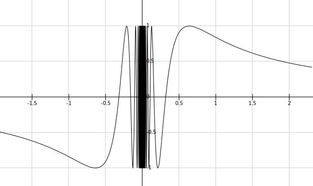
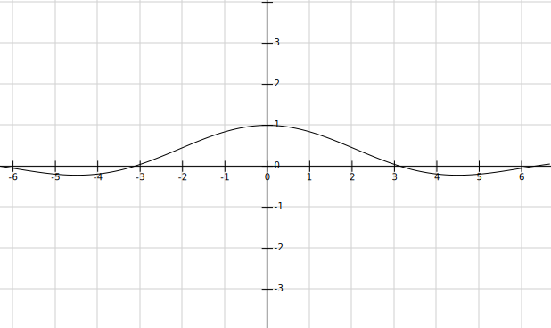
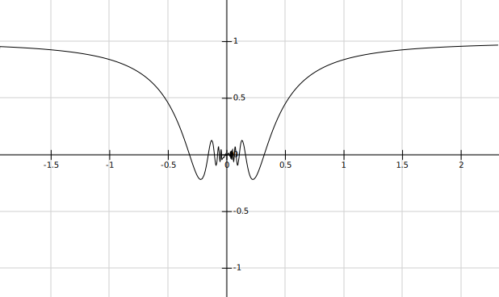
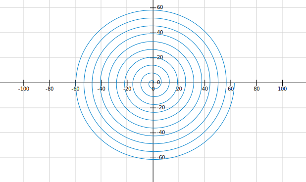
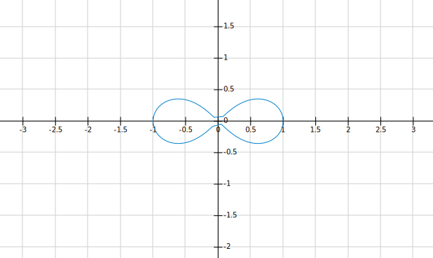
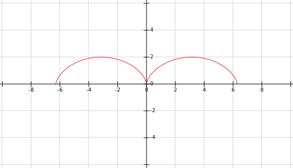
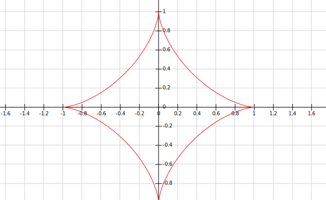
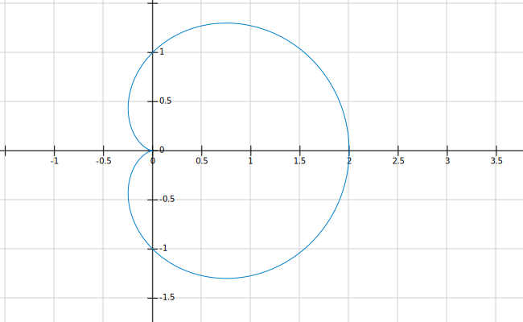
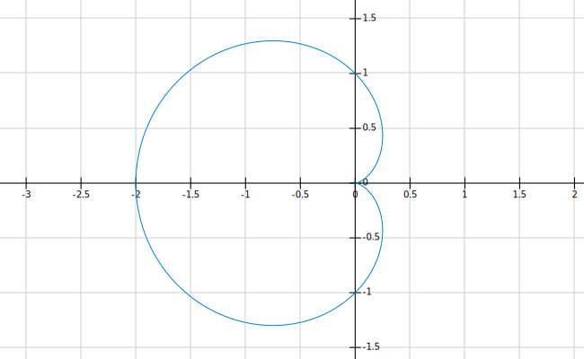

# 等价无穷小
## 当x -> 0的时候,有
```tex
\displaystyle
\footnotesize
x  \enspace\text{\textasciitilde}\enspace
\sin x \enspace\text{\textasciitilde}\enspace
\tan x \enspace\text{\textasciitilde}\enspace
\arcsin x \enspace\text{\textasciitilde}\enspace
\arctan x \enspace\text{\textasciitilde}\enspace
e^x - 1 \enspace\text{\textasciitilde}\enspace
ln(1 + x)   \\
a^x - 1 \enspace\text{\textasciitilde}\enspace e^{xlna} - 1 \enspace\text{\textasciitilde}\enspace xlna  \\
1 - \cos x \enspace\text{\textasciitilde}\enspace \frac{1}{2}x^2  \\
(1 + x)^\alpha - 1 \enspace\text{\textasciitilde}\enspace \alpha x  \\
(1 + x)^a(x) - 1 \enspace\text{\textasciitilde}\enspace a(x)x(a(x)\to0或a(x)有界)  \\
\alpha ^ x - 1 \enspace\text{\textasciitilde}\enspace xln \alpha  \\
x - ln(1 + x) \enspace\text{\textasciitilde}\enspace \frac{1}{2}x^2  \\
e^x - 1 - x \enspace\text{\textasciitilde}\enspace \frac{1}{2}x^2  \\
\sqrt{1 + x} - 1 - \frac{1}{2}x  \enspace\text{\textasciitilde}\enspace -\frac{1}{8}x^2  \\
1 - \cos^\alpha x \enspace\text{\textasciitilde}\enspace \frac{\alpha}{2}x^2  \\
x - \sin x \enspace\text{\textasciitilde}\enspace \frac{1}{6}x^3
写成泰勒公式是x - \sin x = \frac{1}{6}x^3 + o(x^3)  \\
x + \sin x \enspace\text{\textasciitilde}\enspace 2x  \\
x^2 - \sin^2 x \enspace\text{\textasciitilde}\enspace \frac{1}{3} x^4  \\
x - \tan x \enspace\text{\textasciitilde}\enspace -\frac{1}{3} x^3  \\
```
这里的x都可以看成扩展的,也就是一个`整体`.

## 当x -> 1的时候,有
```tex
\displaystyle
\footnotesize
ln x \enspace\text{\textasciitilde}\enspace x - 1
```

当f(x) -> 1有  
```tex
\displaystyle
\footnotesize
ln f(x) \enspace\text{\textasciitilde}\enspace f(x) - 1
```

## 1的无穷次方
```tex
\displaystyle
\footnotesize
1^\infty,可以丢弃对数  \\
\lim\limits_{x\to0} u(x)^{v(x)} = e^{\lim\limits_{x\to0} v(x)ln{u(x)}} = e^{\lim\limits_{x\to0} v(x)[u(x) - 1]}
```

## 常用极限
重要极限  
```tex
\displaystyle
\footnotesize
\lim\limits_{x\to0} \dfrac{\sin{x}}{x} = 1  \\
\lim\limits_{x\to0} (1 + x)^\frac{1}{x} = e  \\
\lim\limits_{x\to\infty} (1 + \frac{1}{x})^x = e  \\
\lim\limits_{x\to0} (1 - x)^\frac{1}{x} = e^{-1}  \\
\lim\limits_{x\to\infty} (1 - \frac{1}{x})^x = e^{-1}  \\
```  
一般极限  
```tex
\displaystyle
\footnotesize
\lim\limits_{x\to{0^+}} x^x = 1 \\
\lim\limits_{x\to{0^+}} xlnx = 0  \\
\lim\limits_{x\to{+\infty}} x^{\frac{1}{x}} = 1  \\
\lim\limits_{n\to{\infty}} \sqrt[n]{a} = 1 \\
\lim\limits_{n\to{\infty}} \sqrt[n]{n} = 1 \\
```

# 极限变换
```tex
\displaystyle
\footnotesize
直接等价代换,不是用倒代换  \\
\lim\limits_{x \to \infty} [x^2ln(1 + \frac{1}{x}) - x] = \lim\limits_{x \to \infty} x^2[ln(1 + \frac{1}{x}) - \frac{1}{x}]  \\
```

# 泰勒公式
```tex
\displaystyle
\footnotesize
\sin x = x - \frac{1}{6}x^3 + o(x^3)  \\
\arcsin x = x + \frac{1}{6}x^3 + o(x^3)  \\
\tan x = x + \frac{1}{3}x^3 + o(x^3)  \\
\arctan x = x - \frac{1}{3}x^3 + o(x^3)  \\
\cos x = 1 - \frac{1}{2}x^2 + \frac{1}{24}x^4 + o(x^4)  \\
ln(1 + x) = x - \frac{1}{2}x^2 + \frac{1}{3}x^3 - \frac{1}{4}x^4 + o(x^4)  \\
e^x = 1 + x + \frac{1}{2!}x^2 + \frac{1}{3!}x^3 + o(x^3)  \\
\frac{1}{1 - x} = 1 + x + x^2 + x^3 + o(x^3),|x| < 1  \\
\frac{1}{1 + x} = 1 - x + x^2 - x^3 + o(x^3)  \\
x - \sin x = \frac{1}{6}x^3 + o(x^3)
写成等价无穷小就是 x - \sin x \enspace\text{\textasciitilde}\enspace \frac{1}{6}x^3 \\
(1 + x)^\alpha = 1 + \alpha x + \frac{\alpha(\alpha - 1)}{2}x^2 + o(x^2)  \\
\sqrt{(1+x)} = (1+x)^\frac12 = 1 + \frac12 x - \frac18 x^2 + o(x^2)  \\
```
```tex
\displaystyle
\footnotesize
无限项相加的泰勒公式  \\
e^x = 1 + x + \frac{1}{2!} x^2 + ... + \frac{1}{n!} x^n +o(x^n)  \\
sinx = x - \frac{1}{3!}x^3 + ... + (-1)^n\frac{1}{(2n+1)!}x^{2n+1} + o(x^{2n+1})  \\
cosx = 1 - \frac{1}{2!}x^2 + \frac{1}{4!}x^4  + ... + (-1)^n\frac{1}{(2n)!}x^{2n} + o(x^{2n})  \\
\frac{1}{1-x} = 1 + x + x^2 + ... + x^n + o(x^n)  \\
\frac{1}{1+x} = 1 - x + x^2 - ... + (-1)^nx^n + o(x^n)  \\
ln(1 + x) = x - \frac12x^2 + \frac13x^3 - ... + (-1)^{n - 1}\frac{1}{n}x^n + o(x^n)  \\
(1 + x)^a = 1 + ax + \frac{a(a - 1)}{2!}x^2 + ... + \frac{a(a-1)...(a-n+1)}{n!}x^n + o(x^n)  \\
arctanx可以看成\frac{1}{1 + x^2}的泰勒公式积分  \\ 
arccotx可以看成-\frac{1}{1 + x^2}的泰勒公式积分  \\
```

# 十大中值定理
1. 有界性定理
    ```tex
    \footnotesize
    \displaystyle
    设f(x)在[a, b]连续, 则\exists K > 0 \forall x \in [a, b],使 |f(x)| \leqslant K
    ```
2. 最值定理
    ```tex
    \footnotesize
    \displaystyle
    设f(x)在[a, b]连续, 则有m \leqslant f(x) \leqslant M(m,M分别是f(x)在[a, b]间的最小值和最大值)  \\
    (闭区间必有最小值和最大值)
    ```
3. 介值定理
    ```tex
    \footnotesize
    \displaystyle
    设f(x)在[a, b]连续, 当m \leqslant \mu \leqslant M, 则\exists \xi \in [a, b], f(\xi) = \mu
    ```
4. 零点定理
    ```tex
    \footnotesize
    \displaystyle
    设f(x)在[a, b]连续, f(a) * a(b) = 0, 则\exists \xi \in (a, b), 使f(\xi) = 0 (端点值异号,所以不为0)
    ```
5. 费马定理
    ```tex
    \footnotesize
    \displaystyle
    若f(x)在x_0可导,且取极值, f'(x_0) = 0
    ```
6. 罗尔定理
    ```tex
    \footnotesize
    \displaystyle
    若f(x)在[a, b]连续,在(a, b)可导, f(a) = f(b), \exists \xi \in (a, b),使f'(\xi) = 0
    ```

    ```tex
    \footnotesize
    \displaystyle
    罗尔定理推论  \\
    若f^{(n)}(x) \mathrlap{\,/}{=} 0, 则f(x) = 0最多有n个根  \\
    ```
7. 拉格朗日中值定理
    ```tex
    \footnotesize
    \displaystyle
    若f(x)在[a, b]连续,在(a, b)可导, \exists \xi \in (a, b),使f'(\xi) = \frac{f(b) - f(a)}{b -a}  \\
    若f(a) = f(b) 则 f'(\xi) = 0,也就是罗尔定理
    ```
8. 柯西中值定理
    ```tex
    \footnotesize
    \displaystyle
    若f(x), g(x)在[a, b]连续,在(a, b)可导, g'(x) \mathrlap{\,/}{=} 0, \exists \xi \in (a, b),使\frac{f'(\xi)}{g'(\xi)} = \frac{f(b) - f(a)}{g(b) - g(a)}  \\
    当g(x) = x, \frac{f'(\xi)}{1} = \frac{f(b) - f(a)}{b - a}(成为了拉格朗日中值定理)
    ```
9. 泰勒定理
    ```tex
    \footnotesize
    \displaystyle
    任何可导函数都可以写成幂级函数的和:f(x) = \sum a_nx^n  \\
    泰勒公式  \\
    f(x) = \sum_{k=0}^n\frac{f^{(k)}(x_0)}{k!}(x - x_0)^k = f(x_0) + f'(x_0)(x - x_0) + ... + \frac{f^{(n)}(x_0)}{n!}(x-x_0)^n  
    麦克劳林公式,就是泰勒公式在x_0 = 0处展开  \\
    f(x) = \sum_{k=0}^n\frac{f^{(k)}(0)}{k!}x^k = f(0) + f'(0)x + ... + \frac{f^{(n)}(0)}{n!}x^n  \\
    拉氏余项(主要用来证明)  \\
    f(x) = \sum_{k=0}^n\frac{f^{(k)}(x_0)}{k!}(x - x_0)^k = f(x_0) + f'(x_0)(x - x_0) + ... + \frac{f^{(n)}(\xi)}{n!}(x-x_0)^n(\xi介(x和x_0)  \\
    佩亚诺余项(主要用于计算)  \\
    f(x) = \sum_{k=0}^n\frac{f^{(k)}(x_0)}{k!}(x - x_0)^k = f(x_0) + f'(x_0)(x - x_0) + ... + \frac{f^{(n)}(x_0)}{n!}(x-x_0)^n + o(x - x_0)^n  \\ 
    一阶带拉格朗日余项,就是泰勒求到一阶, 再求拉格朗日余项
    ```
10. 积分中值定理: 积分值等于上下限间的一个点的函数值*(b-a)
```tex
\footnotesize
\displaystyle
\int_a^bf(x)dx = f(\xi)(b - a) ,\xi \in [a, b]
```

# 中值定理常见求导构造
```tex
\footnotesize
\displaystyle
对应形式的函数构造方式  \\
g(x) = xf(x), g'(x) = f(x) + xf'(x)  \\
g(x) = xe^{f(x)}, g'(x) = e^{f(x)}(1 + xf'(x))  \\
g(x) = e^{\frac{x^2}{2}}f(x), g'(x) = e^{\frac{x^2}{2}}(xf(x) + f'(x))  \\
g(x) = f(x)e^{\int g(x)dx}, g'(x) = e^{\int g(x)dx}[f'(x) + g(x)f(x)]  \\
\frac{f'(x)}{g'(x)}可能是柯西中值定理  \\
g(x) = \frac{f(x)}{x}, f'(x) = \frac{xf'(x) - f(x)}{x^2}  \\
h(x) = f(x)g(x), h'(x) = f'(x)g(x) + f(x)g'(x), h''(x) = f''(x)g(x) + 2f'(x)g'(x) + f(x)g''(x)  \\
```
```tex
\footnotesize
\displaystyle
另一种函数构造方式  \\
这里的f'(x)和g(x)f(x)可正可负, 且f'(x)系数需为1(不满足可变形一下)  \\
若f'(x) + g(x)f(x) = h(x),则  \\
f'(x)e^{\int g(x)dx} + g(x)f(x)e^{\int g(x)dx} = h(x)e^{\int g(x)dx}  \\
[f(x)e^{\int g(x)dx}]' = [\int h(x)e^{\int g(x)dx}dx]'  \\
[f(x)e^{\int g(x)dx} - \int h(x)e^{\int g(x)dx}dx]' = 0  \\
则F(x) = f(x)e^{\int g(x)dx} - \int h(x)e^{\int g(x)dx}dx  \\
若h(x) = 0  \\
则F(x) = f(x)e^{\int g(x)dx}  \\
```

# 求导公式
```tex
\footnotesize
\displaystyle
(x^a)' = ax^{a-1}  \\
(a^x)' = a^xlna  \\
(e^x)' = e^x  \\
(lnx)' = \frac1x  \\
(sinx)' = cosx  \\
(cosx)' = -sinx  \\
(tanx)' = sec^2x  \\
(cotx)' = -csc^2x  \\
(secx)' = secxtanx  \\
(cscx)' = -cscxcotx  \\
(arcsinx)' = \frac{1}{\sqrt{1 - x^2}}  \\
(arccosx)' = -\frac{1}{\sqrt{1-x^2}}  \\
(arctanx)' = \frac{1}{1 + x^2}  \\
(arccotx)' = -\frac{1}{1 + x^2}  \\
[ln(x + \sqrt{x^2 + 1})] = \frac{1}{\sqrt{x^2 + 1}}  \\
[ln(x + \sqrt{x^2 - 1})] = \frac{1}{\sqrt{x^2 - 1}}  \\
[ln(x + \sqrt{a^2 + x^2})] = \frac{1}{\sqrt{a^2 + x^2}}  \\
[ln(secx + tanx)]' = secx  \\
[ln(cscx - cotx)]' = cscx  \\
(uvw)' = u'vw + uv'w + uvw'  \\
(\frac{u}{v})' = \frac{u'v - uv'}{v^2}  \\
[ln(ax)]' = \frac1x  \\
sin(ax + b)^{(n)} = a^nsin(ax + b + \frac{\pi n}{2})  \\
cos(ax + b)^{(n)} = a^ncos(ax + b + \frac{\pi n}{2})  \\
(ln|u|)' = \frac{1}{u} * u'_x(ln有绝对值,视绝对值不见)
```

# 曲率半径,曲率圆,曲率,变化率
```tex
\footnotesize
\displaystyle
曲率半径  \\
R = \frac1k = \frac{(1 + y'2)^{\frac32}}{|y''|}(y''\mathrlap{\,/}{=}0)  \\
曲率  \\
k = \frac1R = \frac{|y''|}{(1 + y'2)^{\frac32}}  \\
曲率圆  \\
(X - \alpha)^2 + (Y - \beta)^2 = R^2,其中  \\
\alpha = x - \frac{y'(1+y'^2)}{y''}, \beta = y + \frac{1+y'^2}{y''}, R是曲率半径  \\
```

# 面积体积
```tex
\displaystyle
\footnotesize
球面积: S = 4\pi R^2  \\
球体积: V = \frac43 \pi R^3  \\
```

# 基本积分公式
```tex
\displaystyle
\footnotesize
\int x^kdx = \frac{1}{k+1}x^{k+1} + C, (k \mathrlap{\,/}{=} -1)  \\
\int \frac{1}{x^2}dx = -\frac{1}{x} + C  \\
\int \frac{1}{\sqrt{x}}dx = 2\sqrt{x} + C  \\
\int \frac{1}{x}dx = ln|x| + C  \\
\int a^xdx = \frac{1}{lna}a^x + C, (a > 0且a \mathrlap{\,/}{=} 1)  \\
\int e^xdx = e^x + C  \\
\int sinxdx = -cosx + C  \\
\int cosxdx = sinx + C  \\
\int tanxdx = -ln|cosx| + C  \\
\int cotxdx = ln|sinx| + C  \\
\int secxdx = ln|secx + tanx| + C(加绝对值是因为这里的secx和tanx不一定是正的)  \\
\int cscxdx = ln|cscx - cotx| + C  \\
\int secxtanxdx = secx + C  \\
\int cscxcotxdx = -cscx + C  \\
\int \frac{1}{\sqrt{1-x^2}}dx = arcsinx + C  \\
\int \frac{1}{\sqrt{a^2-x^2}}dx = arcsin\frac{x}{a} + C  \\
\int \frac{1}{\sqrt{a^2+x^2}}dx = ln(x + \sqrt{a^2 + x^2}) + C  \\
\int \frac{1}{\sqrt{x^2-a^2}}dx = ln(x + \sqrt{x^2 - a^2}) + C \\
\int \frac{1}{a^2 + x^2}dx = \frac{1}{a}arctan\frac{x}{a} + C  \\
\int \frac{1}{a^2 - x^2}dx = \frac{1}{2a}ln|\frac{a+x}{a-x}| + C  \\
\int \frac{1}{x^2 - a^2}dx = \frac{1}{2a}ln|\frac{x-a}{x+a}| + C  \\
\int \sqrt{a^2 - x^2}dx = \frac{a^2}{2}arcsin\frac{x}{a} + \frac{x}{2}\sqrt{a^2 - x^2} + C  \\
\int \frac{1}{cos^3x}dx = \frac12(secxtanx + ln|secx + tanx|)  \\
\int \frac{f'(x)}{f(x)}dx = ln|f(x)| + C  \\
```

# 华里士公式,点火公式
```tex
\displaystyle
\footnotesize
I = \int_0^{\frac{\pi}{2}}sin^nxdx = \int_0^{\frac{\pi}{2}}cos^nxdx = \\
若n为正偶数:\frac{n-1}{n}*\frac{n-3}{n-2}*...*\frac{1}{2}*\frac{\pi}{2}  \\
若n为正奇数:\frac{n-1}{n}*\frac{n-3}{n-2}*...*\frac{2}{3}*1  \\
当n = 1时  \\
I = \int_0^{\frac{\pi}{2}}sinxdx = \int_0^{\frac{\pi}{2}}cosxdx = 1
```

# 常用积分变形
```tex
\displaystyle
\footnotesize
这样变可以省去将x化为sect的麻烦  \\
\int \frac{1}{x\sqrt{x^2 - 1}}dx = \int \frac{1}{x^2 \sqrt{1 - (\frac{1}{x})^2}}dx 
= -\int \frac{1}{\sqrt{1 - (\frac{1}{x})^2}}d(\frac{1}{x}) = arccos\frac{1}{x}  \\
```
```tex
\displaystyle
\footnotesize
将上边的e^x与下边合并  \\
\int_{-\frac\pi4}^{\frac\pi4} \frac{sinx*e^x}{1 + e^{2x}} = 
\int_{-\frac\pi4}^{\frac\pi4} \frac{sinx}{\frac{1}{e^x} + e^{x}} = 
\int_{-\frac\pi4}^{\frac\pi4} \frac{sinx}{e^{-x} + e^{x}} = 
f(x)因为是奇函数,故积分为0  \\
\frac{1}{e^{-x} + e^{x}}是偶函数  \\
```
```tex
\displaystyle
\footnotesize
\sqrt{4x - x^2} = \sqrt{4 - (x-2)^2}  \\
则y^2 + (x - 2)^2 = 2^2,所以是半径为2,圆心右偏的圆,y是正的,故只取上半部分  \\
```
```tex
\displaystyle
\footnotesize
\int \frac{1}{cost*sin^2t}dt = 2\int csc2t* csct dt \to 这样转换之后下边就不能算了  \\
\int \frac{1}{cost*sin^2t}dt = \int \frac{sin^2x + cos^2x}{cost*sin^2t}d \to 所以可以将1拆分  \\
```

# 总结公式
```tex
\displaystyle
\footnotesize
\lim\limits_{n \to \infty}\sqrt[n]{a_1^n + a_2^n + ... + a_m^n} = max\{a_1,...,a_m\}(m是一个常数,不是无限变量)  \\
\lim\limits_{n \to \infty}\int_0^1x^nf(x)dx = 0(f(x)在[0, 1]连续)  \\
```

# 一些二维图形
```tex
\displaystyle
\footnotesize
y = sin\frac{1}{x}  \\
```


```tex
\displaystyle
\footnotesize
y = \frac{sin x}{x}  \\
```


```tex
\displaystyle
\footnotesize
y = x * sin\frac{1}{x} \\
```


```tex
\displaystyle
\footnotesize
阿基米德螺旋线  
r = a\theta  \\
```  
  
双纽线  
```tex
\displaystyle
\footnotesize
r^2 = cos2\theta
```  
  
摆线  
```tex
\displaystyle
\footnotesize
x = a(\theta - sin\theta)  \\
y = a(1 - cos\theta)  \\
这里a取的1,一拱的高是2a  \\
```  
  
星形线  
```tex
\displaystyle
\footnotesize
x = cos^3t  \\
y = sin^3t  \\
```  
  
心形线  
```tex
\displaystyle
\footnotesize
r = a(1 + cos\theta)  \\
这里a取1,两个零点之间的距离是2a  \\
```  
  
心形线另一侧  
```tex
\displaystyle
\footnotesize
x^2 + y^2 + ax = a\sqrt{x^2 + y^2}  \\
r = a(1 - cos\theta)  \\
这里a取1,两个零点之间的距离是2a  \\
```  
  

# 一些三维图形

# 线性代数
## 常用公式
```tex
\displaystyle
\footnotesize
(1)主对角线都是a, 其他都是b  \\
\begin{bmatrix}
a & b & ... & b \\
b & a & ... & b \\
. & . &   & .  \\
. & . &   & .  \\
. & . &   & .  \\
b & b & ... & a \\
\end{bmatrix} = (a + (n - 1)b)(a - b)^{n - 1}  \\
```